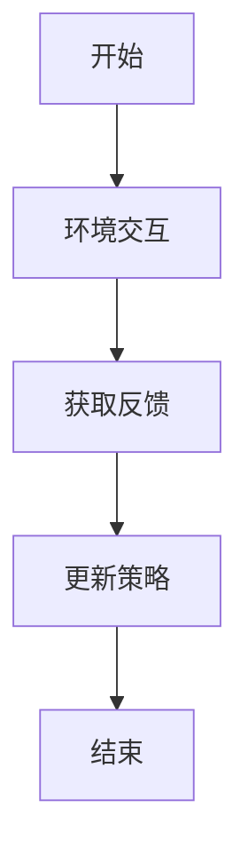
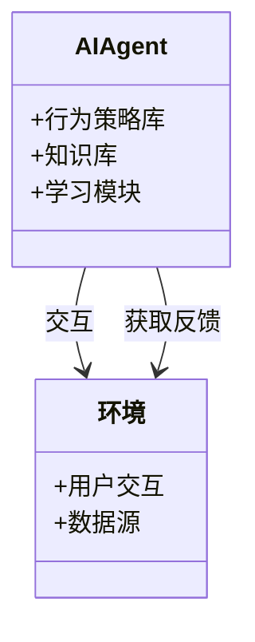
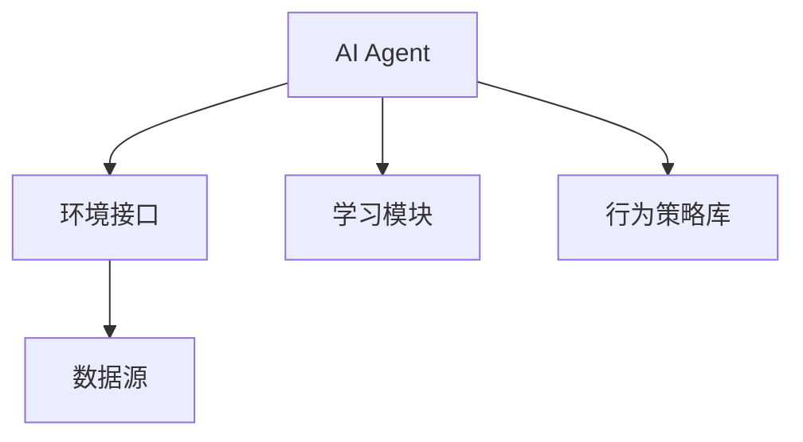
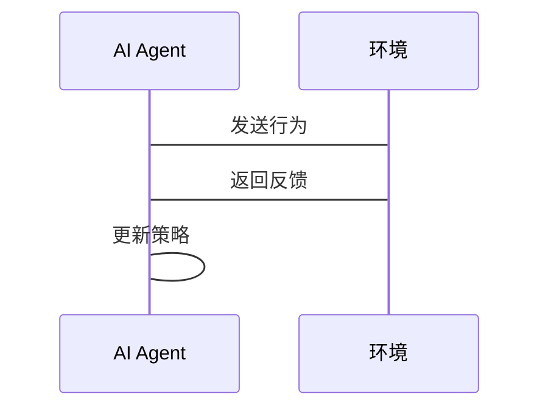

                 


# 自主学习型 AI Agent：利用 LLM 实现持续进化

> 关键词：自主学习型 AI Agent, LLM, 大语言模型, 持续进化, 人工智能, 机器学习

> 摘要：本文详细探讨了自主学习型 AI Agent 的概念、算法原理、系统架构设计以及实际应用案例。通过结合大语言模型（LLM）的特性，阐述了如何利用 LLM 实现 AI Agent 的持续进化，以及在实际项目中的应用和优化策略。

---

## 第一部分: 自主学习型 AI Agent 的背景与概念

### 第1章: 自主学习型 AI Agent 的背景介绍

#### 1.1 问题背景
传统的 AI 系统在面对复杂、动态变化的环境时，往往显得力不从心。它们依赖于预设的规则和数据，无法在没有外部干预的情况下自主学习和适应新环境。例如，一个基于规则的推荐系统可能会在用户行为模式发生变化时失效，无法自动调整其推荐策略。因此，开发能够自主学习的 AI 系统成为了一个重要的研究方向。

#### 1.2 问题描述
自主学习型 AI Agent 的核心目标是能够在无需外部干预的情况下，通过与环境的交互，持续优化自身的行为策略。这涉及到从环境中获取信息、理解信息、制定决策以及执行决策的全过程。其主要挑战包括如何设计高效的 learning algorithm、如何处理动态变化的环境以及如何确保系统在学习过程中的稳定性。

#### 1.3 问题解决
通过结合大语言模型（LLM）的能力，我们可以实现 AI Agent 的自主学习。LLM 的特点包括强大的自然语言处理能力、知识表达能力和自适应学习能力，这使其成为实现自主学习型 AI Agent 的理想工具。通过与环境的交互，LLM 可以逐步优化自身的知识库和行为策略，从而实现持续进化。

### 第2章: 自主学习型 AI Agent 的核心概念

#### 2.1 自主学习型 AI Agent 的概念
自主学习型 AI Agent 是一种能够在没有外部干预的情况下，通过与环境的交互，持续优化自身行为策略的智能体。其核心特征包括自主性、学习性和适应性。

#### 2.2 LLM 与自主学习的关系
LLM（Large Language Model）是一种基于深度学习的自然语言处理模型，具有强大的文本生成、理解和推理能力。LLM 通过其内部的神经网络结构，能够从海量数据中学习到语言的规律和知识。这使得 LLM 成为实现自主学习型 AI Agent 的理想工具。

#### 2.3 概念结构与核心要素组成
| 概念 | 描述 |
|------|------|
| 自主性 | 系统能够在没有外部干预的情况下自主运行 |
| 学习性 | 系统能够通过与环境的交互，不断优化自身 |
| 适应性 | 系统能够根据环境的变化，调整自身的行为策略 |

---

## 第二部分: 自主学习型 AI Agent 的算法原理

### 第3章: 自主学习型 AI Agent 的算法原理

#### 3.1 算法概述
自主学习型 AI Agent 的算法主要基于强化学习（Reinforcement Learning）和生成对抗网络（GAN）。通过强化学习，系统能够从环境中获取反馈，并通过不断尝试和调整行为策略，以最大化累积奖励。生成对抗网络则用于优化系统的知识生成能力。

#### 3.2 LLM 的数学模型
LLM 的核心是基于 Transformer 架构的神经网络模型。其数学模型主要包括编码器（Encoder）和解码器（Decoder）两个部分。

编码器负责将输入的文本序列转换为一个固定长度的向量表示。解码器则基于编码器的输出，逐步生成目标输出序列。数学上，编码器的输出可以表示为：
$$
x = \text{Encoder}(input)
$$
解码器的输出则可以表示为：
$$
output = \text{Decoder}(x)
$$

#### 3.3 算法流程
以下是基于强化学习的自主学习型 AI Agent 的算法流程图：



#### 3.4 优化策略
为了确保系统的稳定性，我们在强化学习过程中引入了以下优化策略：
1. **奖励机制**：通过设计合理的奖励函数，引导系统向期望的行为模式发展。
2. **经验回放**：将历史经验存储在经验回放池中，以避免策略的过快变化。
3. **渐进式学习**：逐步增加任务的复杂度，以确保系统能够逐步适应更复杂的环境。

---

## 第三部分: 自主学习型 AI Agent 的系统架构设计

### 第4章: 系统分析与架构设计

#### 4.1 问题场景介绍
在实际应用中，自主学习型 AI Agent 需要能够处理复杂的任务场景。例如，在一个电商推荐系统中，AI Agent 需要根据用户的浏览行为、购买历史和反馈信息，实时调整推荐策略。

#### 4.2 系统功能设计
以下是系统功能设计的领域模型：



#### 4.3 系统架构设计
以下是系统的整体架构设计：



#### 4.4 系统接口设计
系统接口设计的序列图如下：



---

## 第四部分: 自主学习型 AI Agent 的项目实战

### 第5章: 项目实战

#### 5.1 环境安装
以下是项目实战所需的环境配置：

1. Python 3.8 或以上版本
2. PyTorch 1.9 或以上版本
3. Transformers库 4.16 或以上版本

#### 5.2 系统核心实现

以下是实现自主学习型 AI Agent 的核心代码：

```python
import torch
from transformers import AutoModelForCausalLM, AutoTokenizer

class AutoAgent:
    def __init__(self, model_name):
        self.model = AutoModelForCausalLM.from_pretrained(model_name)
        self.tokenizer = AutoTokenizer.from_pretrained(model_name)
    
    def interact(self, input_text):
        inputs = self.tokenizer.encode(input_text, return_tensors="pt")
        outputs = self.model.generate(inputs, max_length=50)
        return self.tokenizer.decode(outputs[0], skip_special_tokens=True)

# 初始化 Agent
agent = AutoAgent("gpt2")
# 与环境交互
response = agent.interact("推荐一个适合我的电影。")
print(response)
```

#### 5.3 案例分析
在实际应用中，我们可以将上述代码部署到电商推荐系统中。通过收集用户的交互数据，系统能够不断优化推荐策略，从而提高用户满意度。

#### 5.4 项目小结
通过本章的实战，我们了解了如何利用 LLM 实现自主学习型 AI Agent 的核心功能。实际案例表明，系统能够通过与环境的交互，不断优化自身的推荐策略。

---

## 第五部分: 总结与展望

### 第6章: 总结与展望

#### 6.1 最佳实践 tips
1. 在实际应用中，建议使用更复杂的强化学习算法，如 PPO（Proximal Policy Optimization）。
2. 确保系统的安全性和稳定性，避免在学习过程中出现策略崩溃。

#### 6.2 小结
通过本文的探讨，我们了解了自主学习型 AI Agent 的核心概念、算法原理和系统架构设计。利用 LLM 的强大能力，我们可以实现 AI 系统的持续进化。

#### 6.3 注意事项
1. 在设计奖励函数时，需确保其能够引导系统向期望的行为模式发展。
2. 在实际应用中，需注意系统的计算资源消耗问题。

#### 6.4 拓展阅读
1. 《Reinforcement Learning: Theory and Algorithms》
2. 《Transformers: State-of-the-Art Neural Networks for NLP》

---

作者：AI天才研究院/AI Genius Institute & 禅与计算机程序设计艺术 /Zen And The Art of Computer Programming

