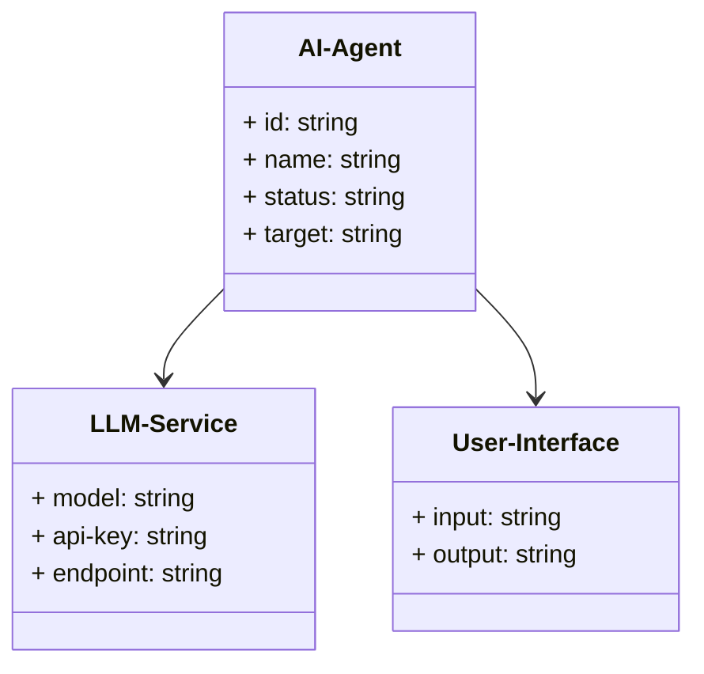
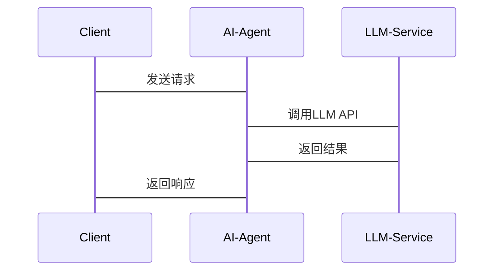

                 


# 自动化AI Agent开发平台：LLM辅助的智能系统构建

## 关键词：
- 自动化AI Agent
- LLM
- 智能系统构建
- 大语言模型
- 人工智能开发平台

## 摘要：
本文深入探讨了自动化AI Agent开发平台的构建，重点分析了大语言模型（LLM）在其中的核心作用。通过详细讲解LLM的工作原理、AI Agent的设计思路以及两者的协同工作方式，本文为读者提供了一套系统化的解决方案。文章从理论到实践，结合具体案例，展示了如何利用LLM辅助构建智能系统，帮助读者全面理解并掌握自动化AI Agent开发的关键技术。

---

# 第一部分: 自动化AI Agent开发平台概述

## 第1章: 自动化AI Agent与LLM概述

### 1.1 自动化AI Agent的定义与特点

#### 1.1.1 自动化AI Agent的定义
自动化AI Agent（Artificial Intelligence Agent）是一种能够感知环境、自主决策并执行任务的智能实体。它通过传感器获取信息，利用算法进行分析，并通过执行器与环境交互，实现预设目标。

#### 1.1.2 自动化AI Agent的核心特点
- **自主性**：能够在无外部干预的情况下独立运行。
- **反应性**：能够实时感知环境变化并做出响应。
- **目标导向**：所有行为都围绕特定目标展开。
- **学习能力**：能够通过经验优化自身性能。

#### 1.1.3 自动化AI Agent与传统AI的区别
自动化AI Agent相较于传统AI，具有更强的自主性和适应性。传统AI通常需要明确的规则和指令，而自动化AI Agent能够根据环境动态调整策略。

### 1.2 LLM在自动化AI Agent中的作用

#### 1.2.1 LLM的基本概念
大语言模型（Large Language Model, LLM）是一种基于深度学习的自然语言处理模型，能够理解并生成人类语言。其核心是通过大量数据训练的神经网络，能够捕捉语言的复杂模式。

#### 1.2.2 LLM在AI Agent中的应用
- **自然语言处理**：通过LLM实现文本的理解与生成，提升AI Agent的交互能力。
- **决策支持**：利用LLM进行信息分析和预测，辅助AI Agent做出更优决策。
- **知识检索**：通过LLM强大的检索能力，快速获取所需信息。

#### 1.2.3 LLM的优势与挑战
优势：  
- 高效性：LLM能够快速处理大量文本数据。  
- 智能性：能够理解和生成自然语言，提升AI Agent的智能化水平。  

挑战：  
- 计算资源消耗大。  
- 模型调优难度较高。  

### 1.3 自动化AI Agent开发平台的背景与意义

#### 1.3.1 自动化AI Agent开发的背景
随着人工智能技术的快速发展，企业对智能化系统的需求日益增加。传统的人工开发模式效率低下，难以满足快速迭代的需求，因此自动化开发平台应运而生。

#### 1.3.2 自动化AI Agent开发平台的意义
- 提供标准化开发流程，降低开发门槛。  
- 提升开发效率，缩短项目周期。  
- 支持快速部署和扩展，满足企业多样化需求。  

#### 1.3.3 自动化AI Agent开发平台的应用场景
- **智能客服**：通过自动化AI Agent实现24/7的客户支持。  
- **自动化运维**：利用AI Agent监控和管理IT系统。  
- **智能推荐**：为用户提供个性化的产品推荐服务。  

### 1.4 本章小结
本章介绍了自动化AI Agent和大语言模型的基本概念，探讨了LLM在AI Agent中的应用及其优势与挑战。通过分析开发平台的背景和意义，明确了其在智能化系统构建中的重要性。

---

## 第2章: LLM与AI Agent的核心原理

### 2.1 LLM的核心原理

#### 2.1.1 大语言模型的训练过程
大语言模型的训练通常采用监督学习和无监督学习相结合的方式。模型通过大量文本数据进行预训练，然后通过微调任务数据进行优化。

#### 2.1.2 大语言模型的推理机制
LLM的推理机制基于生成式模型，通过给定输入生成输出。其核心是解码器部分，能够逐步生成符合语义的文本。

#### 2.1.3 大语言模型的数学模型
大语言模型通常基于Transformer架构，其数学模型包括编码器和解码器部分，通过自注意力机制捕捉文本中的语义关系。

### 2.2 AI Agent的核心原理

#### 2.2.1 AI Agent的感知与决策机制
AI Agent通过传感器获取环境信息，利用感知算法分析信息，并基于决策算法做出行动选择。

#### 2.2.2 AI Agent的行动与反馈机制
AI Agent根据决策结果执行动作，并通过反馈机制调整自身的策略。

#### 2.2.3 AI Agent的自适应能力
通过强化学习和经验积累，AI Agent能够不断优化自身的感知、决策和执行能力。

### 2.3 LLM与AI Agent的关系

#### 2.3.1 LLM作为AI Agent的核心模块
LLM通常作为AI Agent的“大脑”，负责信息处理和决策支持。

#### 2.3.2 LLM与AI Agent的协同工作
通过调用LLM API，AI Agent能够实现复杂的自然语言处理任务，如对话生成和信息检索。

#### 2.3.3 LLM对AI Agent能力的提升
LLM的引入显著提升了AI Agent的自然语言理解和生成能力，使其能够更好地与人类用户交互。

### 2.4 本章小结
本章详细讲解了LLM和AI Agent的核心原理，分析了它们之间的协同关系。通过理解两者的结合方式，可以更好地构建智能化的AI Agent系统。

---

## 第3章: 自动化AI Agent的系统架构设计

### 3.1 问题场景介绍
假设我们正在开发一个智能客服系统，希望通过自动化AI Agent实现自动响应客户需求的功能。

### 3.2 系统功能设计

#### 3.2.1 领域模型设计
使用Mermaid绘制领域模型图：



#### 3.2.2 系统架构设计
使用Mermaid绘制系统架构图：


#### 3.2.3 系统接口设计
主要接口包括：
- AI Agent调用LLM服务接口。
- 用户与AI Agent交互的接口。

#### 3.2.4 交互流程设计
使用Mermaid绘制交互流程图：



### 3.3 本章小结
通过系统架构设计，我们可以清晰地了解AI Agent开发平台的各个组成部分及其交互关系。这为后续的实现提供了理论基础。

---

## 第4章: 项目实战

### 4.1 环境安装
首先，需要安装Python和相关依赖库：

```bash
pip install python
pip install transformers
pip install requests
```

### 4.2 核心代码实现

#### 4.2.1 AI Agent类实现
```python
class AI-Agent:
    def __init__(self, llm_service):
        self.llm_service = llm_service
        self.status = "idle"

    def perceive(self, input):
        # 处理输入
        pass

    def decide(self, input):
        # 调用LLM进行决策
        return self.llm_service.generate(input)

    def act(self, action):
        # 执行动作
        pass
```

#### 4.2.2 LLM服务类实现
```python
class LLMService:
    def __init__(self, api_key):
        self.api_key = api_key
        self.endpoint = "https://api.example.com"

    def generate(self, prompt):
        # 调用LLM API生成文本
        pass
```

### 4.3 代码解读与分析
通过代码实现，我们可以看到AI Agent与LLM服务之间的交互流程。AI Agent负责处理输入和执行动作，而LLM服务则负责生成文本内容。

### 4.4 实际案例分析
以智能客服为例，详细分析如何通过代码实现自动化响应客户需求的功能。

### 4.5 项目小结
通过项目实战，我们掌握了自动化AI Agent开发的基本流程和关键实现细节。

---

## 第5章: 最佳实践、小结与拓展阅读

### 5.1 最佳实践 tips
- 在开发过程中，建议使用成熟的LLM框架（如Hugging Face）来降低开发难度。
- 定期优化AI Agent的模型参数，以提升性能和准确率。

### 5.2 小结
本文详细讲解了自动化AI Agent开发平台的构建过程，从理论到实践，帮助读者掌握了相关技术和实现方法。

### 5.3 注意事项
- 开发过程中要注意数据安全和隐私保护。
- 在生产环境中，建议部署高可用性的LLM服务。

### 5.4 拓展阅读
- 《Large Language Models: A Survey》
- 《Building AI Applications with Python》

---

## 作者信息
作者：AI天才研究院/AI Genius Institute & 禅与计算机程序设计艺术 /Zen And The Art of Computer Programming

---

以上是关于《自动化AI Agent开发平台：LLM辅助的智能系统构建》的技术博客文章，涵盖了从背景介绍到项目实战的各个方面。希望本文能为读者提供有价值的参考和启发。

