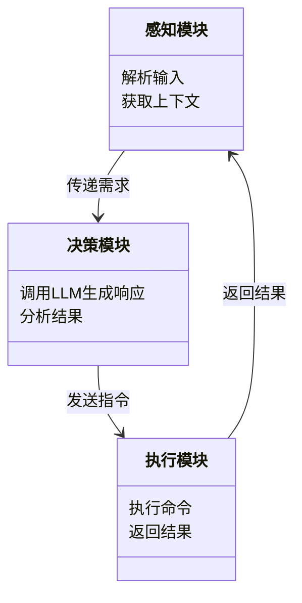

                 


# 自动化AI Agent开发：LLM辅助的代码生成

## 关键词

LLM, AI Agent, 代码生成, 自动化开发, 大语言模型

## 摘要

本文探讨如何利用大语言模型（LLM）辅助开发自动化的人工智能代理，重点介绍代码生成的应用。文章从背景、原理到系统设计和实战，全面解析LLM在AI Agent中的作用，帮助读者掌握自动化开发的核心技术。

## 正文

### 第1章：背景与基础

#### 1.1 LLM与AI Agent的基本概念

**1.1.1 大语言模型（LLM）的定义**

大语言模型（Large Language Model, LLM）是基于深度学习的自然语言处理模型，如GPT系列，通过大量数据预训练，能够生成、理解和分析人类语言。

**1.1.2 AI Agent的定义与特点**

AI Agent是智能体，能够感知环境、执行任务，通过与用户交互完成目标，具有自主性、反应性、目标导向等特点。

**1.1.3 LLM与AI Agent的关系**

LLM作为AI Agent的核心，负责理解和生成自然语言，提升其交互能力和任务处理效率。

#### 1.2 技术演进与应用现状

**1.2.1 从规则引擎到机器学习的演变**

早期AI Agent依赖规则引擎，效率有限。随着机器学习的发展，特别是深度学习的兴起，AI Agent的能力得到显著提升。

**1.2.2 LLM在自然语言处理中的突破**

LLM通过预训练掌握大量语言知识，显著提升了自然语言处理的准确性和流畅性。

**1.2.3 AI Agent在不同领域的应用案例**

涵盖客服、教育、金融等领域，如智能助手、自动回复系统等，展示了广泛的应用前景。

#### 1.3 问题背景与挑战

**1.3.1 当前代码生成中的痛点**

传统代码生成依赖模板，灵活性差，难以处理复杂需求，且生成代码的质量和可靠性有限。

**1.3.2 LLM在代码生成中的优势**

LLM能够理解需求描述，生成高质量代码，具备灵活性和可扩展性。

**1.3.3 实际应用中的挑战与解决方案**

挑战包括计算资源消耗大、生成代码的可维护性、模型的泛化能力等，解决方案涉及优化算法、模型微调和结合领域知识。

### 第2章：LLM的基本原理

#### 2.1 模型结构与训练机制

**2.1.1 变压器（Transformer）模型的核心组件**

Transformer模型由编码器和解码器组成，编码器处理输入，解码器生成输出。

**2.1.2 自注意力机制的数学模型**

自注意力机制通过计算查询、键、值向量的点积，加权求和得到输出，公式如下：

$$
\text{Attention}(Q, K, V) = \text{softmax}\left(\frac{QK^T}{\sqrt{d_k}}\right)V
$$

其中，$Q$、$K$、$V$分别为查询、键、值矩阵，$d_k$为键的维度。

**2.1.3 大规模预训练的原理**

通过海量数据预训练，模型学习语言的统计规律，提升泛化能力。

#### 2.2 LLM的生成机制

**2.2.1 解码器的结构与作用**

解码器负责将输入转换为输出序列，常用贪心搜索或随机采样生成结果。

**2.2.2 概率生成模型的工作流程**

模型计算每个位置的概率分布，选择概率最高的词逐步生成文本。

**2.2.3 温度与核采样的应用**

温度参数控制生成的多样性，低温产生保守结果，高温增加随机性。核采样用于生成多个候选项，选择最优解。

#### 2.3 模型评估与优化

**2.3.1 常见的评估指标**

- BLEU：基于n-gram的精确率，反映生成文本与参考文本的相似度。
- ROUGE：基于召回率的评估指标，衡量生成文本的摘要质量。

**2.3.2 模型调优策略**

包括调整学习率、批量大小、训练轮数，以及使用早停和模型checkpoint。

**2.3.3 计算资源与训练效率的平衡**

选择合适的硬件配置，优化数据加载和模型并行，平衡训练时间和成本。

### 第3章：AI Agent的架构与交互

#### 3.1 AI Agent的架构设计

**3.1.1 AI Agent的组成模块**

AI Agent通常由感知模块、决策模块和执行模块组成：

- 感知模块：负责接收输入，解析用户意图。
- 决策模块：基于LLM生成行动计划。
- 执行模块：调用API或执行命令，完成任务。

**3.1.2 模块之间关系的Mermaid图**



**3.1.3 LLM在AI Agent中的角色**

LLM作为决策模块的核心，负责理解和生成自然语言，协调各模块协作完成任务。

#### 3.2 LLM与交互设计

**3.2.1 人机交互的重要性**

良好的交互设计提升用户体验，确保用户能够有效与AI Agent沟通，明确表达需求。

**3.2.2 自然语言处理中的交互优化**

通过上下文理解和对话历史管理，提升交互的连贯性和准确性。

**3.2.3 多轮对话的实现**

维护对话状态，处理上下文信息，确保每次交互基于前文进行。

### 第4章：LLM辅助代码生成的实现

#### 4.1 代码生成模型

**4.1.1 基于LLM的代码生成模型**

模型接受自然语言描述作为输入，生成相应的代码。

**4.1.2 代码生成的流程**

1. 输入解析：将自然语言转换为代码生成指令。
2. 代码生成：调用LLM生成代码。
3. 代码优化：自动优化生成的代码。
4. 代码验证：检查代码是否符合要求。

#### 4.2 代码优化与错误处理

**4.2.1 代码优化策略**

- 优化代码结构，提升可读性。
- 降低代码复杂度，提升可维护性。
- 使用静态分析工具检测潜在问题。

**4.2.2 错误处理机制**

- 实时语法检查，自动修复错误。
- 生成错误报告，指导用户修改。

### 第5章：系统设计与架构

#### 5.1 系统分析与架构设计

**5.1.1 系统功能设计**

- 用户输入处理
- 代码生成与优化
- 结果展示与反馈

**5.1.2 系统架构设计**

系统由前端、后端和LLM服务组成：


**5.1.3 系统接口设计**

- 前端API：处理用户输入，传递请求。
- 后端API：接收请求，调用LLM生成代码。
- LLM接口：提供生成代码的API。

### 第6章：项目实战

#### 6.1 环境搭建

**6.1.1 安装Python和依赖**

安装Python 3.8及以上，安装必要的库，如transformers和torch。

```bash
pip install transformers torch
```

#### 6.2 核心实现

**6.2.1 编写代码生成模块**

导入库，定义生成函数，处理输入，调用模型生成代码。

```python
from transformers import AutoTokenizer, AutoModelForCausalLM

tokenizer = AutoTokenizer.from_pretrained('gpt2')
model = AutoModelForCausalLM.from_pretrained('gpt2')

def generate_code(prompt):
    inputs = tokenizer.encode(prompt, return_tensors='pt')
    outputs = model.generate(inputs, max_length=100)
    return tokenizer.decode(outputs[0])
```

**6.2.2 实现代码优化模块**

使用静态分析工具检查代码，优化结构。

```python
def optimize_code(original_code):
    # 这里需要集成代码优化工具，如autopep8
    optimized_code = autopep8.fix_code(original_code)
    return optimized_code
```

#### 6.3 项目总结

通过实战，验证了LLM在代码生成中的潜力，但也发现了优化空间，如提升生成代码的可维护性和准确性。

### 第7章：最佳实践与未来展望

#### 7.1 最佳实践

- **结合领域知识**：在代码生成中引入专业领域知识，提升准确性。
- **优化交互设计**：设计直观的用户界面，提升用户体验。
- **监控与反馈**：实时监控生成代码质量，收集用户反馈，持续优化模型。

#### 7.2 未来展望

随着LLM技术的进步，代码生成将更加智能化，AI Agent在软件开发中的作用将更加重要，未来可能实现从需求到代码的全自动流程。

## 作者

作者：AI天才研究院/AI Genius Institute & 禅与计算机程序设计艺术 /Zen And The Art of Computer Programming

