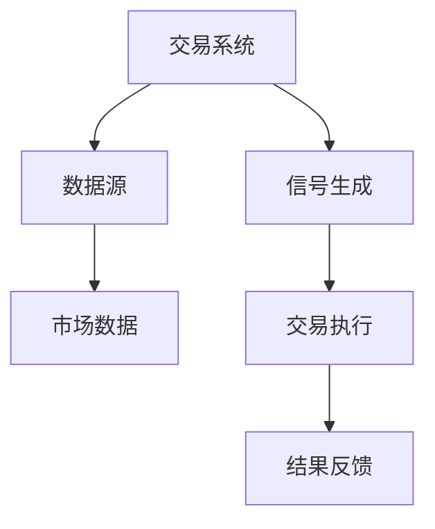
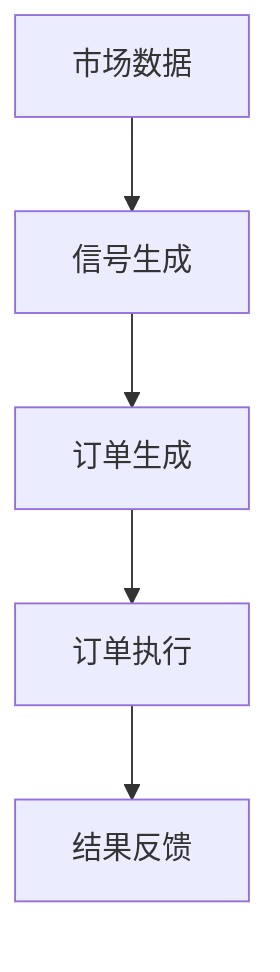
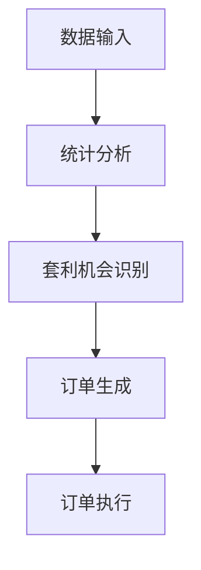
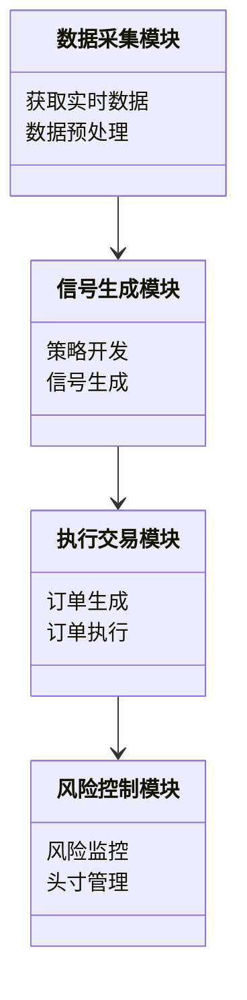
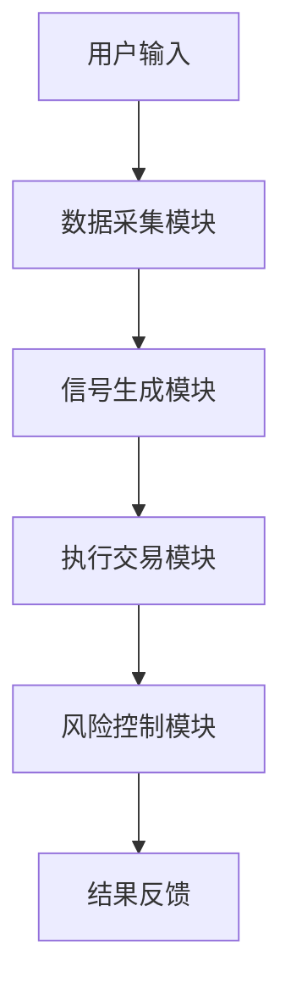
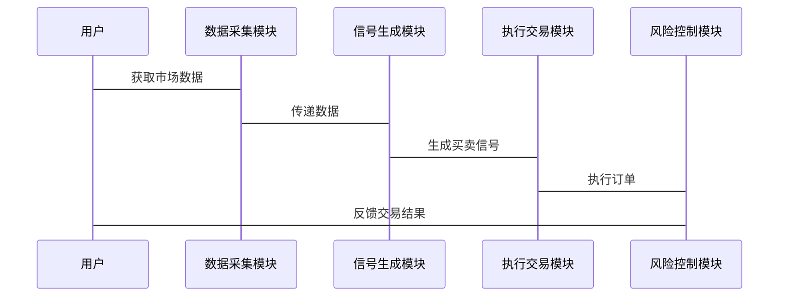

                 


# 自动化交易系统的集成

## 关键词：自动化交易系统，系统集成，高频交易，统计套利，风险管理

## 摘要：  
本文详细探讨了自动化交易系统的集成过程，从基本概念到系统架构，从算法原理到项目实战，全面解析了如何构建一个高效、稳定的自动化交易系统。文章结合实际案例，深入分析了系统集成的关键技术与挑战，并提出了优化建议与未来发展方向。

---

# 第1章：自动化交易系统的背景与概念

## 1.1 自动化交易的基本概念  
### 1.1.1 什么是自动化交易  
自动化交易是指通过计算机算法和系统自动执行交易决策的过程，无需人工干预。  

### 1.1.2 自动化交易的特点  
- **高速性**：能够在毫秒级别完成交易决策。  
- **稳定性**：通过算法确保交易行为的可预测性。  
- **高效性**：减少人为情绪干扰，提高交易效率。  

### 1.1.3 自动化交易的应用场景  
- 股票交易  
- 外汇交易  
- 期货交易  
- 数字货币交易  

## 1.2 自动化交易系统的组成  
### 1.2.1 数据采集模块  
- **市场数据**：实时市场行情数据，如价格、成交量等。  
- **历史数据**：过去交易数据，用于策略回测。  

### 1.2.2 信号生成模块  
- **算法策略**：如均值回归、趋势跟踪等。  
- **风险管理**：控制单笔交易的风险敞口。  

### 1.2.3 执行交易模块  
- **订单生成**：根据信号生成具体的买卖指令。  
- **订单执行**：通过API或交易平台执行订单。  

### 1.2.4 风险控制模块  
- **止损策略**：设定最大亏损容忍度。  
- **头寸管理**：控制整体仓位风险。  

## 1.3 自动化交易与传统交易的区别  
### 1.3.1 交易速度的差异  
- 传统交易：依赖人工决策，速度较慢。  
- 自动化交易：算法实时执行，速度快。  

### 1.3.2 交易策略的差异  
- 传统交易：基于市场分析和经验判断。  
- 自动化交易：基于算法和数据驱动。  

### 1.3.3 市场影响的差异  
- 传统交易：可能引发市场波动。  
- 自动化交易：高频交易可能导致市场流动性冲击。  

## 1.4 自动化交易系统的优缺点  
### 1.4.1 优势分析  
- 提高交易效率。  
- 减少人为情绪干扰。  
- 支持高频交易。  

### 1.4.2 劣势分析  
- 系统故障可能导致重大损失。  
- 可能引发市场操纵。  
- 高频交易成本较高。  

### 1.4.3 适用场景分析  
- 适合标准化市场。  
- 适合数据驱动型策略。  
- 适合对冲基金等机构投资者。  

## 1.5 本章小结  
本章从基本概念、系统组成、与传统交易的区别以及优缺点四个方面，全面介绍了自动化交易系统的核心概念和应用场景。

---

# 第2章：自动化交易系统的集成背景

## 2.1 金融市场的数字化转型  
### 2.1.1 传统交易方式的局限性  
- 人工交易效率低，容易出错。  
- 无法应对高频交易需求。  

### 2.1.2 数字化交易的需求  
- 提高交易效率。  
- 降低交易成本。  
- 支持复杂策略实现。  

### 2.1.3 自动化交易的兴起  
- 技术进步推动自动化交易发展。  
- 市场竞争加剧，自动化交易成为必然选择。  

## 2.2 技术进步推动自动化交易发展  
### 2.2.1 高性能计算技术  
- 多核处理器、GPU加速等技术提升了交易系统的处理能力。  

### 2.2.2 人工智能技术  
- 机器学习算法用于市场预测和策略优化。  

### 2.2.3 大数据技术  
- 数据挖掘和分析技术支持策略开发和回测。  

## 2.3 自动化交易的市场现状  
### 2.3.1 全球自动化交易市场分析  
- 自动化交易占比逐年提升。  
- 美国市场自动化交易占比超过70%。  

### 2.3.2 中国市场自动化交易现状  
- 自动化交易逐步普及，但比例相对较低。  
- 机构投资者是主要推动者。  

### 2.3.3 未来发展趋势预测  
- 更高的交易频率。  
- 更复杂的算法策略。  
- 更强的系统集成能力。  

## 2.4 本章小结  
本章分析了自动化交易系统在金融市场中的背景，包括数字化转型、技术进步以及市场现状和未来趋势。

---

# 第3章：自动化交易系统的核心概念与联系

## 3.1 系统集成的核心概念  
### 3.1.1 系统模块划分  
- 数据采集模块：负责数据的获取和预处理。  
- 信号生成模块：负责策略开发和信号生成。  
- 执行交易模块：负责订单生成和执行。  
- 风险控制模块：负责风险监控和管理。  

### 3.1.2 系统功能定义  
- 数据采集：实时获取市场数据。  
- 策略开发：设计交易策略并回测。  
- 信号生成：根据策略生成买卖信号。  
- 风险管理：监控和控制交易风险。  

### 3.1.3 系统性能指标  
- 延迟：从信号生成到订单执行的时间。  
- 可靠性：系统的稳定性与容错能力。  
- 扩展性：系统的可扩展性与适应性。  

## 3.2 核心概念的属性对比  
### 3.2.1 模块化与整体化对比  
| 属性 | 模块化 | 整体化 |
|------|--------|--------|
| 优点 | 系统灵活，便于维护 | 系统稳定，易于管理 |
| 缺点 | 开发复杂度高 | 系统扩展性差 |

### 3.2.2 高效性与稳定性对比  
| 属性 | 高效性 | 稳定性 |
|------|--------|--------|
| 优点 | 交易速度快 | 系统可靠性高 |
| 缺点 | 系统资源消耗大 | 系统响应速度慢 |

### 3.2.3 可扩展性与安全性对比  
| 属性 | 可扩展性 | 安全性 |
|------|--------|--------|
| 优点 | 系统适应性强 | 数据安全有保障 |
| 缺点 | 初期开发成本高 | 安全漏洞存在风险 |

## 3.3 ER实体关系图架构  


## 3.4 本章小结  
本章通过核心概念的对比和ER实体关系图，分析了自动化交易系统各模块之间的关系与特性。

---

# 第4章：自动化交易系统的算法原理

## 4.1 高频交易算法  
### 4.1.1 算法原理  
高频交易算法通过分析市场数据中的微小价格波动，快速执行买卖指令，从中获利。  



### 4.1.2 代码实现  
```python
import pandas as pd
import numpy as np

def calculate_signal(data):
    # 示例算法：计算短期移动平均线与长期移动平均线的交叉点
    short_ma = data['close'].rolling(10).mean()
    long_ma = data['close'].rolling(50).mean()
    signal = 1 if short_ma[-1] > long_ma[-1] else -1
    return signal

data = pd.read_csv('market_data.csv')
signal = calculate_signal(data)
print(signal)
```

## 4.2 统计套利算法  
### 4.2.1 算法原理  
统计套利算法通过寻找资产之间的统计套利机会，利用均值回归策略进行交易。  



### 4.2.2 代码实现  
```python
import pandas as pd
import numpy as np

def calculate_arbitrage_opportunity(data):
    # 示例算法：寻找价差异常的资产对
    asset1 = data['asset1']
    asset2 = data['asset2']
    spread = asset1 - asset2
    zscore = (spread - spread.mean()) / spread.std()
    threshold = 2
    if abs(zscore[-1]) > threshold:
        return 'execute_arbitrage'
    else:
        return 'no_trade'

data = pd.read_csv('market_data.csv')
opportunity = calculate_arbitrage_opportunity(data)
print(opportunity)
```

## 4.3 算法实现代码  
### 4.3.1 高频交易算法的数学模型  
$$ 短期移动平均线 = \frac{\sum_{i=1}^{n} p_i}{n} $$  
$$ 长期移动平均线 = \frac{\sum_{i=1}^{m} p_i}{m} $$  
$$ 信号 = 1 \text{ 如果 } \text{短期移动平均线} > \text{长期移动平均线} $$  

### 4.3.2 统计套利算法的数学模型  
$$ \text{价差} = p_1 - p_2 $$  
$$ \text{Z分数} = \frac{\text{价差} - \text{均值}}{\text{标准差}} $$  
$$ \text{信号} = 1 \text{ 如果 } |\text{Z分数}| > \text{阈值} $$  

## 4.4 本章小结  
本章通过高频交易和统计套利两个典型算法，详细介绍了自动化交易系统中的算法原理和实现方法。

---

# 第5章：自动化交易系统的系统架构设计

## 5.1 系统功能设计  
### 5.1.1 领域模型设计  


### 5.1.2 系统架构设计  


### 5.1.3 系统接口设计  
- 数据接口：与交易所API对接。  
- 交易接口：与交易系统对接。  
- 风险接口：与风险管理系统对接。  

## 5.2 系统架构方案  
### 5.2.1 问题场景介绍  
- 高频交易对系统性能的要求。  
- 多策略同时运行的资源分配问题。  

### 5.2.2 项目介绍  
- 开发一个支持多策略的自动化交易系统。  
- 系统架构采用模块化设计，便于扩展和维护。  

### 5.2.3 系统功能设计  
- 数据采集模块：实时获取市场数据。  
- 信号生成模块：根据策略生成买卖信号。  
- 执行交易模块：自动执行订单。  
- 风险控制模块：监控交易风险并进行干预。  

### 5.2.4 系统架构设计  
- **分层架构**：将系统分为数据层、业务逻辑层和表现层。  
- **微服务架构**：每个模块独立运行，通过API进行通信。  

## 5.3 系统交互设计  
### 5.3.1 系统交互流程  


## 5.4 本章小结  
本章从系统功能设计、架构设计和交互设计三个方面，详细分析了自动化交易系统的架构方案。

---

# 第6章：自动化交易系统的项目实战

## 6.1 环境配置  
### 6.1.1 开发环境  
- 操作系统：Linux/Windows/MacOS  
- 开发工具：Python、Jupyter Notebook  
- 依赖库：Pandas、NumPy、Matplotlib  

### 6.1.2 交易接口  
- 第三方API：如 Interactive Brokers、MetaTrader  
- 数据源：Yahoo Finance、Quandl  

## 6.2 核心代码实现  
### 6.2.1 数据采集模块  
```python
import pandas as pd
import requests

def get_market_data(symbol, start_date, end_date):
    url = f"https://api.example.com/historical_data/{symbol}"
    params = {
        'start': start_date,
        'end': end_date
    }
    response = requests.get(url, params=params)
    data = response.json()
    df = pd.DataFrame(data)
    return df

market_data = get_market_data('AAPL', '2023-01-01', '2023-12-31')
print(market_data)
```

### 6.2.2 信号生成模块  
```python
def generate_signal(data):
    # 示例策略：简单移动平均线策略
    short_ma = data['close'].rolling(10).mean()
    long_ma = data['close'].rolling(50).mean()
    signal = 1 if short_ma[-1] > long_ma[-1] else -1
    return signal

signal = generate_signal(market_data)
print(signal)
```

### 6.2.3 执行交易模块  
```python
import pytz
from ibapi.client import EClient
from ibapi.contract import Contract

def execute_order(symbol, quantity, signal):
    # 示例：通过Interactive Brokers API执行订单
    client = EClient()
    contract = Contract(symbol=symbol, exchange='SMART', currency='USD', sec_type='STK')
    if signal == 1:
        order = client.order().order.create(
            symbol=symbol,
            quantity=quantity,
            action='BUY',
            type='MKT',
            pytz.timezone('US/Eastern')
        )
    else:
        order = client.order().order.create(
            symbol=symbol,
            quantity=quantity,
            action='SELL',
            type='MKT',
            pytz.timezone('US/Eastern')
        )
    return order

order = execute_order('AAPL', 100, signal)
print(order)
```

## 6.3 案例分析  
### 6.3.1 实际案例分析  
- 案例一：使用简单移动平均线策略进行股票交易。  
- 案例二：使用统计套利策略进行外汇交易。  

### 6.3.2 代码实现解读  
- 数据采集模块：实时获取市场数据。  
- 信号生成模块：根据策略生成买卖信号。  
- 执行交易模块：自动执行交易订单。  

## 6.4 本章小结  
本章通过实际案例和代码实现，详细讲解了自动化交易系统的集成过程。

---

# 第7章：自动化交易系统的最佳实践与优化

## 7.1 最佳实践  
### 7.1.1 系统性能优化  
- 使用高效的编程语言，如C++或Python的底层优化。  
- 优化数据结构和算法，减少计算时间。  

### 7.1.2 风险管理优化  
- 设置合理的止损点和止盈点。  
- 定期回测策略，调整风险参数。  

### 7.1.3 系统稳定性优化  
- 使用冗余设计，确保系统高可用性。  
- 定期进行压力测试，提升系统承载能力。  

## 7.2 注意事项  
### 7.2.1 系统集成中的风险  
- 系统故障可能导致重大损失。  
- 数据源不稳定可能影响交易决策。  

### 7.2.2 交易策略的风险  
- 策略失效可能导致系统性亏损。  
- 市场波动可能导致策略无法适应。  

## 7.3 拓展阅读  
- 《算法交易：胜过市场的简单方法》  
- 《Python算法交易：从入门到实践》  

## 7.4 本章小结  
本章总结了自动化交易系统集成中的最佳实践和注意事项，为读者提供了宝贵的优化建议。

---

# 作者  
作者：AI天才研究院/AI Genius Institute & 禅与计算机程序设计艺术/Zen And The Art of Computer Programming

