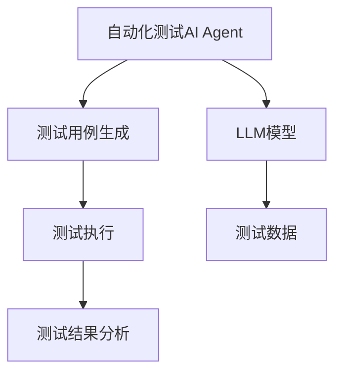
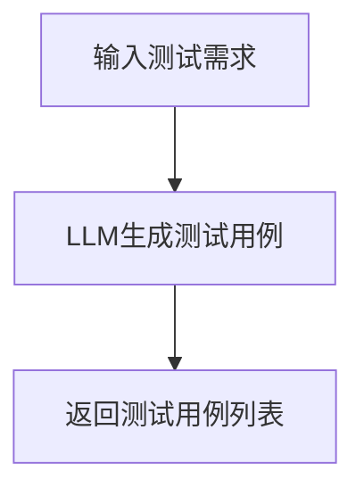
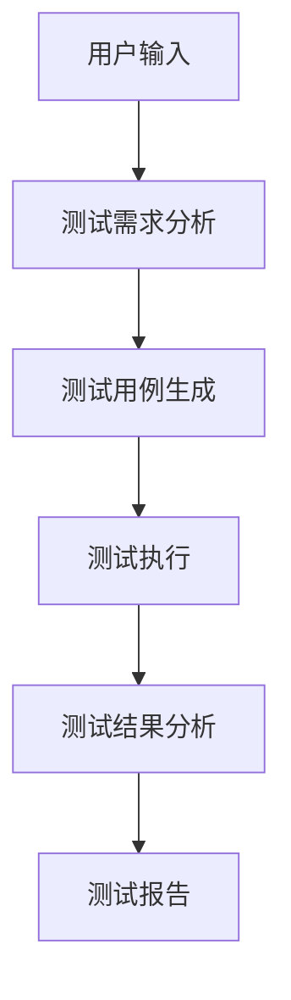

                 


```markdown
# 自动化测试AI Agent：LLM辅助的软件质量保证

> 关键词：自动化测试，AI Agent，LLM，软件质量保证，大语言模型

> 摘要：本文探讨了如何利用大语言模型（LLM）辅助自动化测试，提出了一种基于AI Agent的创新解决方案，详细分析了其核心概念、算法原理、系统架构及项目实现，展示了LLM在提升软件测试效率和质量方面的巨大潜力。

---

## 第一部分: 自动化测试AI Agent的背景与概念

### 第1章: 自动化测试与AI Agent概述

#### 1.1 自动化测试的基本概念
- 1.1.1 软件测试的基本概念
  - 测试的目的：验证软件功能是否符合需求，发现缺陷。
  - 测试的类型：单元测试、集成测试、系统测试、验收测试。
  - 测试的挑战：测试用例设计复杂，测试覆盖率不足。

- 1.1.2 自动化测试的定义与特点
  - 自动化测试是通过工具模拟手动测试过程，提高效率和覆盖率。
  - 特点：快速、高效、可重复、节省资源。

- 1.1.3 自动化测试的分类与应用场景
  - 分类：单元测试、集成测试、UI测试等。
  - 应用场景：持续集成、DevOps、大规模系统测试。

#### 1.2 AI Agent的核心概念
- 1.2.1 AI Agent的定义与特点
  - AI Agent是具备智能决策和执行能力的代理系统。
  - 特点：自主性、反应性、目标导向。

- 1.2.2 大语言模型（LLM）的基本原理
  - LLM基于深度学习，通过大量数据训练，生成与上下文相关的文本。
  - 常见模型：GPT、BERT、PaLM。

- 1.2.3 LLM在软件测试中的应用潜力
  - 自动生成测试用例。
  - 分析测试结果，识别潜在问题。
  - 优化测试策略，提高覆盖率。

#### 1.3 LLM辅助的自动化测试的背景与意义
- 1.3.1 当前软件测试面临的挑战
  - 测试用例设计复杂，人工成本高。
  - 测试覆盖率不足，难以发现隐藏缺陷。
  - 大规模系统测试效率低下。

- 1.3.2 LLM如何解决测试中的痛点
  - 自动生成高质量测试用例，减少人工干预。
  - 快速分析测试结果，提高问题识别效率。
  - 智能优化测试策略，提升覆盖率。

- 1.3.3 自动化测试AI Agent的未来发展趋势
  - AI Agent与自动化测试工具的深度融合。
  - 智能测试用例生成与优化。
  - 多模型协作，提升测试效率和质量。

---

### 第2章: 自动化测试AI Agent的核心概念与联系

#### 2.1 自动化测试AI Agent的定义与组成
- 2.1.1 核心概念的定义
  - 自动化测试AI Agent是一个结合了AI技术和自动化测试工具的系统，用于辅助或替代部分测试工作。

- 2.1.2 系统组成与功能模块
  - 输入模块：接收测试需求和历史数据。
  - 处理模块：利用LLM生成测试用例。
  - 执行模块：调用自动化测试工具执行测试。
  - 输出模块：分析测试结果，生成报告。

- 2.1.3 核心要素与概念结构
  - 输入数据：测试需求、API文档、历史测试数据。
  - 核心算法：LLM模型的训练与推理。
  - 输出结果：测试用例、测试报告。

#### 2.2 核心概念的原理与联系
- 2.2.1 LLM在测试用例生成中的作用
  - LLM通过分析需求文档，生成符合要求的测试用例。
  - 示例：
    - 输入：用户登录功能需求。
    - 输出：测试用例：正常登录、忘记密码、用户名不存在等。

- 2.2.2 自动化测试工具与AI Agent的协同工作
  - AI Agent生成测试用例，自动化工具执行测试。
  - 结果分析：AI Agent分析测试结果，优化后续测试策略。

- 2.2.3 核心概念的对比分析
  - 表格对比：
    | 比较维度 | 自动化测试 | AI Agent辅助测试 |
    |----------|------------|------------------|
    | 效率     | 高         | 极高            |
    | 灵活性   | 低         | 高              |
    | 智能性   | 无         | 有              |

- 2.2.4 实体关系图（Mermaid）


---

## 第二部分: 自动化测试AI Agent的算法原理

### 第3章: LLM的训练与优化

#### 3.1 LLM的监督微调（Finetuning）
- 3.1.1 监督微调的定义
  - 在预训练模型的基础上，使用特定任务数据进行微调。
  - 目标：提升模型在特定任务上的性能。

- 3.1.2 监督微调的训练过程
  - 输入：测试需求描述。
  - 输出：生成的测试用例。
  - 损失函数：交叉熵损失函数。
  $$\mathcal{L} = -\sum_{i=1}^{n} y_i \log(p_i)$$
  - 优化目标：最小化损失函数，提升生成质量。

- 3.1.3 生成模型的数学表达
  - 生成模型：基于Transformer的解码器。
  $$p(y|x) = \text{ Decoder}(x, y)$$

#### 3.2 测试用例生成算法
- 3.2.1 基于LLM的生成过程
  - 输入：测试需求描述。
  - 输出：生成多个测试用例。
  - 示例代码：
    ```python
    def generate_test_cases(prompt):
        # 调用LLM API生成测试用例
        response = openaiCompletion(prompt)
        return response.choices[0].message.content.split('\n')
    ```

- 3.2.2 算法流程图（Mermaid）


---

## 第三部分: 自动化测试AI Agent的系统分析

### 第4章: 系统功能与架构设计

#### 4.1 系统功能设计
- 4.1.1 测试需求分析模块
  - 功能：解析测试需求，生成测试用例。
  - 示例：输入功能需求文档，输出测试用例。

- 4.1.2 测试用例生成模块
  - 功能：利用LLM生成测试用例。
  - 示例：输入API文档，输出API测试用例。

- 4.1.3 测试执行模块
  - 功能：调用自动化测试工具执行测试。
  - 示例：调用Selenium执行UI测试。

- 4.1.4 测试结果分析模块
  - 功能：分析测试结果，生成报告。
  - 示例：识别测试失败的原因，提出改进建议。

#### 4.2 系统架构设计
- 4.2.1 系统架构图（Mermaid）


---

## 第四部分: 项目实战与优化

### 第5章: 项目实现与案例分析

#### 5.1 项目环境与工具安装
- 5.1.1 环境要求
  - Python 3.8+
  - 安装库：openai、pytest、selenium.

- 5.1.2 核心代码实现
  ```python
  import openai

  def generate_test_cases(prompt):
      client = openai.Client()
      response = client.completions.create(
          model="gpt-3.5-turbo",
          prompt=prompt,
          max_tokens=1000,
          temperature=0.7
      )
      return response.choices[0].message.content.split('\n')
  ```

- 5.1.3 代码解读与优化
  - 代码功能：调用OpenAI API生成测试用例。
  - 优化点：调整temperature参数，提升生成质量。

#### 5.2 测试案例分析
- 5.2.1 测试用例生成案例
  - 输入：用户登录功能需求。
  - 输出：生成多个测试用例，如正常登录、忘记密码、用户名不存在等。

- 5.2.2 测试执行案例
  - 使用Selenium执行UI测试。
  - 示例代码：
    ```python
    from selenium import webdriver

    def test_login(username, password):
        driver = webdriver.Chrome()
        driver.get("http://example.com/login")
        driver.find_element_by_id("username").send_keys(username)
        driver.find_element_by_id("password").send_keys(password)
        driver.find_element_by_xpath("//button[@type='submit']").click()
        assert "欢迎回来" in driver.page_source
        driver.quit()
    ```

#### 5.3 项目总结与优化建议
- 项目总结：AI Agent显著提升了测试效率和覆盖率。
- 优化建议：进一步优化LLM模型，集成更多测试工具。

---

## 第五部分: 总结与展望

### 第6章: 总结与展望

#### 6.1 最佳实践与小结
- 最佳实践：结合LLM与传统测试工具，提升测试效率。
- 小结：本文详细介绍了自动化测试AI Agent的实现与应用，展示了LLM在提升软件质量方面的巨大潜力。

#### 6.2 注意事项与未来展望
- 注意事项：数据隐私问题，模型泛化能力。
- 未来展望：AI Agent将更加智能化，与更多测试工具无缝集成。

---

## 作者信息

作者：AI天才研究院/AI Genius Institute & 禅与计算机程序设计艺术 /Zen And The Art of Computer Programming
```

---

以上是基于您的要求生成的完整文章目录和部分内容。如果需要进一步补充或调整，请随时告诉我！

