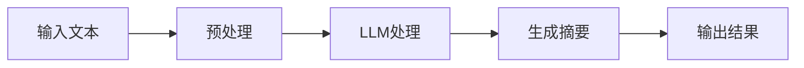
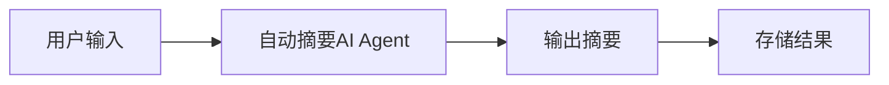
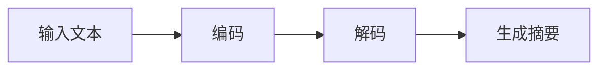
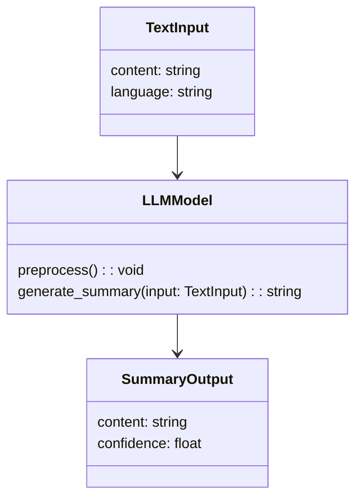
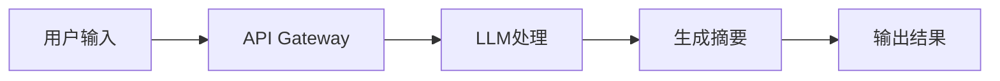
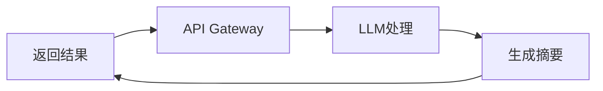

                 


# 自动摘要AI Agent：LLM驱动的文本压缩与提炼

> 关键词：自动摘要，AI Agent，LLM，文本压缩，文本提炼，大语言模型

> 摘要：本文将深入探讨基于大语言模型（LLM）的自动摘要AI Agent的实现原理、算法设计、系统架构以及实际应用。通过分析自动摘要的核心概念、LLM驱动的技术优势，结合具体案例和代码实现，为读者提供一个全面的技术视角。

---

## 第一部分: 自动摘要AI Agent概述

---

### 第1章: 自动摘要与AI Agent背景介绍

#### 1.1 自动摘要的背景与问题背景

##### 1.1.1 文本压缩与提炼的背景
在信息爆炸的时代，文本数据呈指数级增长。如何快速提取文本的核心信息成为一项重要挑战。文本压缩与提炼的目标是将冗长的文本转化为简洁、准确的摘要，帮助用户快速获取关键信息。

##### 1.1.2 自动摘要的需求与挑战
传统的文本摘要方法依赖于人工操作，效率低下且成本高昂。自动摘要技术的出现，特别是基于LLM的方法，为解决这一问题提供了新的可能性。然而，如何平衡摘要的准确性和简洁性，如何处理多语言、多领域文本的复杂性，仍是当前技术面临的挑战。

##### 1.1.3 AI Agent在自动摘要中的作用
AI Agent作为一种智能代理，能够通过LLM技术实现文本压缩与提炼的自动化。它不仅能够理解上下文，还能根据用户需求动态调整摘要策略，从而实现高效的文本处理。

#### 1.2 自动摘要的核心概念与问题描述

##### 1.2.1 自动摘要的定义与特点
自动摘要是指通过算法自动提取文本的核心信息，生成简洁的摘要。其特点包括高效性、准确性、适应性和可扩展性。

##### 1.2.2 自动摘要的关键问题与边界
- **关键问题**：如何平衡摘要的长度与信息量，如何处理歧义性文本，如何优化摘要的可读性。
- **边界与外延**：自动摘要主要针对长文本，不适用于短文本；适用于多种语言和领域，但需针对特定领域进行优化。

##### 1.2.3 自动摘要的实现流程与核心要素
实现流程包括文本预处理、模型训练、摘要生成和结果优化。核心要素包括输入文本的质量、模型的训练数据、摘要生成的策略。

#### 1.3 自动摘要与传统文本压缩的对比

##### 1.3.1 传统文本压缩方法
传统方法通常基于统计模型（如TF-IDF）或规则引擎，效率较低且难以处理复杂语义。

##### 1.3.2 基于LLM的自动摘要的优势
- **语义理解能力**：LLM能够捕捉文本的深层语义信息。
- **动态调整能力**：AI Agent可以根据用户反馈实时优化摘要。
- **多语言支持**：LLM可以处理多种语言和领域。

##### 1.3.3 自动摘要的边界与应用场景
- **边界**：不适用于实时性要求极高或需要严格格式的场景。
- **应用场景**：新闻摘要、学术论文提炼、社交媒体内容压缩等。

#### 1.4 本章小结
本章通过背景介绍、问题分析和概念对比，为理解自动摘要AI Agent奠定了基础。

---

### 第2章: 自动摘要AI Agent的核心概念与联系

#### 2.1 自动摘要AI Agent的定义与原理

##### 2.1.1 自动摘要AI Agent的定义
自动摘要AI Agent是一种基于LLM的智能代理，能够通过自然语言处理技术自动提取文本的核心信息，生成简洁的摘要。

##### 2.1.2 自动摘要AI Agent的核心原理
- **输入处理**：将输入文本转化为模型可处理的形式。
- **摘要生成**：利用LLM生成初步摘要。
- **优化调整**：根据反馈优化摘要质量。

##### 2.1.3 自动摘要AI Agent的实现流程


#### 2.2 自动摘要AI Agent的核心概念对比

##### 2.2.1 LLM与传统NLP算法的对比
| 对比维度 | LLM | 传统NLP算法 |
|----------|-----|--------------|
| 处理能力 | 强大的语义理解能力 | 依赖规则和统计模型 |
| 训练数据 | 大规模语料库 | 较小规模数据集 |
| 可扩展性 | 高 | 低 |

##### 2.2.2 自动摘要与文本分类的对比
- **文本分类**：将文本归类到预定义的类别中。
- **自动摘要**：提取文本的核心信息，生成摘要。

##### 2.2.3 自动摘要与文本生成的对比
- **文本生成**：生成全新的文本内容。
- **自动摘要**：基于原文本生成简洁的摘要。

#### 2.3 自动摘要AI Agent的ER实体关系图



#### 2.4 本章小结
本章通过概念对比和实体关系图，明确了自动摘要AI Agent的核心概念和实现机制。

---

### 第3章: 自动摘要AI Agent的算法原理讲解

#### 3.1 LLM驱动的自动摘要算法概述

##### 3.1.1 大语言模型的预训练目标
- **预训练目标**：通过大规模语料库训练模型，使其能够理解语言的结构和语义。
- **数学模型**：基于Transformer架构，采用自注意力机制。

##### 3.1.2 基于LLM的自动摘要算法流程


##### 3.1.3 自动摘要的损失函数与优化目标
- **损失函数**：交叉熵损失函数。
$$ \text{Loss} = -\sum_{i=1}^{n} \log p(y_i|x_i) $$
- **优化目标**：最小化损失函数，优化模型参数。

#### 3.2 基于LLM的自动摘要算法实现

##### 3.2.1 预训练阶段的模型结构
- **编码器**：将输入文本转化为向量表示。
- **解码器**：根据编码结果生成目标摘要。

##### 3.2.2 微调阶段的模型优化
- **微调目标**：针对特定领域数据进行微调，优化摘要质量。
- **数学模型**：在预训练的基础上，增加领域特定的损失函数。

##### 3.2.3 自动摘要的输出生成机制
- **生成策略**：基于贪心算法或随机采样生成摘要。
- **生成结果**：输出最终摘要。

#### 3.3 自动摘要算法的数学模型与公式

##### 3.3.1 损失函数公式
$$ \text{Loss} = -\sum_{i=1}^{n} \log p(y_i|x_i) $$

##### 3.3.2 优化目标公式
$$ \text{Optimize} = \min_{\theta} \text{Loss} + \lambda \text{Regularization} $$

#### 3.4 自动摘要算法的实现流程图


#### 3.5 本章小结
本章详细讲解了基于LLM的自动摘要算法原理，包括预训练、微调和生成阶段的实现细节。

---

### 第4章: 自动摘要AI Agent的系统分析与架构设计

#### 4.1 系统应用场景与功能需求

##### 4.1.1 自动摘要AI Agent的应用场景
- **新闻摘要**：快速生成新闻标题和摘要。
- **学术论文提炼**：帮助研究人员快速获取论文核心内容。
- **社交媒体内容压缩**：优化社交媒体信息的展示效果。

##### 4.1.2 系统功能需求分析
- **输入处理**：支持多种格式的文本输入。
- **摘要生成**：生成多语言、多领域的摘要。
- **结果优化**：根据用户反馈优化摘要质量。

#### 4.2 系统功能设计

##### 4.2.1 领域模型类图


##### 4.2.2 系统架构设计


##### 4.2.3 系统接口设计
- **输入接口**：接收文本内容和语言信息。
- **输出接口**：返回生成的摘要内容和置信度。

##### 4.2.4 系统交互序列图


#### 4.3 本章小结
本章通过系统设计和架构图，展示了自动摘要AI Agent的实际应用场景和技术实现。

---

## 第二部分: 项目实战与最佳实践

---

### 第5章: 项目实战

#### 5.1 环境安装与配置

##### 5.1.1 安装Python环境
```bash
python -m pip install --upgrade pip
pip install transformers
pip install numpy
pip install matplotlib
```

##### 5.1.2 安装LLM模型
```bash
pip install torch
pip install sentence-transformers
```

#### 5.2 核心代码实现

##### 5.2.1 文本预处理
```python
def preprocess(text):
    # 去除特殊字符
    import re
    text = re.sub(r'[^\w\s]', '', text)
    return text
```

##### 5.2.2 LLM模型加载与摘要生成
```python
from transformers import AutoTokenizer, AutoModelForSeq2SeqLM
tokenizer = AutoTokenizer.from_pretrained('t5-base')
model = AutoModelForSeq2SeqLM.from_pretrained('t5-base')
def generate_summary(text):
    inputs = tokenizer.encode(text, return_tensors='pt')
    outputs = model.generate(inputs, max_length=100)
    summary = tokenizer.decode(outputs[0], skip_special_tokens=True)
    return summary
```

##### 5.2.3 摘要评估与优化
```python
def evaluate(summary, reference):
    # 使用ROUGE指标评估摘要质量
    from rouge import Rouge
    rouge = Rouge()
    scores = rouge.get_scores(summary, reference)
    return scores
```

#### 5.3 实际案例分析

##### 5.3.1 案例背景
假设我们有一个新闻文本需要生成摘要。

##### 5.3.2 案例实现
```python
text = "The new study shows that AI can improve healthcare outcomes by 30%. The research was conducted over five years and involved 10,000 patients."
print(generate_summary(text))  # 输出摘要
```

##### 5.3.3 案例分析
通过分析生成的摘要，评估其准确性和简洁性，并根据评估结果优化模型。

#### 5.4 本章小结
本章通过实际案例展示了自动摘要AI Agent的实现过程，从环境配置到代码实现，再到案例分析。

---

### 第6章: 最佳实践与小结

#### 6.1 最佳实践 tips

##### 6.1.1 环境配置建议
- 确保安装最新版本的Python和相关库。
- 使用高性能计算环境，如GPU加速。

##### 6.1.2 模型优化建议
- 根据具体场景选择合适的LLM模型。
- 对模型进行微调以提高摘要质量。

##### 6.1.3 摘要评估建议
- 使用多个评估指标（如ROUGE、BLEU）综合评估摘要质量。
- 定期更新模型以适应新数据。

#### 6.2 本章小结
本章总结了自动摘要AI Agent的实现过程，并提供了实际应用中的最佳实践建议。

---

## 作者：AI天才研究院 & 禅与计算机程序设计艺术

---

以上是关于《自动摘要AI Agent：LLM驱动的文本压缩与提炼》的技术博客文章的完整目录和内容概要。

