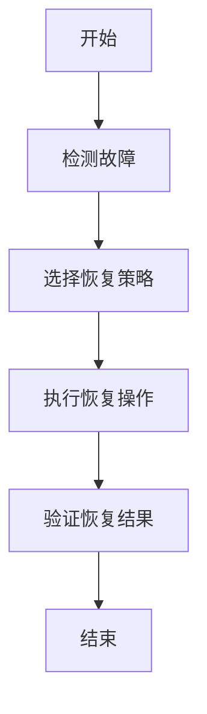

                 


# 自动故障恢复：提高AI Agent的可靠性

> **关键词**：AI Agent, 故障恢复, 可靠性, 算法原理, 系统架构, 项目实战

> **摘要**：  
> 本文详细探讨了AI Agent的自动故障恢复技术，从核心概念、算法原理到系统设计，再到项目实战，全面解析了如何通过自动故障恢复提高AI Agent的可靠性。文章通过背景介绍、算法流程图、数学公式、系统架构图等多维度分析，为读者提供了一套完整的解决方案，帮助AI Agent在复杂环境中稳定运行。

---

## 第一部分: 自动故障恢复的背景与概念

### 第1章: 自动故障恢复的背景与概念

#### 1.1 问题背景
- **AI Agent的可靠性挑战**：AI Agent在实际应用中面临多种不确定性，如环境干扰、数据错误、算法失效等，这些都会导致系统故障。  
- **故障恢复的重要性**：故障恢复是保障AI Agent稳定运行的关键技术，能够最大限度减少停机时间，提高系统的可用性。  
- **核心目标**：实现自动化、快速响应的故障检测与恢复机制，确保AI Agent在复杂环境中的可靠性。

#### 1.2 核心概念与联系
- **故障检测与恢复的基本原理**：通过实时监控系统状态，识别异常情况并触发恢复操作。  
- **关键概念对比表格**：  
  | 概念         | 描述                                   |
  |--------------|--------------------------------------|
  | 故障检测     | 识别系统中的异常状态                   |
  | 恢复策略     | 针对故障的解决方案                     |
  | 可靠性评估   | 量化系统在故障情况下的表现           |
- **ER实体关系图架构**  
  ```mermaid
  er
      A(AgentID, AgentName, Status)
      F(FailureID, FailureType, FailureTime)
      R(RestoreID, RestoreTime, RestoreStatus)
      A-F-FR(FailureID, AgentID)
      F-R(RestoreID, FailureID)
  ```

---

## 第二部分: 自动故障恢复算法原理

### 第2章: 自动故障恢复算法原理

#### 2.1 故障检测算法
- **基于概率的故障检测模型**：通过历史数据计算故障概率，实时监控当前状态，判断是否触发故障检测。  
  $$P(Failure) = \frac{N_{failure}}{N_{total}}$$  
- **基于时间序列的异常检测**：利用时间序列分析方法，识别系统状态中的突变点。  
- **基于聚类分析的故障检测**：将系统状态数据聚类，发现偏离主集群的异常状态。

#### 2.2 恢复策略选择
- **基于决策树的恢复策略**：通过构建决策树，根据故障类型和系统状态选择最优恢复路径。  
  ```mermaid
  graph TD
      A[故障类型] --> B[选择恢复方法]
      B --> C[执行恢复操作]
  ```
- **基于马尔可夫链的状态转移模型**：利用状态转移概率，预测恢复过程中的状态变化，优化恢复路径。  
  状态转移矩阵：  
  $$
  \begin{pmatrix}
  0.7 & 0.3 \\
  0.2 & 0.8 \\
  \end{pmatrix}
  $$

#### 2.3 算法流程图


---

## 第三部分: 数学模型与公式解析

### 第3章: 数学模型与公式解析

#### 3.1 故障概率模型
- **故障概率计算公式**：$$P(Failure) = \frac{N_{failure}}{N_{total}}$$  
  其中，$N_{failure}$为故障发生次数，$N_{total}$为总运行次数。  
- **状态转移矩阵**：  
  $$
  \begin{pmatrix}
  0.7 & 0.3 \\
  0.2 & 0.8 \\
  \end{pmatrix}
  $$  
  矩阵表示状态之间的转移概率，行表示当前状态，列表示下一个状态。

#### 3.2 恢复策略优化模型
- **基于线性回归的恢复时间预测**：$$t_{restore} = a \cdot t_{detect} + b$$  
  其中，$t_{restore}$为恢复时间，$t_{detect}$为检测时间，$a$和$b$为回归系数。  
- **基于决策树的恢复路径选择**：通过构建决策树，优化恢复路径的选择，减少恢复时间。  
  ```mermaid
  graph TD
      A[故障类型] --> B[选择恢复方法]
      B --> C[执行恢复操作]
  ```

---

## 第四部分: 系统分析与架构设计

### 第4章: 系统分析与架构设计

#### 4.1 问题场景介绍
- **AI Agent的故障场景**：AI Agent在运行过程中可能因网络中断、传感器故障、算法错误等原因导致系统故障。  
- **自动恢复的系统需求**：系统需要具备实时监控能力，能够快速检测故障并自动触发恢复操作。

#### 4.2 系统架构设计
- **领域模型类图**  
  ```mermaid
  classDiagram
      class Agent {
          int ID
          string Name
          bool Status
      }
      class Failure {
          int ID
          string Type
          datetime Time
      }
      class Restore {
          int ID
          datetime Time
          bool Status
      }
      Agent --> Failure
      Failure --> Restore
  ```
- **系统架构图**  
  ```mermaid
  architecture
      Client
      Server
      Database
  ```

#### 4.3 系统接口设计
- **故障检测接口**：提供API用于实时检测系统故障。  
- **恢复操作接口**：根据故障类型调用相应的恢复操作。  

#### 4.4 系统交互流程
- **故障检测与恢复的交互流程**  
  ```mermaid
  sequenceDiagram
      Client -> Server: 发送系统状态请求
      Server -> Database: 查询历史数据
      Database --> Server: 返回历史数据
      Server -> Client: 返回当前状态
      Client -> Server: 发现异常，触发故障检测
      Server -> Restore: 执行恢复操作
      Restore --> Server: 恢复完成
      Server -> Client: 返回恢复结果
  ```

---

## 第五部分: 项目实战

### 第5章: 项目实战

#### 5.1 环境安装
- **开发环境**：Python 3.8+, PyTorch, TensorFlow, Scikit-learn  
- **运行环境**：Ubuntu 20.04, Docker  

#### 5.2 系统核心实现
- **故障检测模块**：基于概率的故障检测算法实现。  
  ```python
  def detect_failure(agent_status):
      failure_prob = calculate_failure_prob(agent_status)
      if failure_prob > 0.9:
          return True
      return False
  ```

- **恢复策略模块**：基于决策树的恢复策略实现。  
  ```python
  def choose_recovery_strategy(failure_type):
      if failure_type == 'network':
          return 'reconnect'
      elif failure_type == 'sensor':
          return 'reset_sensor'
      return 'default'
  ```

#### 5.3 代码应用解读与分析
- **故障检测模块解读**：通过概率模型计算故障概率，判断是否触发故障检测。  
- **恢复策略模块解读**：根据故障类型选择最优恢复策略，确保系统快速恢复。

#### 5.4 实际案例分析
- **案例分析**：假设AI Agent因网络中断导致故障，系统触发恢复操作，选择重新连接网络，成功恢复系统。  
- **详细讲解**：从故障检测到恢复完成的整个流程，分析每一步的具体实现和优化点。

---

## 第六部分: 总结与展望

### 第6章: 总结与展望

#### 6.1 项目总结
- **核心成果**：实现了AI Agent的自动故障恢复系统，提高了系统的可靠性和可用性。  
- **经验总结**：通过概率模型和决策树算法的结合，优化了故障检测和恢复的效率。

#### 6.2 小结
- **注意事项**：在实际应用中，需要根据具体场景调整算法参数，确保系统的稳定性和可靠性。  
- **拓展阅读**：推荐学习相关领域的最新研究成果，如强化学习在故障恢复中的应用。

---

**作者：AI天才研究院/AI Genius Institute & 禅与计算机程序设计艺术 /Zen And The Art of Computer Programming**

