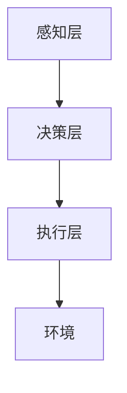
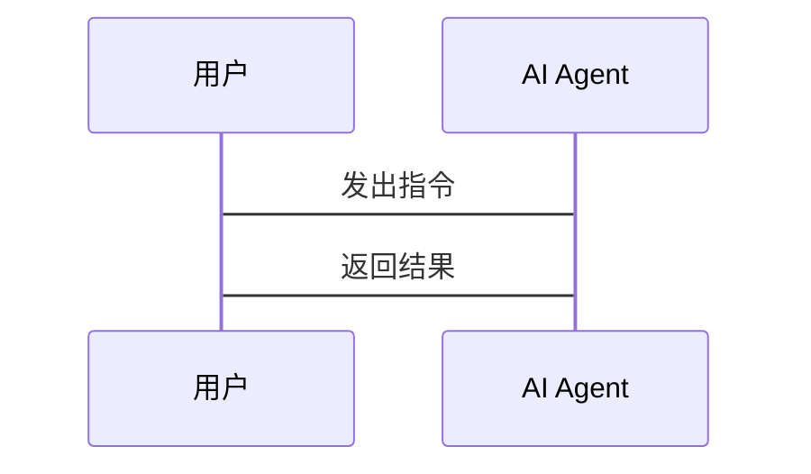
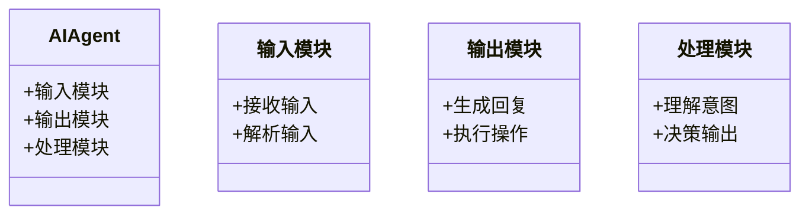

                 


# 自然语言处理在AI Agent中的应用

## 关键词：
- 自然语言处理（NLP）
- AI Agent
- 人机交互
- 语言模型
- 强化学习

## 摘要：
本文详细探讨了自然语言处理在AI Agent中的应用，从NLP和AI Agent的基本概念出发，分析了它们的结合方式、核心算法、系统架构设计以及实际应用场景。通过具体案例和代码实现，深入讲解了如何利用NLP技术提升AI Agent的智能性和交互能力，为读者提供了全面的技术视角和实践指导。

---

# 第一部分: 自然语言处理与AI Agent的背景介绍

## 第1章: 自然语言处理与AI Agent概述

### 1.1 自然语言处理的定义与技术发展
自然语言处理（NLP）是人工智能领域的重要分支，旨在让计算机能够理解、生成和处理人类语言。NLP的核心任务包括语言理解（如文本分类、实体识别）、语言生成（如机器翻译、文本摘要）以及对话生成等。近年来，深度学习技术的引入，如词嵌入（Word2Vec）、Transformer架构等，极大地推动了NLP技术的发展。

**技术发展里程碑**：
- 20世纪50年代：基于规则的NLP系统开始出现。
- 20世纪90年代：统计学方法成为主流。
- 21世纪初：深度学习模型（如RNN、BERT）逐渐取代传统方法。

### 1.2 AI Agent的定义与核心功能
AI Agent是一种能够感知环境并采取行动以实现目标的智能体。它可以分为简单反射型、基于模型的反应型、目标驱动型和实用驱动型四种类型。AI Agent的核心功能包括感知环境、决策制定和执行行动。

**AI Agent的核心功能**：
1. **感知环境**：通过传感器或API获取外部信息。
2. **决策制定**：基于感知信息和目标，选择最优行动。
3. **执行行动**：通过执行器与环境互动。

### 1.3 自然语言处理与AI Agent的结合
AI Agent需要与人类进行自然语言交互，而NLP技术为其提供了实现这一目标的核心能力。例如，智能音箱（如Alexa）通过NLP技术理解用户的语音指令并执行相应的操作。

**结合方式**：
1. **语言理解**：NLP帮助AI Agent理解用户的输入。
2. **语言生成**：NLP帮助AI Agent生成自然的回复。
3. **对话管理**：NLP与强化学习结合，优化对话流程。

---

## 第2章: 自然语言处理的核心原理

### 2.1 语言模型的基本原理
语言模型通过概率分布预测下一个词，常用模型包括马尔可夫链、n-gram和深度学习模型。

**Transformer模型结构**：
- **编码器**：将输入序列转换为固定长度的向量。
- **解码器**：根据编码器的输出生成目标序列。

### 2.2 自然语言理解与生成的实现
自然语言理解（NLU）通过词嵌入、句法分析等技术提取文本信息；自然语言生成（NLG）则通过生成模型（如GPT）生成文本。

**NLU与NLG的对比**：
| **技术**       | **NLU**             | **NLG**             |
|----------------|--------------------|--------------------|
| 输入形式       | 文本或语音          | 语义意图或模板      |
| 输出形式       | 标签或语义表示       | 自然语言文本        |
| 主要任务       | 理解用户意图        | 生成回复或描述      |

### 2.3 自然语言处理的挑战与解决方案
**挑战**：
- 多义词理解
- 上下文依赖
- 实时处理

**解决方案**：
- 使用预训练模型（如BERT）
- 结合领域知识构建定制模型
- 强化学习优化交互流程

---

## 第3章: AI Agent的核心原理

### 3.1 AI Agent的体系结构
AI Agent的体系结构包括感知层、决策层和执行层。

**体系结构图**：


### 3.2 AI Agent的决策机制
决策机制可以通过规则或强化学习实现。

**强化学习框架**：
- **状态**：当前对话的上下文
- **动作**：回复内容或执行命令
- **奖励**：用户反馈

### 3.3 AI Agent的交互方式
交互方式包括文本输入、语音输入和多模态输入。

**交互流程图**：


---

## 第4章: 基于Transformer的NLP算法实现

### 4.1 Transformer模型的原理
Transformer模型由编码器和解码器组成，每个编码器和解码器包含多个堆叠的层。

**Transformer结构图**：
```mermaid
graph TD
    Encoder --> Multi-Head Attention
    Multi-Head Attention --> Feed Forward Network
    Decoder --> Multi-Head Attention
    Multi-Head Attention --> Feed Forward Network
```

### 4.2 使用Python实现简单的Transformer模型
```python
import torch
import torch.nn as nn

class Transformer(nn.Module):
    def __init__(self, input_dim, hidden_dim):
        super(Transformer, self).__init__()
        self.encoder = nn.Linear(input_dim, hidden_dim)
        self.decoder = nn.Linear(hidden_dim, input_dim)

    def forward(self, x):
        encoded = self.encoder(x)
        decoded = self.decoder(encoded)
        return decoded

# 创建实例
model = Transformer(input_dim=100, hidden_dim=200)
# 假设输入
x = torch.randn(100)
output = model(x)
print(output)
```

### 4.3 数学公式与模型分析
**多头注意力机制**：
$$
\text{Attention}(Q, K, V) = \text{softmax}\left(\frac{QK^T}{\sqrt{d_k}}\right)V
$$

---

## 第5章: AI Agent的系统架构设计

### 5.1 系统功能设计
AI Agent的功能模块包括自然语言理解、对话管理、知识库查询和执行接口。

**功能模块图**：


### 5.2 系统架构设计
AI Agent的架构设计包括前端交互、后端处理和知识库支持。

**系统架构图**：


---

## 第6章: 项目实战——实现一个简单的AI Agent

### 6.1 环境安装
安装必要的库：
```
pip install transformers torch
```

### 6.2 核心代码实现
```python
from transformers import pipeline

class SimpleAI:
    def __init__(self):
        self.nlp = pipeline("text-generation", model="gpt2")

    def process_query(self, input_text):
        response = self.nlp(input_text, max_length=50, num_return_sequences=1)
        return response[0]['generated_text']

# 使用示例
agent = SimpleAI()
print(agent.process_query("Hello, how are you?"))
```

### 6.3 代码解读与分析
- **输入处理**：解析用户的输入。
- **NLP处理**：使用预训练模型生成回复。
- **输出**：返回生成的文本或执行命令。

### 6.4 实际案例分析
- **案例1**：用户输入“今天天气如何？”。
- **处理流程**：解析意图，调用天气API，生成回复。

---

## 第7章: 最佳实践与未来展望

### 7.1 最佳实践
- 使用预训练模型提升效率。
- 结合领域知识优化模型。
- 引入强化学习优化交互流程。

### 7.2 小结
本文详细介绍了自然语言处理在AI Agent中的应用，从理论到实践，为读者提供了全面的技术视角和实践指导。

### 7.3 未来展望
随着NLP和AI Agent技术的不断发展，未来的交互将更加智能化和个性化。

---

## 作者：
作者：AI天才研究院 & 禅与计算机程序设计艺术

