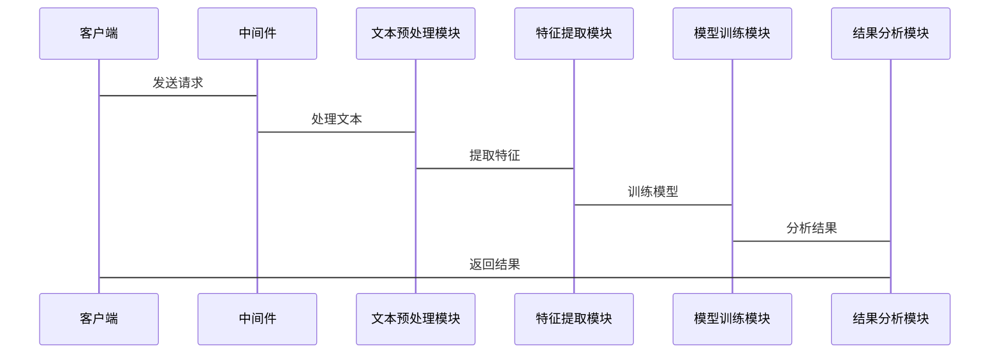

                 


```markdown
# 自然语言处理在金融中的应用

> 关键词：自然语言处理、金融、文本挖掘、情感分析、知识图谱、风险管理、机器学习

> 摘要：本文详细探讨了自然语言处理（NLP）技术在金融领域的应用，涵盖核心技术、具体应用场景、系统架构设计及项目实战。通过分析NLP在金融文本挖掘、舆情分析、知识图谱构建等领域的应用，本文为金融从业者和技术爱好者提供了深入的技术洞察和实践指导。

---

## 第1章 自然语言处理与金融应用概述

### 1.1 自然语言处理的基本概念

#### 1.1.1 自然语言处理的定义
自然语言处理（NLP）是人工智能的核心领域之一，致力于让计算机能够理解和处理人类语言。NLP的目标是实现人与计算机之间的自然交流，涉及文本分析、语义理解、机器翻译等多种任务。

#### 1.1.2 自然语言处理的核心技术
NLP的核心技术包括：
- **分词**：将连续的文本分割成有意义的词语或短语。
- **词性标注**：确定每个词语的词性（名词、动词、形容词等）。
- **句法分析**：分析句子的语法结构。
- **文本表示**：将文本转换为计算机可处理的向量形式。
- **主题模型**：从文本中提取主题信息。
- **情感分析**：判断文本的情感倾向（正面、负面或中性）。

#### 1.1.3 自然语言处理的发展历程
NLP的发展经历了从规则驱动到数据驱动的转变，近年来，深度学习技术的引入极大地推动了NLP的进步，特别是Transformer模型的出现，使得NLP技术更加高效和准确。

### 1.2 自然语言处理在金融中的应用背景

#### 1.2.1 金融领域的信息处理需求
金融领域的信息高度依赖文本数据，如财务报告、新闻标题、社交媒体评论等。这些文本数据包含丰富的市场信息和投资者情绪，如何高效地处理这些数据成为金融从业者的重要挑战。

#### 1.2.2 自然语言处理在金融中的独特价值
NLP能够从海量金融文本中提取关键信息，帮助投资者做出更明智的决策。例如，通过分析公司财报和新闻，NLP可以预测市场趋势和公司业绩。

#### 1.2.3 金融行业对自然语言处理的期待
金融行业希望NLP能够实现自动化的信息提取、情感分析和风险评估，从而提高交易效率和投资回报。

### 1.3 金融领域的自然语言处理挑战

#### 1.3.1 金融领域的数据特点
金融文本具有高度的专业性和复杂性，包含大量的专业术语和隐含信息，这对NLP技术提出了更高的要求。

#### 1.3.2 自然语言处理在金融中的难点
- **数据稀疏性**：金融领域的某些事件或数据点可能非常罕见，导致模型难以学习。
- **语义复杂性**：金融文本中的隐含意义和多义词较多，增加了语义分析的难度。
- **实时性要求**：金融市场对信息处理的实时性要求高，需要高效的NLP技术支持。

#### 1.3.3 金融领域对自然语言处理的需求
金融行业需要NLP技术能够处理多语言、多模态的数据，并具备强大的实时处理能力。

### 1.4 本章小结
本章介绍了自然语言处理的基本概念和在金融中的应用背景，分析了金融领域NLP面临的挑战和需求，为后续章节奠定了基础。

---

## 第2章 自然语言处理的核心技术

### 2.1 分词技术

#### 2.1.1 分词的定义与作用
分词是NLP的基石，旨在将连续的文本分割成有意义的词语或短语。分词的准确性直接影响后续任务的效果。

#### 2.1.2 常见的分词算法
- **基于规则的分词**：利用词典和语法规则进行分词。
- **统计分词**：基于词语出现频率和上下文进行分词。
- **深度学习分词**：利用神经网络模型进行分词。

#### 2.1.3 分词在金融中的应用
在金融文本挖掘中，分词技术常用于提取关键词和主题，例如从财务报告中提取公司名称和财务指标。

#### 2.1.4 分词算法实现
以下是一个简单的分词算法实现示例：

```python
import jieba

text = "中国银行发布了2023年第三季度财报"
words = jieba.lcut(text)
print(words)  # 输出: ['中国银行', '发布', '2023年', '第三', '季度', '财报']
```

### 2.2 词性标注与句法分析

#### 2.2.1 词性标注的定义与算法
词性标注是对每个词语进行词性分类，例如名词、动词、形容词等。常用的算法包括最大熵模型和隐马尔可夫模型。

#### 2.2.2 句法分析的原理与方法
句法分析旨在分析句子的语法结构，常用的方法包括基于规则的句法分析和基于统计的句法分析。

#### 2.2.3 词性标注与句法分析在金融中的应用
在金融舆情分析中，词性标注和句法分析可以帮助识别情感极强的关键词和句子结构，例如判断“业绩增长”中的“增长”是动词还是名词。

### 2.3 文本表示与相似度计算

#### 2.3.1 文本表示的定义与方法
文本表示是将文本转换为向量形式，常用的方法包括词袋模型、TF-IDF和词嵌入（如Word2Vec、GloVe）。

#### 2.3.2 基于向量的相似度计算
余弦相似度是常用的文本相似度计算方法，公式如下：

$$\text{余弦相似度} = \frac{\vec{A} \cdot \vec{B}}{|\vec{A}| \cdot |\vec{B}|}$$

#### 2.3.3 文本表示在金融中的应用
在金融领域，文本表示常用于相似文档检索和主题建模，例如识别同一主题的财务报告。

### 2.4 主题模型与情感分析

#### 2.4.1 主题模型的定义与算法
主题模型旨在从文本中提取主题信息，常用的算法包括LDA（Latent Dirichlet Allocation）和LSA（Latent Semantic Analysis）。

#### 2.4.2 情感分析的原理与方法
情感分析旨在判断文本的情感倾向，常用的方法包括基于规则的分类和基于机器学习的分类（如SVM、神经网络）。

#### 2.4.3 主题模型与情感分析在金融中的应用
在金融舆情分析中，主题模型可以提取市场主题，情感分析可以判断市场情绪，例如分析社交媒体上的投资者情绪对股价的影响。

---

## 第3章 自然语言处理技术在金融中的具体应用

### 3.1 金融文本挖掘

#### 3.1.1 金融文本挖掘的定义与流程
金融文本挖掘是从金融文本中提取有价值信息的过程，通常包括数据预处理、特征提取、模型训练和结果分析四个步骤。

#### 3.1.2 金融文本挖掘的关键技术
- **信息抽取**：从文本中提取特定信息，例如公司名称、财务指标。
- **信息融合**：将多个来源的信息进行整合，例如结合财务报告和新闻进行风险评估。

#### 3.1.3 金融文本挖掘在风险评估中的应用
通过分析财务报告和新闻，文本挖掘可以帮助识别潜在的财务风险和市场风险。

### 3.2 金融舆情分析

#### 3.2.1 金融舆情分析的定义与目标
金融舆情分析旨在通过分析社交媒体、新闻等文本数据，了解市场情绪和投资者信心。

#### 3.2.2 基于自然语言处理的舆情分析方法
- **情感分析**：判断文本的情感倾向。
- **主题建模**：提取市场主题。
- **情绪强度分析**：量化情绪的强度。

#### 3.2.3 金融舆情分析在投资决策中的应用
舆情分析可以帮助投资者做出更明智的投资决策，例如通过分析社交媒体上的评论预测股价走势。

### 3.3 金融知识图谱构建

#### 3.3.1 知识图谱的定义与构建流程
知识图谱是一种结构化的数据表示形式，用于描述实体及其关系。构建知识图谱通常包括数据收集、实体识别、关系抽取和图谱构建四个步骤。

#### 3.3.2 自然语言处理在知识图谱构建中的作用
NLP技术在实体识别和关系抽取中发挥重要作用，例如识别公司名称、产品名称和它们之间的关系。

#### 3.3.3 金融知识图谱在风险管理中的应用
知识图谱可以用于风险传播分析，例如识别一家公司的风险可能影响哪些其他公司。

---

## 第4章 自然语言处理的系统架构设计

### 4.1 问题场景介绍
金融领域的自然语言处理系统通常需要处理大量文本数据，支持多种功能，例如舆情监控、风险评估和智能客服。

### 4.2 系统功能设计
系统功能设计包括：
- **文本预处理**：分词、去停用词等。
- **特征提取**：提取文本特征，例如TF-IDF。
- **模型训练**：训练分类器或生成器。
- **结果分析**：分析模型输出并生成报告。

#### 4.2.1 领域模型（mermaid类图）
```mermaid
classDiagram
    class TextPreprocessing {
        +String inputText
        -List tokens
        -List features
        preprocess()
    }
    class FeatureExtraction {
        +List features
        extractFeatures()
    }
    class ModelTraining {
        +List features
        +List labels
        trainModel()
    }
    class ResultAnalysis {
        +Model model
        analyzeResults()
    }
    TextPreprocessing -> FeatureExtraction : pass features
    FeatureExtraction -> ModelTraining : pass features
    ModelTraining -> ResultAnalysis : pass model
```

### 4.3 系统架构设计（mermaid架构图）


### 4.4 系统接口设计
系统接口设计包括：
- **文本预处理接口**：接受文本输入，返回处理后的文本。
- **特征提取接口**：接受处理后的文本，返回特征向量。
- **模型训练接口**：接受特征向量和标签，返回训练好的模型。
- **结果分析接口**：接受模型和输入，返回分析结果。

### 4.5 系统交互设计（mermaid序列图）


---

## 第5章 项目实战：基于自然语言处理的金融舆情分析系统

### 5.1 环境安装
需要安装以下工具和库：
- **Python**：编程语言
- **NLTK**：自然语言处理库
- **jieba**：中文分词工具
- **Gensim**：主题模型库
- **Scikit-learn**：机器学习库

### 5.2 系统核心实现源代码

#### 5.2.1 数据预处理
```python
import jieba
from sklearn.feature_extraction.text import TfidfVectorizer

def preprocess(text):
    # 分词
    tokens = jieba.lcut(text)
    # 去停用词
    stopwords = set(['的', '了', '是', '在', '我'])
    filtered_tokens = [token for token in tokens if token not in stopwords]
    return ' '.join(filtered_tokens)

text = "中国银行发布了2023年第三季度财报"
preprocessed_text = preprocess(text)
print(preprocessed_text)  # 输出: "中国银行 发布 2023年 第三 季度 财报"
```

#### 5.2.2 特征提取与模型训练
```python
from sklearn.pipeline import Pipeline
from sklearn.naive_bayes import MultinomialNB

pipeline = Pipeline([
    ('tfidf', TfidfVectorizer()),
    ('clf', MultinomialNB())
])

# 假设X为文本数据，y为标签
pipeline.fit(X, y)
```

#### 5.2.3 情感分析
```python
from sklearn.svm import SVC

# 训练情感分析模型
model = SVC()
model.fit(X, y)

# 预测情感
test_text = "业绩增长"
test_preprocessed = preprocess(test_text)
predicted_label = model.predict([test_preprocessed])[0]
print(predicted_label)  # 输出: 1（假设1表示正面）
```

### 5.3 代码应用解读与分析
上述代码实现了一个简单的金融舆情分析系统，包括数据预处理、特征提取和情感分析三个部分。实际应用中，可以进一步优化模型和增加更多功能，例如使用深度学习模型（如LSTM或BERT）进行情感分析。

### 5.4 实际案例分析
以分析一条社交媒体评论为例：
- **输入文本**："中国银行的业绩增长显著"
- **预处理**：去除停用词，得到"中国银行 业绩 增长 显著"
- **特征提取**：计算TF-IDF特征
- **模型训练**：训练情感分析模型，预测情感为正面

### 5.5 项目小结
本项目实现了基于自然语言处理的金融舆情分析系统，展示了如何将NLP技术应用于实际金融场景中。通过优化模型和增加更多功能，可以进一步提升系统的性能和实用性。

---

## 第6章 最佳实践与小结

### 6.1 最佳实践 tips
- **数据质量**：确保数据的准确性和完整性。
- **模型选择**：根据具体任务选择合适的模型。
- **实时性优化**：优化系统的响应时间，提高实时处理能力。
- **多模态融合**：结合文本、图像等多种数据源，提升分析效果。

### 6.2 小结
本文详细探讨了自然语言处理在金融中的应用，从核心技术到具体应用，再到系统架构设计和项目实战，为读者提供了全面的技术指导。未来，随着NLP技术的不断发展，其在金融领域的应用将更加广泛和深入。

### 6.3 注意事项
- 在实际应用中，需注意数据隐私和合规性问题。
- 需定期更新模型和优化算法，以适应市场变化。

### 6.4 拓展阅读
- [《自然语言处理实战：基于Python的机器学习与深度学习》](https://example.com/book1)
- [《金融风险管理与数据分析》](https://example.com/book2)

---

## 作者：AI天才研究院/AI Genius Institute & 禅与计算机程序设计艺术 /Zen And The Art of Computer Programming
```

