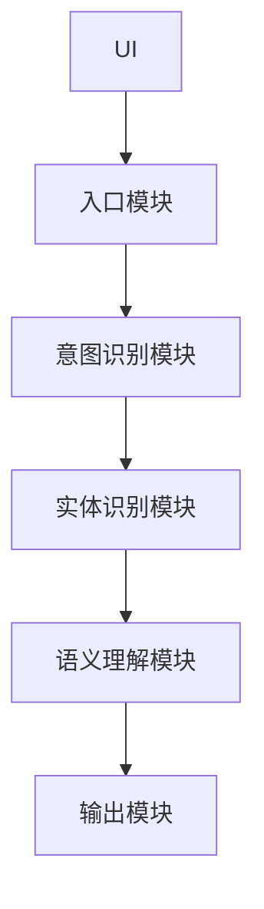

                 


# 自然语言理解增强AI Agent：深化LLM的语义分析

> 关键词：自然语言理解，增强AI Agent，大语言模型，语义分析，LLM，AI代理

> 摘要：本文深入探讨了自然语言理解（NLU）在增强AI Agent中的应用，重点分析了如何通过大语言模型（LLM）深化语义分析能力。文章从NLU的核心原理、LLM的算法机制、系统架构设计以及项目实战等多个方面展开，系统性地阐述了如何构建一个高效的自然语言理解增强AI Agent。通过详细的技术分析和实际案例，本文为读者提供了从理论到实践的完整指南。

---

# 第一部分: 自然语言理解与增强AI Agent背景介绍

## 第1章: 自然语言理解与增强AI Agent背景介绍

### 1.1 自然语言理解的核心概念

#### 1.1.1 什么是自然语言理解
自然语言理解（NLU）是人工智能领域的重要分支，旨在让计算机能够理解人类的自然语言输入。NLU的目标是将输入的文本或语音信号转换为计算机可以处理的结构化信息，从而实现人机交互。

#### 1.1.2 自然语言理解的关键问题
- **语义解析**：理解文本的深层含义，包括实体识别、关系抽取、意图识别等。
- **上下文理解**：处理上下文信息，理解对话的历史和背景。
- **多语言支持**：支持多种语言的处理和转换。

#### 1.1.3 自然语言理解的应用场景
- 智能客服：通过NLU技术理解用户的意图，提供个性化的服务。
- 智能音箱：通过语音识别和NLU技术实现人机交互。
- 智慧教育：通过NLU技术分析学生的提问，提供个性化的学习建议。

### 1.2 增强AI Agent的定义与目标

#### 1.2.1 AI Agent的基本概念
AI Agent（智能代理）是指能够感知环境并采取行动以实现目标的智能实体。增强AI Agent是指通过集成先进的自然语言理解技术，使其在人机交互中更加智能化和高效。

#### 1.2.2 增强AI Agent的核心目标
- 提供更自然的人机交互体验。
- 实现更精准的意图识别和语义理解。
- 支持多轮对话，提升用户体验。

#### 1.2.3 增强AI Agent的实现方式
- 集成大语言模型（LLM）：利用LLM的强大语义理解能力，提升NLU的准确性。
- 实时上下文理解：通过动态分析对话历史，优化语义理解。
- 多模态交互：结合视觉、听觉等多种交互方式，提升用户体验。

### 1.3 大语言模型（LLM）与自然语言理解

#### 1.3.1 大语言模型的定义与特点
大语言模型（LLM）是指经过大规模数据训练的深度学习模型，具有强大的语义理解和生成能力。其特点包括：
- 参数量大（通常超过 billions）。
- 模型结构复杂（如Transformer架构）。
- 具备上下文理解能力。

#### 1.3.2 LLM在自然语言理解中的作用
- 提供强大的语义表示能力。
- 支持多语言处理。
- 实现上下文相关的语义分析。

#### 1.3.3 LLM与增强AI Agent的关系
LLM是增强AI Agent的核心技术之一，通过LLM的强大能力，AI Agent能够更好地理解用户意图，提供更精准的服务。

### 1.4 本章小结
本章介绍了自然语言理解的核心概念、增强AI Agent的定义与目标，以及大语言模型在NLU中的作用。通过这些内容，读者可以理解NLU在增强AI Agent中的重要性，以及LLM在其中的关键作用。

---

# 第二部分: 自然语言理解的核心原理与技术

## 第2章: 自然语言理解的核心原理

### 2.1 语义分析的基本原理

#### 2.1.1 语义分析的定义
语义分析是指通过语法分析和语义规则，将文本转换为结构化的语义表示。

#### 2.1.2 语义分析的关键技术
- **词义消歧**：消除词语的多种可能含义，确定其在上下文中的具体含义。
- **语义角色标注**：标注句子中词语的语义角色，如主语、谓语等。
- **语义网络构建**：构建语义网络，表示词语之间的语义关系。

#### 2.1.3 语义分析的实现流程
1. **文本预处理**：包括分词、停用词处理等。
2. **特征提取**：提取文本的语义特征。
3. **模型训练**：利用机器学习或深度学习模型进行语义分析。

### 2.2 大语言模型的语义理解机制

#### 2.2.1 LLM的训练过程
1. **数据准备**：收集和整理大规模的文本数据。
2. **模型构建**：基于Transformer架构构建模型。
3. **训练优化**：通过梯度下降等优化算法训练模型。

#### 2.2.2 LLM的语义表示方法
- **词嵌入**：将词语映射为低维向量。
- **上下文表示**：通过自注意力机制捕捉上下文信息。
- **语义向量**：利用模型的输出向量表示语义。

#### 2.2.3 LLM的上下文理解能力
- **全局注意力**：捕捉整个文本的上下文信息。
- **局部注意力**：聚焦于局部上下文，提高语义理解的准确性。

### 2.3 自然语言理解的挑战与解决方案

#### 2.3.1 当前NLU技术的主要挑战
- **语义模糊性**：同一词语在不同上下文中有不同含义。
- **数据稀疏性**：某些语义模式的数据不足。
- **实时性要求**：需要快速响应，这对计算资源提出更高要求。

#### 2.3.2 解决NLU挑战的技术手段
- **预训练模型**：利用大规模预训练模型提升语义理解能力。
- **迁移学习**：通过迁移学习适应特定领域的语义理解需求。
- **多模态交互**：结合视觉、听觉等多种信息，提升语义理解的准确性。

#### 2.3.3 增强AI Agent在NLU中的应用
- **意图识别**：通过NLU技术准确识别用户的意图。
- **实体识别**：识别文本中的实体信息，如人名、地点等。
- **情感分析**：分析文本中的情感倾向，提供个性化服务。

### 2.4 本章小结
本章深入探讨了语义分析的基本原理、大语言模型的语义理解机制以及当前NLU技术的挑战与解决方案。通过这些内容，读者可以理解NLU技术的核心原理及其在增强AI Agent中的应用。

---

# 第三部分: 增强AI Agent的算法原理与数学模型

## 第3章: 大语言模型的算法原理

### 3.1 LLM的训练算法

#### 3.1.1 基于Transformer的模型结构
Transformer模型由编码器和解码器两部分组成。编码器用于将输入文本转换为向量表示，解码器用于生成输出文本。

#### 3.1.2 自注意力机制的实现原理
自注意力机制通过计算输入序列中每个位置的注意力权重，捕捉序列中的全局依赖关系。

#### 3.1.3 梯度下降与优化算法
- **梯度下降**：通过计算损失函数的梯度，更新模型参数。
- **Adam优化算法**：结合动量和自适应学习率的优化算法。

### 3.2 语义分析的算法实现

#### 3.2.1 基于概率的语义分析模型
基于概率的语义分析模型通过计算条件概率，预测文本的语义表示。

#### 3.2.2 基于深度学习的语义分析模型
深度学习模型通过多层神经网络提取文本的深层特征，提升语义理解的准确性。

#### 3.2.3 增强AI Agent中的语义分析算法
- **意图识别算法**：基于深度学习的意图识别模型。
- **实体识别算法**：基于条件随机场（CRF）的实体识别模型。

### 3.3 数学模型与公式解析

#### 3.3.1 Transformer模型的数学公式
$$\text{Attention}(Q,K,V) = \text{softmax}\left(\frac{QK^T}{\sqrt{d_k}}\right)V$$

其中，$Q$ 是查询向量，$K$ 是键向量，$V$ 是值向量，$d_k$ 是键向量的维度。

#### 3.3.2 梯度下降与优化算法
- **梯度下降**：$$ \theta = \theta - \eta \frac{\partial L}{\partial \theta} $$
- **Adam优化算法**：结合动量和自适应学习率的优化算法。

### 3.4 本章小结
本章详细讲解了大语言模型的训练算法和语义分析的算法实现，通过数学公式和算法流程图，帮助读者理解LLM的核心技术。

---

## 第4章: 系统分析与架构设计方案

### 4.1 问题场景介绍
增强AI Agent需要在复杂的环境下运行，支持多轮对话和多种交互方式。

### 4.2 项目介绍
本项目旨在开发一个基于LLM的增强AI Agent，提升其自然语言理解能力。

### 4.3 系统功能设计
- **意图识别模块**：识别用户的意图。
- **实体识别模块**：识别文本中的实体信息。
- **语义理解模块**：提供语义分析服务。

### 4.4 系统架构设计

#### 4.4.1 领域模型（ER图）
```mermaid
erd
    实体：用户
    实体：意图
    实体：实体信息
    关系：用户发起意图
    关系：意图包含实体信息
```

#### 4.4.2 系统架构图


#### 4.4.3 系统交互图
```mermaid
sequenceDiagram
    用户 ->+> 入口模块: 发起请求
    入口模块 ->+> 意图识别模块: 提交请求
    意图识别模块 ->+> 实体识别模块: 获取实体信息
    实体识别模块 ->+> 语义理解模块: 提供语义分析结果
    语义理解模块 ->+> 输出模块: 返回最终结果
    输出模块 ->+> 用户: 返回响应
```

### 4.5 系统接口设计
- **意图识别接口**：提供意图识别服务。
- **实体识别接口**：提供实体识别服务。
- **语义理解接口**：提供语义分析服务。

### 4.6 本章小结
本章通过系统分析与架构设计，展示了如何构建一个高效的自然语言理解增强AI Agent。通过ER图、架构图和交互图，帮助读者理解系统的整体结构和各部分之间的关系。

---

## 第5章: 项目实战

### 5.1 环境安装
- **Python 3.8+**
- **TensorFlow 2.0+**
- **PyTorch 1.0+**

### 5.2 系统核心实现源代码

#### 5.2.1 意图识别模块
```python
import torch
import torch.nn as nn
import torch.optim as optim

class IntentClassifier(nn.Module):
    def __init__(self, input_dim, hidden_dim, output_dim):
        super(IntentClassifier, self).__init__()
        self.fc1 = nn.Linear(input_dim, hidden_dim)
        self.fc2 = nn.Linear(hidden_dim, output_dim)
        self.dropout = nn.Dropout(0.5)
        self.softmax = nn.Softmax(dim=1)

    def forward(self, x):
        x = torch.relu(self.fc1(x))
        x = self.dropout(x)
        x = self.softmax(self.fc2(x))
        return x
```

#### 5.2.2 实体识别模块
```python
import spacy

nlp = spacy.load("en_core_web_sm")

def extract_entities(text):
    doc = nlp(text)
    entities = []
    for ent in doc.ents:
        entities.append((ent.start_char, ent.end_char, ent.label_))
    return entities
```

#### 5.2.3 语义理解模块
```python
from transformers import AutoTokenizer, AutoModelForMaskedLM

tokenizer = AutoTokenizer.from_pretrained("bert-base-uncased")
model = AutoModelForMaskedLM.from_pretrained("bert-base-uncased")

def semantic_analysis(text):
    inputs = tokenizer(text, return_tensors="pt")
    with torch.no_grad():
        outputs = model(**inputs)
    return outputs
```

### 5.3 代码应用解读与分析
- **意图识别模块**：通过神经网络模型实现意图分类。
- **实体识别模块**：利用spaCy库实现实体识别。
- **语义理解模块**：基于BERT模型实现语义分析。

### 5.4 实际案例分析和详细讲解剖析
通过一个实际案例，展示如何利用上述代码实现意图识别、实体识别和语义理解。

### 5.5 项目小结
本章通过项目实战，展示了如何利用Python和深度学习框架实现增强AI Agent的核心功能。通过实际案例，帮助读者理解理论知识的实际应用。

---

## 第6章: 总结与展望

### 6.1 本章总结
本文系统性地探讨了自然语言理解增强AI Agent的核心技术，包括NLU的核心原理、LLM的算法机制、系统架构设计以及项目实战。通过这些内容，读者可以全面理解如何构建一个高效的自然语言理解增强AI Agent。

### 6.2 最佳实践 tips
- 在实际应用中，建议结合具体业务需求，选择合适的NLU技术。
- 定期更新模型，保持语义理解的准确性。
- 结合多模态交互，提升用户体验。

### 6.3 注意事项
- 注意数据隐私和安全问题。
- 确保系统的可扩展性和可维护性。
- 定期监控系统性能，及时优化。

### 6.4 未来研究方向
- 研究更高效的NLU算法。
- 探索多模态交互的新模式。
- 深化跨语言NLU技术的研究。

### 6.5 本章小结
本章总结了全文的主要内容，并提供了最佳实践建议和未来研究方向，帮助读者进一步理解和应用相关技术。

---

# 作者：AI天才研究院/AI Genius Institute & 禅与计算机程序设计艺术 /Zen And The Art of Computer Programming

