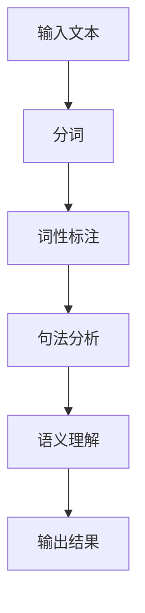
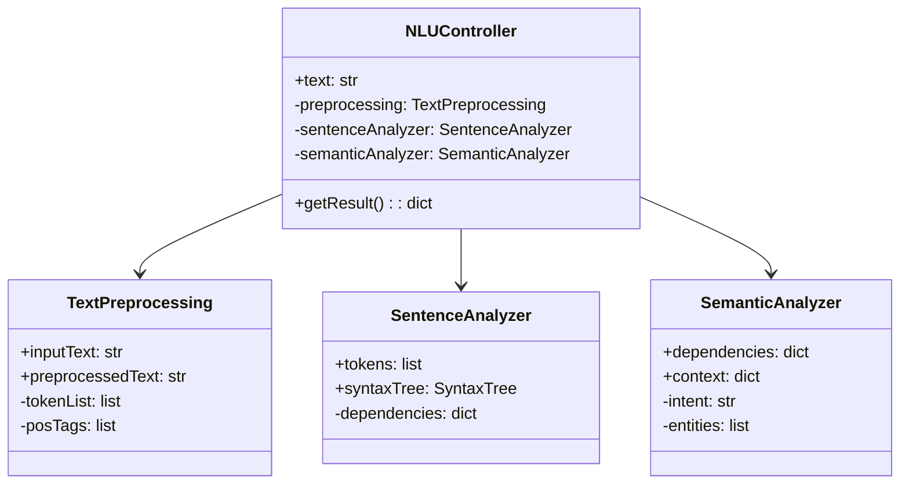
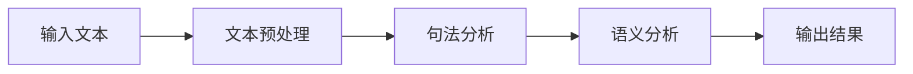
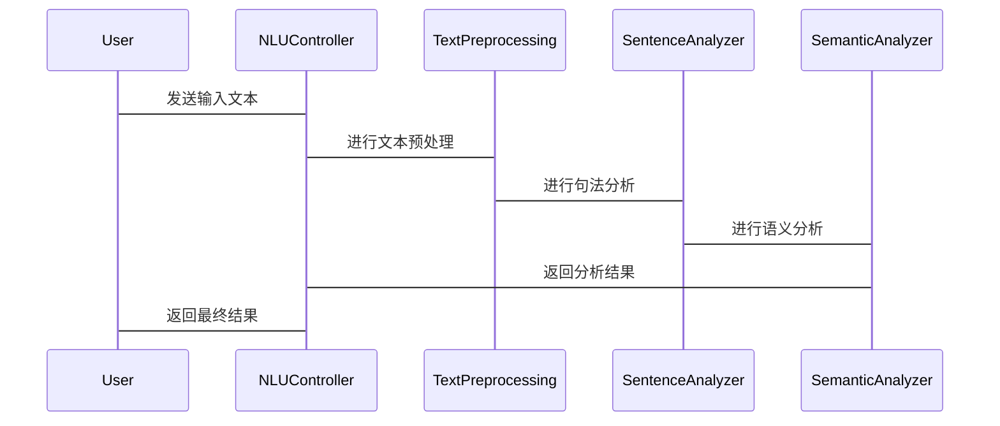

                 


# 自然语言理解（NLU）：提升AI Agent的语义分析能力

## 关键词：
自然语言理解, 语义分析, AI Agent, 深度学习, NLP, 语义理解

## 摘要：
自然语言理解（NLU）是人工智能领域中的核心技术，旨在帮助AI Agent准确理解人类语言的语义和意图。本文将从NLU的核心概念、算法原理、系统架构设计、项目实战等方面展开详细讲解，深入剖析NLU的关键技术与实现细节，帮助读者全面掌握NLU的原理与应用。

---

## 目录大纲：

# 第1章: 自然语言理解（NLU）概述

## 1.1 自然语言理解的核心概念

### 1.1.1 什么是自然语言理解（NLU）
- NLU的定义与目标
- NLU与自然语言处理（NLP）的关系
- NLU在AI Agent中的作用

### 1.1.2 NLU的主要目标与应用场景
- 语义理解的目标
- NLU在智能对话系统中的应用
- NLU在机器翻译、问答系统、信息抽取等领域的应用

### 1.1.3 NLU与AI Agent的关系
- AI Agent的定义与功能
- NLU在AI Agent中的核心作用
- NLU如何提升AI Agent的智能水平

## 1.2 NLU的关键问题与挑战

### 1.2.1 语义理解的复杂性
- 语言的歧义性与上下文依赖性
- 不同语境下语义的变化
- 语义理解的准确性与鲁棒性

### 1.2.2 多语种支持的挑战
- 多语言NLU的复杂性
- 各语言的语法、语义差异
- 跨语言语义分析的技术难点

### 1.2.3 实时语义分析的性能优化
- 高效计算与模型压缩
- 实时响应的挑战
- 资源受限环境下的性能优化

## 1.3 NLU技术的发展历程

### 1.3.1 传统NLP方法
- 基于规则的NLU方法
- 统计NLP方法的兴起
- 传统NLU的优缺点

### 1.3.2 深度学习时代的NLU技术
- 深度学习对NLU的推动作用
- 基于神经网络的NLU模型
- Transformer架构对NLU的贡献

### 1.3.3 当前NLU技术的最新进展
- 多模态NLU的发展
- 跨领域NLU模型的优化
- 自适应NLU技术的创新

## 1.4 本章小结
- 本章总结了NLU的核心概念、关键问题与技术发展，为后续章节的学习打下基础。

---

# 第2章: NLU的核心概念与原理

## 2.1 词法分析

### 2.1.1 什么是词法分析
- 词法分析的定义
- 词法分析的目标与作用

### 2.1.2 分词技术与实现
- 分词的基本原理
- 常见分词算法（如基于规则的分词、统计分词、深度学习分词）
- 分词的挑战与优化

### 2.1.3 词性标注与应用
- 词性标注的定义与实现方法
- 词性标注的应用场景
- 常见词性标注工具与技术

## 2.2 句法分析

### 2.2.1 句法分析的基本概念
- 句法分析的定义与目标
- 句法分析的作用与意义

### 2.2.2 依存句法分析与树状句法分析
- 依存句法分析的原理与特点
- 树状句法分析的原理与特点
- 依存句法分析与树状句法分析的对比

### 2.2.3 常见句法分析算法
- 基于规则的句法分析
- 统计句法分析
- 深度学习驱动的句法分析

## 2.3 语义分析

### 2.3.1 语义分析的定义与目标
- 语义分析的定义
- 语义分析的目标与作用

### 2.3.2 基于规则的语义分析
- 基于规则的语义分析方法
- 规则库的构建与管理
- 基于规则的语义分析的优缺点

### 2.3.3 基于深度学习的语义分析
- 深度学习驱动的语义分析模型
- 常见的深度学习语义分析方法（如BERT、GPT等）
- 深度学习语义分析的优缺点

## 2.4 NLU的整体架构与流程

### 2.4.1 NLU的输入输出流程
- NLU系统的输入与输出
- NLU系统的内部处理流程
- NLU系统的输出结果形式

### 2.4.2 各模块之间的关系与协作
- 词法分析、句法分析与语义分析的关系
- 各模块如何协同工作
- 模块之间的数据流与控制流

### 2.4.3 NLU系统的整体架构图（Mermaid）



## 2.5 本章小结
- 本章详细介绍了NLU的核心模块，包括词法分析、句法分析和语义分析，并通过Mermaid图展示了NLU的整体架构。

---

# 第3章: NLU的算法原理与实现

## 3.1 词袋模型（Bag of Words）

### 3.1.1 词袋模型的基本原理
- 词袋模型的定义与核心思想
- 词袋模型的实现步骤
- 词袋模型的优缺点

### 3.1.2 TF-IDF算法
- TF-IDF的定义与计算公式
- TF-IDF的实现步骤
- TF-IDF的应用场景

### 3.1.3 Word2Vec算法
- Word2Vec的定义与核心思想
- Word2Vec的实现方法（CBOW与Skip-Gram）
- Word2Vec的优缺点

## 3.2 基于深度学习的NLU算法

### 3.2.1 RNN与LSTM在NLU中的应用
- RNN与LSTM的定义与工作原理
- RNN与LSTM在NLU中的应用案例
- RNN与LSTM的优缺点

### 3.2.2 Transformer架构与BERT模型
- Transformer架构的定义与核心思想
- BERT模型的定义与核心思想
- BERT模型在NLU中的应用

## 3.3 NLU算法的实现步骤与代码示例

### 3.3.1 使用Python实现TF-IDF算法
```python
from sklearn.feature_extraction.text import TfidfVectorizer

vectorizer = TfidfVectorizer()
tfidf = vectorizer.fit_transform(corpus)
print(tfidf)
```

### 3.3.2 使用Python实现Word2Vec算法
```python
from gensim.models import Word2Vec

model = Word2Vec(sentences, vector_size=100, window=5, min_count=1, workers=4)
model.save("word2vec.model")
```

## 3.4 本章小结
- 本章详细讲解了NLU中常用的算法，包括TF-IDF、Word2Vec、RNN、LSTM和Transformer架构，并通过Python代码展示了这些算法的实现步骤。

---

# 第4章: NLU系统的分析与架构设计

## 4.1 问题场景介绍
- NLU系统的功能需求
- NLU系统的性能需求
- NLU系统的交互需求

## 4.2 系统功能设计

### 4.2.1 领域模型设计（Mermaid类图）


### 4.2.2 系统架构设计（Mermaid架构图）


## 4.3 系统接口设计
- 输入接口设计
- 输出接口设计
- API接口设计

## 4.4 系统交互流程（Mermaid序列图）


## 4.5 本章小结
- 本章详细分析了NLU系统的功能需求、系统架构设计和交互流程，并通过Mermaid图展示了系统的整体架构。

---

# 第5章: NLU项目实战

## 5.1 项目背景与目标
- 项目背景
- 项目目标
- 项目需求

## 5.2 项目环境安装
- 开发工具安装（Python、Jupyter、PyCharm）
- 依赖库安装（如spaCy、NLTK、Gensim）
- 环境配置

## 5.3 系统核心实现

### 5.3.1 文本预处理模块实现
```python
import spacy

nlp = spacy.load("en_core_web_sm")
doc = nlp(text)
tokens = [token.text for token in doc]
```

### 5.3.2 句法分析模块实现
```python
from nltk import pos_tag

tokens = ["This", "is", "a", "test"]
pos_tags = pos_tag(tokens)
print(pos_tags)
```

### 5.3.3 语义分析模块实现
```python
from transformers import pipeline

classifier = pipeline("text-classification")
result = classifier("This is a test sentence.")
print(result)
```

## 5.4 项目案例分析
- 案例背景
- 数据准备
- 模型训练
- 模型测试与结果分析

## 5.5 项目小结
- 本章通过一个实际项目展示了NLU技术的实现过程，包括环境安装、模块实现和案例分析。

---

# 第6章: 总结与展望

## 6.1 全文总结
- 本文总结了NLU的核心概念、算法原理、系统架构设计和项目实现过程。

## 6.2 学习建议与注意事项
- 学习NLU技术的建议
- 使用NLU技术时的注意事项
- 如何保持技术更新与进步

## 6.3 未来展望
- NLU技术的未来发展方向
- NLU技术在AI Agent中的潜力
- NLU技术与其他技术的结合与应用

---

## 作者：AI天才研究院/AI Genius Institute & 禅与计算机程序设计艺术 /Zen And The Art of Computer Programming

---

本文通过系统化的讲解，帮助读者全面掌握自然语言理解（NLU）的核心技术与实现细节，为AI Agent的语义分析能力提升提供了理论与实践的双重支持。

