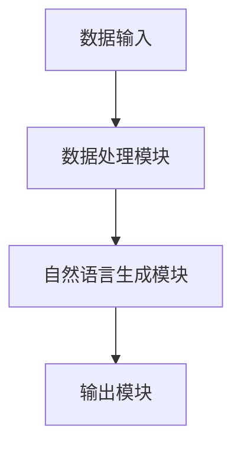
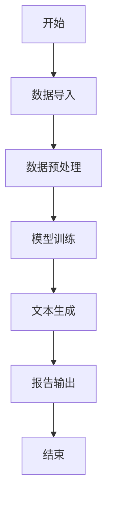
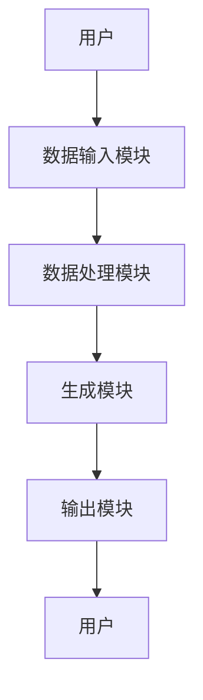

                 


---

# 自然语言生成技术在财务报告中的应用

## 关键词：自然语言生成技术，财务报告，文本生成，机器学习，深度学习

## 摘要：自然语言生成技术（NLG）在财务报告中的应用为财务信息的处理和呈现提供了新的可能性。本文深入探讨了NLG技术的基本原理、财务报告的结构与内容，以及NLG技术在财务报告生成中的具体应用。通过分析系统设计、项目实战以及面临的挑战，本文为读者提供了全面的视角，展示了NLG技术在财务领域中的潜力和未来发展方向。

---

## 第一部分：引言

### 第1章：自然语言生成技术与财务报告概述

#### 1.1 自然语言生成技术的定义与核心概念

自然语言生成（Natural Language Generation, NLG）是一种人工智能技术，旨在将结构化的数据转化为自然流畅的文本。其核心目标是让计算机能够像人类一样理解和生成语言，从而在多种场景中自动化地生成文本内容。

**核心概念：**

- **结构化数据**：例如表格、数字和事实。
- **自然流畅的文本**：生成的文本应符合语言学规则，语法正确，语义清晰。
- **上下文理解**：生成的文本需要考虑上下文，确保内容的连贯性和逻辑性。

**财务报告的特点：**

- **结构化**：财务报告通常包含固定的格式和表格，如资产负债表、利润表等。
- **数据驱动**：报告内容基于财务数据，如收入、支出、利润等。
- **合规性**：必须符合会计准则和法律法规。

#### 1.2 自然语言生成技术在财务报告中的应用意义

传统的财务报告生成过程通常依赖人工撰写，效率低且容易出错。通过引入NLG技术，可以实现自动化、高效且准确的财务报告生成。

**具体意义：**

- **提高效率**：自动化处理财务数据，减少人工操作时间。
- **降低错误率**：减少人为计算和写作中的错误。
- **增强可扩展性**：能够快速生成大量财务报告，满足不同用户需求。
- **实时更新**：基于实时数据生成报告，提升决策的及时性。

#### 1.3 自然语言生成技术在财务报告中的应用目标

通过NLG技术，实现以下目标：

1. 自动化生成财务报告的各个部分，如摘要、分析和建议。
2. 提供定制化的报告内容，满足不同用户的特定需求。
3. 确保生成报告的准确性和合规性，符合会计准则和行业标准。

---

## 第二部分：自然语言生成技术基础

### 第2章：自然语言生成技术的原理与方法

#### 2.1 自然语言生成技术的生成模型

自然语言生成技术的核心在于生成模型的选择与应用。以下是几种常见的生成模型：

1. **统计模型**：基于概率统计的方法，通过分析大量文本数据，计算每个词的出现概率，生成符合语言习惯的文本。
   - **实例**：n-gram模型，通过分析连续的n个词的概率分布生成文本。
   
2. **基于规则的模型**：通过预定义的语法规则和模板生成文本。
   - **优点**：生成文本的可控制性高。
   - **缺点**：灵活性有限，难以应对复杂语境。

3. **基于深度学习的模型**：利用神经网络结构，如RNN、LSTM、Transformer等，生成高质量的自然语言文本。
   - **RNN（循环神经网络）**：适用于处理序列数据，如时间序列和文本。
   - **LSTM（长短期记忆网络）**：解决RNN的长序列训练问题，适用于文本生成。
   - **Transformer**：通过自注意力机制，捕捉文本中的全局信息，生成更连贯的文本。

#### 2.2 自然语言生成技术的文本处理工具

自然语言生成过程中，需要对文本进行多种处理，包括分词、句法分析、实体识别等。

1. **分词与句法分析**：
   - 分词：将文本分割成词语或短语。
   - 句法分析：分析句子的语法结构，确定每个词语的词性、句法角色等。
   - **工具实例**：Python中的`nltk`库和`spaCy`库。

2. **实体识别与指代消解**：
   - 实体识别：识别文本中的专有名词，如公司名称、人名等。
   - 指代消解：确定代词或指代短语所指的具体对象。
   - **工具实例**：`spaCy`和`Gensim`。

3. **文本摘要与文本生成**：
   - 文本摘要：从大量文本中提取关键信息，生成简洁的摘要。
   - 文本生成：基于结构化数据生成自然语言文本。
   - **工具实例**：`GPT-2`、`GPT-3`。

#### 2.3 基于深度学习的自然语言生成模型

基于深度学习的自然语言生成模型是当前的研究热点，其中最为人熟知的是Transformer架构。

**模型结构：**

1. **编码器（Encoder）**：将输入的文本转换为上下文向量。
2. **解码器（Decoder）**：基于编码器输出的上下文向量，生成目标文本。

**数学模型：**

- **自注意力机制**：
  $$\text{Attention}(Q, K, V) = \text{softmax}\left(\frac{QK^T}{\sqrt{d_k}}\right)V$$
  其中，Q为查询向量，K为键向量，V为值向量，d_k为键向量的维度。

- **前馈神经网络**：每个位置的输入都会通过两个线性变换和一个跳跃连接。

**训练过程：**

1. **损失函数**：交叉熵损失函数。
   $$\mathcal{L} = -\sum_{i=1}^{n} \log p(x_i)$$
2. **优化算法**：通常使用Adam优化器。
3. **训练策略**：使用大规模的文本数据进行预训练，然后进行微调任务。

#### 2.4 自然语言生成技术的挑战与改进

**挑战：**

- **数据稀疏性**：在某些领域，高质量的训练数据可能不足。
- **模型泛化能力**：生成的文本可能缺乏上下文理解和逻辑推理能力。
- **计算资源**：深度学习模型需要大量的计算资源，限制了其在小公司或资源有限环境中的应用。

**改进方法：**

- **领域特定预训练**：针对财务领域的数据进行预训练，提升模型的领域适应性。
- **多模态生成**：结合其他数据类型（如图像、表格数据）进行生成，提升文本的准确性。
- **可解释性增强**：通过可视化和中间结果分析，提升模型的可解释性。

---

## 第三部分：财务报告的结构与内容

### 第3章：财务报告的基本结构与内容

#### 3.1 资产负债表

**定义与结构：**

资产负债表是反映企业在某一特定日期财务状况的报表，主要包括以下三部分：

1. **资产**：企业拥有的资源，如现金、应收账款、存货等。
2. **负债**：企业所欠债务，如应付账款、短期借款等。
3. **所有者权益**：企业净资产，包括股本、资本公积、盈余公积等。

**公式：**
$$\text{资产} = \text{负债} + \text{所有者权益}$$

**例子：**
一家公司年末的资产为100万元，负债为60万元，所有者权益为40万元，符合上述公式。

#### 3.2 利润表

**定义与结构：**

利润表反映企业在一定会计期间的经营成果，主要包括收入、费用和利润三个部分。

1. **收入**：企业销售商品或提供服务所获得的收入。
2. **费用**：企业为取得收入而发生的各项支出，如销售费用、管理费用等。
3. **利润**：收入减去费用后的净收益。

**公式：**
$$\text{净利润} = \text{营业收入} - \text{营业成本} - \text{税金及附加} - \text{销售费用} - \text{管理费用} - \text{研发费用}$$

#### 3.3 现金流量表

**定义与结构：**

现金流量表反映企业在一定会计期间内现金和现金等价物的流入和流出情况，分为经营活动、投资活动和筹资活动三部分。

1. **经营活动现金流**：与企业日常经营直接相关的现金流。
2. **投资活动现金流**：与购买或出售长期资产相关的现金流。
3. **筹资活动现金流**：与企业融资活动相关的现金流。

**公式：**
$$\text{现金及现金等价物净增加额} = \text{经营活动现金流} + \text{投资活动现金流} + \text{筹资活动现金流}$$

#### 3.4 财务报告的行业差异与合规要求

**行业差异：**

不同行业的财务报告可能有不同的侧重点和结构。例如，制造业可能更关注存货和生产成本，而金融行业则更关注资产质量和风险敞口。

**合规要求：**

财务报告必须遵循相关的会计准则和法律法规，如国际财务报告准则（IFRS）和美国通用会计准则（US GAAP）。这些准则对财务报告的格式、内容和披露要求有明确规定。

---

## 第四部分：自然语言生成技术在财务报告中的应用

### 第4章：自然语言生成技术在财务报告中的具体应用

#### 4.1 财务报告摘要的生成

**摘要生成的重要性：**

财务报告通常篇幅较长，内容复杂，生成摘要可以帮助读者快速抓住重点内容。

**生成流程：**

1. **数据输入**：输入财务数据和报告内容。
2. **文本处理**：对数据进行清洗和结构化处理。
3. **摘要生成**：利用自然语言生成模型生成摘要。

**数学模型：**

- **文本摘要模型**：
  使用基于Transformer的模型，如`Bert`或`GPT`进行摘要生成。

#### 4.2 财务分析报告的生成

**分析报告的结构：**

财务分析报告通常包括以下几个部分：

1. **财务状况分析**：分析企业的资产、负债和所有者权益状况。
2. **盈利能力分析**：分析企业的净利润、毛利率等指标。
3. **现金流分析**：分析企业的现金流状况。

**生成方法：**

1. **数据处理**：对财务数据进行清洗和预处理。
2. **生成报告**：基于预训练模型生成分析报告。

**挑战：**

- **数据准确性**：生成的报告需要确保数据的准确性，避免因模型误差导致的错误。
- **合规性**：报告内容需要符合会计准则和行业规范。

---

## 第五部分：系统设计与实现

### 第5章：自然语言生成技术在财务报告生成系统中的应用

#### 5.1 系统架构设计

**系统架构图：**



**模块功能：**

1. **数据输入模块**：接收结构化的财务数据。
2. **数据处理模块**：对数据进行清洗、转换和结构化处理。
3. **自然语言生成模块**：基于处理后的数据生成自然语言文本。
4. **输出模块**：将生成的文本输出为报告。

#### 5.2 系统功能设计

**功能需求：**

1. **数据导入**：支持多种数据格式的导入，如Excel、CSV等。
2. **数据预处理**：包括数据清洗、标准化和结构化处理。
3. **模型训练**：基于预处理后的数据，训练自然语言生成模型。
4. **文本生成**：根据输入数据生成财务报告。
5. **报告输出**：输出生成的报告，并支持导出为PDF、Word等格式。

**系统流程图：**



#### 5.3 系统实现

**环境配置：**

- **编程语言**：Python 3.8+
- **深度学习框架**：TensorFlow或PyTorch
- **自然语言处理库**：`transformers`库（用于加载预训练模型）

**核心代码实现：**

```python
from transformers import AutoTokenizer, AutoModelForCausalLM
import torch

# 加载预训练模型和tokenizer
model_name = "gpt2-large"
tokenizer = AutoTokenizer.from_pretrained(model_name)
model = AutoModelForCausalLM.from_pretrained(model_name)

# 定义生成函数
def generate_financial_report(prefix, max_length=500):
    inputs = tokenizer.encode(prefix, return_tensors="pt", add_special_tokens=True)
    outputs = model.generate(inputs, max_length=max_length, do_sample=True)
    return tokenizer.decode(outputs[0], skip_special_tokens=True)

# 示例：生成财务报告摘要
prefix = "公司2023年第四季度的财务报告摘要如下："
print(generate_financial_report(prefix))
```

---

## 第六部分：项目实战

### 第6章：基于Python的财务报告生成系统

#### 6.1 项目背景

随着企业对自动化财务报告的需求增加，开发一个基于自然语言生成技术的财务报告生成系统具有重要意义。

**项目目标：**

开发一个能够根据输入的财务数据自动生成财务报告的系统。

**项目需求：**

1. **数据输入**：支持多种数据格式。
2. **文本生成**：生成高质量的财务报告。
3. **用户友好的界面**：提供直观的操作界面。

#### 6.2 系统设计

**系统功能模块：**

1. **数据输入模块**：允许用户上传财务数据。
2. **数据处理模块**：对数据进行清洗和结构化处理。
3. **生成模块**：基于预训练模型生成报告。
4. **输出模块**：将生成的报告输出为多种格式。

**系统交互流程图：**



#### 6.3 系统实现

**代码实现：**

```python
import pandas as pd
from transformers import AutoTokenizer, AutoModelForCausalLM

# 加载预训练模型
model_name = " microsoft/DeBERTa-v3-large"
tokenizer = AutoTokenizer.from_pretrained(model_name)
model = AutoModelForCausalLM.from_pretrained(model_name)

# 定义生成函数
def generate_report(company_data):
    inputs = tokenizer.encode(f"公司{company_data['name']}的财务报告如下：", return_tensors="pt", add_special_tokens=True)
    outputs = model.generate(inputs, max_length=500, do_sample=True)
    return tokenizer.decode(outputs[0], skip_special_tokens=True)

# 示例数据
data = {
    "name": "科技有限公司",
    "revenue": 1000000,
    "net_profit": 200000
}

# 生成报告
report = generate_report(data)
print(report)
```

---

## 第七部分：挑战与未来展望

### 第7章：自然语言生成技术在财务报告中的挑战与未来展望

#### 7.1 当前应用中的挑战

**数据隐私与安全**：财务数据往往涉及敏感信息，数据泄露风险高。

**模型泛化能力**：当前模型在特定领域的适应性有限，难以生成复杂语境下的文本。

**计算资源限制**：深度学习模型需要大量的计算资源，限制了其在中小企业的应用。

#### 7.2 未来发展趋势

**多模态生成**：结合图像、表格等多种数据类型，生成更准确的财务报告。

**实时数据处理**：基于实时财务数据生成动态报告，提升决策的及时性。

**增强的可解释性**：提高模型的可解释性，确保生成报告的准确性和合规性。

---

## 附录

### 附录A：术语表

- **自然语言生成（NLG）**：将结构化数据转化为自然语言文本的技术。
- **财务报告**：反映企业财务状况和经营成果的文件。
- **深度学习模型**：基于神经网络的机器学习模型，如Transformer、LSTM等。

### 附录B：工具安装指南

- **安装`transformers`库**：
  ```bash
  pip install transformers
  ```

- **安装`mermaid`图生成工具**：
  ```bash
  pip install mermaid
  ```

### 附录C：参考文献

1. Vaswani, A., et al. "Attention is all you need." Advances in neural information processing systems, 2017.
2. Brown, T., et al. "Language models have extractive capabilities." arXiv preprint arXiv:1906.08369, 2019.
3. LeCun, Y., et al. "Deep learning."nature, 2015.

---

## 作者：AI天才研究院/AI Genius Institute & 禅与计算机程序设计艺术 / Zen And The Art of Computer Programming

---

通过以上内容，我们详细探讨了自然语言生成技术在财务报告中的应用，从基础原理到系统实现，再到实际项目案例，为读者提供了全面的知识体系。希望本文能够为相关领域的研究和实践提供有价值的参考。

