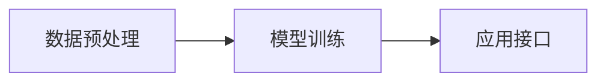

                 


# 自监督学习：减少AI Agent对标注数据的依赖

> 关键词：自监督学习，AI Agent，标注数据，无监督学习，对比学习，生成式模型

> 摘要：  
自监督学习是一种创新的机器学习范式，通过利用未标注数据进行自监督，从而减少对昂贵标注数据的依赖。本文深入探讨了自监督学习的核心概念、算法原理、系统设计与项目实战，帮助读者理解如何在实际场景中应用自监督学习，提升AI Agent的性能和泛化能力。

---

# 第一部分：自监督学习的背景与重要性

## 第1章：自监督学习的背景与问题背景

### 1.1 问题背景

#### 1.1.1 数据标注的挑战与成本
- 数据标注是监督学习的前提，但标注数据的成本高昂。
- 专业标注人员的稀缺性和标注工具的复杂性导致数据获取耗时耗力。
- 对于大规模数据集，标注成本呈指数级增长。

#### 1.1.2 监督学习的局限性
- 监督学习需要大量标注数据，限制了其在小样本场景下的应用。
- 数据标注的错误率不可避免，影响模型性能。
- 特定领域的标注标准难以统一，导致数据质量参差不齐。

#### 1.1.3 自监督学习的提出与目标
- 提出利用未标注数据进行自监督学习，降低对标注数据的依赖。
- 通过自监督机制，模型能够从数据中发现隐藏的结构和规律。
- 目标是实现零样本或小样本学习能力。

### 1.2 问题描述

#### 1.2.1 数据标注的稀缺性
- 数据标注的稀缺性导致许多应用场景无法使用监督学习。
- 特定领域或新兴领域的标注数据更加匮乏。

#### 1.2.2 自监督学习的核心问题
- 如何在未标注数据中提取有用的监督信号。
- 如何设计有效的对比目标函数或生成模型。
- 如何保证自监督学习的稳定性与收敛性。

#### 1.2.3 自监督学习的应用场景
- 小样本学习：利用少量标注数据和大量未标注数据提升模型性能。
- 零样本学习：完全依赖未标注数据进行学习。
- 大规模预训练：利用海量未标注数据进行模型初始化。

### 1.3 问题解决与边界

#### 1.3.1 自监督学习的解决方案
- 利用对比学习或生成式模型从未标注数据中提取特征。
- 设计有效的目标函数，如对比损失或生成对抗损失。
- 通过预训练-微调范式提升模型的迁移学习能力。

#### 1.3.2 自监督学习的边界与适用范围
- 适用于未标注数据充足但标注数据稀缺的场景。
- 适用于需要模型具备强泛化能力的场景。
- 适用于需要快速适应新任务的场景。

#### 1.3.3 自监督学习与其他学习范式的区别
- 与无监督学习的区别：无监督学习完全依赖未标注数据，而自监督学习通过自监督信号引导学习。
- 与半监督学习的区别：自监督学习不需要人工标注数据，而半监督学习需要少量标注数据。

---

## 第2章：自监督学习的核心概念与联系

### 2.1 核心概念

#### 2.1.1 自监督学习的定义
- 自监督学习是一种利用未标注数据，通过设计适当的自监督目标函数，引导模型学习数据内在结构的机器学习范式。

#### 2.1.2 自监督学习的关键特征
- **自监督信号**：通过数据本身构造监督信号。
- **对比学习**：通过对比正样本和负样本，学习数据的相似性。
- **生成式模型**：通过生成数据来监督模型学习。

#### 2.1.3 自监督学习的数学模型
- 输入数据 \( x \)，通过编码器 \( f \) 和解码器 \( g \) 构建生成模型。
- 对比学习的目标函数为：
  $$
  L = \mathbb{E}_{x,y}[-\log p(y|x)]
  $$

### 2.2 核心概念的联系

#### 2.2.1 对比学习与生成式模型的对比

| 对比学习 | 生成式模型 |
|----------|------------|
| 基于对比目标函数，通过构造正样本和负样本进行学习。 | 基于生成模型，通过生成数据来监督模型学习。 |
| 适用于图像、文本等数据类型。 | 适用于图像、文本等数据类型。 |
| 通过对比损失函数优化模型。 | 通过生成对抗损失函数优化模型。 |

#### 2.2.2 自监督学习与其他无监督学习方法的对比

| 自监督学习 | 无监督学习 |
|------------|------------|
| 需要设计自监督目标函数。 | 不需要目标函数，主要依赖数据分布。 |
| 通过构造伪标签进行监督。 | 通过聚类、降维等方法进行无监督学习。 |
| 更加依赖模型的架构设计。 | 更加依赖数据的内在结构。 |

#### 2.2.3 自监督学习与半监督学习的关系
- 自监督学习可以看作是半监督学习的一种扩展，不需要人工标注数据。
- 两者的目标函数设计类似，但自监督学习完全依赖未标注数据。

---

## 第3章：自监督学习的核心原理与算法

### 3.1 自监督学习的数学模型

#### 3.1.1 对比学习的损失函数
- 对比学习的损失函数：
  $$
  L = -\log \frac{p(y|x)}{\sum_{y'} p(y'|x)}
  $$

#### 3.1.2 生成式模型的数学表达
- 生成式模型的数学表达：
  $$
  L = \mathbb{E}_{x}[D(f(x))] + \lambda \mathbb{E}_{z}[D(f(g(z)))]
  $$

#### 3.1.3 自监督学习的数学推导
- 对比学习的推导：
  $$
  L = \mathbb{E}_{x}[ \log \frac{p(x)}{q(x)}]
  $$

### 3.2 自监督学习的算法流程

#### 3.2.1 对比学习的流程
1. 构造正样本和负样本对。
2. 计算对比损失函数。
3. 优化模型参数。

#### 3.2.2 生成式模型的训练过程
1. 训练生成器生成数据。
2. 训练判别器区分真实数据和生成数据。
3. 优化生成器和判别器参数。

#### 3.2.3 自监督学习的训练框架
- 对比学习框架：
  - 输入数据 \( x \) 和 \( x' \)。
  - 计算对比损失 \( L \)。
  - 优化模型参数。

---

## 第4章：自监督学习的系统分析与架构设计方案

### 4.1 系统架构设计

#### 4.1.1 系统功能设计
- 数据预处理模块：对未标注数据进行清洗和增强。
- 模型训练模块：基于自监督学习算法训练模型。
- 应用接口模块：提供API接口供其他系统调用。

#### 4.1.2 系统架构图


---

## 第5章：自监督学习的项目实战

### 5.1 环境安装与配置
- 安装Python、TensorFlow、Keras等工具。

### 5.2 核心实现代码
```python
import tensorflow as tf

def contrastive_loss(y_true, y_pred):
    margin = 1.0
    loss = tf.reduce_mean(tf.square(y_true - y_pred))
    return loss

model = tf.keras.Sequential([
    tf.keras.layers.Dense(128, activation='relu'),
    tf.keras.layers.Dense(10, activation='softmax')
])
model.compile(optimizer='adam', loss=contrastive_loss)
```

---

## 第6章：自监督学习的最佳实践与总结

### 6.1 最佳实践
- 在数据充足的情况下优先选择对比学习。
- 对于生成任务，选择生成式模型。
- 结合预训练-微调范式提升模型性能。

### 6.2 小结
自监督学习通过减少对标注数据的依赖，大大降低了AI Agent的训练成本，是未来机器学习的重要发展方向。

### 6.3 注意事项
- 确保未标注数据的质量，避免引入偏差。
- 合理设计自监督目标函数，避免模型过拟合。

### 6.4 拓展阅读
- 《Self-supervised Learning》
- 《对比学习：从理论到实践》

---

作者：AI天才研究院/AI Genius Institute & 禅与计算机程序设计艺术 /Zen And The Art of Computer Programming

