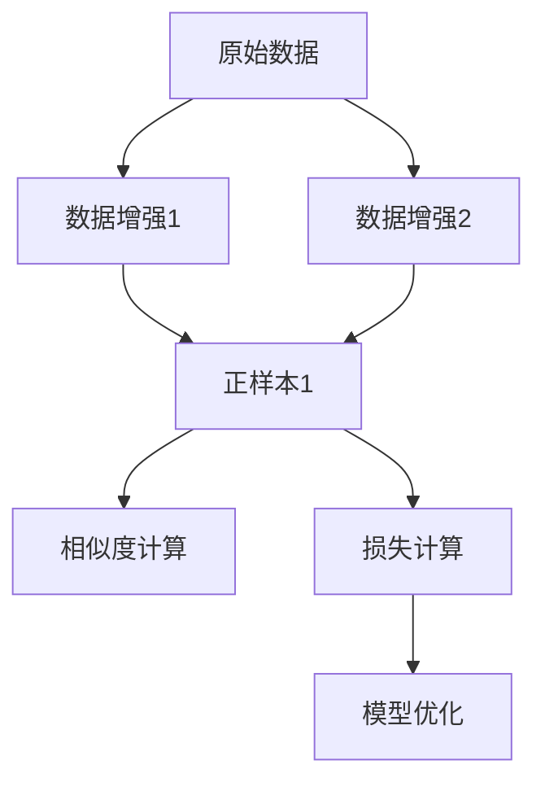
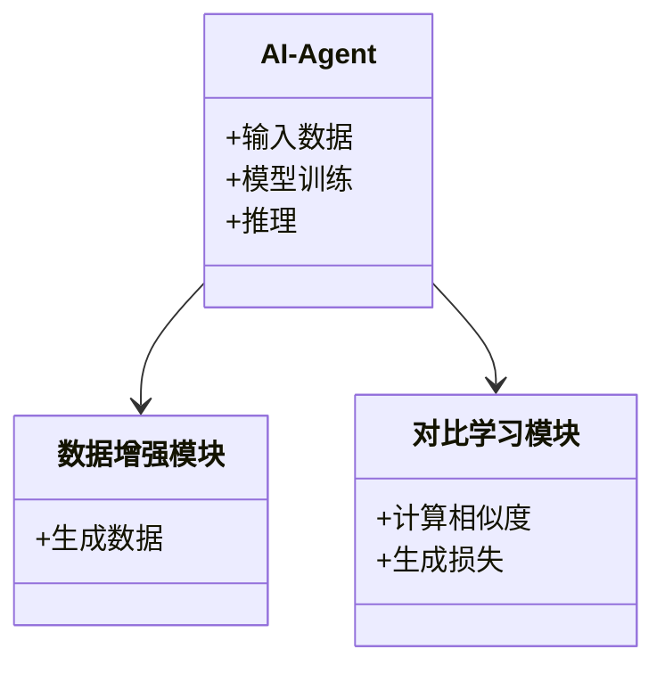
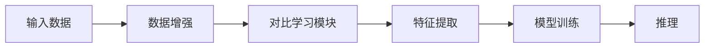

                 


# 自监督学习：减少AI Agent的标注数据依赖

**关键词：** 自监督学习, AI Agent, 标注数据, 对比学习, 生成式模型, 知识蒸馏

**摘要：**  
随着人工智能技术的快速发展，AI Agent在各个领域的应用日益广泛。然而，传统的监督学习方法对标注数据的依赖性过强，导致数据获取成本高、标注难度大。自监督学习作为一种新兴的学习范式，通过利用未标注数据中的内在结构信息，显著减少了对标注数据的依赖。本文将深入探讨自监督学习的核心概念、算法原理、系统架构以及实际应用，为减少AI Agent的标注数据依赖提供理论支持和实践指导。

---

## 第一部分: 自监督学习基础与背景

### 第1章: 自监督学习概述

#### 1.1 自监督学习的核心概念

##### 1.1.1 自监督学习的定义与特点
自监督学习（Self-Supervised Learning, SSL）是一种无监督学习的变体，旨在通过预测未标注数据中的某些属性或关系来学习数据的表示。与监督学习不同，自监督学习不需要人工标注的数据，而是通过自动生成标签或利用数据的内在结构来训练模型。其特点包括：
- **无监督性**：主要依赖未标注数据。
- **任务驱动性**：通过构造特定任务（如图像旋转、文本预测）来学习特征。
- **数据效率高**：能够在较少标注数据的情况下进行有效学习。

##### 1.1.2 自监督学习与监督学习的区别
| 特性 | 监督学习 | 自监督学习 |
|------|----------|-------------|
| 数据需求 | 需要大量标注数据 | 利用未标注数据，仅需少量标注数据辅助 |
| 标签来源 | 人工标注 | 数据本身生成 |
| 应用场景 | 需要精确标注的任务 | 适用于数据充足但标注成本高的场景 |

##### 1.1.3 自监督学习的优势与应用场景
自监督学习的优势在于能够有效利用未标注数据，降低标注成本，适用于以下场景：
- **自然语言处理**：如文本预测、句法分析。
- **计算机视觉**：如图像分类、目标检测。
- **语音处理**：如语音识别、语义分割。

#### 1.2 AI Agent的标注数据依赖问题

##### 1.2.1 监督学习的局限性
监督学习需要大量标注数据，但标注数据的获取成本高、耗时长，尤其是在处理复杂任务时，标注难度大且容易出错。

##### 1.2.2 标注数据的获取成本与挑战
- **数据标注成本**：人工标注需要大量时间和资源。
- **数据稀疏性**：某些领域数据标注难度大，导致模型难以泛化。

##### 1.2.3 减少标注数据依赖的意义
通过自监督学习，AI Agent可以在无标注数据环境下进行有效学习，降低对标注数据的依赖，从而提高学习效率和应用范围。

---

### 第2章: 自监督学习的核心原理

#### 2.1 对比学习

##### 2.1.1 对比学习的基本原理
对比学习通过将数据样本及其扰动版本进行对比，学习数据的不变量表示。例如，图像旋转后与原始图像对比，模型需要识别出相同的物体。

##### 2.1.2 对比学习的损失函数
对比学习的核心是计算两个样本的相似性。常用损失函数为NT-Xent损失：
$$ \text{loss} = -\frac{1}{N}\sum_{i=1}^{N}\log\left(\frac{\exp(s_i)}{1 + \exp(s_i)}\right) $$
其中，$s_i$是第$i$对样本的相似度分数。

##### 2.1.3 对比学习的典型算法（如SimCLR）
SimCLR通过数据增强生成正样本对，并通过对比损失函数训练模型。

**对比学习流程图（mermaid）：**


#### 2.2 生成式自监督学习

##### 2.2.1 生成式模型的原理
生成式模型（如GAN、VAE）通过生成数据来学习数据分布，从而进行自监督学习。

##### 2.2.2 使用生成式模型进行自监督学习的方法
通过生成模型生成数据，并与真实数据对比，调整模型参数。

##### 2.2.3 GAN与VAE在自监督学习中的应用
- **GAN**：生成对抗网络通过生成器和判别器的博弈，生成高质量数据。
- **VAE**：变分自编码器通过最大化似然估计，学习数据分布。

#### 2.3 知识蒸馏

##### 2.3.1 知识蒸馏的基本概念
知识蒸馏通过将教师模型的知识迁移到学生模型，减少对标注数据的依赖。

##### 2.3.2 知识蒸馏在自监督学习中的应用
教师模型生成伪标签，学生模型通过蒸馏损失函数进行学习。

##### 2.3.3 知识蒸馏的优势与挑战
优势：减少标注数据需求，提升模型泛化能力；挑战：依赖教师模型的质量。

---

## 第二部分: 自监督学习算法原理与数学模型

### 第3章: 对比学习的数学模型

#### 3.1 对比学习的损失函数

##### 3.1.1 NT-Xent损失函数
NT-Xent损失函数用于衡量正样本对的相似度：
$$ \text{NT-Xent}(x_i, x_j) = -\frac{1}{\log(2)}\log\left(\frac{1}{1 + e^{-d(x_i, x_j)}}\right) $$

##### 3.1.2 其他对比学习损失函数
- **InfoNCE**：基于信息论的损失函数。
- **ArcFace**：用于人脸识别的损失函数。

#### 3.2 对比学习的网络结构

##### 3.2.1 编码器网络
编码器将输入数据映射到特征空间。

##### 3.2.2 对比层的设计
对比层通过计算特征相似度，生成损失函数。

#### 3.3 对比学习的数学推导

##### 3.3.1 损失函数的推导
基于KL散度推导对比损失函数。

##### 3.3.2 网络优化的数学过程
通过梯度下降优化模型参数。

### 第4章: 生成式自监督学习的数学模型

#### 4.1 GAN的数学模型

##### 4.1.1 GAN的损失函数
生成对抗网络的损失函数：
$$ \mathcal{L}_{\text{GAN}} = \mathbb{E}_{x \sim p_{\text{data}}}[ \log D(x) ] + \mathbb{E}_{z \sim p_z}[ \log (1 - D(G(z)))] $$

##### 4.1.2 GAN的训练过程
生成器和判别器交替训练，优化损失函数。

#### 4.2 VAE的数学模型

##### 4.2.1 VAE的变分下界
变分下界的推导：
$$ \mathcal{L} = \mathbb{E}_{z \sim q(z|x)}[ \log p(x|z) ] - \text{KL}(q(z|x) || p(z)) $$

##### 4.2.2 VAE的重参数化技巧
通过重参数化技巧生成样本。

#### 4.3 GAN与VAE在自监督学习中

---

## 第三部分: 系统架构设计与项目实战

### 第5章: 系统架构设计

#### 5.1 问题场景介绍
AI Agent需要在无标注数据环境下进行目标识别和分类。

#### 5.2 系统功能设计

##### 5.2.1 领域模型（mermaid类图）


#### 5.3 系统架构设计（mermaid架构图）


### 第6章: 项目实战

#### 6.1 环境安装
安装必要的库：
```bash
pip install tensorflow-gpu numpy matplotlib
```

#### 6.2 系统核心实现源代码
对比学习模型的实现：
```python
import tensorflow as tf
from tensorflow import keras

def contrastive_loss(y_true, y_pred):
    margin = 1.0
    loss = tf.reduce_mean(tf.square(y_true - y_pred))
    return loss

def build_model(input_dim):
    inputs = keras.Input(shape=(input_dim,))
    x = keras.layers.Dense(128, activation='relu')(inputs)
    x = keras.layers.Dense(1, activation='sigmoid')(x)
    return keras.Model(inputs=inputs, outputs=x)

model = build_model(input_dim=784)
model.compile(optimizer='adam', loss=contrastive_loss)
model.fit(X_train, y_train, epochs=10, batch_size=32)
```

#### 6.3 代码应用解读与分析
- **输入数据**：未标注数据。
- **数据增强**：增加数据多样性。
- **模型训练**：通过对比损失函数优化模型参数。

#### 6.4 实际案例分析和详细讲解剖析
以图像分类为例，展示自监督学习如何减少标注数据的依赖。

---

## 第四部分: 最佳实践与总结

### 第7章: 最佳实践

#### 7.1 小结
自监督学习通过利用未标注数据，有效减少了标注数据的依赖。

#### 7.2 注意事项
- 数据质量影响模型性能。
- 模型调参需谨慎。

#### 7.3 拓展阅读
推荐相关论文和书籍，供读者深入学习。

---

**作者：AI天才研究院/AI Genius Institute & 禅与计算机程序设计艺术 /Zen And The Art of Computer Programming**

---

通过以上内容，文章详细介绍了自监督学习的核心概念、算法原理、系统架构和项目实战，帮助读者全面理解并掌握减少AI Agent标注数据依赖的方法。

