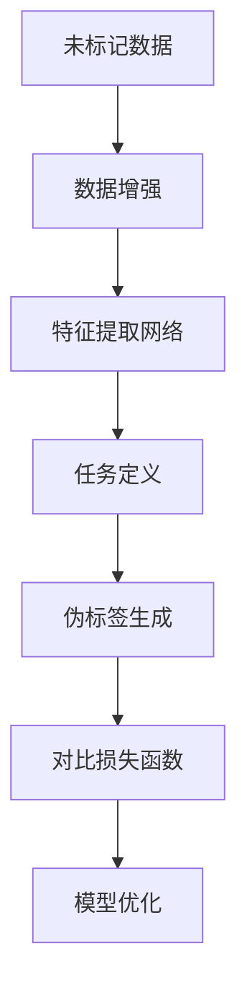
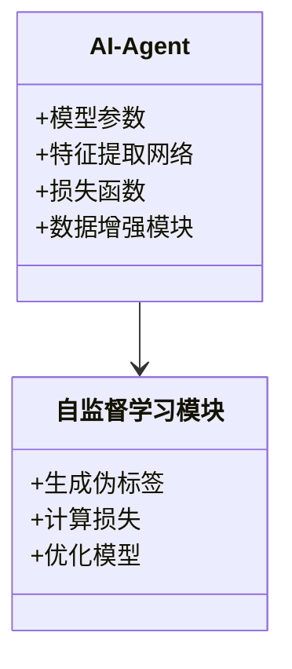
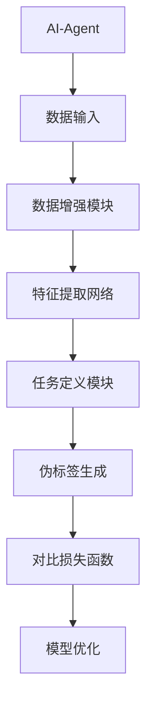

                 


# 自监督学习：利用未标记数据提升AI Agent能力

## 关键词：自监督学习、未标记数据、AI Agent、机器学习、深度学习

## 摘要：本文深入探讨自监督学习如何利用未标记数据提升AI Agent的能力。通过背景介绍、核心概念、算法原理、系统架构设计和项目实战，全面解析自监督学习的原理和应用。文章结合数学公式、代码示例和图表，展示自监督学习在AI代理中的实际应用，为读者提供全面而深入的指导。

---

## 第一部分：自监督学习的背景与应用价值

### 第1章：自监督学习的背景与应用价值

#### 1.1 自监督学习的起源与定义

##### 1.1.1 机器学习的演进：从监督学习到无监督学习

在机器学习的发展历程中，监督学习一直是主流方法。然而，随着数据量的爆炸式增长，标注数据的成本日益高昂。自监督学习作为一种新兴的无监督学习方法，逐渐成为解决这一问题的关键技术。自监督学习通过利用未标记数据中的内在结构信息，实现了在无标注数据下的自我监督和学习，从而扩展了AI Agent的能力。

##### 1.1.2 自监督学习的定义与特点

自监督学习（Self-Supervised Learning, SSL）是一种无监督学习方法，其核心思想是利用未标记数据本身的信息构建伪标签，并通过这些伪标签进行监督学习。与监督学习不同，自监督学习无需人工标注，能够从大量未标记数据中提取有用的特征，从而降低对标注数据的依赖。其主要特点包括：

- **自监督机制**：通过任务目标构建伪标签，引导模型学习有用的特征表示。
- **数据效率高**：能够利用未标记数据进行预训练，提升模型在小规模标注数据上的表现。
- **任务多样性**：适用于多种任务，如图像分类、自然语言处理等。

##### 1.1.3 自监督学习在AI Agent中的应用价值

AI Agent需要处理大量未标记数据，例如传感器数据、用户行为数据等。自监督学习能够在这些数据中发现模式和结构，提升AI Agent的学习能力和决策能力。通过自监督学习，AI Agent可以在无需人工标注的情况下，不断优化自身模型，适应动态变化的环境。

---

#### 1.2 未标记数据的挑战与机遇

##### 1.2.1 数据标注的高成本问题

标注数据需要大量的人力和时间，尤其是在处理图像、语音和自然语言数据时，标注成本尤为高昂。对于小公司或资源有限的团队来说，获取大量标注数据是一个巨大的挑战。

##### 1.2.2 未标记数据的丰富性与多样性

现代社会产生了海量的未标记数据，例如社交媒体上的帖子、 IoT 设备收集的传感器数据等。这些数据包含了丰富的信息，但由于缺乏标注，难以直接用于监督学习任务。

##### 1.2.3 利用未标记数据提升AI Agent能力的意义

通过自监督学习，AI Agent能够从未标记数据中提取有用的信息，提升模型的泛化能力和适应性。特别是在数据稀疏或标注数据不足的情况下，自监督学习成为了一种有效的解决方案。

---

## 第二部分：自监督学习的核心概念与原理

### 第2章：自监督学习的核心概念与联系

#### 2.1 自监督学习的核心概念

自监督学习的核心在于构建一个任务，利用未标记数据生成伪标签，并通过优化模型预测与伪标签的差异来学习数据的特征表示。常见的自监督学习方法包括对比学习、生成对抗网络等。

##### 2.1.1 数据处理与特征提取

自监督学习的关键步骤是数据处理和特征提取。通过对未标记数据进行预处理（如数据增强），生成多样化的数据样本，并通过特征提取网络学习数据的表示。

##### 2.1.2 损失函数与优化

自监督学习通常采用对比损失函数，通过最大化正样本对的相似性，最小化负样本对的相似性，来优化模型参数。

---

#### 2.2 自监督学习与其他无监督学习方法的对比

以下是自监督学习与其他无监督学习方法的对比：

| 方法        | 是否需要生成伪标签 | 是否需要任务定义 | 适用场景                 |
|-------------|---------------------|------------------|--------------------------|
| K-means     | 否                 | 否               | 聚类                     |
| PCA         | 否                 | 否               | 降维                     |
| 自监督学习  | 是                 | 是               | 特征学习、分类           |

#### 2.3 自监督学习的核心要素与关系

以下是自监督学习的核心要素与关系：



---

## 第三部分：自监督学习的算法原理

### 第3章：自监督学习的算法原理

#### 3.1 对比学习

对比学习是一种常用的自监督学习方法，其核心思想是通过最大化正样本对的相似性，最小化负样本对的相似性。以下是对比学习的数学模型：

$$ L = -\frac{1}{N}\sum_{i=1}^{N}\left[\log\frac{e^{s_i}}{1 + e^{s_i}} + \log\frac{e^{s_i}}{1 + e^{s_i}}\right] $$

其中，\( s_i \) 是正样本对的相似性。

##### 3.1.1 对比学习的实现步骤

以下是对比学习的实现步骤：

1. **数据增强**：对未标记数据进行数据增强，生成正样本和负样本对。
2. **特征提取**：通过特征提取网络提取数据的特征表示。
3. **计算相似性**：计算正样本对和负样本对的相似性。
4. **损失函数优化**：通过优化损失函数，更新模型参数。

##### 3.1.2 对比学习的Python实现

以下是对比学习的Python实现示例：

```python
import torch
import torch.nn as nn

class ContrastiveLoss(nn.Module):
    def __init__(self, temperature=0.1):
        super(ContrastiveLoss, self).__init__()
        self.temperature = temperature

    def forward(self, features, labels):
        # 正样本对的相似性
        positive_pairs = (features * labels).sum(dim=-1)
        # 负样本对的相似性
        negative_pairs = (features * (1 - labels)).sum(dim=-1)
        # 计算损失
        loss = -torch.mean(torch.log(positive_pairs / (positive_pairs + negative_pairs)))
        return loss

# 示例使用
features = torch.randn(100, 128)
labels = torch.randint(0, 2, (100, 1))
loss = ContrastiveLoss()(features, labels)
print(loss)
```

---

#### 3.2 生成对抗网络

生成对抗网络（GAN）是一种自监督学习方法，通过生成器和判别器的对抗训练，生成逼真的样本数据。

##### 3.2.1 GAN的数学模型

以下是GAN的数学模型：

生成器的目标是最小化判别器的损失：

$$ \min_G \mathbb{E}_{z \sim p_z}[\log D(G(z))] $$

判别器的目标是最大化生成样本被识别为真实样本的概率：

$$ \max_D \mathbb{E}_{x \sim p_{data}}[\log D(x)] + \mathbb{E}_{z \sim p_z}[\log (1 - D(G(z)))] $$

##### 3.2.2 GAN的实现步骤

以下是GAN的实现步骤：

1. **初始化生成器和判别器**：定义生成器和判别器的网络结构。
2. **对抗训练**：交替训练生成器和判别器，更新模型参数。
3. **生成样本**：通过生成器生成新的样本数据。

##### 3.2.3 GAN的Python实现

以下是一个简单的GAN实现示例：

```python
import torch
import torch.nn as nn

# 定义生成器
class Generator(nn.Module):
    def __init__(self, latent_dim, hidden_size):
        super(Generator, self).__init__()
        self.latent_dim = latent_dim
        self.hidden_size = hidden_size
        self.net = nn.Sequential(
            nn.Linear(latent_dim, hidden_size),
            nn.ReLU(),
            nn.Linear(hidden_size, 128)
        )

    def forward(self, z):
        return self.net(z)

# 定义判别器
class Discriminator(nn.Module):
    def __init__(self, hidden_size):
        super(Discriminator, self).__init__()
        self.hidden_size = hidden_size
        self.net = nn.Sequential(
            nn.Linear(128, hidden_size),
            nn.ReLU(),
            nn.Linear(hidden_size, 1),
            nn.Sigmoid()
        )

    def forward(self, x):
        return self.net(x)

# 初始化模型
latent_dim = 100
hidden_size = 128
generator = Generator(latent_dim, hidden_size)
discriminator = Discriminator(hidden_size)

# 定义损失函数和优化器
criterion = nn.BCELoss()
optimizer_g = torch.optim.Adam(generator.parameters(), lr=0.001)
optimizer_d = torch.optim.Adam(discriminator.parameters(), lr=0.001)

# 训练循环
for epoch in range(100):
    for _ in range(2):
        # 判别器训练
        optimizer_d.zero_grad()
        z = torch.randn(100, latent_dim)
        generated = generator(z)
        x_real = torch.randn(100, 128)
        output_real = discriminator(x_real)
        output_fake = discriminator(generated)
        loss_d = -torch.mean(torch.log(output_real)) - torch.mean(torch.log(1 - output_fake))
        loss_d.backward()
        optimizer_d.step()

    # 生成器训练
    optimizer_g.zero_grad()
    z = torch.randn(100, latent_dim)
    generated = generator(z)
    output = discriminator(generated)
    loss_g = -torch.mean(torch.log(output))
    loss_g.backward()
    optimizer_g.step()
```

---

## 第四部分：自监督学习的系统分析与架构设计

### 第4章：自监督学习的系统分析与架构设计

#### 4.1 问题场景介绍

在AI Agent的应用中，未标记数据的处理是一个关键问题。通过自监督学习，AI Agent可以从未标记数据中提取特征，提升模型的泛化能力。

#### 4.2 系统功能设计

以下是系统功能设计的领域模型类图：



#### 4.3 系统架构设计

以下是系统架构设计的架构图：



---

## 第五部分：自监督学习的项目实战

### 第5章：自监督学习的项目实战

#### 5.1 环境安装

以下是环境安装步骤：

1. 安装Python和PyTorch：
   ```bash
   pip install torch torchvision
   ```

2. 安装其他依赖：
   ```bash
   pip install numpy matplotlib
   ```

#### 5.2 系统核心实现

以下是自监督学习的核心代码实现：

```python
import torch
import torch.nn as nn
import torch.optim as optim
from torch.utils.data import DataLoader, Dataset

class CustomDataset(Dataset):
    def __init__(self, data, transform=None):
        self.data = data
        self.transform = transform

    def __len__(self):
        return len(self.data)

    def __getitem__(self, idx):
        sample = self.data[idx]
        if self.transform:
            sample = self.transform(sample)
        return sample

class SimpleModel(nn.Module):
    def __init__(self, input_size, hidden_size, output_size):
        super(SimpleModel, self).__init__()
        self.fc1 = nn.Linear(input_size, hidden_size)
        self.fc2 = nn.Linear(hidden_size, output_size)

    def forward(self, x):
        x = self.fc1(x)
        x = nn.ReLU()(x)
        x = self.fc2(x)
        return x

# 数据生成
data = torch.randn(100, 128)
labels = torch.randint(0, 2, (100,))

# 数据集和数据加载器
dataset = CustomDataset(data, transform=None)
dataloader = DataLoader(dataset, batch_size=32, shuffle=True)

# 模型定义
input_size = 128
hidden_size = 64
output_size = 1
model = SimpleModel(input_size, hidden_size, output_size)

# 损失函数和优化器
criterion = nn.BCEWithLogitsLoss()
optimizer = optim.Adam(model.parameters(), lr=0.001)

# 训练循环
for epoch in range(10):
    for batch in dataloader:
        inputs, labels = batch
        optimizer.zero_grad()
        outputs = model(inputs)
        loss = criterion(outputs, labels.float().view(-1, 1))
        loss.backward()
        optimizer.step()

print("训练完成！")
```

---

## 第六部分：自监督学习的最佳实践

### 第6章：自监督学习的最佳实践

#### 6.1 小结

自监督学习是一种强大的无监督学习方法，能够在未标记数据中提取有用的特征，提升AI Agent的能力。

#### 6.2 注意事项

- **数据质量**：确保未标记数据的质量，避免噪声干扰。
- **任务定义**：合理定义任务目标，确保伪标签的有效性。
- **模型选择**：选择适合自监督学习的模型架构和优化方法。

#### 6.3 未来趋势

随着深度学习技术的不断发展，自监督学习将在更多领域得到应用，尤其是在AI Agent和自动驾驶等需要处理大量未标记数据的场景中。

#### 6.4 拓展阅读

-《Deep Learning》 by Ian Goodfellow
-《Hands-On Machine Learning with Scikit-Learn, Keras, and TensorFlow》 by Aurélien Géron

---

## 作者：AI天才研究院/AI Genius Institute & 禅与计算机程序设计艺术 /Zen And The Art of Computer Programming

---

**感谢您的阅读！希望本文对您理解自监督学习有所帮助。**

