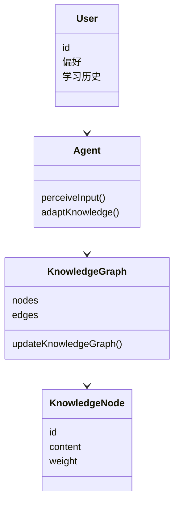
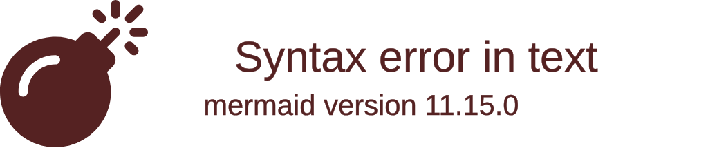

                 


# 自适应学习AI Agent：LLM的动态知识结构调整

> 关键词：自适应学习AI Agent，LLM，动态知识结构，大语言模型，知识图谱

> 摘要：本文探讨自适应学习AI Agent如何通过大语言模型（LLM）动态调整知识结构。通过分析LLM的原理及其在动态知识结构中的应用，结合算法原理、系统架构和项目实战，详细阐述如何构建高效的知识调整系统，为AI Agent的发展提供新思路。

---

## 第一部分: 自适应学习AI Agent概述

### 第1章: 自适应学习AI Agent的背景与概念

#### 1.1 AI Agent的基本概念
- **AI Agent定义**：AI Agent（智能体）是指能够感知环境并采取行动以实现目标的实体。它具备自主性、反应性、主动性、社会性和持续性。
- **自适应学习的定义**：自适应学习是指系统能够根据环境变化和用户反馈动态调整学习策略和内容。
- **动态知识结构的特点**：动态知识结构是指知识体系能够实时更新和调整，以适应不断变化的信息和需求。

#### 1.2 动态知识结构的定义与特点
- **知识结构的动态性**：知识节点和关系随时间变化而更新。
- **动态知识调整的必要性**：实时更新知识以适应新信息和用户需求。
- **自适应学习AI Agent的核心要素**：感知、推理、学习和执行能力。

### 第2章: 自适应学习AI Agent的核心概念

#### 2.1 自适应学习的机制
- **基于反馈的自适应调整**：通过用户反馈优化学习路径。
- **动态知识图谱的构建**：利用图结构表示知识，支持实时更新。
- **知识关联的实时更新**：动态调整知识节点之间的关联关系。

#### 2.2 动态知识结构的调整算法
- **知识节点的识别与关联**：通过LLM提取和关联知识点。
- **知识权重的动态调整**：根据用户行为调整知识的重要性。
- **知识结构的自适应优化**：基于反馈不断优化知识结构。

---

## 第二部分: 大语言模型（LLM）在自适应学习中的应用

### 第3章: 大语言模型的基本原理

#### 3.1 LLM的模型结构
- **Transformer架构**：由编码器和解码器组成，支持并行处理。
- **注意力机制**：重点关注重要信息，提升模型的上下文理解能力。
- **训练目标**：通过大量数据预训练，学习语言的分布规律。

#### 3.2 LLM在动态知识结构调整中的作用
- **知识提取**：从文本中提取关键知识点。
- **知识关联**：建立知识点之间的关联关系。
- **知识更新**：根据新信息实时更新知识库。

### 第4章: 动态知识结构调整的算法原理

#### 4.1 算法概述
- **总体流程**：信息感知 → 知识提取 → 关系构建 → 权重调整 → 知识更新。
- **核心步骤**：节点识别、权重计算、关系更新。

#### 4.2 算法的数学模型与公式
- **知识权重计算公式**：
  $$ w_{i} = \alpha \cdot w_{i-1} + (1 - \alpha) \cdot f(x) $$
  其中，$\alpha$是遗忘因子，$f(x)$是新信息的影响函数。
- **关联规则挖掘**：使用关联规则算法，如Apriori，确定知识点之间的关联强度。

#### 4.3 算法实现步骤
1. 信息感知：通过LLM获取新信息。
2. 知识提取：识别知识点并构建图谱。
3. 权重调整：根据用户反馈更新权重。
4. 关系更新：动态调整知识点的关联关系。

---

## 第三部分: 动态知识结构调整的系统架构与实现

### 第5章: 系统架构设计

#### 5.1 问题场景介绍
- **用户需求**：个性化学习路径，实时知识更新。
- **系统目标**：构建自适应学习AI Agent，支持动态知识结构调整。

#### 5.2 系统功能设计
- **领域模型（Mermaid类图）**：


#### 5.3 系统架构设计（Mermaid架构图）


#### 5.4 系统接口设计
- **输入接口**：接收用户输入和反馈。
- **输出接口**：提供个性化学习内容和建议。

#### 5.5 系统交互设计（Mermaid序列图）
```mermaid
sequenceDiagram
    用户 → Agent: 提供学习反馈
    Agent → KnowledgeGraph: 更新知识权重
    KnowledgeGraph → Agent: 返回更新结果
    Agent → 用户: 提供新学习路径
```

### 第6章: 项目实战

#### 6.1 环境安装
- **工具安装**：安装Python、TensorFlow、Hugging Face库。
- **依赖管理**：使用虚拟环境管理依赖。

#### 6.2 系统核心实现源代码
- **知识提取模块**：
```python
def extract Knowledge(text):
    # 使用LLM提取知识点
    pass
```
- **权重更新模块**：
```python
def update_weight(node, alpha):
    node.weight = alpha * node.weight + (1 - alpha) * f(node.content)
```

#### 6.3 代码应用解读
- **知识提取**：利用LLM从文本中提取知识点。
- **权重更新**：根据用户反馈调整知识点的重要性。

#### 6.4 实际案例分析
- **案例背景**：用户学习编程，系统动态调整知识点。
- **案例分析**：系统根据反馈更新权重，优化学习路径。

#### 6.5 项目小结
- **项目目标**：构建自适应学习系统。
- **项目成果**：实现了动态知识结构调整模块。

### 第7章: 最佳实践与总结

#### 7.1 小结
- **核心内容回顾**：AI Agent、动态知识结构、LLM的应用。
- **关键点总结**：动态调整知识结构的重要性。

#### 7.2 注意事项
- **数据质量**：确保数据准确，避免误导用户。
- **算法优化**：持续优化算法，提升调整效率。

#### 7.3 未来研究方向
- **模型优化**：探索更高效的算法。
- **多模态整合**：结合视觉、听觉等多模态信息。

#### 7.4 拓展阅读
- **推荐书籍**：《深度学习》、《自适应教育技术》。
- **在线资源**：推荐相关技术博客和开源项目。

---

## 作者

作者：AI天才研究院/AI Genius Institute & 禅与计算机程序设计艺术 /Zen And The Art of Computer Programming

---

本文通过详细分析自适应学习AI Agent的核心概念、动态知识结构的调整算法以及大语言模型的应用，为读者提供了从理论到实践的全面指导。希望本文能为相关领域的研究者和开发者提供有价值的参考，推动自适应学习技术的发展。

