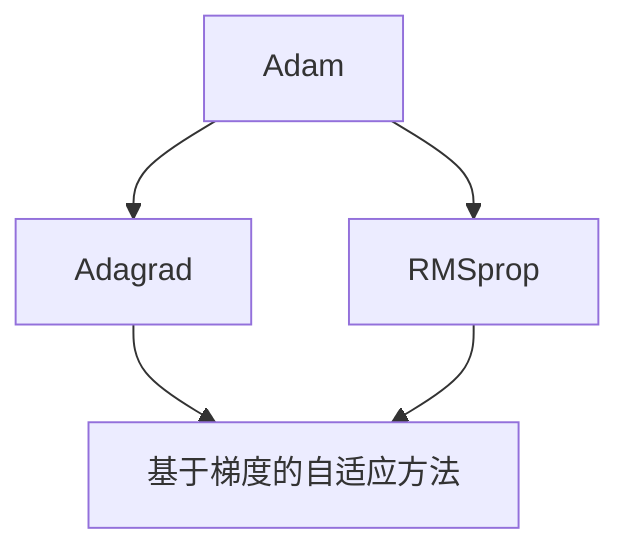

                 

## 第2章：自适应学习率的核心概念与联系

### 2.1 自适应学习率的原理

自适应学习率通过动态调整每个参数的学习率，使得模型能够更好地适应当前的梯度信息和优化目标。其核心思想是根据梯度的统计信息（如均值、方差等）来自适应地调整学习率。具体来说，自适应学习率算法通常基于以下几种策略：

- **基于梯度的自适应方法**：这种方法通过分析梯度的大小和方向来调整学习率。例如，Adam算法不仅考虑梯度的均值，还考虑梯度的方差，从而实现更稳定和高效的学习。
- **基于误差的自适应方法**：这种方法根据预测值与真实值之间的误差来调整学习率。当误差较大时，增加学习率；当误差较小时，减小学习率。
- **综合考虑梯度和误差的方法**：这种方法结合了梯度和误差的双重信息，以更全面地调整学习率。

### 2.2 自适应学习率算法的对比

目前，有许多自适应学习率算法被提出并广泛应用于AI Agent训练中。以下是几种常见的算法及其对比：

#### 2.2.1 Adam算法

Adam（Adaptive Moment Estimation）是一种结合了动量和自适应学习率的优化算法。它通过维护梯度的移动平均（一阶矩估计）和梯度的平方的移动平均（二阶矩估计）来自适应地调整学习率。Adam的优势在于其计算效率高，适用于大规模数据集和高维参数空间。

#### 2.2.2 Adagrad算法

Adagrad是一种基于梯度累积的自适应学习率算法。它通过将每个参数的梯度平方累加起来，动态调整每个参数的学习率。Adagrad特别适用于稀疏数据，因为它能够在不同参数之间自动调整学习率。

#### 2.2.3 RMSprop算法

RMSprop（Root Mean Square Propagation）是一种基于梯度平方滑动平均的自适应学习率算法。它通过维护梯度平方的滑动平均来动态调整学习率，从而避免了梯度消失或爆炸的问题。

#### 2.2.4 SGD算法

SGD（Stochastic Gradient Descent）是一种传统的批量随机梯度下降算法。虽然它不具有自适应学习率的功能，但可以通过手动调整学习率或学习率衰减策略来实现一定程度的自适应。

### 2.3 算法对比表格

以下是几种常见自适应学习率算法的对比表格：

| 算法名称 | 参数自适应 | 学习率调整方式 | 优点 | 缺点 |
|---------|----------|--------------|------|------|
| Adam    | 是       | 动态调整      | 收敛快 | 参数过多 |
| Adagrad | 是       | 累积梯度      | 适合稀疏数据 | 收敛慢 |
| RMSprop | 是       | 滑动平均      | 稳定性好 | 参数调整复杂 |
| SGD     | 否       | 固定或手动调整 | 简单 | 收敛慢 |

### 2.4 ER

接下来，我将通过Mermaid图来展示自适应学习率算法中Adam、Adagrad和RMSprop的核心思想之间的关系：

从上图可以看出，Adam算法结合了Adagrad和RMSprop的优点，既考虑了梯度的均值（动量），又考虑了梯度的方差（自适应学习率）。这种结合使得Adam在实际应用中表现出色。

---

接下来，我将进入第3章：自适应学习率算法的数学模型与实现。这一章将详细推导各种自适应学习率算法的数学模型，并提供Python实现代码。

如果您对当前内容有任何反馈或需要调整，请随时告诉我。

