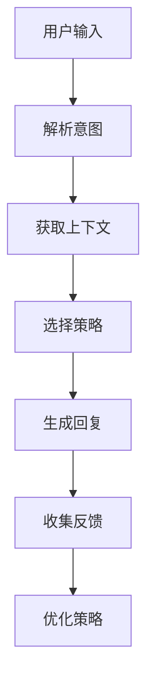
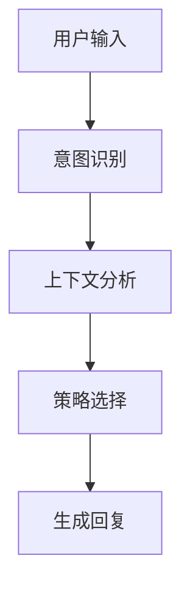
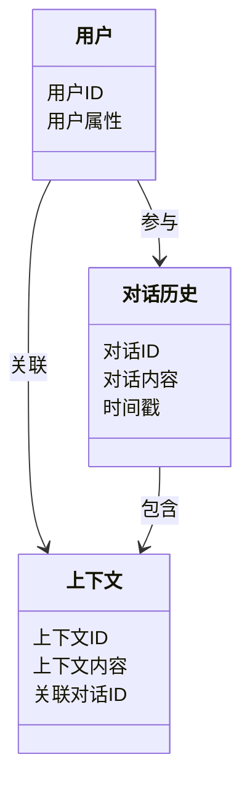
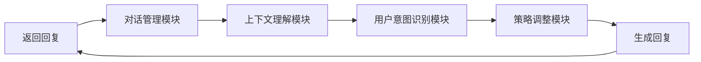

                 


# 自适应对话策略：提升AI Agent的交互质量

> 关键词：自适应对话策略，AI Agent，自然语言处理，对话系统，上下文理解，用户意图识别

> 摘要：  
> 本文深入探讨了自适应对话策略在提升AI Agent交互质量中的核心作用。通过分析传统对话策略的局限性，提出了基于上下文理解和用户意图识别的自适应对话策略，并结合算法原理、系统架构和实际案例，详细阐述了如何实现高效的自适应对话系统。本文还提供了具体的代码实现和系统设计思路，为读者提供了一个从理论到实践的完整指南。

---

## 第1章: 自适应对话策略概述

### 1.1 问题背景与描述
#### 1.1.1 对话策略的定义与特点
对话策略是AI Agent在与用户交互过程中选择和生成回复的核心规则和方法。传统的对话策略通常基于固定的规则或预定义的模板，难以应对复杂多变的用户需求和语境变化。

#### 1.1.2 传统对话策略的局限性
1. **静态性**：传统策略依赖固定的规则，无法根据用户反馈或上下文动态调整。
2. **缺乏灵活性**：在面对用户情绪、意图变化时，传统策略难以灵活应对。
3. **信息利用率低**：无法有效整合历史对话记录和外部知识库的信息。

#### 1.1.3 自适应对话策略的核心目标
自适应对话策略的目标是在交互过程中，根据用户反馈、上下文信息和对话历史动态调整对话策略，从而提高对话的流畅性和用户体验。

### 1.2 自适应对话策略的定义与特点
#### 1.2.1 自适应对话策略的定义
自适应对话策略是一种动态调整对话行为的策略，能够根据实时反馈和上下文信息优化对话流程和内容。

#### 1.2.2 自适应与传统对话策略的对比
| 对比维度 | 传统对话策略 | 自适应对话策略 |
|----------|----------------|------------------|
| 策略调整 | 静态，固定规则 | 动态，基于反馈 |
| 上下文理解 | 单一，基于规则 | 多维，基于上下文 |
| 用户意图识别 | 简单，基于关键词 | 精准，基于意图 |

#### 1.2.3 自适应对话策略的核心要素
1. **上下文理解**：准确解析对话历史、用户情绪和意图。
2. **用户意图识别**：基于自然语言处理技术，识别用户的深层需求。
3. **动态调整机制**：根据反馈实时优化对话策略。

---

## 第2章: 自适应对话策略的核心概念与联系

### 2.1 对话策略与自适应机制
#### 2.1.1 对话策略的核心原理
对话策略的选择依赖于对用户意图的理解和对话历史的分析。自适应对话策略通过实时反馈优化策略执行效果。

#### 2.1.2 自适应机制的实现原理
自适应机制通过以下步骤实现：
1. **收集反馈**：从用户行为或对话中获取反馈信息。
2. **分析反馈**：结合上下文信息，分析反馈的意义。
3. **调整策略**：根据反馈结果动态调整对话策略。

#### 2.1.3 对话上下文的理解与管理
对话上下文是自适应对话策略的核心输入。通过自然语言处理技术，AI Agent能够理解对话的背景、用户情绪和意图。

#### 2.1.4 用户意图识别与对话目标调整
基于意图识别的结果，AI Agent可以动态调整对话目标，确保对话朝着用户期望的方向发展。

### 2.2 核心概念对比与ER实体关系图
#### 2.2.1 核心概念对比表
| 概念 | 描述 |
|------|------|
| 对话策略 | 确定如何生成回复 |
| 自适应机制 | 动态调整策略的规则 |
| 上下文理解 | 解析对话背景和用户情绪 |
| 用户意图识别 | 理解用户的深层需求 |

#### 2.2.2 ER实体关系图
```mermaid
erDiagram
    class 用户 {
        用户ID
        用户属性
    }
    class 对话历史 {
        对话ID
        对话内容
        时间戳
    }
    class 上下文 {
        上下文ID
        上下文内容
        关联对话ID
    }
    用户 --> 对话历史 : 参与
    用户 --> 上下文 : 关联
    对话历史 --> 上下文 : 包含
```

---

## 第3章: 自适应对话策略的算法原理

### 3.1 对话策略选择算法
#### 3.1.1 基于反馈的策略调整算法


#### 3.1.2 基于意图的策略选择算法


#### 3.1.3 对话策略的数学模型
策略选择的概率可以通过以下公式计算：
$$ P(s_i | u_j) = \frac{N(s_i, u_j)}{\sum_{s_i} N(s_i, u_j)} $$
其中，$N(s_i, u_j)$ 表示策略 $s_i$ 在用户输入 $u_j$ 下的成功次数。

---

## 第4章: 系统分析与架构设计

### 4.1 问题场景介绍
以智能客服系统为例，分析自适应对话策略的应用场景。

### 4.2 系统功能设计
#### 4.2.1 功能模块
- 对话管理模块：负责接收用户输入并生成回复。
- 上下文理解模块：解析对话历史和用户情绪。
- 用户意图识别模块：识别用户的深层需求。
- 策略调整模块：根据反馈动态优化策略。

#### 4.2.2 领域模型类图


### 4.3 系统架构设计
#### 4.3.1 系统架构图


#### 4.3.2 系统接口设计
- 用户输入接口：接收用户输入的文本或语音信号。
- 反馈接口：收集用户对回复的反馈信息。
- 知识库接口：整合外部知识库信息。

---

## 第5章: 项目实战

### 5.1 智能客服系统的实现
#### 5.1.1 环境安装
安装必要的Python库：
```bash
pip install numpy pandas scikit-learn transformers
```

#### 5.1.2 核心代码实现
```python
def adaptive_dialogue_strategy(user_input, context):
    # 解析意图
    intent = parse_intent(user_input)
    # 获取上下文
    context_info = get_context(context)
    # 选择策略
    selected_strategy = choose_strategy(intent, context_info)
    # 生成回复
    response = generate_response(selected_strategy)
    return response
```

#### 5.1.3 案例分析
分析一个实际对话案例，展示自适应对话策略的实现过程和效果。

---

## 第6章: 总结与展望

### 6.1 本章小结
总结自适应对话策略的核心思想和实现方法。

### 6.2 注意事项
- 数据隐私保护
- 模型泛化能力
- 用户反馈的及时性

### 6.3 拓展阅读
推荐相关领域的书籍和论文，供读者深入学习。

---

## 作者：AI天才研究院 & 禅与计算机程序设计艺术

---

以上是《自适应对话策略：提升AI Agent的交互质量》的技术博客文章的完整大纲和内容。如需进一步扩展或调整，请随时告知！

