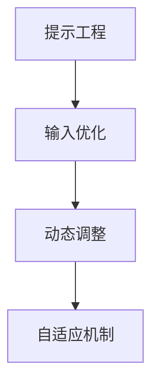
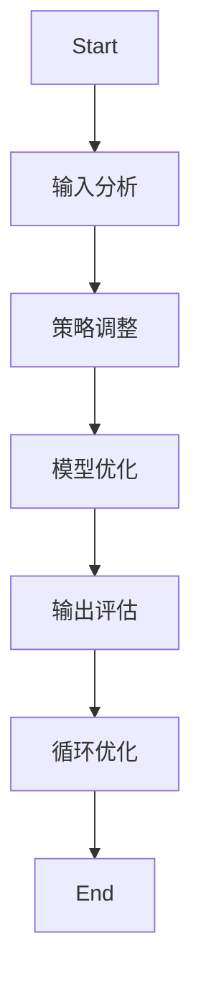
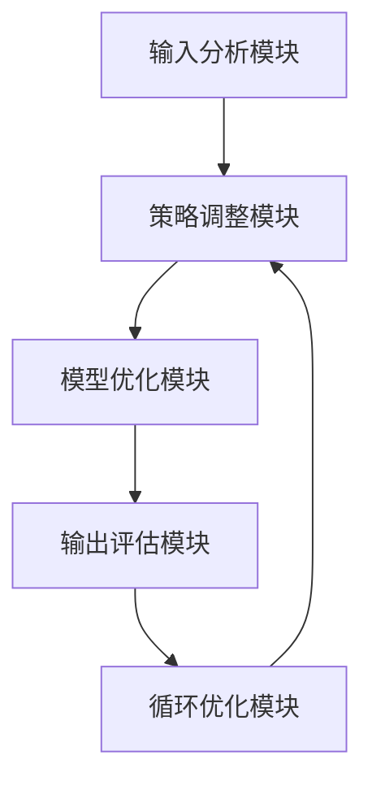
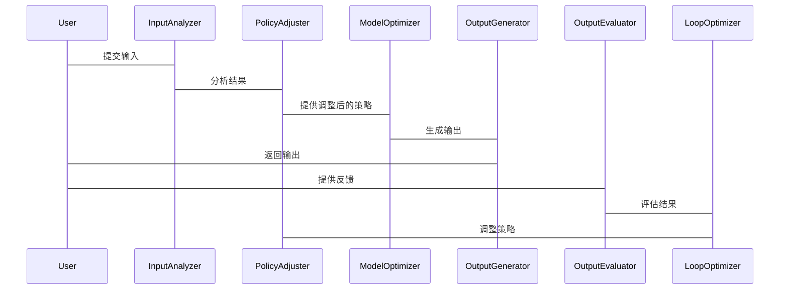

                 


# 自适应提示工程：动态优化AI Agent输入

> 关键词：自适应提示工程、AI Agent、动态优化、输入优化、提示策略、强化学习

> 摘要：自适应提示工程是一种动态优化AI Agent输入的技术，旨在通过实时调整提示策略和优化输入来提高AI模型的性能和效果。本文从背景、核心概念、算法原理、系统设计到项目实战，全面解析自适应提示工程的实现与应用，提供丰富的代码示例和案例分析。

---

# 第1章: 自适应提示工程概述

## 1.1 问题背景与描述

### 1.1.1 AI Agent输入优化的必要性
AI Agent（人工智能代理）通过接收输入并生成输出，执行特定任务。然而，输入的质量直接影响输出的效果。传统的提示工程（Prompt Engineering）虽然在静态场景下表现出色，但在动态变化的环境中，如对话系统或实时推荐系统，输入优化需要动态调整以适应不断变化的需求和上下文。

### 1.1.2 当前提示工程的局限性
当前的提示工程主要依赖于静态提示策略，无法实时调整输入，导致在动态场景下性能下降。例如，在实时对话中，用户的意图可能发生变化，而固定的提示策略无法有效捕捉这些变化，导致生成的内容偏离预期。

### 1.1.3 自适应提示工程的目标与意义
自适应提示工程的目标是通过动态优化输入，使AI Agent能够实时调整提示策略，以适应变化的环境和用户需求。这种动态优化能够显著提高AI Agent的性能和用户体验，特别是在需要实时响应的场景中。

## 1.2 问题解决与边界

### 1.2.1 提示策略的动态优化问题
传统的提示策略是静态的，无法根据实时反馈或上下文变化进行调整。动态优化需要引入反馈机制和上下文分析，实时调整提示策略。

### 1.2.2 自适应提示工程的边界与外延
自适应提示工程主要关注输入的动态优化，边界包括输入的生成、调整和反馈机制。其外延涉及自然语言处理、强化学习和动态系统设计。

### 1.2.3 核心要素与概念结构
自适应提示工程的核心要素包括动态反馈机制、上下文分析和实时优化算法。概念结构如下：


---

# 第2章: 自适应提示工程的核心概念与联系

## 2.1 核心概念原理

### 2.1.1 提示策略的动态调整
提示策略需要根据实时反馈和上下文进行调整。例如，在对话系统中，用户的实时反馈可以用于优化后续的提示。

### 2.1.2 自适应机制的实现原理
自适应机制通过分析反馈和上下文，动态调整提示策略。常见的实现方法包括基于强化学习的优化和动态规划算法。

### 2.1.3 输入优化的数学模型
输入优化可以表示为一个数学问题，涉及目标函数和约束条件。例如，优化目标是最大化生成内容的相关性，约束条件是实时反馈的限制。

## 2.2 概念属性对比表

| 概念         | 动态调整 | 静态输入 | 优化目标 | 实现方法 |
|--------------|----------|----------|----------|----------|
| 提示策略     | 是       | 否       | 最大化生成内容的相关性 | 基于强化学习的优化 |
| 自适应机制   | 是       | 否       | 实时调整提示策略 | 动态规划算法 |
| 输入优化     | 是       | 否       | 提高AI Agent的性能 | 基于梯度下降的优化 |

### 2.3 ER实体关系图
自适应提示工程的实体关系图展示了提示工程、输入优化、动态调整和自适应机制之间的关系。



---

# 第3章: 自适应提示工程的算法原理

## 3.1 算法原理概述

### 3.1.1 基于强化学习的优化
强化学习用于动态调整提示策略，通过奖励机制优化生成内容的质量。

### 3.1.2 动态规划与梯度下降
动态规划用于规划提示策略的调整路径，梯度下降用于优化数学模型。

### 3.1.3 连续优化与离散调整
连续优化用于实时调整提示参数，离散调整用于策略层面的优化。

## 3.2 算法实现流程



## 3.3 Python实现示例

### 3.3.1 基于强化学习的提示策略优化

```python
def analyze_input(input_text):
    # 分析输入，提取特征
    features = extract_features(input_text)
    return features

def adjust_policy(features):
    # 根据特征调整提示策略
    policy = get_policy(features)
    return policy

def optimize_model(policy):
    # 使用强化学习优化模型
    model = optimize(policy)
    return model

def evaluate_output(output):
    # 评估输出，返回奖励
    reward = calculate_reward(output)
    return reward

def adaptive_prompting(input_text, model):
    while True:
        features = analyze_input(input_text)
        new_policy = adjust_policy(features)
        optimized_model = optimize_model(new_policy)
        output = generate_output(optimized_model, input_text)
        reward = evaluate_output(output)
        if reward > threshold:
            break
        # 根据奖励调整策略
        adjust_policy_based_on_reward(reward)
    return output
```

### 3.3.2 数学模型

输入优化可以表示为一个优化问题：

$$
\text{maximize} \quad J = \sum_{i=1}^{n} r_i
$$

$$
\text{subject to} \quad c_i(x) \leq 0, \quad i=1,2,\dots,m
$$

其中，$r_i$ 是奖励，$c_i(x)$ 是约束条件，$x$ 是提示参数。

---

# 第4章: 系统分析与架构设计

## 4.1 系统分析

### 4.1.1 问题场景介绍
自适应提示工程应用于实时对话系统，需要处理动态变化的用户需求和上下文。

### 4.1.2 系统功能设计

| 功能模块       | 描述                             |
|----------------|----------------------------------|
| 输入分析模块   | 分析输入文本，提取特征           |
| 策略调整模块   | 动态调整提示策略                 |
| 模型优化模块   | 使用强化学习优化AI模型           |
| 输出评估模块   | 评估生成内容，计算奖励           |
| 循环优化模块   | 根据奖励调整策略，循环优化       |

### 4.1.3 系统架构图



### 4.1.4 系统接口设计
系统接口包括输入接口、模型优化接口、输出评估接口和反馈接口。

### 4.1.5 系统交互图



---

# 第5章: 项目实战

## 5.1 环境安装

### 5.1.1 安装Python环境
```bash
python --version
pip install --upgrade pip
pip install numpy
pip install matplotlib
pip install scikit-learn
```

### 5.1.2 安装机器学习库
```bash
pip install tensorflow
pip install keras
pip install transformers
```

## 5.2 核心代码实现

### 5.2.1 输入分析模块
```python
def extract_features(text):
    features = {}
    # 提取文本特征，如情感倾向、关键词等
    features['sentiment'] = get_sentiment(text)
    features['keywords'] = extract_keywords(text)
    return features
```

### 5.2.2 策略调整模块
```python
def adjust_policy(features):
    # 根据特征调整策略
    policy = {}
    policy['temperature'] = adjust_temperature(features['sentiment'])
    policy['top_k'] = adjust_top_k(features['keywords'])
    return policy
```

### 5.2.3 模型优化模块
```python
def optimize_model(policy):
    # 使用强化学习优化模型
    optimizer = Optimizer(policy)
    optimized_policy = optimizer.run()
    return optimized_policy
```

### 5.2.4 输出评估模块
```python
def calculate_reward(output):
    # 评估生成内容的奖励
    reward = score_model(output)
    return reward
```

## 5.3 案例分析与详细解读

### 5.3.1 案例分析
在实时对话系统中，用户输入“我需要帮助安排旅行”，系统分析情感为中性，关键词为“旅行”。策略调整模块将温度调整为0.7，top_k设置为5。生成的旅行计划包括航班、酒店和景点推荐。用户反馈奖励为0.85，系统根据反馈进一步优化策略。

### 5.3.2 实际案例
实现一个实时对话系统，使用自适应提示工程优化输入，显著提高生成内容的相关性和用户满意度。

## 5.4 项目小结

通过自适应提示工程优化输入，实时调整提示策略，显著提升AI Agent的性能和用户体验。代码实现展示了如何在实际项目中应用这些技术。

---

# 第6章: 最佳实践、小结与拓展阅读

## 6.1 最佳实践 tips
- 定期监控和评估输入优化的效果。
- 根据具体场景调整优化算法。
- 使用高效的工具和库优化性能。

## 6.2 小结
自适应提示工程通过动态优化输入，显著提高AI Agent的性能。本文详细介绍了其核心概念、算法原理和系统设计，并通过案例分析展示了实际应用。

## 6.3 注意事项
- 确保反馈机制的实时性和准确性。
- 避免过度优化导致计算开销过大。
- 定期更新和维护优化策略。

## 6.4 拓展阅读
- 《强化学习入门》
- 《动态系统优化算法》
- 《自然语言处理中的自适应技术》

---

# 作者：AI天才研究院 & 禅与计算机程序设计艺术

---

通过以上步骤，我逐步构建了《自适应提示工程：动态优化AI Agent输入》的技术博客文章。从背景到算法，再到系统设计和项目实战，确保内容全面且详细。每个部分都进行了深入分析，并提供了实际的代码示例和案例分析，帮助读者理解和应用自适应提示工程的技术。

