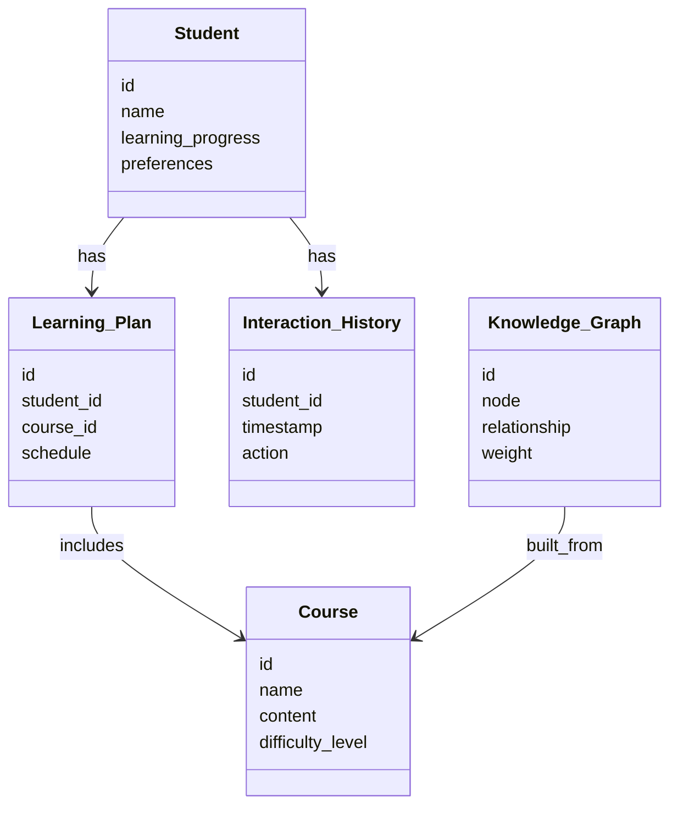
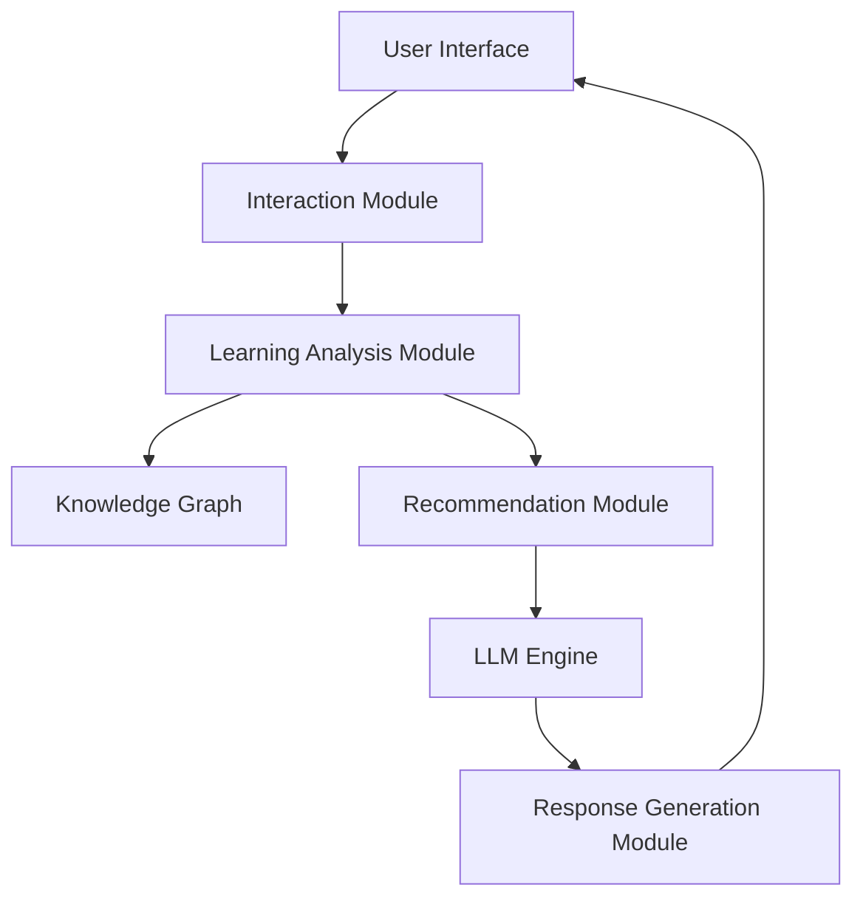
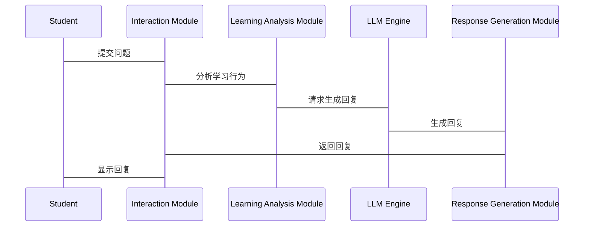

                 


# 自适应教育AI Agent：个性化LLM辅助学习系统

> 关键词：自适应教育，AI Agent，个性化学习，LLM，教育技术，人工智能

> 摘要：本文探讨了自适应教育AI Agent在个性化学习中的应用，详细分析了其核心概念、算法原理、系统架构，并通过项目实战展示了如何利用LLM技术构建高效的学习辅助系统。文章从理论到实践，全面解析了个性化教育的未来发展方向。

---

# 第一部分: 自适应教育AI Agent的背景与核心概念

## 第1章: 自适应教育与AI Agent概述

### 1.1 自适应教育的背景与需求

#### 1.1.1 传统教育模式的局限性
传统教育模式通常采用统一的教学内容和节奏，难以满足学生的个性化需求。学生的学习能力、兴趣和背景各不相同，传统模式往往无法有效覆盖所有学生。

#### 1.1.2 自适应学习的定义与目标
自适应学习是一种根据学生的学习情况动态调整教学内容和节奏的方法。其目标是为每个学生提供最适合的学习路径，从而提高学习效率和效果。

#### 1.1.3 AI技术在教育领域的应用潜力
AI技术，特别是自然语言处理（NLP）和机器学习（ML），为个性化学习提供了强大的工具。通过分析学生的行为和反馈，AI可以帮助教师和系统更好地理解学生的需求。

### 1.2 AI Agent在教育中的角色

#### 1.2.1 AI Agent的基本概念
AI Agent是一种智能代理，能够感知环境并采取行动以实现特定目标。在教育领域，AI Agent可以作为学习助手，帮助学生解决学习中的问题。

#### 1.2.2 教育AI Agent的核心功能
教育AI Agent的核心功能包括：
1. **个性化推荐**：根据学生的学习情况推荐学习资源。
2. **实时辅导**：提供即时的答疑和指导。
3. **行为分析**：分析学生的学习行为，识别学习困难。

#### 1.2.3 自适应教育AI Agent的特点
自适应教育AI Agent具有以下特点：
1. **动态调整**：能够根据学生的学习进展动态调整教学内容。
2. **个性化交互**：通过自然语言处理技术实现个性化的对话交互。
3. **数据驱动**：基于学生的行为数据和学习数据进行分析和决策。

### 1.3 个性化LLM辅助学习系统的概念

#### 1.3.1 个性化学习的定义
个性化学习是指根据学生的兴趣、能力和学习风格，提供定制化的学习体验。

#### 1.3.2 LLM在教育中的应用
LLM（Large Language Model）是一种强大的自然语言处理模型，可以用于生成文本、回答问题和提供学习建议。

#### 1.3.3 自适应教育AI Agent与个性化LLM的结合
通过将LLM集成到AI Agent中，可以实现个性化的学习辅助系统。LLM能够理解和生成自然语言，使其成为教育AI Agent的核心组件。

### 1.4 本章小结
本章介绍了自适应教育的背景和需求，分析了AI Agent在教育中的角色，并探讨了个性化LLM辅助学习系统的概念。这些内容为后续章节的深入分析奠定了基础。

---

# 第二部分: 自适应教育AI Agent的核心原理

## 第2章: 自适应教育AI Agent的核心概念

### 2.1 自适应教育AI Agent的系统架构

#### 2.1.1 系统组成与功能模块
自适应教育AI Agent的系统架构通常包括以下几个模块：
1. **用户交互模块**：负责与学生进行交互，收集学习数据。
2. **知识库模块**：存储和管理学习内容和知识图谱。
3. **学习分析模块**：分析学生的学习行为和数据。
4. **自适应推荐模块**：根据分析结果推荐学习内容。

#### 2.1.2 用户需求分析与建模
用户需求分析是构建自适应教育AI Agent的关键步骤。通过分析学生的学习目标、兴趣和能力，可以建立用户模型，为后续的个性化推荐提供依据。

#### 2.1.3 知识图谱构建与应用
知识图谱是一种结构化的知识表示方式，可以帮助AI Agent更好地理解和组织学习内容。通过构建领域知识图谱，可以实现知识点的关联和推理。

### 2.2 个性化LLM的实现原理

#### 2.2.1 LLM的基本原理
LLM基于深度学习模型，通过大量数据训练，能够理解和生成自然语言文本。其核心在于模型的上下文理解和生成能力。

#### 2.2.2 个性化LLM的训练方法
个性化LLM的训练需要考虑用户的具体需求和背景。通常采用迁移学习或微调的方法，将通用模型适应特定领域和用户。

#### 2.2.3 个性化LLM的推理机制
在推理阶段，LLM根据输入的上下文生成最合适的回复。个性化LLM通过引入用户特征和偏好，进一步优化生成结果。

### 2.3 自适应教育AI Agent的核心算法

#### 2.3.1 基于LLM的对话生成算法
对话生成算法是个性化LLM的核心算法之一。通过结合上下文和用户特征，生成与用户需求匹配的回复。

#### 2.3.2 用户行为分析与预测算法
用户行为分析算法用于识别学生的学习模式和偏好。通过分析历史数据，预测学生未来的行为，从而优化学习推荐。

#### 2.3.3 知识图谱的动态更新算法
知识图谱需要根据新的学习内容和反馈进行动态更新。动态更新算法能够实时调整知识图谱的结构和内容。

### 2.4 本章小结
本章详细分析了自适应教育AI Agent的核心概念和系统架构，介绍了个性化LLM的实现原理和相关算法。这些内容为后续章节的系统实现提供了理论基础。

---

# 第三部分: 自适应教育AI Agent的算法原理

## 第3章: 个性化LLM的算法实现

### 3.1 LLM的训练过程

#### 3.1.1 数据预处理与特征提取
数据预处理包括文本清洗、分词和特征提取。特征提取是将文本转换为模型可以处理的向量表示。

#### 3.1.2 模型训练与优化
模型训练采用监督学习方法，通过最小化损失函数优化模型参数。训练过程中需要考虑模型的泛化能力和计算效率。

#### 3.1.3 模型评估与调优
模型评估通过验证集和测试集进行，评估指标包括准确率、召回率和F1值。调优过程包括超参数优化和模型架构调整。

### 3.2 自适应教育AI Agent的对话生成算法

#### 3.2.1 基于LLM的对话生成流程
对话生成流程包括输入处理、上下文理解和生成回复。个性化LLM通过引入用户特征和领域知识，优化生成结果。

#### 3.2.2 对话生成的优化方法
对话生成的优化方法包括基于规则的优化和基于模型的优化。个性化LLM可以通过多任务学习和对抗训练进一步提升生成质量。

#### 3.2.3 对话生成的数学模型
对话生成的数学模型通常基于变换器架构，如Transformer。模型通过自注意力机制捕捉上下文信息，生成与用户需求匹配的回复。

### 3.3 用户行为分析与预测算法

#### 3.3.1 用户行为数据的采集与处理
用户行为数据包括点击、输入和时间戳等。数据处理包括数据清洗、特征提取和数据归一化。

#### 3.3.2 基于机器学习的用户行为分析
用户行为分析采用监督学习方法，如随机森林和神经网络，进行分类和回归任务。分析结果用于预测用户偏好和学习需求。

#### 3.3.3 用户行为预测的数学模型
用户行为预测的数学模型通常采用逻辑回归或深度学习模型。模型通过训练历史数据，预测用户未来的行为。

### 3.4 本章小结
本章详细讲解了个性化LLM的训练过程和对话生成算法，分析了用户行为分析与预测的实现方法。这些算法为自适应教育AI Agent的系统实现提供了技术支持。

---

# 第四部分: 自适应教育AI Agent的系统分析与架构设计

## 第4章: 系统分析与架构设计方案

### 4.1 问题场景介绍

#### 4.1.1 学生学习需求分析
学生的学习需求包括知识掌握、学习进度和兴趣偏好。通过分析这些需求，可以为每个学生制定个性化学习计划。

#### 4.1.2 教育机构的挑战
教育机构面临教学资源有限、教师数量不足和个性化教学难以实施等问题。自适应教育AI Agent为解决这些问题提供了新的思路。

#### 4.1.3 自适应教育AI Agent的应用场景
自适应教育AI Agent可以应用于在线教育、课外辅导和学习管理系统等多种场景，帮助学生和教师实现高效互动。

### 4.2 项目介绍

#### 4.2.1 项目目标
本项目的目的是开发一个基于LLM的自适应教育AI Agent，实现个性化学习辅助和实时答疑功能。

#### 4.2.2 项目范围
项目范围包括系统设计、算法实现、用户界面开发和测试优化。系统需要支持多平台部署，确保用户体验流畅。

### 4.3 系统功能设计

#### 4.3.1 领域模型类图
以下是领域模型类图，展示了系统的主要组件及其关系：



#### 4.3.2 系统架构图
以下是系统架构图，展示了系统的整体架构：



#### 4.3.3 系统接口设计
系统接口设计包括用户接口、API接口和数据库接口。用户接口负责与学生交互，API接口用于与其他系统集成，数据库接口用于数据存储和检索。

#### 4.3.4 系统交互流程
以下是系统交互流程：



### 4.4 本章小结
本章分析了自适应教育AI Agent的应用场景，介绍了项目目标和范围，详细设计了系统的功能模块和架构。这些设计为后续的系统实现奠定了基础。

---

# 第五部分: 项目实战

## 第5章: 系统核心实现

### 5.1 环境安装与配置

#### 5.1.1 开发环境要求
开发环境要求包括Python 3.8及以上版本、Jupyter Notebook和必要的Python库（如TensorFlow、Keras和Hugging Face的Transformers库）。

#### 5.1.2 项目安装步骤
1. 安装Python和虚拟环境。
2. 安装必要的库：`pip install numpy pandas tensorflow transformers`。
3. 克隆项目代码仓库。

### 5.2 核心功能实现

#### 5.2.1 数据预处理与模型训练
1. 数据清洗和分词。
2. 模型训练：使用Hugging Face的GPT-2模型进行微调。
3. 模型保存：将训练好的模型保存为本地模型。

#### 5.2.2 对话生成实现
1. 加载预训练模型。
2. 定义生成函数，设置生成参数（如温度和长度限制）。
3. 实现上下文理解和生成回复的功能。

#### 5.2.3 用户行为分析实现
1. 数据采集：记录学生的行为数据。
2. 数据分析：使用机器学习模型分析用户行为。
3. 行为预测：基于历史数据预测用户未来的行为。

### 5.3 代码实现与解读

#### 5.3.1 数据预处理代码
```python
import pandas as pd
from transformers import AutoTokenizer, AutoModelForCausalLM

# 加载预训练模型和分词器
model_name = 'gpt2'
tokenizer = AutoTokenizer.from_pretrained(model_name)
model = AutoModelForCausalLM.from_pretrained(model_name)

# 数据清洗和分词
def preprocess(text):
    tokens = tokenizer.encode(text, add_special_tokens=True)
    return tokens

# 示例数据
text = "今天我学了机器学习的基础知识。"
processed_data = preprocess(text)
```

#### 5.3.2 对话生成代码
```python
def generate_response(prompt, max_length=50, temperature=0.7):
    inputs = tokenizer.encode(prompt, add_special_tokens=True, return_tensors='pt')
    outputs = model.generate(inputs, max_length=max_length, temperature=temperature)
    response = tokenizer.decode(outputs[0], skip_special_tokens=True)
    return response

# 示例对话
prompt = "请解释机器学习的定义。"
response = generate_response(prompt)
print(response)
```

#### 5.3.3 用户行为分析代码
```python
import pandas as pd
from sklearn.ensemble import RandomForestClassifier

# 示例用户行为数据
data = {
    'user_id': [1, 2, 3, 4],
    'action': ['click', 'input', 'click', 'input'],
    'timestamp': [1000, 2000, 3000, 4000]
}
df = pd.DataFrame(data)

# 数据预处理
X = df[['user_id', 'timestamp']]
y = df['action']

# 训练模型
model = RandomForestClassifier()
model.fit(X, y)

# 预测行为
new_user = [[5, 5000]]
predicted_action = model.predict(new_user)
print(predicted_action)
```

### 5.4 项目小结
本章通过实际案例展示了如何利用LLM技术实现自适应教育AI Agent的核心功能。代码示例帮助读者理解系统实现的细节，为后续的优化和扩展提供了参考。

---

# 第六部分: 总结与展望

## 第6章: 总结与展望

### 6.1 最佳实践 tips

1. 在数据预处理阶段，确保数据质量和多样性。
2. 在模型训练阶段，合理设置超参数以优化性能。
3. 在系统部署阶段，考虑可扩展性和用户体验。

### 6.2 本章小结
本章总结了自适应教育AI Agent的核心概念和实现方法，提出了系统优化和未来发展方向的建议。个性化LLM辅助学习系统为教育领域带来了新的可能性，未来的研究可以进一步探索其在多语言和跨平台的应用。

---

# 作者

作者：AI天才研究院/AI Genius Institute & 禅与计算机程序设计艺术/Zen And The Art of Computer Programming

