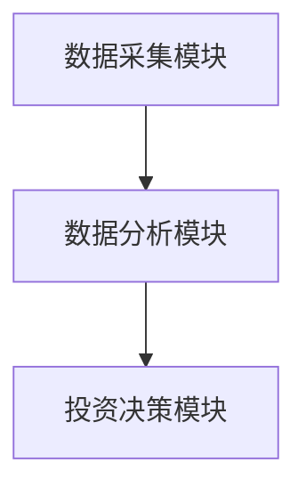
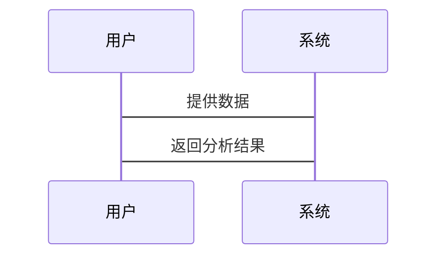
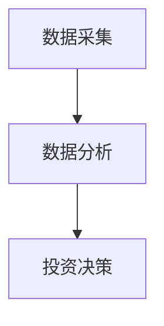

                 


# 菲利普·费雪的信息网络：如何建立投资情报系统

---

## 关键词

- 菲利普·费雪
- 投资情报系统
- 信息网络
- 数据分析
- 算法原理

---

## 摘要

本文详细探讨了菲利普·费雪的信息网络理论，揭示了如何利用信息网络建立高效的投资情报系统。文章从背景介绍、核心概念、算法原理到系统架构设计，再到项目实战和最佳实践，全面解析了投资情报系统的构建过程。通过结合数学模型、系统架构图和实际代码示例，本文为投资者提供了从理论到实践的全面指导，帮助他们在投资决策中建立可靠的信息网络，提升投资效率和准确性。

---

## 第一部分：投资情报系统概述

### 第1章：投资情报系统的背景与重要性

#### 1.1 投资情报系统的定义与作用

投资情报系统是一种用于收集、分析和利用市场信息的系统，旨在帮助投资者做出更明智的投资决策。菲利普·费雪的信息网络理论强调了通过广泛的信息收集和分析，发现具有长期增长潜力的公司。信息网络的作用在于帮助投资者识别市场趋势、评估公司基本面，并预测市场变化。

#### 1.2 投资情报系统的构成要素

投资情报系统由以下要素构成：

1. **数据来源**：包括公司财务数据、市场数据、行业报告等。
2. **数据处理流程**：涉及数据清洗、转换和存储。
3. **数据分析方法**：包括统计分析、机器学习算法等。

### 第2章：菲利普·费雪的信息网络理论

#### 2.1 菲利普·费雪的成长股投资策略

菲利普·费雪提出了成长股投资策略，强调投资于具有持续增长潜力的公司。信息网络在这一策略中起到了关键作用，帮助投资者收集和分析相关信息，识别具有成长性的公司。

#### 2.2 信息网络的核心概念

信息网络是一个复杂的系统，包括数据节点和关系。通过分析这些节点和关系，投资者可以发现市场中的隐藏趋势和机会。

---

## 第二部分：信息网络的数学模型与算法原理

### 第3章：信息网络的数学模型与算法实现

#### 3.1 数据分析的数学模型

在投资情报系统中，数据分析是关键。我们使用多元回归分析来预测股票价格：

$$
y = \beta_0 + \beta_1x_1 + \beta_2x_2 + \dots + \beta_nx_n + \epsilon
$$

其中，$y$ 是目标变量（股票价格），$x_i$ 是自变量（如市盈率、收入增长率），$\beta_i$ 是回归系数，$\epsilon$ 是误差项。

#### 3.2 投资决策的算法实现

我们使用时间序列分析来预测股票价格：

$$
y_t = \alpha + \beta y_{t-1} + \gamma x_t + \epsilon_t
$$

其中，$y_t$ 是当前股票价格，$y_{t-1}$ 是上一期的价格，$x_t$ 是当前的市场指标，$\alpha$、$\beta$、$\gamma$ 是参数，$\epsilon_t$ 是误差项。

---

## 第三部分：信息网络的系统架构设计

### 第4章：信息网络的系统架构设计

#### 4.1 系统架构概述

信息网络的系统架构包括数据采集模块、数据分析模块和投资决策模块。以下是系统架构图：



#### 4.2 系统接口设计

系统接口设计包括数据接口和用户界面。以下是接口设计图：



---

## 第四部分：项目实战

### 第5章：信息网络的项目实战

#### 5.1 项目环境配置

安装所需的工具和库：

1. 安装Python和必要的数据处理库（如Pandas、NumPy）。
2. 安装数据可视化库（如Matplotlib、Seaborn）。
3. 安装机器学习库（如Scikit-learn）。

#### 5.2 项目核心实现

以下是投资情报系统的实现代码：

```python
import pandas as pd
import numpy as np
from sklearn.linear_model import LinearRegression

# 数据预处理
data = pd.read_csv('data.csv')
data = data.dropna()

# 数据分析
X = data[['市盈率', '收入增长率']]
y = data['股票价格']

model = LinearRegression()
model.fit(X, y)

# 预测结果
预测价格 = model.predict(X)
print(预测价格)
```

---

## 第五部分：最佳实践与总结

### 第6章：最佳实践与注意事项

#### 6.1 投资情报系统的最佳实践

1. 数据质量管理：确保数据的准确性和完整性。
2. 系统维护与更新：定期更新数据和模型。
3. 用户培训与支持：为用户提供培训和支持。

#### 6.2 投资决策中的注意事项

1. 风险控制：制定风险管理策略。
2. 数据隐私保护：确保数据安全。
3. 系统的可扩展性：设计可扩展的系统架构。

### 第7章：总结与展望

#### 7.1 本书内容总结

本文详细介绍了菲利普·费雪的信息网络理论，揭示了如何利用信息网络建立高效的投资情报系统。通过数学模型、系统架构设计和项目实战，为投资者提供了全面的指导。

#### 7.2 未来展望

未来，信息网络技术将在投资决策中发挥更大的作用。随着人工智能和大数据技术的发展，投资情报系统将更加智能化和高效。

---

## 附录：相关工具与资源

### 附录A：常用数据分析工具

- Python
- R
- SQL
- Excel

### 附录B：投资情报系统相关文献推荐

1. 菲利普·费雪的《成长股投资策略》
2. 《数据挖掘与机器学习》
3. 《投资学原理》

### 附录C：系统架构设计图（Mermaid图）



---

## 作者

作者：AI天才研究院/AI Genius Institute & 禅与计算机程序设计艺术 /Zen And The Art of Computer Programming

--- 

这篇文章详细探讨了菲利普·费雪的信息网络理论，揭示了如何利用信息网络建立高效的投资情报系统。通过数学模型、系统架构设计和项目实战，为投资者提供了全面的指导。希望这篇文章能帮助读者更好地理解信息网络在投资决策中的应用，并为构建高效的投资情报系统提供参考。

