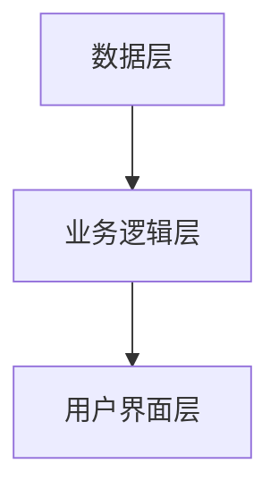

                 


# 菲利普·费雪的成长型股票投资策略

## 关键词：成长型股票、投资策略、菲利普·费雪、投资筛选标准、数学模型、系统架构

## 摘要：菲利普·费雪是成长型投资策略的奠基者，他的策略强调选择那些具备持续增长潜力和竞争优势的企业。本文详细介绍了费雪的成长型投资理念，包括选股标准、长期视角、分散投资、数学模型和系统架构设计。通过实际案例分析，展示了如何将这些策略应用于投资决策，并提供了最佳实践建议。

---

## 第一部分: 菲利普·费雪的成长型股票投资策略概述

### 第1章: 成长型投资的起源与发展

#### 1.1 成长型投资的定义与背景

成长型投资是一种以长期资本增值为目标的投资策略，主要投资于那些具有持续增长潜力的企业。与价值型投资不同，成长型投资更关注企业的未来盈利能力和市场份额的扩展。

菲利普·费雪（Philip Fisher）是成长型投资的鼻祖，他在20世纪30年代提出了成长型投资的理念。费雪认为，投资者应选择那些具有强大竞争优势和良好管理团队的企业，并长期持有这些股票。

#### 1.2 菲利普·费雪的投资理念

费雪的投资理念可以总结为以下几点：
- **长期视角**：投资于具有持续增长潜力的企业，而非短期波动。
- **管理层评估**：重视管理层的诚信、能力和决策能力。
- **竞争优势**：选择那些在市场上具有独特竞争优势的企业。

---

### 第2章: 成长型股票的核心特征

#### 2.1 成长型股票的定义

成长型股票是指那些收入和利润持续增长的企业发行的股票。这些企业通常处于成长期，具有较高的增长潜力。

#### 2.2 成长型企业的特征

成长型企业具有以下特征：
- 高增长的收入和利润。
- 强大的竞争优势，如专利、品牌或技术。
- 良好的管理团队和战略规划。

#### 2.3 成长型股票与价值型股票的对比

| 特征                | 成长型股票                | 价值型股票                |
|---------------------|--------------------------|--------------------------|
| 投资目标            | 长期资本增值            | 低估的市场价格            |
| 估值方法            | 现金流贴现模型            | 市盈率、市净率分析          |
| 风险                | 较高                     | 较低                     |

---

### 第3章: 菲利普·费雪的投资筛选标准

#### 3.1 管理层评估

费雪认为，管理层的质量是企业成功的关键因素。在选择股票时，应关注以下几点：
- 管理层的诚信和责任感。
- 管理层的决策能力和战略规划。
- 管理层的历史业绩。

#### 3.2 竞争优势分析

竞争优势是企业长期增长的核心。在选择股票时，应分析企业的竞争优势，包括：
- 专利和技术优势。
- 市场地位和品牌影响力。
- 成本优势和供应链管理。

#### 3.3 财务指标筛选

费雪认为，财务健康是企业长期增长的基础。以下财务指标是筛选成长型股票的重要依据：
- **营业收入与利润增长**：连续三年以上收入和利润稳步增长。
- **财务健康状况**：低负债率、高净资产收益率。
- **现金流**：健康的现金流是企业增长的保障。

---

### 第4章: 菲利普·费雪的成长型投资策略

#### 4.1 长期投资视角

长期投资是成长型策略的核心。费雪认为，短期市场波动不应影响长期投资决策。投资者应关注企业的长期增长潜力，而非短期市场波动。

#### 4.2 分散投资与风险控制

分散投资是降低风险的有效方法。通过投资于不同行业和不同成长阶段的企业，投资者可以降低单一股票带来的风险。

---

### 第5章: 菲利普·费雪投资策略的数学模型

#### 5.1 成长型股票的估值模型

现金流贴现模型（DCF）是常用的估值方法。公式如下：

$$
\text{内在价值} = \sum_{t=1}^{n} \frac{\text{现金流}}{(1+r)^t} + \frac{\text{残值}}{(1+r)^n}
$$

其中，\( r \) 是折现率，\( n \) 是预测期数。

#### 5.2 股票价格的预测模型

时间序列分析是一种常用的价格预测方法。以下是一个简单的线性回归模型：

$$
\text{未来价格} = a + b \times \text{当前价格}
$$

其中，\( a \) 和 \( b \) 是回归系数。

---

### 第6章: 投资策略的系统架构设计

#### 6.1 投资决策系统的功能设计

- **数据采集模块**：收集企业的财务数据和市场信息。
- **数据分析模块**：应用数学模型进行估值和预测。
- **投资决策模块**：根据分析结果生成投资建议。

#### 6.2 系统架构设计

系统架构采用分层设计，包括数据层、业务逻辑层和用户界面层。以下是架构图：



---

### 第7章: 项目实战与案例分析

#### 7.1 环境安装与配置

- **工具**：Python、NumPy、Pandas、Matplotlib。
- **数据源**：股票历史数据和财务报表。

#### 7.2 核心实现源代码

以下是现金流贴现模型的Python实现：

```python
import numpy as np
import pandas as pd

def calculate_intrinsic_value(cash_flows, discount_rate, residual_value):
    present_value = 0
    for t in range(len(cash_flows)):
        present_value += cash_flows[t] / (1 + discount_rate) ** t
    present_value += residual_value / (1 + discount_rate) ** len(cash_flows)
    return present_value

# 示例数据
cash_flows = [100, 150, 200]
discount_rate = 0.1
residual_value = 500

intrinsic_value = calculate_intrinsic_value(cash_flows, discount_rate, residual_value)
print("内在价值：", intrinsic_value)
```

#### 7.3 案例分析

以科技公司为例，分析其财务数据和市场地位，评估其是否符合成长型股票的标准。

---

## 结论

菲利普·费雪的成长型投资策略强调长期视角和精选个股。通过系统的筛选标准和数学模型，投资者可以更科学地选择成长型股票。然而，投资需谨慎，建议在实际操作中结合市场环境和个人风险承受能力。

---

## 作者：AI天才研究院/AI Genius Institute & 禅与计算机程序设计艺术 /Zen And The Art of Computer Programming

