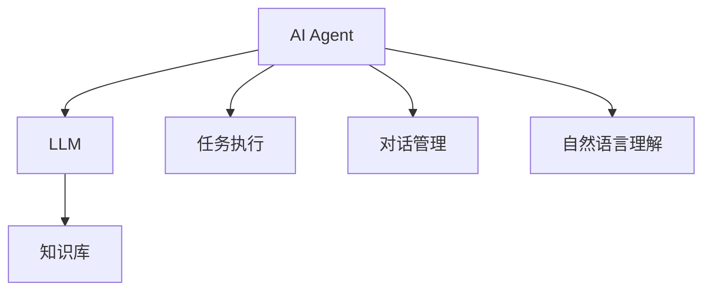
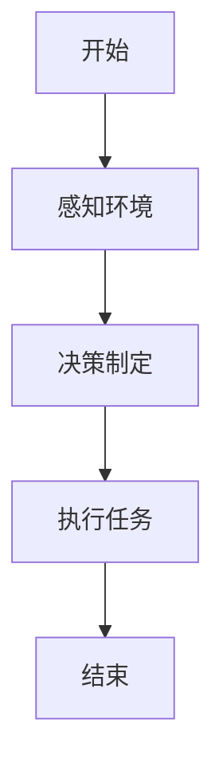
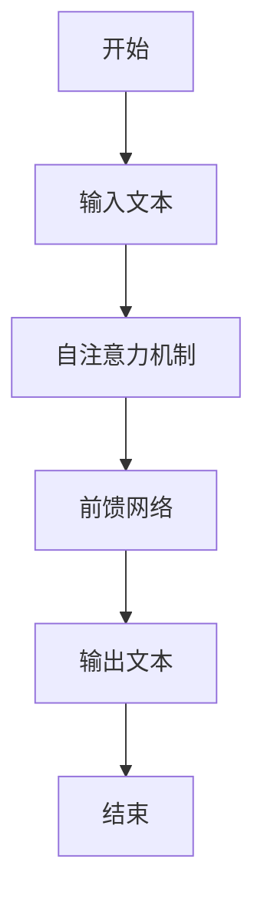
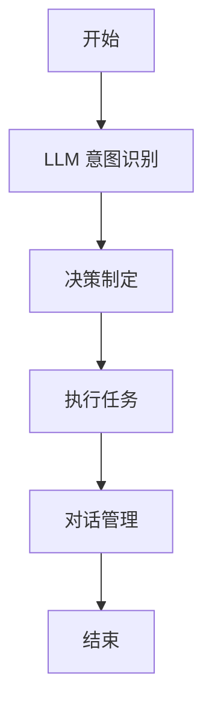
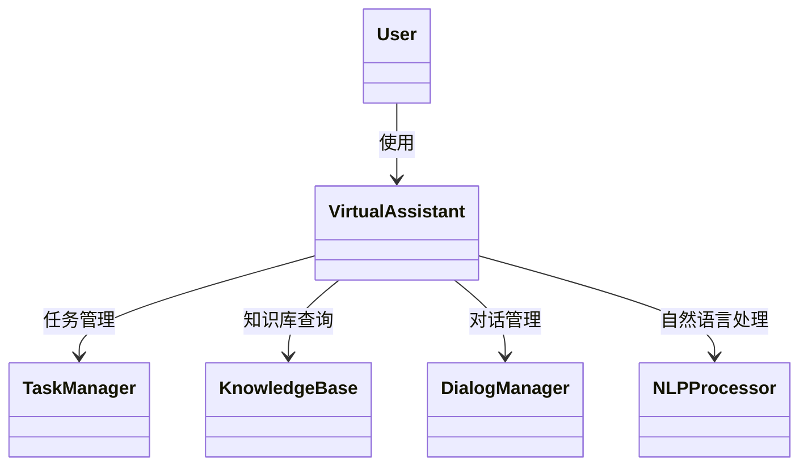
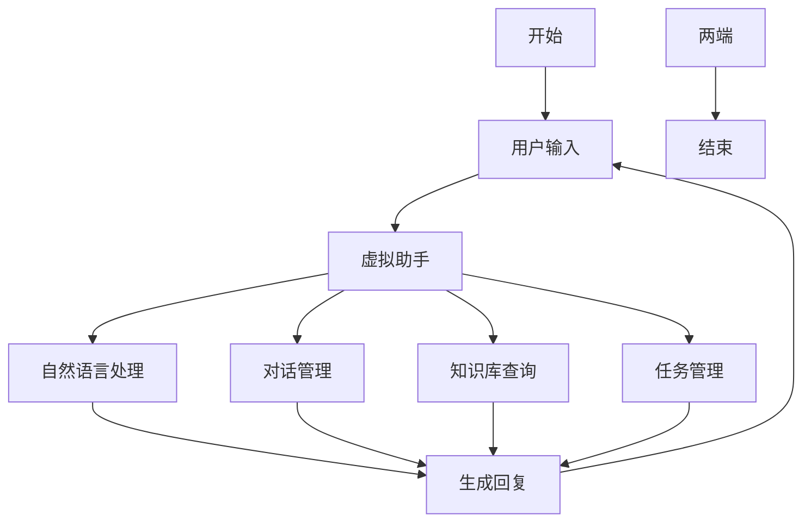
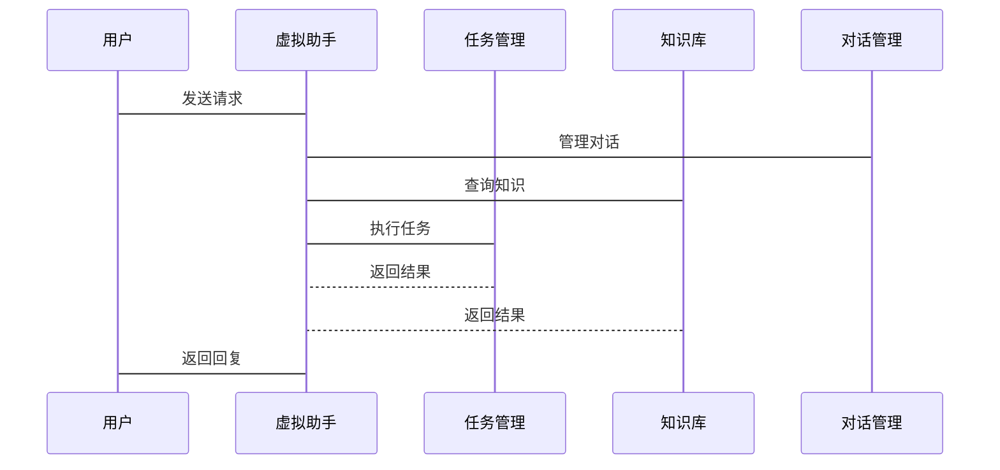

                 


# 虚拟助手 AI Agent：打造基于 LLM 的数字人

---

## 关键词
虚拟助手, AI Agent, 大语言模型, 数字人, 人工智能, 人机交互, 技术实现

---

## 摘要
本文旨在探讨如何基于大语言模型（LLM）打造虚拟助手 AI Agent，构建一个智能化的数字人。文章从虚拟助手的背景介绍、AI Agent 与 LLM 的核心概念、算法原理、系统架构设计、项目实战等方面展开，通过丰富的图表、代码示例和数学公式，深入剖析技术细节。文章最后给出了最佳实践建议和未来展望，帮助读者全面掌握虚拟助手 AI Agent 的设计与实现。

---

## 第一部分: 虚拟助手 AI Agent 的背景与概念

### 第1章: 虚拟助手 AI Agent 的背景介绍

#### 1.1 问题背景与描述

##### 1.1.1 虚拟助手的概念与定义
虚拟助手（Virtual Assistant）是一种基于人工智能技术的交互式工具，能够通过自然语言处理（NLP）技术理解用户意图，并通过执行预设或自定义的任务来提供服务。虚拟助手可以以文本、语音或图形界面的形式与用户交互，帮助用户完成信息查询、任务执行、决策支持等多种功能。

##### 1.1.2 问题背景分析
随着人工智能技术的快速发展，虚拟助手在各个领域的应用越来越广泛。然而，传统的虚拟助手存在以下问题：
- **功能单一**：仅能执行简单的查询任务，无法进行复杂问题的分析和决策。
- **缺乏深度理解**：无法真正理解用户的意图，导致交互体验差。
- **实时性不足**：在处理复杂任务时，响应速度较慢，无法满足用户的实时需求。

##### 1.1.3 虚拟助手的目标与解决方法
虚拟助手的目标是通过结合大语言模型（LLM）技术，提升其理解和执行复杂任务的能力，实现智能化、个性化的服务。解决方法包括：
- 基于 LLM 的自然语言理解（NLU）技术，提升意图识别的准确性。
- 引入强化学习（Reinforcement Learning）等技术，优化任务执行的策略。
- 通过知识图谱（Knowledge Graph）构建，增强虚拟助手的知识储备和推理能力。

#### 1.2 问题的边界与外延

##### 1.2.1 虚拟助手的应用场景
虚拟助手的应用场景包括：
- **智能家居**：控制家电、管理日程等。
- **客服系统**：自动响应用户咨询、处理订单等。
- **教育辅助**：为学生提供学习建议、解答问题等。
- **医疗健康**：提供健康咨询、预约挂号等服务。

##### 1.2.2 虚拟助手的边界
虚拟助手的边界包括：
- **功能范围**：仅限于用户授权的任务范围，不涉及用户的隐私数据。
- **执行能力**：受限于当前技术和数据的支持，无法完成超出设计范围的任务。
- **响应时间**：受网络延迟和计算资源的限制，存在一定的响应时间。

##### 1.2.3 虚拟助手的外延与扩展
虚拟助手的外延包括：
- **多模态交互**：支持文本、语音、图像等多种交互方式。
- **个性化服务**：根据用户的行为习惯，提供个性化的服务。
- **持续学习**：通过反馈机制不断优化自身的性能。

#### 1.3 概念结构与核心要素

##### 1.3.1 虚拟助手的核心要素
虚拟助手的核心要素包括：
- **自然语言理解（NLU）**：理解用户输入的意图。
- **对话管理（DM）**：根据对话历史，生成合适的回复。
- **任务执行（Execution）**：根据用户指令执行任务。
- **知识库（Knowledge Base）**：存储和管理相关知识。

##### 1.3.2 虚拟助手的组成结构
虚拟助手的组成结构包括：
- **前端交互层**：用户与虚拟助手的交互界面。
- **后端逻辑层**：处理用户的请求，执行相关任务。
- **知识库层**：存储和管理虚拟助手的知识库。
- **接口层**：与其他系统或服务进行交互。

##### 1.3.3 虚拟助手的系统架构
虚拟助手的系统架构可以分为：
- **客户端**：用户与虚拟助手的交互界面。
- **服务端**：处理用户的请求，执行相关任务。
- **知识库**：存储和管理相关知识。

#### 1.4 本章小结
本章介绍了虚拟助手的背景、概念、应用场景以及核心要素，为后续章节的分析奠定了基础。

---

### 第2章: AI Agent 与 LLM 的核心概念

#### 2.1 AI Agent 的核心概念

##### 2.1.1 AI Agent 的定义与特点
AI Agent 是一种智能体，能够感知环境、自主决策并执行任务。其特点包括：
- **自主性**：能够在没有外部干预的情况下自主运行。
- **反应性**：能够实时感知环境并做出反应。
- **目标导向性**：具有明确的目标，并能够为实现目标而行动。

##### 2.1.2 AI Agent 的分类与应用场景
AI Agent 的分类包括：
- **简单反射型 Agent**：仅根据当前输入做出反应。
- **基于模型的反射型 Agent**：利用内部模型对环境进行建模，并根据模型进行决策。
- **目标驱动型 Agent**：根据目标进行决策和行动。
- **实用驱动型 Agent**：根据效用函数进行决策。

AI Agent 的应用场景包括：
- **自动驾驶**：通过感知环境，做出驾驶决策。
- **智能助手**：帮助用户完成各种任务。
- **博弈 AI**：在游戏环境中进行决策和行动。

##### 2.1.3 AI Agent 的核心算法与技术
AI Agent 的核心算法与技术包括：
- **自然语言处理（NLP）**：理解用户意图。
- **机器学习（ML）**：通过数据训练模型，提升决策能力。
- **强化学习（Reinforcement Learning）**：通过奖励机制优化决策策略。
- **知识图谱（Knowledge Graph）**：构建和管理知识库。

#### 2.2 LLM 的核心概念

##### 2.2.1 LLM 的定义与特点
大语言模型（Large Language Model，LLM）是一种基于深度学习的自然语言处理模型，具有以下特点：
- **大规模训练数据**：通常使用 billions 级别的数据进行训练。
- **深度网络结构**：通常使用多层的深度神经网络。
- **上下文理解能力**：能够理解文本的上下文关系。

##### 2.2.2 LLM 的主要技术与实现
LLM 的主要技术与实现包括：
- **Transformer 架构**：通过自注意力机制（Self-Attention）捕捉文本中的长距离依赖关系。
- **大规模数据训练**：使用大量的文本数据进行无监督或有监督训练。
- **多任务学习**：同时训练多种任务，提升模型的泛化能力。

##### 2.2.3 LLM 的优势与局限性
LLM 的优势包括：
- **强大的文本生成能力**：能够生成自然流畅的文本。
- **多任务能力**：可以在多种任务上表现出色。
- **可扩展性**：可以通过微调（Fine-tuning）适应不同的任务。

LLM 的局限性包括：
- **计算资源需求高**：训练和推理需要大量的计算资源。
- **数据依赖性**：性能严重依赖训练数据的质量和多样性。
- **伦理和隐私问题**：可能引发数据泄露和滥用问题。

#### 2.3 AI Agent 与 LLM 的关系

##### 2.3.1 AI Agent 的核心算法与 LLM 的结合
AI Agent 的核心算法与 LLM 的结合主要体现在：
- **自然语言理解（NLU）**：利用 LLM 进行意图识别和实体抽取。
- **对话管理（DM）**：利用 LLM 生成回复和管理对话流程。
- **任务执行（Execution）**：通过 LLM 提供的上下文理解，优化任务执行的策略。

##### 2.3.2 LLM 在 AI Agent 中的角色
LLM 在 AI Agent 中的角色可以分为：
- **知识库**：作为 AI Agent 的知识库，存储和管理相关知识。
- **推理引擎**：作为推理引擎，帮助 AI Agent 进行逻辑推理和决策。
- **交互界面**：作为交互界面，实现与用户的自然语言对话。

##### 2.3.3 AI Agent 与 LLM 的能力对比
AI Agent 的能力主要依赖于 LLM 的性能，但 AI Agent 还需要具备任务执行和对话管理的能力，这使得 AI Agent 的能力更加全面。

#### 2.4 本章小结
本章详细介绍了 AI Agent 和 LLM 的核心概念，分析了它们之间的关系和各自的特点，为后续章节的实现奠定了理论基础。

---

### 第3章: 虚拟助手 AI Agent 的核心概念与联系

#### 3.1 核心概念原理

##### 3.1.1 AI Agent 的核心算法原理
AI Agent 的核心算法原理包括：
- **感知环境**：通过传感器或其他输入方式感知环境。
- **决策制定**：基于感知的信息，制定决策策略。
- **执行任务**：根据决策策略执行任务。

##### 3.1.2 LLM 的核心算法原理
LLM 的核心算法原理包括：
- **自注意力机制**：通过自注意力机制捕捉文本中的长距离依赖关系。
- **前馈网络**：通过多层前馈网络生成文本。

##### 3.1.3 AI Agent 与 LLM 的协同工作原理
AI Agent 与 LLM 的协同工作原理包括：
- **意图识别**：通过 LLM 进行意图识别，理解用户的需求。
- **对话管理**：通过对话管理算法，生成合适的回复。
- **任务执行**：根据用户的需求，执行相关任务。

#### 3.2 核心概念属性特征对比

##### 3.2.1 AI Agent 的属性特征
AI Agent 的属性特征包括：
- **自主性**：能够在没有外部干预的情况下自主运行。
- **反应性**：能够实时感知环境并做出反应。
- **目标导向性**：具有明确的目标，并能够为实现目标而行动。

##### 3.2.2 LLM 的属性特征
LLM 的属性特征包括：
- **大规模训练数据**：通常使用 billions 级别的数据进行训练。
- **深度网络结构**：通常使用多层的深度神经网络。
- **上下文理解能力**：能够理解文本的上下文关系。

##### 3.2.3 AI Agent 与 LLM 的属性对比
AI Agent 与 LLM 的属性对比可以通过表格形式展示：

| 属性          | AI Agent                              | LLM                                  |
|---------------|---------------------------------------|---------------------------------------|
| 目标           | 执行任务，实现目标                   | 生成自然语言文本                   |
| 输入           | 多种形式，包括文本、语音、图像       | 文本或文本片段                     |
| 输出           | 动作、决策、回复                     | 文本或文本片段                     |
| 决策方式       | 基于感知和推理                       | 基于训练好的模型生成文本           |
| 依赖性         | 依赖于知识库和推理能力               | 依赖于大规模训练数据和模型结构     |

#### 3.3 ER 实体关系图架构

##### 3.3.1 实体关系图的定义与作用
实体关系图（Entity-Relationship Diagram）用于描述系统中各实体之间的关系，帮助理解系统的结构和功能。

##### 3.3.2 AI Agent 与 LLM 的实体关系图
以下是 AI Agent 与 LLM 的实体关系图：



##### 3.3.3 实体关系图的分析与优化
通过上述实体关系图可以看出，AI Agent 依赖于 LLM 进行自然语言理解和生成，并通过知识库进行推理和决策。这种结构可以进一步优化，例如通过增加反馈机制来提升 AI Agent 的学习能力。

#### 3.4 本章小结
本章通过对比分析 AI Agent 和 LLM 的核心概念，构建了实体关系图，明确了它们之间的关系和协同工作原理。

---

### 第4章: 虚拟助手 AI Agent 的算法原理

#### 4.1 算法原理概述

##### 4.1.1 AI Agent 的核心算法
AI Agent 的核心算法包括：
- **强化学习（Reinforcement Learning）**：通过奖励机制优化决策策略。
- **监督学习（Supervised Learning）**：通过标注数据训练模型，提升任务执行能力。

##### 4.1.2 LLM 的核心算法
LLM 的核心算法包括：
- **Transformer 架构**：通过自注意力机制捕捉文本的长距离依赖关系。
- **多任务学习（Multi-task Learning）**：同时训练多种任务，提升模型的泛化能力。

##### 4.1.3 AI Agent 与 LLM 的协同算法
AI Agent 与 LLM 的协同算法包括：
- **意图识别**：通过 LLM 进行意图识别，理解用户的需求。
- **对话管理**：通过对话管理算法，生成合适的回复。
- **任务执行**：根据用户的需求，执行相关任务。

#### 4.2 算法原理的 Mermaid 流程图

##### 4.2.1 AI Agent 的算法流程图
以下是 AI Agent 的算法流程图：



##### 4.2.2 LLM 的算法流程图
以下是 LLM 的算法流程图：



##### 4.2.3 AI Agent 与 LLM 的协同算法流程图
以下是 AI Agent 与 LLM 的协同算法流程图：



#### 4.3 核心算法的 Python 实现

##### 4.3.1 强化学习算法实现
以下是强化学习算法的简单实现：

```python
class Agent:
    def __init__(self):
        self.state = None
        self.action = None
        self.reward = None

    def perceive(self, state):
        self.state = state

    def decide(self):
        # 假设动作空间为 ['up', 'down', 'left', 'right']
        self.action = 'up'  # 简单示例，实际中需要根据策略选择动作

    def learn(self, reward):
        self.reward = reward
        # 简单示例，实际中需要更新策略

agent = Agent()
agent.perceive('current_state')
agent.decide()
agent.learn(1.0)
```

##### 4.3.2 Transformer 模型实现
以下是 Transformer 模型的简单实现：

```python
import torch
import torch.nn as nn

class Transformer(nn.Module):
    def __init__(self, d_model):
        super(Transformer, self).__init__()
        self.d_model = d_model
        self.self_attention = nn.MultiheadAttention(embed_dim=d_model, num_heads=8)

    def forward(self, x):
        output = self.self_attention(x, x, x)[0]
        return output

model = Transformer(512)
input_tensor = torch.randn(1, 10, 512)
output = model(input_tensor)
print(output.size())
```

##### 4.3.3 对话管理算法实现
以下是对话管理算法的简单实现：

```python
class DialogManager:
    def __init__(self):
        self.dialogue_history = []

    def process_input(self, input_text):
        self.dialogue_history.append(input_text)

    def generate_response(self):
        # 简单示例，实际中需要根据对话历史生成合适的回复
        response = "I understand your request. How can I assist you further?"
        self.dialogue_history.append(response)
        return response

dialog_manager = DialogManager()
dialog_manager.process_input("Hello, how can I help you?")
response = dialog_manager.generate_response()
print(response)
```

#### 4.4 算法原理的数学公式

##### 4.4.1 强化学习算法公式
强化学习的奖励机制可以通过以下公式表示：

$$ R = \sum_{t=1}^{T} r_t $$

其中，\( R \) 是总奖励，\( r_t \) 是第 \( t \) 步的奖励。

##### 4.4.2 Transformer 模型公式
Transformer 模型的自注意力机制可以通过以下公式表示：

$$ \text{Attention}(Q, K, V) = \text{softmax}\left(\frac{QK^T}{\sqrt{d_k}}\right)V $$

其中，\( Q \) 是查询向量，\( K \) 是键向量，\( V \) 是值向量，\( d_k \) 是键的维度。

##### 4.4.3 对话管理算法公式
对话管理的回复生成可以通过以下公式表示：

$$ P(y|x) = \text{softmax}(Wx + b) $$

其中，\( x \) 是输入向量，\( y \) 是输出向量，\( W \) 是权重矩阵，\( b \) 是偏置项。

#### 4.5 算法实现的代码示例
以下是基于上述算法原理的 Python 实现示例：

##### 4.5.1 强化学习算法代码示例
```python
class ReinforcementLearningAgent:
    def __init__(self):
        self.state = None
        self.action = None
        self.reward = None

    def perceive(self, state):
        self.state = state

    def decide(self):
        # 假设动作空间为 ['up', 'down', 'left', 'right']
        self.action = 'up'  # 简单示例，实际中需要根据策略选择动作

    def learn(self, reward):
        self.reward = reward
        # 简单示例，实际中需要更新策略

agent = ReinforcementLearningAgent()
agent.perceive('current_state')
agent.decide()
agent.learn(1.0)
```

##### 4.5.2 Transformer 模型代码示例
```python
import torch
import torch.nn as nn

class Transformer(nn.Module):
    def __init__(self, d_model):
        super(Transformer, self).__init__()
        self.d_model = d_model
        self.self_attention = nn.MultiheadAttention(embed_dim=d_model, num_heads=8)

    def forward(self, x):
        output = self.self_attention(x, x, x)[0]
        return output

model = Transformer(512)
input_tensor = torch.randn(1, 10, 512)
output = model(input_tensor)
print(output.size())
```

##### 4.5.3 对话管理算法代码示例
```python
class DialogManager:
    def __init__(self):
        self.dialogue_history = []

    def process_input(self, input_text):
        self.dialogue_history.append(input_text)

    def generate_response(self):
        # 简单示例，实际中需要根据对话历史生成合适的回复
        response = "I understand your request. How can I assist you further?"
        self.dialogue_history.append(response)
        return response

dialog_manager = DialogManager()
dialog_manager.process_input("Hello, how can I help you?")
response = dialog_manager.generate_response()
print(response)
```

#### 4.6 本章小结
本章详细介绍了 AI Agent 和 LLM 的核心算法原理，并通过代码示例和数学公式深入剖析了其实现细节。

---

### 第5章: 虚拟助手 AI Agent 的系统分析与架构设计

#### 5.1 系统分析

##### 5.1.1 问题场景介绍
虚拟助手 AI Agent 的应用场景包括智能家居、客服系统、教育辅助和医疗健康等。

##### 5.1.2 项目介绍
本项目旨在基于 LLM 技术，构建一个智能化的虚拟助手 AI Agent，实现多模态交互、个性化服务和持续学习。

#### 5.2 系统功能设计

##### 5.2.1 领域模型 mermaid 类图
以下是虚拟助手 AI Agent 的领域模型类图：



##### 5.2.2 系统架构设计 mermaid 架构图
以下是虚拟助手 AI Agent 的系统架构图：



##### 5.2.3 系统接口设计
系统接口设计包括：
- **用户输入接口**：接收用户的输入，包括文本、语音和图像。
- **任务管理接口**：管理任务的执行和状态。
- **知识库接口**：提供知识库的查询和更新功能。
- **对话管理接口**：管理对话流程，生成回复。

##### 5.2.4 系统交互 mermaid 序列图
以下是虚拟助手 AI Agent 的系统交互序列图：



#### 5.3 本章小结
本章通过系统分析和架构设计，明确了虚拟助手 AI Agent 的实现路径和系统结构。

---

### 第6章: 虚拟助手 AI Agent 的项目实战

#### 6.1 环境安装

##### 6.1.1 项目依赖安装
虚拟助手 AI Agent 的项目依赖包括：
- **Python 3.8+**
- **TensorFlow 或 PyTorch**
- **Transformers库（Hugging Face）**
- **Mermaid 图形库**

安装命令：
```bash
pip install python-transformers mermaid4jupyter jupyterlab
```

##### 6.1.2 开发环境配置
开发环境配置包括：
- **Jupyter Notebook**：用于算法实现和测试。
- **IDE（如 VS Code）**：用于代码开发和调试。
- **虚拟环境**：建议使用虚拟环境管理依赖。

##### 6.1.3 项目初始化
项目初始化命令：
```bash
mkdir virtual_assistant_project
cd virtual_assistant_project
pip install -r requirements.txt
```

#### 6.2 核心代码实现

##### 6.2.1 AI Agent 核心代码实现
以下是 AI Agent 的核心代码实现：

```python
class AIAssistant:
    def __init__(self):
        self.llm = LLM()  # 假设 LLM 类已实现
        self.dialog_manager = DialogManager()
        self.task_manager = TaskManager()

    def process_request(self, input_text):
        # 意图识别
        intent = self.llm.intent_recognition(input_text)
        # 对话管理
        response = self.dialog_manager.generate_response(input_text)
        # 任务执行
        self.task_manager.execute_task(intent)
        return response

    def learn(self, feedback):
        # 反馈学习
        self.llm.update_model(feedback)
        self.dialog_manager.update_policy(feedback)

assistant = AIAssistant()
response = assistant.process_request("帮我查找附近的餐馆")
print(response)
```

##### 6.2.2 LLM 核心代码实现
以下是 LLM 的核心代码实现：

```python
class LLM:
    def __init__(self):
        self.model = Transformer(512)  # 假设 Transformer 已实现
        self.tokenizer = AutoTokenizer.from_pretrained('bert-base-uncased')

    def generate_response(self, input_text):
        inputs = self.tokenizer.encode(input_text, return_tensors='pt')
        outputs = self.model(inputs)
        return self.tokenizer.decode(outputs[0].argmax().item(), skip_special_tokens=True)

    def update_model(self, feedback):
        # 简单示例，实际中需要根据反馈更新模型
        pass

llm = LLM()
response = llm.generate_response("帮我写一封邮件")
print(response)
```

##### 6.2.3 对话管理代码实现
以下是对话管理的代码实现：

```python
class DialogManager:
    def __init__(self):
        self.dialogue_history = []

    def process_input(self, input_text):
        self.dialogue_history.append(input_text)

    def generate_response(self, input_text):
        # 简单示例，实际中需要根据对话历史生成合适的回复
        response = "I understand your request. How can I assist you further?"
        self.dialogue_history.append(response)
        return response

dialog_manager = DialogManager()
dialog_manager.process_input("Hello, how can I help you?")
response = dialog_manager.generate_response()
print(response)
```

#### 6.3 案例分析与代码应用

##### 6.3.1 项目案例分析
以智能家居场景为例，用户可以通过虚拟助手 AI Agent 控制家电、管理日程等。

##### 6.3.2 代码应用解读
以下是智能家居场景下的代码应用示例：

```python
assistant = AIAssistant()
response = assistant.process_request("打开客厅的灯")
print(response)  # 示例输出："客厅的灯已打开"
```

#### 6.4 项目总结
本章通过项目实战，详细介绍了虚拟助手 AI Agent 的实现过程，包括环境配置、核心代码实现和案例分析。

---

## 第七章: 虚拟助手 AI Agent 的最佳实践与未来展望

### 7.1 最佳实践

#### 7.1.1 技术实现 tips
- **模型优化**：通过剪枝（Pruning）和蒸馏（Distillation）等技术优化模型性能。
- **数据隐私**：确保用户数据的安全和隐私，避免数据泄露。
- **多模态交互**：支持多种交互方式，提升用户体验。

#### 7.1.2 系统设计 tips
- **模块化设计**：将系统划分为多个模块，便于维护和扩展。
- **容错设计**：设计容错机制，提升系统的健壮性。
- **日志记录**：记录系统的运行日志，便于调试和优化。

#### 7.1.3 项目管理 tips
- **版本控制**：使用 Git 进行版本控制，便于团队协作。
- **持续集成**：通过 CI/CD 工具实现持续集成和部署。
- **用户反馈**：收集用户反馈，不断优化系统。

### 7.2 本章小结
本章总结了虚拟助手 AI Agent 的最佳实践，为读者提供了实用的建议。

### 7.3 未来展望
随着人工智能技术的不断发展，虚拟助手 AI Agent 的功能和性能将不断提升。未来，虚拟助手将更加智能化、个性化和多样化，为人类带来更便捷的服务和更高效的体验。

---

## 结语

虚拟助手 AI Agent 的实现基于大语言模型（LLM）技术，结合了自然语言处理、强化学习和知识图谱等多种技术，通过系统的分析和设计，可以构建出智能化的数字人。本文从背景介绍、核心概念、算法原理、系统设计到项目实战，详细探讨了虚拟助手 AI Agent 的实现过程，为读者提供了全面的技术指导。

---

## 作者

**作者：AI天才研究院/AI Genius Institute & 禅与计算机程序设计艺术/Zen And The Art of Computer Programming**

