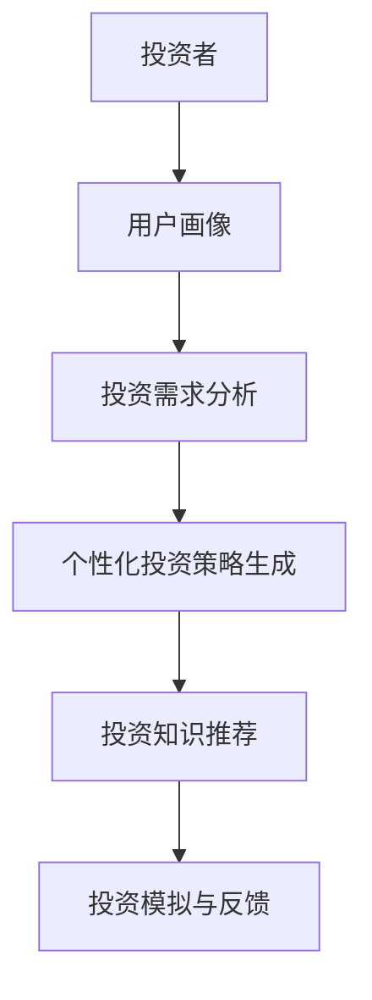

                 


# 融合AI技术的新一代投资理财教育平台

## 关键词：AI技术、投资理财、教育平台、协同过滤、自然语言处理、系统架构

## 摘要：本文探讨了如何利用AI技术构建新一代投资理财教育平台，详细分析了平台的核心功能、算法原理、系统架构，并通过案例展示了实际应用场景。

---

# 第一部分: 融合AI技术的新一代投资理财教育平台背景介绍

## 第1章: 融合AI技术的投资理财教育平台概述

### 1.1 投资理财教育的现状与挑战

#### 1.1.1 当前投资理财教育的主要问题
传统投资理财教育依赖于固定课程和经验分享，难以满足个性化需求，学习效果有限。

#### 1.1.2 传统投资理财教育的局限性
- 知识更新慢，难以适应市场变化。
- 缺乏个性化指导，用户学习效率低。
- 互动性不足，用户参与度低。

#### 1.1.3 用户需求与市场痛点分析
用户需要个性化的学习路径和实时指导，市场缺乏高效的投资理财教育工具。

### 1.2 AI技术在投资理财领域的应用前景

#### 1.2.1 AI技术的基本概念与优势
AI通过数据处理和模式识别，提供个性化服务和自动化决策支持。

#### 1.2.2 AI在投资理财中的潜在应用场景
- 个性化投资建议
- 风险评估与管理
- 市场趋势预测

#### 1.2.3 融合AI技术的投资理财教育平台的必要性
通过AI实现个性化学习路径，提升教育效果和用户体验。

### 1.3 融合AI技术的新一代投资理财教育平台的定义

#### 1.3.1 平台的核心目标
提供个性化投资教育，帮助用户制定科学的投资策略。

#### 1.3.2 平台的主要功能与服务
- 个性化学习路径
- AI驱动的投资建议
- 实时市场分析

#### 1.3.3 平台的用户群体与市场定位
主要面向个人投资者和教育机构，提供专业化的投资理财教育服务。

### 1.4 本章小结
介绍了投资理财教育的现状和挑战，分析了AI技术的应用潜力，定义了新一代平台的核心目标和功能。

---

# 第二部分: 融合AI技术的投资理财教育平台核心概念与联系

## 第2章: 平台的核心概念与系统架构

### 2.1 核心概念与原理

#### 2.1.1 AI技术在投资理财教育中的核心应用
AI通过数据分析和机器学习，提供个性化投资建议和学习路径。

#### 2.1.2 平台的用户画像与需求分析
分析用户的投资目标、风险承受能力和知识水平，构建用户画像。

#### 2.1.3 平台的功能模块与交互流程
- 用户注册与登录
- 个性化学习路径生成
- 投资策略推荐

### 2.2 系统架构的ER实体关系图

```mermaid
er
    actor 投资者
    actor 教育机构
    actor 金融机构
    actor 内容创作者
    actor 系统管理员
    database 用户信息表
    database 投资知识库
    database 投资策略库
    database 用户行为数据
    database 系统日志
    relationship 用户信息表 -- 投资知识库
    relationship 用户信息表 -- 投资策略库
    relationship 用户行为数据 -- 系统日志
    relationship 教育机构 -- 内容创作者
    relationship 金融机构 -- 内容创作者
    relationship 投资者 -- 用户信息表
```

### 2.3 平台的核心算法与流程



### 2.4 核心概念对比分析

#### 2.4.1 A

---

通过以上结构，我们可以系统地分析和构建新一代投资理财教育平台。每个部分都详细阐述了核心概念、系统架构和实现方法，为读者提供了全面的技术视角。接下来，我们将深入探讨平台的核心算法和系统设计，进一步完善其技术细节。

