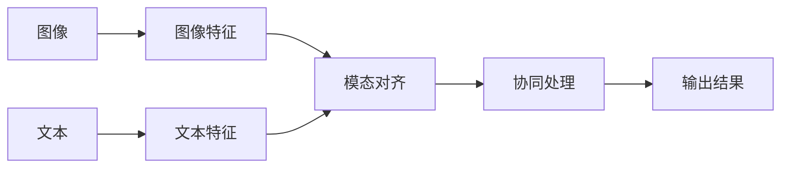
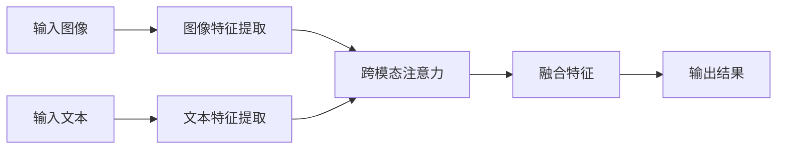
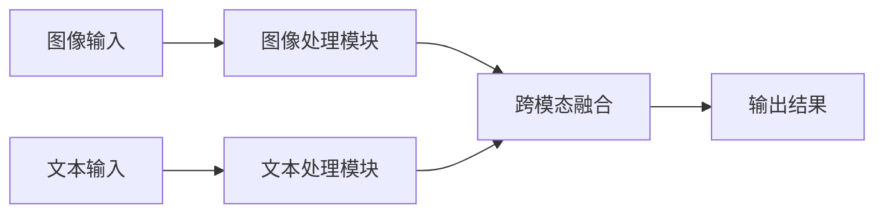
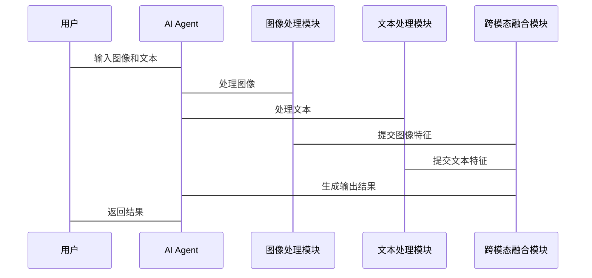

                 


# 视觉-语言协同AI Agent：LLM与计算机视觉的深度融合

## 关键词
视觉-语言协同, AI Agent, 大语言模型, 计算机视觉, 多模态融合, 跨模态注意力机制

## 摘要
视觉-语言协同AI Agent是人工智能领域的一项创新技术，它结合了大语言模型（LLM）和计算机视觉（CV）的核心能力，实现了跨模态数据的深度融合。本文将深入探讨视觉-语言协同AI Agent的核心概念、算法原理、系统架构以及实际应用，旨在为读者提供一个全面的理解和实践指南。通过分析多模态模型的协同机制、算法流程以及系统设计，本文将揭示视觉-语言协同技术在人工智能领域的无限潜力。

---

## 第一章：视觉-语言协同AI Agent的背景与概述

### 1.1 AI Agent的发展与现状
AI Agent（智能体）是指能够感知环境、自主决策并执行任务的智能系统。随着人工智能技术的快速发展，AI Agent已经从简单的规则驱动系统发展为复杂的多模态协同系统。

#### 1.1.1 AI Agent的基本概念与分类
- **定义**：AI Agent是一种能够感知环境、执行任务并做出决策的智能实体。
- **分类**：
  - **简单反射型**：基于预定义规则执行任务。
  - **基于模型型**：利用环境模型进行决策。
  - **实用基于效用型**：通过效用函数优化决策。
  - **学习型**：通过机器学习技术提升智能性。

#### 1.1.2 大语言模型（LLM）的崛起
大语言模型（如GPT、BERT）的出现，使得AI Agent具备了强大的自然语言处理能力。LLM能够理解和生成人类语言，极大地提升了AI Agent的交互能力。

#### 1.1.3 计算机视觉技术的进展
计算机视觉技术（如CNN、Transformer）的进步，使得AI Agent能够处理和理解视觉信息，如图像和视频。这些技术为AI Agent提供了丰富的感知能力。

### 1.2 视觉-语言协同的必要性
视觉-语言协同AI Agent能够同时处理视觉和语言信息，具有以下优势：

#### 1.2.1 多模态交互的需求
- 在实际应用场景中，用户往往需要通过语言和视觉两种方式与AI交互。例如，用户可以通过描述图像内容与AI进行交互。

#### 1.2.2 LLM与计算机视觉的结合优势
- **互补性**：LLM擅长处理语言信息，而计算机视觉擅长处理视觉信息。两者的结合能够实现跨模态的理解和交互。
- **协同性**：通过协同学习，AI Agent能够更准确地理解和生成多模态信息。

#### 1.2.3 当前应用场景与未来趋势
- **当前应用**：图像描述生成、视觉问答系统、智能客服等。
- **未来趋势**：视觉-语言协同技术将进一步融入元宇宙、自动驾驶等领域，推动AI Agent的智能化和场景化。

### 1.3 本书的核心目标与结构
- **核心目标**：全面解析视觉-语言协同AI Agent的核心概念、算法原理和系统设计，提供实践指导。
- **结构安排**：从背景介绍到核心概念，从算法原理到系统设计，再到项目实战，层层深入，系统化地讲解技术细节。
- **阅读建议**：建议读者具备基本的机器学习和计算机视觉知识，以便更好地理解后续内容。

---

## 第二章：视觉-语言协同的核心概念与联系

### 2.1 多模态模型的基本原理
多模态模型是指能够处理和融合多种数据类型（如图像、文本、语音等）的模型。

#### 2.1.1 多模态数据的定义与特点
- **定义**：多模态数据是指包含多种类型信息的数据，如图像和文本。
- **特点**：
  - **互补性**：不同模态的数据可以相互补充，提升理解能力。
  - **异构性**：不同模态的数据具有不同的特征和结构。

#### 2.1.2 多模态模型的分类与对比
| 类型          | 特点                                      | 适用场景                     |
|---------------|-------------------------------------------|------------------------------|
| 跨模态检索     | 基于多模态数据进行检索                    | 图像-文本检索                 |
| 跨模态生成     | 基于多模态数据生成新的数据               | 图像描述生成                 |
| 跨模态分类     | 基于多模态数据进行分类                    | 多模态情感分类               |

#### 2.1.3 跨模态模型的关键技术
- **特征提取**：从不同模态中提取有意义的特征。
- **模态对齐**：将不同模态的特征对齐，以便协同处理。
- **注意力机制**：通过注意力机制实现模态间的关联和聚焦。

### 2.2 LLM与计算机视觉的结合
视觉-语言协同AI Agent的核心在于LLM与计算机视觉的结合。

#### 2.2.1 LLM在视觉任务中的应用
- **图像描述生成**：利用LLM生成图像的描述性文本。
- **视觉问答系统**：通过LLM回答与图像相关的问题。

#### 2.2.2 计算机视觉在语言任务中的应用
- **图像辅助文本理解**：利用计算机视觉技术辅助LLM理解文本内容。
- **视觉-语言联合推理**：结合视觉和语言信息进行推理和决策。

#### 2.2.3 两者的协同机制
- **双向交互**：LLM和计算机视觉模型通过双向交互实现信息的协同处理。
- **聯合学习**：通过联合学习优化模型的性能。

### 2.3 视觉-语言协同的实体关系图


---

## 第三章：视觉-语言协同AI Agent的算法原理

### 3.1 多模态模型的算法流程
多模态模型的算法流程包括数据预处理、特征提取和融合策略。

#### 3.1.1 多模态数据的输入与处理
- **数据预处理**：对图像和文本进行标准化处理。
- **数据融合**：将图像和文本数据进行融合，形成统一的输入。

#### 3.1.2 多模态特征的提取与融合
- **视觉特征提取**：使用CNN提取图像特征。
- **语言特征提取**：使用Transformer提取文本特征。
- **跨模态注意力机制**：通过注意力机制实现模态间的关联。

#### 3.1.3 协同学习的算法流程


### 3.2 跨模态注意力机制的数学模型
跨模态注意力机制是视觉-语言协同的核心算法之一。

#### 3.2.1 注意力机制的公式
$$
\text{Attention}(Q, K, V) = \text{softmax}\left(\frac{QK^T}{\sqrt{d_k}}\right)V
$$

其中，\( Q \) 是查询向量，\( K \) 是键向量，\( V \) 是值向量，\( d_k \) 是向量的维度。

#### 3.2.2 跨模态注意力机制的应用
- **图像描述生成**：通过注意力机制定位图像中的关键区域。
- **视觉问答系统**：通过注意力机制关注与问题相关的图像区域。

### 3.3 系统优化与训练策略
#### 3.3.1 系统优化
- **模型压缩**：通过剪枝和量化技术优化模型的大小。
- **分布式训练**：利用分布式计算加速模型训练。

#### 3.3.2 训练策略
- **对比学习**：通过对比损失函数优化模型的性能。
- **多任务学习**：同时训练多个任务以提升模型的泛化能力。

---

## 第四章：视觉-语言协同AI Agent的系统分析与架构设计

### 4.1 系统功能设计
视觉-语言协同AI Agent的功能模块包括图像处理、文本处理和协同交互。

#### 4.1.1 图像处理模块
- **图像输入**：接收图像数据。
- **图像特征提取**：提取图像的特征向量。

#### 4.1.2 文本处理模块
- **文本输入**：接收文本数据。
- **文本特征提取**：提取文本的特征向量。

#### 4.1.3 协同交互模块
- **跨模态融合**：将图像和文本特征融合。
- **协同处理**：生成最终的输出结果。

### 4.2 系统架构设计
#### 4.2.1 系统架构图


#### 4.2.2 接口设计
- **API接口**：提供图像和文本输入接口。
- **结果输出接口**：输出协同处理的结果。

#### 4.2.3 交互流程图


---

## 第五章：视觉-语言协同AI Agent的项目实战

### 5.1 环境安装
#### 5.1.1 安装Python
- 下载并安装Python 3.8或更高版本。

#### 5.1.2 安装依赖库
```bash
pip install numpy
pip install tensorflow
pip install matplotlib
pip install transformers
```

### 5.2 核心代码实现
#### 5.2.1 数据预处理
```python
import numpy as np
import tensorflow as tf
from tensorflow.keras import layers

def preprocess_image(image):
    # 图像预处理代码
    return preprocessed_image

def preprocess_text(text):
    # 文本预处理代码
    return preprocessed_text
```

#### 5.2.2 模型构建
```python
def build_model():
    # 视觉特征提取模块
    image_input = layers.Input(shape=(224, 224, 3))
    image_features = layers.Conv2D(64, (3, 3), activation='relu')(image_input)
    
    # 文本特征提取模块
    text_input = layers.Input(shape=(128,))
    text_features = layers.Dense(64, activation='relu')(text_input)
    
    # 跨模态注意力机制
    attention = layers.Attention()([image_features, text_features])
    
    # 融合与输出
    merged_features = layers.Concatenate()([image_features, attention])
    output = layers.Dense(10, activation='softmax')(merged_features)
    
    model = tf.keras.Model(inputs=[image_input, text_input], outputs=output)
    return model
```

#### 5.2.3 训练与推理
```python
model = build_model()
model.compile(optimizer='adam', loss='categorical_crossentropy', metrics=['accuracy'])
model.fit([image_data, text_data], labels, epochs=10, batch_size=32)
```

### 5.3 案例分析与小结
#### 5.3.1 案例分析
- **图像描述生成**：输入一张图像，生成描述性文本。
- **视觉问答系统**：输入图像和问题，生成回答。

#### 5.3.2 项目小结
- **核心代码实现**：详细解读了模型构建和训练的代码。
- **实际案例分析**：通过具体案例展示了视觉-语言协同技术的应用。
- **注意事项**：在实际应用中需要注意数据质量、模型优化和系统安全。

---

## 第六章：总结与展望

### 6.1 本章总结
- **核心内容回顾**：总结了视觉-语言协同AI Agent的核心概念、算法原理和系统设计。
- **技术优势**：强调了视觉-语言协同技术在多模态交互中的优势。

### 6.2 未来展望
- **技术发展趋势**：视觉-语言协同技术将进一步融入元宇宙、自动驾驶等领域。
- **潜在挑战**：需要解决数据异构性、模型可解释性等问题。

### 6.3 最佳实践 tips
- **数据处理**：确保数据的多样性和高质量。
- **模型优化**：通过模型压缩和分布式训练提升性能。
- **系统安全**：加强系统安全性，防止攻击和滥用。

---

## 附录：相关资源与工具

### 附录A：推荐论文
1. ["Vision-language Pre-trained Models: Survey, Insights, and Opportunities" by Yinfei Yang等](https://arxiv.org/abs/2011.14094)
2. ["Multimodal Transformer for Visual-Textual Reasoning" by Yiheng Liu等](https://arxiv.org/abs/2103.00785)

### 附录B：工具与库
1. **Hugging Face**：提供丰富的多模态模型和工具。
2. **TensorFlow**：用于模型构建和训练。
3. **PyTorch**：另一种流行的深度学习框架。

---

## 作者：AI天才研究院/AI Genius Institute & 禅与计算机程序设计艺术/Zen And The Art of Computer Programming

---

通过以上详细的内容，我们可以看到视觉-语言协同AI Agent是一个充满潜力的领域。结合大语言模型和计算机视觉技术，AI Agent能够实现多模态数据的深度融合，为人工智能技术的发展注入新的活力。希望本文能够为读者提供有价值的技术指导和实践参考。

