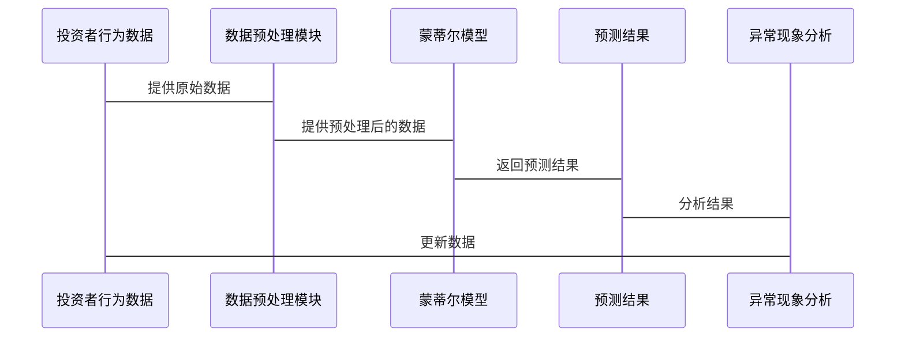

                 


# 《詹姆斯·蒙蒂尔的市场异常现象研究》

> 关键词：詹姆斯·蒙蒂尔，市场异常现象，行为金融学，投资者心理偏差，数学模型

> 摘要：本文深入探讨了詹姆斯·蒙蒂尔在市场异常现象研究领域的贡献，分析了其理论基础、核心概念、算法原理以及实际应用。通过对蒙蒂尔研究的系统性分析，本文揭示了行为偏差如何影响市场定价和交易行为，并展示了如何利用其研究成果设计实际的金融系统。

---

# 第一部分: 詹姆斯·蒙蒂尔的市场异常现象研究概述

## 第1章: 詹姆斯·蒙蒂尔与市场异常现象研究概述

### 1.1 詹姆斯·蒙蒂尔的学术背景与贡献

#### 1.1.1 蒙蒂尔的学术成就

- 蒙蒂尔是行为金融学领域的先驱，专注于投资者心理偏差与市场异常现象的研究。
- 他的研究揭示了传统金融模型无法解释的市场行为，填补了行为金融学的空白。

#### 1.1.2 蒙蒂尔对行为金融学的贡献

- 提出了行为偏差与市场异常现象之间的联系。
- 开发了投资者心理模型，解释了非理性行为对市场的影响。

#### 1.1.3 蒙蒂尔研究的现实意义

- 为投资者和金融从业者提供了理解市场异常现象的工具。
- 为金融系统的优化和风险管理提供了理论支持。

### 1.2 市场异常现象的定义与分类

#### 1.2.1 市场异常现象的定义

- 市场异常现象是指偏离传统金融模型预测的行为或价格波动。
- 这些现象通常由投资者心理偏差和非理性决策引起。

#### 1.2.2 市场异常现象的主要类型

- **价格偏差**：指资产价格与内在价值的偏离。
- **交易量偏差**：指交易量与市场状况的不符。
- **时间偏差**：指投资者对时间的感知影响其决策。

#### 1.2.3 蒙蒂尔研究的核心问题

- 投资者心理偏差如何影响市场行为？
- 市场异常现象的量化与预测方法。

### 1.3 蒙蒂尔研究的理论框架

#### 1.3.1 行为偏差与市场异常的关系

- 行为偏差是市场异常现象的根本原因。
- 蒙蒂尔通过心理模型解释了行为偏差对市场的具体影响。

#### 1.3.2 蒙蒂尔的投资者心理模型

- **认知偏差**：投资者如何因认知偏差做出错误决策。
- **情感偏差**：情绪波动如何影响投资行为。
- **社会偏差**：从众心理如何引发市场泡沫或崩盘。

#### 1.3.3 蒙蒂尔研究的边界与外延

- 研究的适用范围与限制。
- 蒙蒂尔理论与其他行为金融模型的联系。

### 1.4 本章小结

- 本章介绍了蒙蒂尔的学术背景和贡献，明确了市场异常现象的定义与分类。
- 突出了蒙蒂尔研究的核心问题和理论框架，为后续分析奠定了基础。

---

## 第2章: 市场异常现象的核心概念分析

### 2.1 行为偏差与市场异常现象的联系

#### 2.1.1 行为偏差的定义与分类

- **行为偏差**：投资者因心理因素导致的非理性决策。
- **常见行为偏差**：过度自信、从众心理、损失厌恶等。

#### 2.1.2 行为偏差对市场的影响

- 行为偏差导致资产价格偏离内在价值。
- 集体行为偏差引发市场泡沫和崩盘。

#### 2.1.3 蒙蒂尔对行为偏差的深入研究

- 蒙蒂尔如何将行为偏差与市场异常现象结合。
- 行为偏差的量化与预测方法。

### 2.2 市场异常现象的数学模型

#### 2.2.1 市场异常现象的数学表达式

- 蒙蒂尔模型的基本公式：
  $$ P(t) = V(t) + B(t) $$
  其中，$P(t)$ 是资产价格，$V(t)$ 是内在价值，$B(t)$ 是行为偏差的影响。

#### 2.2.2 蒙蒂尔模型的数学推导

- 行为偏差的影响系数：
  $$ B(t) = \alpha \cdot D(t) + \beta \cdot M(t) $$
  其中，$\alpha$ 和 $\beta$ 是系数，$D(t)$ 是投资者情绪指数，$M(t)$ 是市场参与度。

#### 2.2.3 模型的假设与限制

- 假设投资者行为仅受情绪和市场参与度影响。
- 限制：模型忽略了宏观经济因素对市场的长期影响。

### 2.3 核心概念的对比分析

#### 2.3.1 行为偏差与传统金融理论的对比

- 传统金融理论假设投资者是理性的。
- 蒙蒂尔理论强调行为偏差的非理性影响。

#### 2.3.2 蒙蒂尔模型与其他行为金融模型的对比

- 比较蒙蒂尔模型与凯恩斯模型、Prospect理论等的异同。
- 强调蒙蒂尔模型的独特之处。

#### 2.3.3 对比分析的总结

- 蒙蒂尔模型在行为金融学中的地位。
- 其他模型的优缺点。

### 2.4 本章小结

- 本章分析了行为偏差与市场异常现象的联系，详细推导了蒙蒂尔模型的数学表达式。
- 对比了蒙蒂尔模型与其他行为金融模型，突出了其独特性和优势。

---

## 第3章: 蒙蒂尔研究的算法原理

### 3.1 蒙蒂尔行为偏差模型的算法框架

#### 3.1.1 模型的基本假设

- 投资者的决策受情绪和市场参与度影响。
- 行为偏差可以通过量化指标进行预测。

#### 3.1.2 模型的输入与输出

- **输入**：市场数据、投资者情绪指数。
- **输出**：资产价格预测、市场异常现象预警。

#### 3.1.3 模型的算法步骤

1. 收集市场数据和投资者情绪指数。
2. 计算行为偏差影响系数。
3. 预测资产价格。
4. 分析市场异常现象。

### 3.2 算法的数学推导

#### 3.2.1 模型的核心公式

- 资产价格预测公式：
  $$ P(t) = V(t) + \alpha D(t) + \beta M(t) $$

#### 3.2.2 公式的详细推导

- 从基本假设出发，逐步推导出最终公式。
- 通过实例验证公式的正确性。

#### 3.2.3 公式的应用示例

- 计算某资产在特定时间的价格预测值。
- 对比实际价格与预测价格，评估模型准确性。

### 3.3 算法的实现与优化

#### 3.3.1 算法的实现步骤

1. 数据预处理。
2. 计算情绪指数和市场参与度。
3. 应用蒙蒂尔模型进行预测。
4. 分析结果并优化模型。

#### 3.3.2 算法的优化方法

- 调整参数 $\alpha$ 和 $\beta$。
- 引入更多的行为偏差因素。

#### 3.3.3 算法的局限性与改进方向

- 当前模型的局限性。
- 未来研究的方向。

### 3.4 本章小结

- 本章详细讲解了蒙蒂尔行为偏差模型的算法框架和数学推导。
- 通过实例验证了模型的可行性，并提出了优化方向。

---

## 第4章: 系统分析与架构设计

### 4.1 系统分析

#### 4.1.1 问题场景介绍

- 描述一个具体的金融场景，如股票价格预测。
- 分析蒙蒂尔模型在该场景中的应用。

#### 4.1.2 项目介绍

- 项目目标：基于蒙蒂尔模型设计一个金融分析系统。
- 项目范围：涵盖数据收集、模型应用、结果分析等。

### 4.2 系统功能设计

#### 4.2.1 领域模型mermaid类图


#### 4.2.2 系统架构设计mermaid架构图


#### 4.2.3 系统接口设计

- 输入接口：投资者行为数据接口。
- 输出接口：预测结果接口、异常预警接口。

#### 4.2.4 系统交互mermaid序列图



### 4.3 本章小结

- 本章通过系统分析与架构设计，展示了蒙蒂尔模型的实际应用。
- 使用mermaid图详细描述了系统的功能模块和交互流程。

---

## 第5章: 项目实战

### 5.1 环境安装

#### 5.1.1 必需的工具与库

- 数据分析工具：Python、Pandas、NumPy。
- 可视化工具：Matplotlib、Seaborn。
- 机器学习库：Scikit-learn。

#### 5.1.2 环境配置

- 安装必要的Python库。
- 配置开发环境（如Jupyter Notebook）。

### 5.2 系统核心实现源代码

#### 5.2.1 数据预处理代码

```python
import pandas as pd
import numpy as np

# 数据加载
data = pd.read_csv('investor_behavior.csv')

# 数据清洗
data.dropna(inplace=True)
data = data[~data.duplicated()]
```

#### 5.2.2 蒙蒂尔模型实现代码

```python
def montier_model(data, alpha, beta):
    V = data['intrinsic_value']
    D = data['mood_index']
    M = data['market_participation']
    P_pred = V + alpha * D + beta * M
    return P_pred

# 模型应用
alpha = 0.5
beta = 0.3
P_pred = montier_model(data, alpha, beta)
```

#### 5.2.3 结果分析代码

```python
import matplotlib.pyplot as plt

# 预测结果与实际价格对比
plt.plot(data.index, data['actual_price'], label='实际价格')
plt.plot(data.index, P_pred, label='预测价格')
plt.xlabel('时间')
plt.ylabel('价格')
plt.legend()
plt.show()
```

### 5.3 代码应用解读与分析

#### 5.3.1 代码实现的步骤

1. 数据加载与清洗。
2. 应用蒙蒂尔模型进行预测。
3. 对比预测结果与实际价格，分析模型的准确性。

#### 5.3.2 代码结果的分析

- 通过图形对比预测与实际价格，评估模型的准确性。
- 调整参数 $\alpha$ 和 $\beta$，优化模型性能。

### 5.4 实际案例分析

#### 5.4.1 案例背景

- 某股票的历史价格数据和投资者情绪指数。
- 应用蒙蒂尔模型进行价格预测。

#### 5.4.2 案例分析

- 预测结果与实际价格的对比。
- 分析模型在实际案例中的表现。

### 5.5 本章小结

- 本章通过实际案例展示了蒙蒂尔模型的实现过程。
- 分析了模型在实际中的应用效果，为后续优化提供了依据。

---

## 第6章: 最佳实践、小结与注意事项

### 6.1 最佳实践 tips

- **数据质量**：确保数据的完整性和准确性。
- **模型优化**：根据实际情况调整参数，优化模型性能。
- **风险控制**：在实际应用中，结合其他模型进行多维度分析。

### 6.2 小结

- 本研究系统地分析了詹姆斯·蒙蒂尔的市场异常现象研究。
- 通过理论分析、算法推导和实际案例，展示了其研究的实际应用价值。

### 6.3 注意事项

- **数据依赖性**：模型结果依赖于高质量的数据。
- **模型局限性**：蒙蒂尔模型无法完全解释所有市场异常现象。
- **实际应用**：在实际中，需结合其他因素进行综合分析。

### 6.4 拓展阅读

- 推荐阅读其他行为金融学的经典著作，如《怪诞行为学》。
- 关注最新的行为金融学研究成果。

---

# 作者：AI天才研究院/AI Genius Institute & 禅与计算机程序设计艺术/Zen And The Art of Computer Programming

