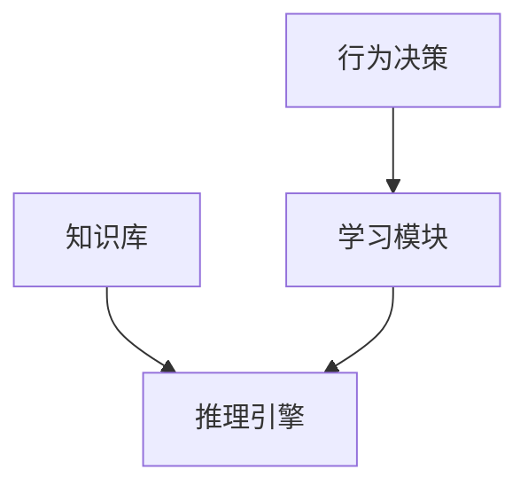
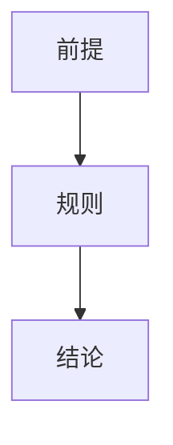
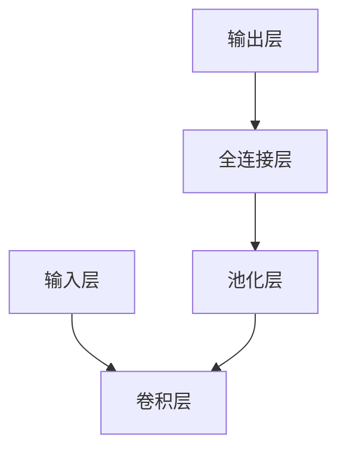
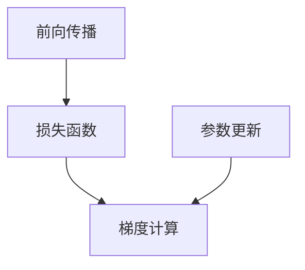
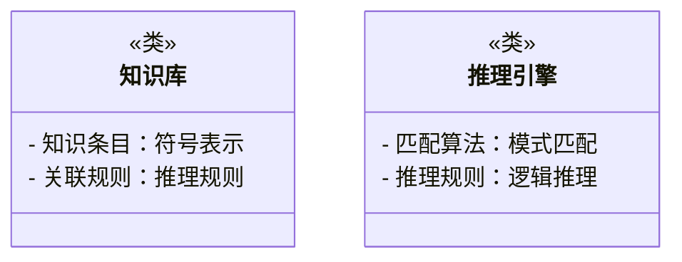
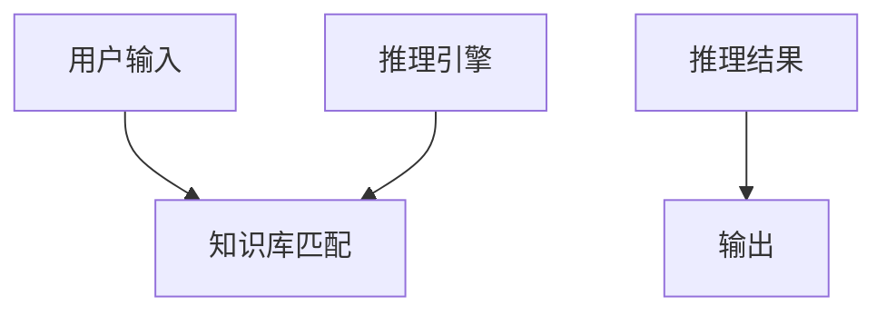
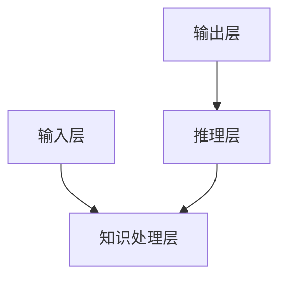

                 


# 认知架构：模拟人类思维的AI Agent设计

> **关键词**：认知架构、AI Agent、人工智能、符号逻辑、神经网络、系统架构设计  
>
> **摘要**：认知架构是模拟人类思维的核心技术，通过分析认知架构的定义、原理、算法和系统设计，结合实际项目案例，深入探讨如何构建具备人类思维能力的AI Agent。

---

## 第一部分: 认知架构与AI Agent概述

### 第1章: 认知架构的定义与背景

#### 1.1 认知架构的核心概念
##### 1.1.1 问题背景与问题描述
认知架构（Cognitive Architecture）是人工智能领域的重要研究方向，旨在模拟人类的思维过程和行为模式。它通过整合知识表示、推理、学习和交互等核心要素，构建能够理解和解决复杂问题的AI系统。认知架构的应用广泛，从智能助手到自动驾驶，都离不开其支撑。

##### 1.1.2 问题解决的基本思路
认知架构的设计需要解决以下几个核心问题：
1. **知识表示**：如何将人类的常识、经验等知识转化为计算机可处理的形式。
2. **推理机制**：如何基于知识进行逻辑推理，得出合理的结论。
3. **学习能力**：如何通过与环境的交互，不断优化自身的知识库和推理能力。
4. **行为决策**：如何根据推理结果，制定并执行具体的行为。

##### 1.1.3 认知架构的边界与外延
认知架构的边界主要集中在“认知”这一核心概念上。它不涉及物理运动或传感器数据处理，而是专注于信息的处理和逻辑推理。其外延则包括自然语言处理、计算机视觉等技术，这些技术为认知架构提供了输入和输出的支持。

##### 1.1.4 核心要素与概念结构
认知架构的核心要素包括：
- **知识库**：存储系统的知识储备。
- **推理引擎**：负责基于知识库进行逻辑推理。
- **学习模块**：通过经验优化知识库。
- **行为决策模块**：根据推理结果制定行为策略。

**概念结构图**：


---

#### 1.2 认知架构与AI Agent的关系
##### 1.2.1 认知架构的基本属性特征对比表
| 属性 | 认知架构 | AI Agent |
|------|----------|----------|
| 核心目标 | 模拟人类思维 | 执行目标任务 |
| 侧重方向 | 知识处理与推理 | 行为决策与执行 |
| 应用场景 | 智能助手、教育机器人 | 自动驾驶、智能家居 |

##### 1.2.2 认知架构的ER实体关系图
```mermaid
erd
actor 认知主体 {
    属性：知识库、目标、行为
}
actor 认知目标 {
    属性：内容、优先级
}
关系：认知主体 -> 知识库、认知主体 -> 目标、认知主体 -> 行为
```

---

### 第2章: 认知架构的核心原理

#### 2.1 基于符号逻辑的推理算法
##### 2.1.1 符号逻辑的基本概念
符号逻辑是一种基于符号和规则的知识表示方法。例如，我们可以将“如果下雨，那么带伞”表示为：
$$
\text{下雨} \rightarrow \text{带伞}
$$

##### 2.1.2 知识表示的规则
知识表示需要遵循以下原则：
1. **一致性**：避免矛盾的知识。
2. **完整性**：覆盖所有相关知识。
3. **可推理性**：便于逻辑推理。

##### 2.1.3 推理过程的实现
推理过程可以分为以下步骤：
1. **知识匹配**：找到与当前问题相关的知识。
2. **规则应用**：根据匹配的知识应用推理规则。
3. **结论生成**：得出推理结果。

**推理过程图**：


#### 2.2 基于神经网络的深度学习算法
##### 2.2.1 神经网络的基本结构
神经网络由输入层、隐藏层和输出层组成。例如，用于图像识别的卷积神经网络（CNN）结构如下：


##### 2.2.2 深度学习的核心算法
深度学习的核心算法包括：
1. **前向传播**：输入数据通过网络传递，得到输出结果。
2. **反向传播**：计算误差并调整网络参数。
3. **梯度下降**：优化网络参数以最小化误差。

**反向传播过程图**：


---

### 第3章: 认知架构的系统架构设计

#### 3.1 问题场景分析
##### 3.1.1 问题背景介绍
假设我们正在设计一个智能助手AI Agent，它需要能够理解用户的意图、回答问题并执行任务。

##### 3.1.2 项目目标设定
目标是构建一个能够处理自然语言查询、提供有用信息的智能助手。

##### 3.1.3 项目范围界定
项目范围包括：
- **前端交互**：用户通过文本输入与AI Agent互动。
- **后端处理**：AI Agent解析输入、推理并生成输出。

#### 3.2 系统功能设计
##### 3.2.1 领域模型类图


##### 3.2.2 交互流程设计


#### 3.3 系统架构设计
##### 3.3.1 系统架构图


---

### 第4章: 认知架构的项目实战

#### 4.1 环境安装与配置
##### 4.1.1 环境要求
- Python 3.8+
- PyTorch 2.0+
- Transformers库

##### 4.1.2 代码安装
```bash
pip install torch transformers
```

#### 4.2 系统核心实现
##### 4.2.1 知识库构建
```python
class KnowledgeBase:
    def __init__(self):
        self.entries = []

    def add_entry(self, entry):
        self.entries.append(entry)
```

##### 4.2.2 推理引擎实现
```python
class ReasoningEngine:
    def __init__(self, knowledge_base):
        self.knowledge_base = knowledge_base

    def infer(self, query):
        # 匹配知识库中的相关条目
        for entry in self.knowledge_base.entries:
            if entry matches query:
                return entry.infer(query)
        return None
```

##### 4.2.3 系统交互实现
```python
def main():
    kb = KnowledgeBase()
    kb.add_entry("下雨 -> 带伞")
    kb.add_entry("下雨 -> 关窗户")
    engine = ReasoningEngine(kb)
    query = "下雨了，我该怎么办？"
    result = engine.infer(query)
    print(f"推理结果：{result}")

if __name__ == "__main__":
    main()
```

---

## 第五章: 总结与展望

### 5.1 核心内容总结
认知架构通过符号逻辑和神经网络的结合，模拟了人类的思维过程。本文从定义、原理、算法到系统设计，全面介绍了认知架构的设计方法。

### 5.2 优缺点分析
- **优点**：能够处理复杂的逻辑推理，具备学习和自适应能力。
- **缺点**：知识表示和推理的效率有待提升，实际应用中仍面临诸多挑战。

### 5.3 未来展望
未来，认知架构将朝着以下方向发展：
1. **多模态融合**：结合视觉、听觉等多种感知方式。
2. **强化学习优化**：通过强化学习提升行为决策的效率。
3. **边缘计算应用**：在边缘设备上实现认知架构，降低延迟。

### 5.4 最佳实践 tips
- **数据质量**：确保知识库的准确性和完整性。
- **算法优化**：结合符号逻辑和神经网络的优势。
- **系统测试**：进行全面的测试，确保系统的稳定性和可靠性。

---

**作者：AI天才研究院/AI Genius Institute & 禅与计算机程序设计艺术 /Zen And The Art of Computer Programming**

---

以上内容按照要求逐步展开，涵盖了认知架构的各个方面，从基础概念到实际应用，逻辑清晰，内容详实。

