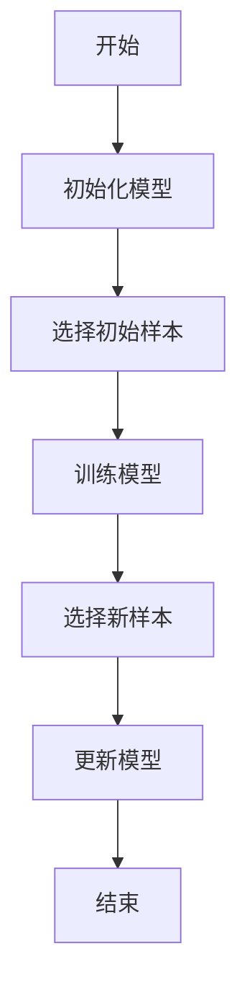
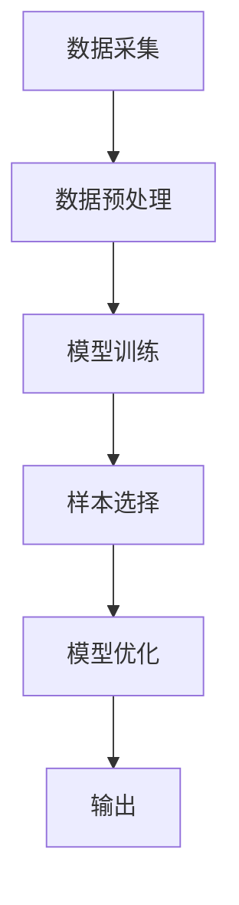
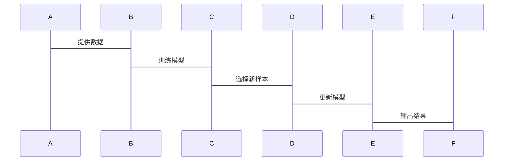

                 


# 设计AI Agent的主动学习策略

> 关键词：AI Agent, 主动学习, 策略设计, 算法实现, 系统架构

> 摘要：本文将详细介绍AI Agent的主动学习策略设计，从基本概念到核心算法，从系统架构到项目实战，全面解析如何设计高效的主动学习策略。我们将探讨不确定性度量、边界区域、密度估计等主动学习策略，并结合实际案例，展示如何在AI Agent中实现这些策略。通过本文的学习，读者将能够掌握AI Agent主动学习的核心原理，并能够将其应用于实际项目中。

---

# 第一部分: AI Agent的主动学习策略概述

# 第1章: AI Agent与主动学习的基本概念

## 1.1 AI Agent的基本概念

### 1.1.1 什么是AI Agent

AI Agent（人工智能代理）是指能够感知环境、自主决策并执行任务的智能体。AI Agent可以是软件程序、机器人或其他智能系统，其核心目标是通过感知和行动来实现特定目标。

**关键特征：**
- **自主性**：能够自主决策，无需外部干预。
- **反应性**：能够实时感知环境并做出反应。
- **目标导向性**：所有行为都围绕实现特定目标展开。

### 1.1.2 AI Agent的类型

AI Agent可以分为以下几类：
1. **简单反射型Agent**：基于当前输入做出简单反应，不涉及复杂决策。
2. **基于模型的反射型Agent**：利用内部模型进行决策，能够预测未来状态。
3. **目标驱动型Agent**：根据目标选择最优动作。
4. **效用驱动型Agent**：通过最大化效用函数来实现目标。
5. **学习型Agent**：通过与环境交互不断优化自身的策略。

### 1.1.3 AI Agent的核心特征

- **感知能力**：通过传感器或数据输入感知环境。
- **决策能力**：基于感知信息做出决策。
- **行动能力**：通过执行器或输出模块采取行动。
- **学习能力**：通过与环境交互不断优化自身的知识和策略。

## 1.2 主动学习的基本原理

### 1.2.1 什么是主动学习

主动学习是一种机器学习方法，其中模型能够主动选择最有信息量的数据进行学习。与传统的被动学习（如监督学习）不同，主动学习强调模型的主动性，能够在有限的标注数据下提高模型性能。

### 1.2.2 主动学习与监督学习的区别

| 对比维度 | 主动学习 | 监督学习 |
|----------|----------|----------|
| 数据选择 | 模型主动选择 | 数据由外部提供 |
| 数据量需求 | 通常需要较少标注数据 | 通常需要大量标注数据 |
| 适用场景 | 数据标注成本高或数据量有限时 | 数据量充足时 |

### 1.2.3 主动学习的典型应用场景

- **医疗诊断**：在数据标注成本较高的情况下，主动学习可以帮助模型快速优化。
- **自然语言处理**：在处理稀有词汇或长尾案例时，主动学习可以提高模型的泛化能力。
- **推荐系统**：通过主动选择最有信息量的用户数据，优化推荐算法。

## 1.3 AI Agent主动学习的背景与意义

### 1.3.1 当前AI Agent的发展现状

AI Agent正在广泛应用于各个领域，包括自动驾驶、智能助手、机器人控制等。然而，随着应用场景的复杂化，AI Agent需要处理的数据量和任务复杂度也在不断增加。

### 1.3.2 主动学习在AI Agent中的重要性

在实际应用中，标注数据的获取往往成本高昂，尤其是在需要实时决策的场景中，主动学习可以帮助AI Agent在有限的标注数据下实现高性能。

### 1.3.3 AI Agent主动学习的挑战与机遇

- **挑战**：如何设计高效的主动学习策略，如何处理动态变化的环境。
- **机遇**：通过主动学习，AI Agent可以在资源受限的场景下实现更好的性能。

---

# 第2章: AI Agent主动学习的核心策略

## 2.1 主动学习的策略分类

### 2.1.1 基于不确定性度量的策略

**不确定性度量**：通过计算模型对某个样本的预测不确定性来选择最有信息量的样本。

$$ \text{不确定性} = 1 - \max(p(y|x)) $$

其中，$p(y|x)$ 是模型对样本$x$的预测概率。

### 2.1.2 基于密度的策略

**密度估计**：选择密度较低的区域，这些区域通常包含更多的信息量。

### 2.1.3 基于边界区域的策略

**边界区域**：选择模型预测结果不稳定的区域，这些区域通常包含类别之间的过渡区域。

---

## 2.2 策略选择的数学模型

### 2.2.1 不确定性度量的数学表达

$$ U(x) = -\sum_{i=1}^{n} p(y_i|x) \ln p(y_i|x) $$

其中，$U(x)$ 是样本$x$的不确定性，$p(y_i|x)$ 是模型对类别$i$的预测概率。

### 2.2.2 模型置信度的计算公式

$$ \text{置信度} = \max(p(y|x)) $$

### 2.2.3 样本重要性评分的实现

$$ I(x) = f(U(x), C(x)) $$

其中，$I(x)$ 是样本$x$的重要性评分，$U(x)$ 是不确定性，$C(x)$ 是样本$x$的类别分布。

---

## 2.3 策略优化与改进

### 2.3.1 策略优化的目标函数

$$ \arg\max_{x} I(x) $$

### 2.3.2 增量式优化算法

```python
def active_learning_strategy(X, Y, model, selector):
    selected = selector.select_samples(X, Y)
    model.update(selected)
    return model
```

### 2.3.3 贪婪策略的优缺点分析

- **优点**：简单高效，能够快速选择最有信息量的样本。
- **缺点**：可能无法全局最优，容易陷入局部最优。

---

## 2.4 本章小结

---

# 第3章: AI Agent主动学习的算法实现

## 3.1 主动学习算法的流程图



### 3.1.1 数据预处理阶段

- 数据清洗：去除噪声数据，标准化或归一化数据。
- 数据增强：通过数据增强技术增加数据多样性。

### 3.1.2 模型训练阶段

- 使用初始标注数据训练模型。
- 使用模型预测未标注数据的标签概率。

### 3.1.3 样本选择阶段

- 使用不确定性度量、边界区域或密度估计等策略选择最有信息量的样本。

### 3.1.4 模型更新阶段

- 将选择的新样本加入训练数据，重新训练模型。

## 3.2 基于不确定性度量的算法实现

### 3.2.1 模型预测概率的计算

$$ p(y|x) = \text{softmax}(w \cdot x) $$

其中，$w$ 是模型参数，$x$ 是样本特征。

### 3.2.2 样本不确定性度量的公式

$$ U(x) = -\sum_{i=1}^{n} p(y_i|x) \ln p(y_i|x) $$

### 3.2.3 样本选择的实现代码

```python
def select_samples(X, model):
    probabilities = model.predict_proba(X)
    uncertainties = -np.log(np.max(probabilities, axis=1))
    selected = np.argsort(uncertainties)[-10:]
    return selected
```

## 3.3 算法的数学模型与公式

### 3.3.1 概率分布的数学表达

$$ p(y|x) = \frac{e^{w \cdot x}}{\sum_{k=1}^{n} e^{w_k \cdot x}} $$

### 3.3.2 信息增益的计算公式

$$ \text{信息增益} = H(y) - H(y|x) $$

其中，$H(y)$ 是数据的熵，$H(y|x)$ 是条件熵。

---

## 3.4 本章小结

---

# 第4章: AI Agent主动学习的系统架构设计

## 4.1 系统功能设计

### 4.1.1 数据采集模块

- 从环境中采集数据。
- 对数据进行预处理和标注。

### 4.1.2 模型训练模块

- 使用标注数据训练模型。
- 定期更新模型参数。

### 4.1.3 样本选择模块

- 根据主动学习策略选择新样本。
- 将新样本加入训练数据。

### 4.1.4 模型优化模块

- 使用选择的新样本优化模型。
- 输出最终的模型参数。

## 4.2 系统架构设计



### 4.2.1 系统交互设计



## 4.3 本章小结

---

# 第5章: AI Agent主动学习的项目实战

## 5.1 项目背景介绍

### 5.1.1 项目目标

设计一个基于主动学习的AI Agent，能够在有限的标注数据下实现高效的分类任务。

### 5.1.2 项目需求

- 数据集：少量标注数据，大量未标注数据。
- 任务：分类。

## 5.2 系统核心实现

### 5.2.1 环境安装

- 安装Python和相关库（如scikit-learn、numpy等）。

### 5.2.2 核心代码实现

```python
class ActiveLearningAgent:
    def __init__(self, model, selector):
        self.model = model
        self.selector = selector
        self.X_train = []
        self.Y_train = []
    
    def select_samples(self, X, Y):
        selected = self.selector.select_samples(X, Y)
        return selected
    
    def update_model(self, X, Y):
        self.X_train.extend(X)
        self.Y_train.extend(Y)
        self.model.fit(self.X_train, self.Y_train)
```

### 5.2.3 代码应用解读

- 初始化模型和选择策略。
- 使用选择策略选择新样本。
- 更新模型参数。

## 5.3 实际案例分析

### 5.3.1 案例描述

假设我们有一个分类任务，只有少量标注数据，希望通过主动学习逐步优化模型性能。

### 5.3.2 案例分析

1. 初始化模型和选择策略。
2. 使用初始标注数据训练模型。
3. 使用选择策略选择新样本。
4. 更新模型参数。
5. 重复步骤2-4，直到达到预设条件。

## 5.4 本章小结

---

# 第6章: 总结与展望

## 6.1 总结

本文详细介绍了AI Agent的主动学习策略设计，从基本概念到核心算法，从系统架构到项目实战，全面解析了如何设计高效的主动学习策略。通过本文的学习，读者可以掌握AI Agent主动学习的核心原理，并能够将其应用于实际项目中。

## 6.2 未来展望

未来的研究方向包括：
- 更高效的主动学习策略设计。
- 更鲁棒的模型更新算法。
- 更广泛的应用场景探索。

---

作者：AI天才研究院/AI Genius Institute & 禅与计算机程序设计艺术 /Zen And The Art of Computer Programming

