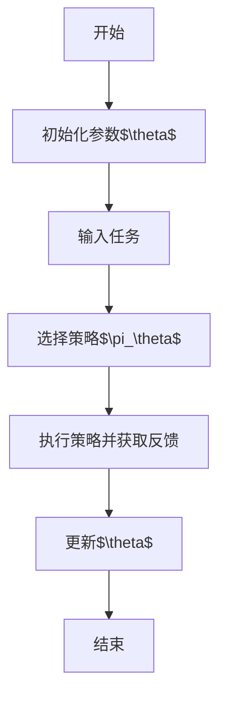
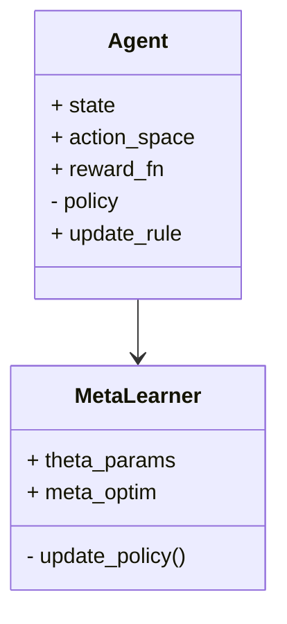
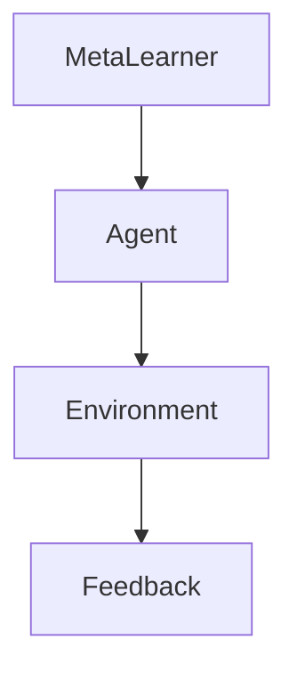
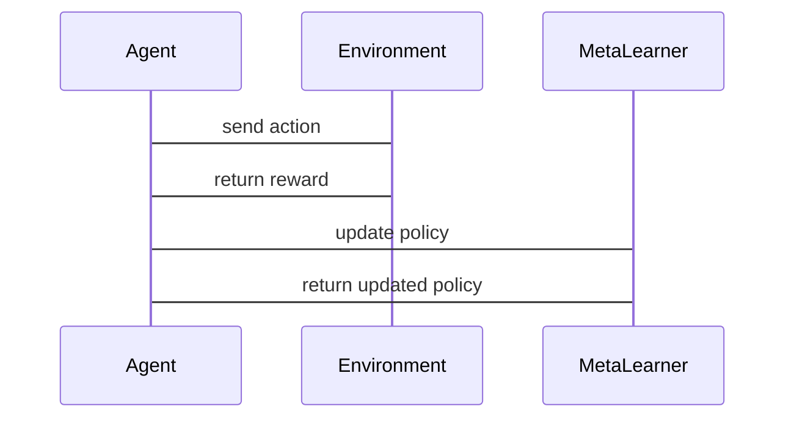

                 


# 设计AI Agent的元控制学习策略

**关键词**：AI Agent，元控制学习，策略优化，算法设计，系统架构

**摘要**：  
本文旨在探讨设计AI Agent的元控制学习策略的核心概念、算法实现和系统架构。通过详细分析元控制学习的原理、算法流程和系统设计，结合实际案例和最佳实践，为读者提供一个全面的设计指南。

---

# 第1章: 引言

## 1.1 AI Agent的基本概念
### 1.1.1 AI Agent的定义
AI Agent（人工智能代理）是指能够感知环境并采取行动以实现目标的智能实体。它可以分为简单反射型、基于模型的反射型、目标驱动型和效用驱动型等类型。

### 1.1.2 元控制学习策略的背景与意义
元控制学习是一种新兴的AI技术，通过元学习（Meta-Learning）方法，使AI Agent能够在不同任务间快速适应和优化策略。其核心在于通过学习如何学习，提升AI Agent的通用性和灵活性。

### 1.1.3 元控制学习在AI Agent中的作用
元控制学习能够帮助AI Agent在复杂环境中实现自主决策和策略优化，尤其适用于任务多样性和动态变化的场景。

---

# 第2章: 核心概念与联系

## 2.1 元控制学习的原理分析
### 2.1.1 元控制学习的基本原理
元控制学习通过学习一个参数化策略分布，使其能够在不同任务间快速调整。其核心在于利用元学习算法（如MAML）优化参数更新规则。

### 2.1.2 元控制学习的核心算法
元控制学习的关键算法包括：
1. **MAML（元学习中的-meta gradient descent）**：通过计算梯度的梯度，优化跨任务的参数更新。
2. **Reptile**：基于局部更新规则，实现任务间参数的快速适应。

### 2.1.3 元控制学习的数学模型
元控制学习的目标函数可以表示为：
$$
\min_{\theta} \sum_{i=1}^{N} \mathbb{E}_{\tau \sim P_i} [L_i(\theta)]
$$
其中，$\theta$是共享参数，$P_i$是任务$i$的数据分布，$L_i$是任务$i$的损失函数。

## 2.2 元控制学习与传统控制学习的对比
### 2.2.1 传统控制学习的特点
传统控制学习依赖于特定任务的数据，通过大量训练数据优化单一策略。

### 2.2.2 元控制学习的优势
元控制学习通过学习通用策略更新规则，能够在新任务上线时快速调整，减少对新数据的需求。

### 2.2.3 元控制学习的挑战
元控制学习需要解决跨任务的参数共享和策略协调问题，同时需要平衡元学习阶段和任务学习阶段的计算开销。

## 2.3 元控制学习的ER实体关系图
```mermaid
er
actor: 元控制学习策略
role: 元控制学习策略的执行者
```

---

# 第3章: 算法原理讲解

## 3.1 元控制学习算法的数学模型
元控制学习的核心数学模型包括：
1. **元参数$\theta$**：用于定义策略的参数更新规则。
2. **任务参数$\phi$**：用于特定任务的策略优化。

## 3.2 元控制学习算法的流程图


## 3.3 元控制学习算法的Python实现
```python
import torch
import torch.nn as nn

class MetaControlNet(nn.Module):
    def __init__(self, input_dim, output_dim):
        super(MetaControlNet, self).__init__()
        self.fc1 = nn.Linear(input_dim, output_dim)
        
    def forward(self, x, params=None):
        if params is None:
            params = self.fc1.weight
        return torch.mm(x, params.unsqueeze(1)).squeeze()

# 示例用法
net = MetaControlNet(input_dim=10, output_dim=1)
optimizer = torch.optim.Adam(net.parameters())

for batch in batches:
    optimizer.zero_grad()
    loss = net.loss(batch)
    loss.backward()
    optimizer.step()
```

---

# 第4章: 系统分析与架构设计方案

## 4.1 系统功能设计
### 4.1.1 领域模型设计


### 4.1.2 系统架构设计


## 4.2 系统接口设计
### 4.2.1 接口定义


---

# 第5章: 项目实战

## 5.1 环境安装与配置
### 5.1.1 安装依赖
```bash
pip install torch numpy matplotlib
```

### 5.1.2 环境配置
```bash
conda create -n meta_control python=3.8
conda activate meta_control
pip install -r requirements.txt
```

## 5.2 系统核心实现
### 5.2.1 元控制学习策略的实现
```python
def meta_learning_loop():
    for epoch in epochs:
        for task in tasks:
            # 从任务中采样数据
            x, y = sample_task_data(task)
            # 计算梯度的梯度
            gradients = compute_meta_gradients(model, x, y)
            # 更新元参数
            optimizer.step(gradients)
```

## 5.3 实际案例分析
### 5.3.1 案例背景
假设我们设计一个AI Agent，用于在多任务环境中优化路径规划。

### 5.3.2 数据分析
通过分析不同任务的奖励分布，优化策略参数，以提高全局最优解。

---

# 第6章: 最佳实践与注意事项

## 6.1 最佳实践
1. **任务多样性**：确保训练任务的多样性，以提升元学习的有效性。
2. **参数初始化**：合理初始化元参数，避免模型陷入局部最优。
3. **计算效率**：优化梯度计算和参数更新过程，减少训练时间。

## 6.2 小结
元控制学习为设计通用AI Agent提供了新的思路，但仍需在算法优化和系统设计上进一步探索。

## 6.3 注意事项
1. **任务差异性**：任务间差异过大可能导致元学习效果不佳。
2. **计算资源**：元控制学习需要大量计算资源，需合理配置。

---

# 作者

作者：AI天才研究院/AI Genius Institute & 禅与计算机程序设计艺术 /Zen And The Art of Computer Programming

---

以上是《设计AI Agent的元控制学习策略》的完整目录和内容概要。文章通过系统化的分析和实际案例，详细阐述了元控制学习的原理和应用，为AI Agent的设计提供了理论和实践指导。

