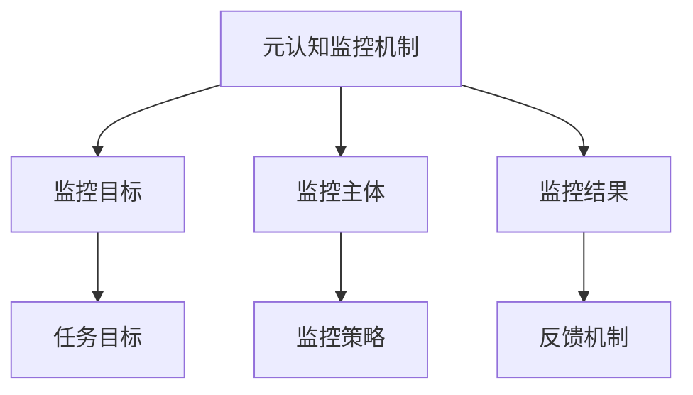
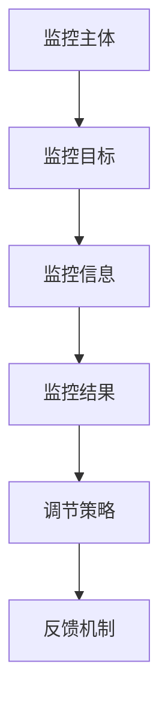

                 


# 设计AI Agent的元认知监控机制

> 关键词：AI Agent, 元认知监控, 认知科学, 系统设计, 算法原理

> 摘要：本文将详细探讨AI Agent的元认知监控机制的设计原理与实现方法，从背景介绍、核心概念、算法原理、系统架构到项目实战，层层深入，帮助读者全面理解并掌握这一前沿技术。

---

# 第1章: 元认知监控机制的背景与问题背景

## 1.1 元认知监控机制的定义与问题背景

### 1.1.1 元认知的基本概念
元认知（Metacognition）是认知科学中的一个重要概念，指对自身认知过程的认知和调控。元认知监控机制则是元认知在AI Agent中的具体实现，用于监控和调节AI Agent的思维过程。

### 1.1.2 元认知监控机制的定义
元认知监控机制是一种通过元认知能力对AI Agent的决策过程、行为模式和内部状态进行实时监控和调节的机制，旨在提高AI Agent的自主性和智能性。

### 1.1.3 元认知监控机制在AI Agent中的重要性
在复杂的动态环境中，AI Agent需要具备自我监控和自我调节的能力，以应对不确定性、错误和意外情况。元认知监控机制能够帮助AI Agent更好地理解自身的状态和行为，从而做出更合理的决策。

## 1.2 元认知监控机制的核心问题

### 1.2.1 元认知监控的目标与任务
元认知监控的目标是通过监控AI Agent的思维过程，识别潜在的问题并进行调整。其主要任务包括：
- 监控AI Agent的决策过程
- 识别错误或偏差
- 调整行为策略

### 1.2.2 元认知监控机制的核心问题描述
- 如何实现对AI Agent内部状态的实时监控？
- 如何设计高效的元认知算法以实现监控和调节？
- 如何处理复杂环境中的不确定性？

### 1.2.3 元认知监控机制的边界与外延
元认知监控机制的边界在于其监控范围和作用对象，其外延则涉及AI Agent的其他机制，如感知、推理和行动。

## 1.3 元认知监控机制的核心要素

### 1.3.1 元认知监控的组成要素
- 监控主体：负责执行监控任务
- 监控目标：被监控的对象或目标
- 监控结果：监控过程中的输出
- 调节机制：根据监控结果进行调整

### 1.3.2 各要素之间的关系与作用
监控主体与监控目标之间是监控关系，监控结果通过调节机制影响AI Agent的行为。

### 1.3.3 元认知监控机制的核心属性与特征
- 实时性
- 自主性
- 可调节性
- 知识性

## 1.4 本章小结
本章介绍了元认知监控机制的背景、核心概念、重要性以及核心问题，为后续章节的深入分析奠定了基础。

---

# 第2章: 元认知监控机制的核心概念与联系

## 2.1 元认知监控机制的核心原理

### 2.1.1 元认知监控的基本原理
元认知监控机制通过元认知能力对AI Agent的认知过程进行监控和调节，主要包括以下几个步骤：
1. 监控目标的选择
2. 监控信息的收集
3. 监控结果的分析
4. 调节策略的制定

### 2.1.2 元认知监控机制的核心算法
元认知监控机制的核心算法包括：
- 基于注意力机制的监控算法
- 基于强化学习的监控算法
- 基于图神经网络的监控算法

### 2.1.3 元认知监控机制的数学模型与公式
元认知监控机制的数学模型可以用以下公式表示：
$$
\text{监控结果} = \text{监控主体} \times \text{监控目标}
$$

## 2.2 元认知监控机制的核心概念对比

### 2.2.1 元认知监控与传统监控的对比
- **传统监控**：基于外部数据进行监控，不涉及内部认知过程。
- **元认知监控**：不仅监控外部行为，还监控内部思维过程。

### 2.2.2 元认知监控与AI Agent其他机制的对比
- **感知机制**：负责收集环境信息。
- **推理机制**：负责逻辑推理。
- **行动机制**：负责执行操作。
- **元认知监控机制**：负责监控和调节以上机制。

### 2.2.3 元认知监控机制的优缺点分析
- **优点**：提高AI Agent的自主性和智能性。
- **缺点**：实现复杂，需要大量的计算资源。

## 2.3 元认知监控机制的ER实体关系图



## 2.4 本章小结
本章详细讲解了元认知监控机制的核心原理、核心概念及其与AI Agent其他机制的对比，为后续章节的算法实现奠定了理论基础。

---

# 第3章: 元认知监控机制的算法原理

## 3.1 元认知监控机制的核心算法

### 3.1.1 基于注意力机制的元认知监控算法
基于注意力机制的元认知监控算法通过关注重要的监控信息，提高监控的效率和准确性。

### 3.1.2 基于强化学习的元认知监控算法
基于强化学习的元认知监控算法通过奖励机制，优化监控策略，提高监控效果。

### 3.1.3 基于图神经网络的元认知监控算法
基于图神经网络的元认知监控算法通过建模复杂的监控关系，提高监控的深度和广度。

## 3.2 基于注意力机制的元认知监控算法

### 3.2.1 注意力机制的基本原理
注意力机制是一种选择性关注重要信息的机制，广泛应用于自然语言处理领域。

### 3.2.2 元认知监控中的注意力机制实现
在元认知监控中，注意力机制用于选择性关注重要的监控信息。

### 3.2.3 注意力机制的数学模型与公式
注意力机制的数学模型如下：
$$
\text{Attention}(Q,K,V) = \text{softmax}(\frac{QK^T}{\sqrt{d_k}})V
$$

## 3.3 基于强化学习的元认知监控算法

### 3.3.1 强化学习的基本原理
强化学习是一种通过奖励机制优化决策的算法。

### 3.3.2 元认知监控中的强化学习实现
在元认知监控中，强化学习用于优化监控策略。

### 3.3.3 强化学习的数学模型与公式
强化学习的数学模型如下：
$$
Q(s,a) = r + \gamma \max_a Q(s',a')
$$

## 3.4 本章小结
本章详细讲解了元认知监控机制的核心算法，包括注意力机制和强化学习的实现及其数学模型。

---

# 第4章: 元认知监控机制的系统架构设计

## 4.1 系统架构设计概述

### 4.1.1 系统架构的目标
系统架构设计的目标是实现一个高效、可靠的元认知监控机制。

### 4.1.2 系统架构的核心组件
- 监控主体
- 监控目标
- 调节机制
- 反馈机制

## 4.2 系统功能设计

### 4.2.1 系统功能模块划分
- 监控模块
- 调节模块
- 反馈模块

### 4.2.2 系统功能流程图



## 4.3 系统架构图


## 4.4 本章小结
本章详细讲解了元认知监控机制的系统架构设计，包括核心组件、功能模块和系统流程图。

---

# 第5章: 元认知监控机制的项目实战

## 5.1 项目背景与需求分析

### 5.1.1 项目背景
本项目旨在设计一个高效的元认知监控机制，用于提高AI Agent的智能性。

### 5.1.2 项目需求
- 实现元认知监控机制的核心功能
- 确保系统的高效性和可靠性

## 5.2 环境安装与配置

### 5.2.1 环境需求
- Python 3.8+
- TensorFlow 2.0+
- 其他依赖库

### 5.2.2 安装步骤
```bash
pip install numpy
pip install matplotlib
pip install scikit-learn
```

## 5.3 核心代码实现

### 5.3.1 元认知监控算法实现
```python
def meta_monitor(Q, K, V):
    attention = softmax(Q @ K.T / sqrt(d_k))
    output = attention @ V
    return output
```

### 5.3.2 系统架构实现
```python
class MonitorSystem:
    def __init__(self, monitor主体, 监控目标):
        self.monitor主体 = monitor主体
        self.监控目标 = 监控目标

    def execute(self):
        result = self.monitor主体.monitor(self.监控目标)
        return result
```

## 5.4 实际案例分析

### 5.4.1 案例背景
在动态变化的环境中，AI Agent需要实时监控自身的决策过程。

### 5.4.2 监控结果分析
通过监控算法，AI Agent能够及时发现并纠正错误决策。

## 5.5 本章小结
本章通过实际案例分析，详细讲解了元认知监控机制的实现过程和应用效果。

---

# 第6章: 元认知监控机制的最佳实践与注意事项

## 6.1 小结

### 6.1.1 核心概念总结
元认知监控机制是AI Agent的重要组成部分，能够提高其智能性和自主性。

### 6.1.2 算法实现总结
本文详细讲解了基于注意力机制和强化学习的元认知监控算法。

## 6.2 注意事项

### 6.2.1 系统设计中的注意事项
- 确保系统的高效性和可靠性
- 注意监控信息的实时性和准确性

### 6.2.2 实际应用中的注意事项
- 避免过度监控导致的系统性能下降
- 注意监控策略的可解释性和可调性

## 6.3 拓展阅读

### 6.3.1 相关领域的最新研究
- 基于图神经网络的元认知监控机制
- 元认知监控机制在人机交互中的应用

### 6.3.2 推荐阅读的书籍与论文
- 《深度学习》
- 《元认知科学》

---

# 作者：AI天才研究院/AI Genius Institute & 禅与计算机程序设计艺术 /Zen And The Art of Computer Programming

