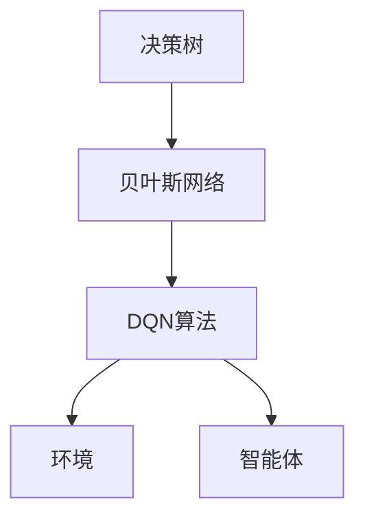
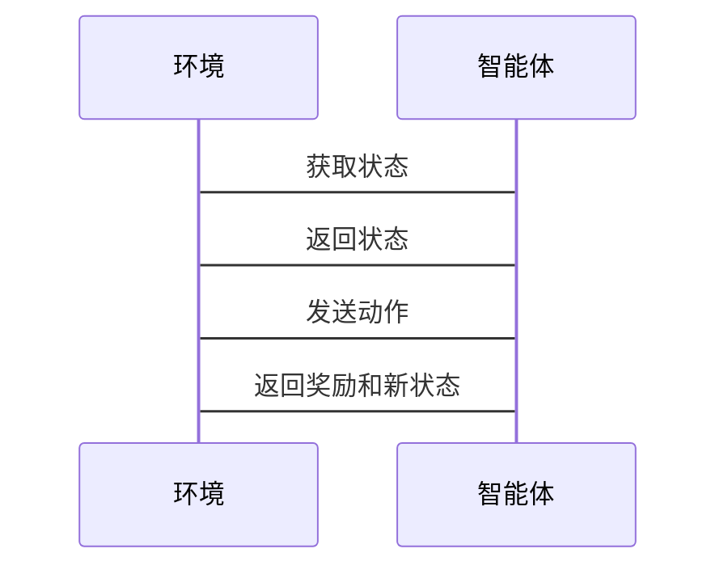

                 


# 设计AI Agent的决策与推理机制

## 关键词：
AI Agent, 决策机制, 推理机制, 算法原理, 系统架构, 项目实战

## 摘要：
本文详细探讨了设计AI Agent的决策与推理机制的核心概念、算法原理、系统架构以及实际应用。通过分析决策树、贝叶斯网络和DQN算法，结合系统设计和项目实战，为读者提供全面的指导。

---

## 第1章：AI Agent的决策与推理机制概述

### 1.1 AI Agent的基本概念
#### 1.1.1 AI Agent的定义与特点
AI Agent（智能体）是指在环境中能够感知并自主行动以实现目标的实体。其特点包括自主性、反应性、主动性、社会性、学习能力等。AI Agent的核心能力在于能够根据环境信息做出决策和行动。

#### 1.1.2 决策与推理机制的背景与意义
决策与推理机制是AI Agent实现智能行为的核心部分。随着AI技术的快速发展，设计高效的决策与推理机制对于提高AI Agent的性能和应用范围至关重要。

#### 1.1.3 问题背景与描述
在实际应用中，AI Agent需要在复杂多变的环境中做出决策。例如，在自动驾驶中，AI Agent需要实时感知环境并做出正确的驾驶决策；在智能客服中，AI Agent需要根据用户需求提供合适的解决方案。这些场景对决策与推理机制的设计提出了更高的要求。

---

## 第2章：决策与推理机制的核心概念与联系

### 2.1 决策与推理机制的原理
#### 2.1.1 决策树的构建与应用
决策树是一种树状结构，用于表示可能的决策路径。通过分析不同的决策路径，AI Agent可以选择最优的行动方案。决策树的构建过程包括特征选择、分裂停止条件和剪枝等步骤。

#### 2.1.2 贝叶斯网络的构建与应用
贝叶斯网络是一种概率图模型，用于表示变量之间的概率关系。通过贝叶斯推理，AI Agent可以基于先验概率和观测数据进行推断，从而做出决策。

#### 2.1.3 DQN算法的基本原理
DQN（Deep Q-Network）算法是一种基于深度学习的强化学习方法。通过与环境交互，AI Agent学习到最优的策略，从而在复杂环境中做出决策。

### 2.2 核心概念的对比分析
#### 2.2.1 决策树与贝叶斯网络的对比
| 对比维度 | 决策树 | 贝叶斯网络 |
|----------|--------|------------|
| 适用场景 | 分类问题 | 概率推理问题 |
| 模型复杂度 | 较低 | 较高 |
| 解释性 | 高 | 中等 |

#### 2.2.2 DQN算法与传统决策树的对比
DQN算法适用于复杂动态环境，而传统决策树适用于数据量较小、规则明确的场景。DQN算法具有更强的适应性和学习能力，但在计算资源和训练时间上要求较高。

#### 2.2.3 决策与推理机制的优缺点分析
| 对比维度 | 决策树 | 贝叶斯网络 | DQN算法 |
|----------|--------|------------|----------|
| 优点 | �易解释，适合小数据 | 概率推理，适合复杂问题 | 强大适应性，适合动态环境 |
| 缺点 | 无法处理复杂非线性关系 | 计算复杂 | 训练时间长，资源消耗大 |

### 2.3 实体关系图（ER图）展示
以下是决策与推理机制的ER图：

```mermaid
erd
    entity 决策树 {
        id
        决策节点
        分支条件
    }
    entity 贝叶斯网络 {
        id
        节点
        边
        条件概率
    }
    entity DQN算法 {
        id
        状态
        动作
        奖励
    }
    决策树 --> 贝叶斯网络: 通过概率推理优化决策路径
    贝叶斯网络 --> DQN算法: 基于动态环境的策略优化
```

---

## 第3章：算法原理讲解

### 3.1 决策树算法
#### 3.1.1 决策树的构建流程
1. 特征选择：使用信息增益或基尼指数选择最优特征。
2. 数据分割：根据选择的特征将数据集分割成子集。
3. 递归构建：对子集递归地构建决策树，直到满足停止条件。
4. 剪枝：去除不必要的节点，防止过拟合。

#### 3.1.2 决策树的Python实现示例
```python
from sklearn.tree import DecisionTreeClassifier
from sklearn.datasets import make_classification

# 生成示例数据
X, y = make_classification(n_samples=100, n_features=2, n_classes=2)

# 初始化决策树模型
clf = DecisionTreeClassifier()

# 训练模型
clf.fit(X, y)

# 预测
print(clf.predict(X))
```

#### 3.1.3 决策树的数学模型
决策树的决策规则可以用条件概率表示：
$$ P(y|X) = \prod_{i=1}^{n} P(x_i | y, parent(x_i)) $$

### 3.2 贝叶斯网络算法
#### 3.2.1 贝叶斯网络的构建流程
1. 确定变量：明确问题中的变量及其关系。
2. 构建结构：定义变量之间的有向无环图（DAG）。
3. 学习参数：估计每个节点的条件概率分布。

#### 3.2.2 贝叶斯网络的Python实现示例
```python
from sklearn.naive_bayes import GaussianNB

# 生成示例数据
X, y = make_classification(n_samples=100, n_features=2, n_classes=2)

# 初始化贝叶斯网络模型
model = GaussianNB()

# 训练模型
model.fit(X, y)

# 预测
print(model.predict(X))
```

#### 3.2.3 贝叶斯网络的数学模型
贝叶斯网络的概率推理公式为：
$$ P(y|x) = \frac{P(x|y)P(y)}{P(x)} $$

### 3.3 DQN算法
#### 3.3.1 DQN算法的构建流程
1. 环境交互：智能体与环境交互，获取状态、动作和奖励。
2. 神经网络：使用深度神经网络近似Q值函数。
3. 策略更新：通过经验回放和目标网络更新策略。

#### 3.3.2 DQN算法的Python实现示例
```python
import gym
import numpy as np

# 初始化环境
env = gym.make('CartPole-v0')

# 定义网络结构
class DQN:
    def __init__(self, state_size, action_size):
        self.state_size = state_size
        self.action_size = action_size
        self.model = self.build_model()

    def build_model(self):
        # 简单的DNN结构
        model = Sequential()
        model.add(Dense(24, activation='relu', input_dim=self.state_size))
        model.add(Dense(24, activation='relu'))
        model.add(Dense(self.action_size, activation='linear'))
        model.compile(optimizer='adam', loss='mse')
        return model

    def remember(self, state, action, reward, next_state, done):
        self.memory.append((state, action, reward, next_state, done))

    # 其他方法如act, replay等略...

# 初始化智能体
dqn = DQN(env.observation_space.shape[0], env.action_space.n)

# 训练过程略...
```

#### 3.3.3 DQN算法的数学模型
DQN的目标是通过最小化损失函数来优化Q值：
$$ \min_{\theta} \mathbb{E}[ (r + \gamma Q(s', a') - Q(s, a))^2 ] $$

---

## 第4章：数学模型与公式推导

### 4.1 决策树的数学模型
决策树的决策规则可以用条件概率表示：
$$ P(y|X) = \prod_{i=1}^{n} P(x_i | y, parent(x_i)) $$

### 4.2 贝叶斯网络的数学模型
贝叶斯网络的概率推理公式为：
$$ P(y|x) = \frac{P(x|y)P(y)}{P(x)} $$

### 4.3 DQN算法的数学模型
DQN的目标是通过最小化损失函数来优化Q值：
$$ \min_{\theta} \mathbb{E}[ (r + \gamma Q(s', a') - Q(s, a))^2 ] $$

---

## 第5章：系统分析与架构设计方案

### 5.1 系统架构设计
以下是AI Agent的系统架构图：



### 5.2 接口设计
AI Agent需要与环境进行交互，接口设计如下：
- 输入：状态、动作、奖励
- 输出：决策

### 5.3 交互流程
以下是交互流程的序列图：



---

## 第6章：项目实战

### 6.1 环境安装
安装必要的库：
```bash
pip install numpy scikit-learn gym matplotlib
```

### 6.2 核心代码实现
以下是DQN算法的核心代码：
```python
import gym
import numpy as np
import tensorflow as tf

# 初始化环境
env = gym.make('CartPole-v0')

# 定义网络结构
class DQN:
    def __init__(self, state_size, action_size):
        self.state_size = state_size
        self.action_size = action_size
        self.model = self.build_model()

    def build_model(self):
        model = tf.keras.Sequential([
            tf.keras.layers.Dense(24, activation='relu', input_dim=self.state_size),
            tf.keras.layers.Dense(24, activation='relu'),
            tf.keras.layers.Dense(self.action_size, activation='linear')
        ])
        model.compile(optimizer='adam', loss='mse')
        return model

    def remember(self, state, action, reward, next_state, done):
        self.memory.append((state, action, reward, next_state, done))

    def act(self, state):
        if np.random.random() < 0.99:  # 探索与利用策略
            state = tf.convert_to_tensor([state], dtype=tf.float32)
            prediction = self.model(state)
            return np.argmax(prediction.numpy()[0])
        else:
            return np.random.randint(self.action_size)

    def replay(self, batch_size):
        # 取出记忆库中的经验
        mini_batch = random.sample(self.memory, batch_size)
        states = tf.convert_to_tensor([x[0] for x in mini_batch], dtype=tf.float32)
        actions = tf.convert_to_tensor([x[1] for x in mini_batch], dtype=tf.float32)
        rewards = tf.convert_to_tensor([x[2] for x in mini_batch], dtype=tf.float32)
        next_states = tf.convert_to_tensor([x[3] for x in mini_batch], dtype=tf.float32)
        dones = tf.convert_to_tensor([x[4] for x in mini_batch], dtype=tf.float32)

        # 计算目标Q值
        target = rewards + (1 - dones) * γ * self.model.predict(next_states)

        # 训练模型
        self.model.fit(states, target, epochs=1, verbose=0)
```

### 6.3 代码解读与分析
1. 环境初始化：使用Gym库的CartPole环境。
2. 网络结构：定义了一个简单的DNN，用于近似Q值函数。
3. 探索与利用策略：通过随机选择动作来平衡探索与利用。
4. 经验回放：通过随机采样记忆库中的经验来训练模型。

### 6.4 实际案例分析
在CartPole环境中，AI Agent需要通过左右移动杆子来保持平衡。通过DQN算法，AI Agent能够逐步掌握最优策略，最终实现稳定的控制。

---

## 第7章：最佳实践

### 7.1 小结
设计AI Agent的决策与推理机制需要结合多种算法，根据具体场景选择合适的方案。

### 7.2 注意事项
- 确保数据质量和完整性。
- 合理设置超参数，避免过拟合。
- 定期监控和更新模型。

### 7.3 拓展阅读
推荐阅读《深度学习》（Deep Learning, Ian Goodfellow著）和《强化学习》（Reinforcement Learning: Theory and Algorithms, Richard S. Sutton著）。

---

## 作者信息

作者：AI天才研究院（AI Genius Institute） & 禅与计算机程序设计艺术（Zen And The Art of Computer Programming）

---

以上是《设计AI Agent的决策与推理机制》的完整内容，涵盖了从基础概念到实际应用的各个方面，为读者提供了全面的指导和实践参考。

