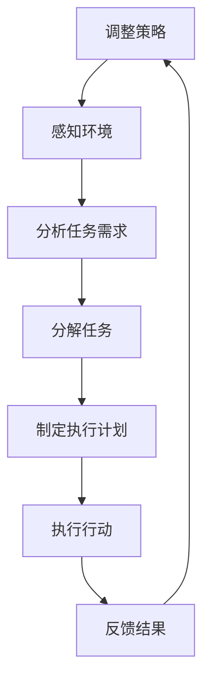
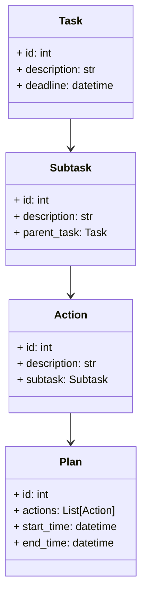
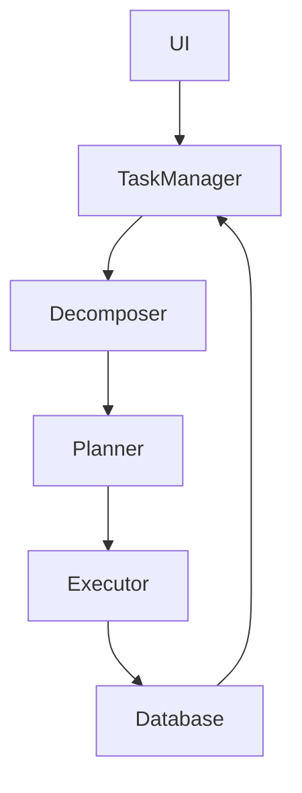

                 


# 设计AI Agent的动态任务分解与规划

## 关键词：AI Agent, 动态任务分解, 规划算法, 系统架构, 项目实战

## 摘要：  
本文深入探讨了设计AI Agent的动态任务分解与规划的核心原理、算法实现、系统架构及项目实战。通过背景介绍、核心概念、算法原理、系统分析与架构设计、项目实战、高级主题与扩展应用等多维度的详细分析，为读者提供了全面而深入的知识体系。文章结合实际案例和代码实现，帮助读者理解并掌握动态任务分解与规划的关键技术与应用方法。

---

# 第1章: 动态任务分解与规划的背景介绍

## 1.1 问题背景  
### 1.1.1 动态任务分解与规划的定义  
动态任务分解与规划是指在复杂动态环境中，AI Agent能够根据实时信息调整任务分解策略和执行计划的能力。  

### 1.1.2 问题的复杂性与挑战  
- 动态环境的不确定性：任务目标、环境条件和可用资源可能随时变化。  
- 多目标优化：需要在有限资源下平衡效率、质量、时间等多目标。  
- 协作性：AI Agent需要与其他Agent或人类用户协作完成任务。  

### 1.1.3 问题解决的必要性  
AI Agent在智能助手、机器人控制、自动驾驶等领域的广泛应用，要求其具备动态任务分解与规划能力以应对复杂场景。  

## 1.2 动态任务分解与规划的核心概念  
### 1.2.1 动态任务分解的定义与特点  
动态任务分解是将复杂任务分解为子任务的过程，其特点是：  
1. 动态性：任务分解策略根据环境变化实时调整。  
2. 可分解性：任务可以分解为多个子任务，且子任务之间具有明确的依赖关系。  
3. 适应性：能够根据环境变化快速调整分解策略。  

### 1.2.2 规划的基本原理  
规划是根据任务分解结果生成执行计划的过程，其核心是：  
1. 状态表示：将问题转化为状态空间中的状态转移。  
2. 行动选择：基于当前状态选择最优行动。  
3. 优化目标：通过优化算法找到最优执行路径。  

### 1.2.3 AI Agent在动态任务分解与规划中的作用  
AI Agent通过感知环境、分析任务需求、分解任务并制定执行计划，实现动态任务分解与规划。  

## 1.3 动态任务分解与规划的边界与外延  
### 1.3.1 任务分解的边界  
- 分解的粒度：任务分解的深度和广度。  
- 分解的目标：任务分解是否满足特定的应用需求。  

### 1.3.2 规划的范围  
- 短期规划：针对具体任务的执行步骤。  
- 长期规划：涉及资源分配和长期目标的设定。  

### 1.3.3 相关概念的对比  
| 概念 | 定义 | 区别 |  
|------|------|------|  
| 任务分解 | 将复杂任务分解为子任务 | 强调分解的层次结构 |  
| 规划 | 制定执行计划 | 强调行动序列的优化 |  

## 1.4 动态任务分解与规划的概念结构  
### 1.4.1 任务分解的层次结构  
任务分解可以分为任务层、子任务层和动作层。  

### 1.4.2 规划的流程模型  
规划的流程包括需求分析、任务分解、行动选择和计划优化。  

### 1.4.3 核心要素的组成  
- 任务目标：任务的最终目标。  
- 环境信息：任务执行的环境条件。  
- 资源约束：可用资源的限制。  

## 1.5 本章小结  
本章介绍了动态任务分解与规划的背景、核心概念、边界与外延，为后续章节奠定了基础。

---

# 第2章: 动态任务分解与规划的核心概念与联系

## 2.1 核心概念原理  
### 2.1.1 动态任务分解的原理  
动态任务分解通过感知环境变化调整任务分解策略，确保任务执行的灵活性和适应性。  

### 2.1.2 规划的基本原理  
规划通过状态空间搜索和优化算法，找到最优执行路径。  

## 2.2 动态任务分解与规划的联系  
动态任务分解为规划提供任务分解结构，而规划则指导任务的执行顺序和资源分配。  

## 2.3 动态任务分解与规划的属性特征对比  
| 属性 | 动态任务分解 | 规划 |  
|------|--------------|------|  
| 输入 | 任务目标和环境信息 | 当前状态和目标 |  
| 输出 | 子任务分解结构 | 执行计划 |  

## 2.4 ER实体关系图架构  
以下是动态任务分解与规划的ER实体关系图：  

```mermaid
erd
    title 动态任务分解与规划 ER 图
    User -> Task: 下达任务
    Task -> Subtask: 分解为子任务
    Subtask -> Action: 转化为具体行动
    Action -> Plan: 组合成执行计划
    Plan -> Environment: 执行于环境
```

## 2.5 AI Agent的协作机制  
以下是AI Agent的协作机制流程图：  



## 2.6 本章小结  
本章通过对比和图示，详细分析了动态任务分解与规划的核心概念及其联系，为后续算法实现提供了理论基础。

---

# 第3章: 动态任务分解与规划的算法原理讲解

## 3.1 分层任务分解算法  
### 3.1.1 分层任务分解算法的原理  
分层任务分解通过层次结构将任务分解为子任务，每个子任务对应特定的执行模块。  

### 3.1.2 分层任务分解算法的实现  
以下是分层任务分解算法的流程图：  

```mermaid
graph TD
    Start --> 分解任务
    分解任务 --> 判断是否满足终止条件
    判断是否满足终止条件 --> 是? 分解到底层子任务
    分解到底层子任务 --> 执行底层任务
    执行底层任务 --> 返回结果
    返回结果 --> 合并子任务结果
    合并子任务结果 --> 返回顶层任务
```

### 3.1.3 分层任务分解算法的数学模型  
分层任务分解可以表示为一棵树，其中根节点是任务，叶子节点是底层动作。数学模型如下：  

$$ T = \{T_1, T_2, ..., T_n\} $$  
其中，$T$ 表示任务分解结构，$T_i$ 表示子任务。  

### 3.1.4 分层任务分解算法的Python代码实现  
```python
def hierarchical_task_decomposition(task):
    if is_leaf_task(task):
        return [task]
    subtasks = []
    for subtask in task.subtasks:
        subtasks.extend(hierarchical_task_decomposition(subtask))
    return subtasks
```

## 3.2 基于强化学习的规划算法  
### 3.2.1 基于强化学习的规划算法的原理  
强化学习通过与环境交互，学习最优策略以最大化奖励函数。  

### 3.2.2 基于强化学习的规划算法的实现  
以下是基于强化学习的规划算法的流程图：  

```mermaid
graph TD
    Start --> 初始化状态
    初始化状态 --> 选择动作
    选择动作 --> 执行动作
    执行动作 --> 获取新状态和奖励
    获取新状态和奖励 --> 判断是否达到目标状态
    判断是否达到目标状态 --> 是? 结束
    判断是否达到目标状态 --> 否? 更新策略并继续
```

### 3.2.3 基于强化学习的规划算法的数学模型  
强化学习的目标是通过优化Q值函数，找到最优策略：  

$$ Q(s, a) = r + \gamma \max_{a'} Q(s', a') $$  
其中，$s$ 是当前状态，$a$ 是当前动作，$r$ 是奖励，$\gamma$ 是折扣因子。  

### 3.2.4 基于强化学习的规划算法的Python代码实现  
```python
class Agent:
    def __init__(self, state_space, action_space):
        self.state_space = state_space
        self.action_space = action_space
        self.Q = defaultdict(lambda: 0)
    
    def choose_action(self, state):
        # 使用ε-greedy策略选择动作
        if random.random() < self.epsilon:
            return random.choice(self.action_space)
        else:
            max_q = max(self.Q[(state, action)] for action in self.action_space)
            actions = [action for action in self.action_space if self.Q[(state, action)] == max_q]
            return random.choice(actions)
    
    def learn(self, state, action, reward, next_state):
        target = reward + self.gamma * max(self.Q[(next_state, action)] for action in self.action_space)
        self.Q[(state, action)] = self.Q[(state, action)] + self.alpha * (target - self.Q[(state, action)])
```

## 3.3 动态任务分解与规划的结合  
### 3.3.1 结合方式  
动态任务分解与规划的结合可以通过分层任务分解算法和基于强化学习的规划算法实现。  

### 3.3.2 结合优势  
- 提高任务执行的灵活性和适应性。  
- 实现多目标优化。  

## 3.4 本章小结  
本章详细讲解了分层任务分解算法和基于强化学习的规划算法的原理、实现和数学模型，并探讨了它们的结合方式及其优势。

---

# 第4章: 动态任务分解与规划的系统分析与架构设计

## 4.1 问题场景介绍  
### 4.1.1 问题背景  
在动态环境中，AI Agent需要具备动态任务分解与规划能力以应对复杂场景。  

### 4.1.2 问题分析  
- 环境的动态变化。  
- 多目标优化。  
- 资源约束。  

## 4.2 系统功能设计  
### 4.2.1 系统功能模块  
- 任务感知模块：感知环境变化并生成任务需求。  
- 任务分解模块：将任务分解为子任务。  
- 规划模块：生成执行计划。  
- 执行模块：执行具体行动。  

### 4.2.2 领域模型类图  
以下是领域模型类图：  



## 4.3 系统架构设计  
### 4.3.1 系统架构图  
以下是系统架构图：  



### 4.3.2 系统接口设计  
- TaskManager接口：用于管理任务。  
- Decomposer接口：用于任务分解。  
- Planner接口：用于生成执行计划。  

## 4.4 系统交互流程  
以下是系统交互流程图：  


## 4.5 本章小结  
本章通过系统分析与架构设计，详细描述了动态任务分解与规划系统的功能模块、类图和交互流程。

---

# 第5章: 动态任务分解与规划的项目实战

## 5.1 环境安装与配置  
### 5.1.1 环境需求  
- Python 3.8+  
- pip 20+  
- 安装依赖：`pip install numpy matplotlib`  

## 5.2 动态任务分解与规划的核心实现  
### 5.2.1 任务分解模块的实现  
```python
def decompose_task(task):
    if task.is_leaf():
        return [task]
    subtasks = []
    for subtask in task.subtasks:
        subtasks.extend(decompose_task(subtask))
    return subtasks
```

### 5.2.2 规划模块的实现  
```python
def plan_actions(subtasks, environment):
    plan = []
    for subtask in subtasks:
        action = select_action(subtask, environment)
        plan.append(action)
    return plan
```

### 5.2.3 执行模块的实现  
```python
def execute_plan(plan):
    for action in plan:
        execute_action(action)
```

## 5.3 代码实现与分析  
### 5.3.1 代码实现  
```python
class AI-Agent:
    def __init__(self):
        self.decomposer = Decomposer()
        self.planner = Planner()
        self.executor = Executor()
    
    def decompose(self, task):
        return self.decomposer.decompose_task(task)
    
    def plan(self, subtasks, environment):
        return self.planner.plan_actions(subtasks, environment)
    
    def execute(self, plan):
        return self.executor.execute_plan(plan)
```

### 5.3.2 代码分析  
- `Decomposer`类负责任务分解。  
- `Planner`类负责生成执行计划。  
- `Executor`类负责执行具体行动。  

## 5.4 案例分析与实际应用  
### 5.4.1 案例分析  
假设任务是“安排会议”，分解为“选择时间”、“发送邀请”、“确认参会人”。  

### 5.4.2 实际应用  
动态任务分解与规划在智能助手、机器人控制等领域有广泛应用。  

## 5.5 本章小结  
本章通过项目实战，详细讲解了动态任务分解与规划的核心实现和代码分析，结合案例分析和实际应用，帮助读者理解其具体应用。

---

# 第6章: 动态任务分解与规划的高级主题与扩展应用

## 6.1 动态任务分解的前沿技术  
### 6.1.1 基于图神经网络的任务分解  
图神经网络通过图结构表示任务依赖关系，实现更复杂的任务分解。  

### 6.1.2 基于强化学习的动态任务分解  
强化学习通过与环境交互，动态调整任务分解策略。  

## 6.2 多智能体协作的动态任务分解与规划  
### 6.2.1 多智能体协作的原理  
多智能体协作通过任务分配和协同执行，实现更复杂的任务分解与规划。  

### 6.2.2 多智能体协作的实现  
- 任务分配：基于角色和能力分配任务。  
- 协同执行：通过通信和协作完成任务。  

## 6.3 人机协作的动态任务分解与规划  
### 6.3.1 人机协作的定义  
人机协作是指人类与AI Agent共同完成任务的过程。  

### 6.3.2 人机协作的优势  
- 利用人类的创造力和判断力。  
- 利用AI的计算能力和数据处理能力。  

## 6.4 动态任务分解与规划的扩展应用  
### 6.4.1 在自动驾驶中的应用  
动态任务分解与规划在自动驾驶中的路径规划和决策制定中起着重要作用。  

### 6.4.2 在智能助手中的应用  
动态任务分解与规划在智能助手的任务分解和执行计划中广泛应用。  

## 6.5 本章小结  
本章探讨了动态任务分解与规划的前沿技术、多智能体协作、人机协作及其扩展应用，为读者提供了更广阔的应用视野。

---

# 第7章: 动态任务分解与规划的最佳实践与注意事项

## 7.1 最佳实践  
### 7.1.1 任务分解的粒度  
任务分解的粒度要适度，过细会增加计算复杂度，过粗会降低灵活性。  

### 7.1.2 规划的优化  
通过强化学习和遗传算法等优化方法，提高规划的效率和质量。  

### 7.1.3 系统的可扩展性  
设计系统的可扩展性，以便应对任务复杂度的增加。  

## 7.2 注意事项  
### 7.2.1 任务分解的边界  
任务分解的边界要明确，避免任务重叠和遗漏。  

### 7.2.2 规划的实时性  
规划需要实时更新，以应对环境的变化。  

### 7.2.3 系统的容错性  
设计系统的容错性，以应对任务执行中的异常情况。  

## 7.3 本章小结  
本章总结了动态任务分解与规划的最佳实践和注意事项，为读者提供了实用的建议。

---

# 第8章: 总结与展望

## 8.1 本课题的总结  
动态任务分解与规划是AI Agent实现智能决策的核心技术，通过分层任务分解算法和基于强化学习的规划算法，能够有效应对复杂动态环境。  

## 8.2 未来展望  
随着人工智能技术的发展，动态任务分解与规划将更加智能化和多样化，未来的研究方向包括多智能体协作、人机协作和动态环境下的自适应优化。

---

# 作者：AI天才研究院/AI Genius Institute & 禅与计算机程序设计艺术/Zen And The Art of Computer Programming

