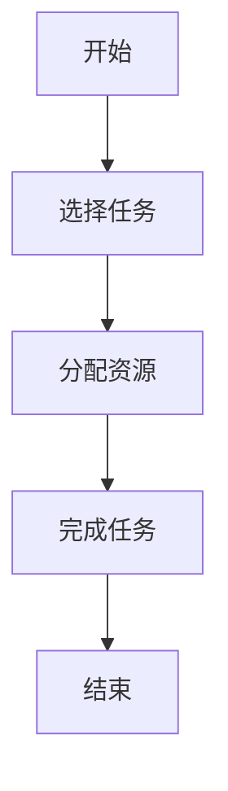
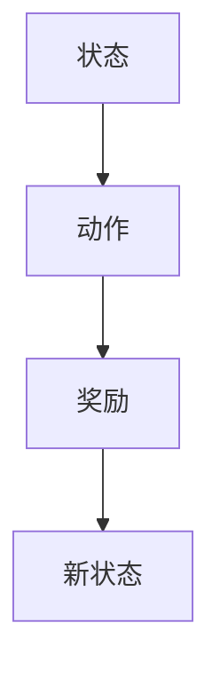
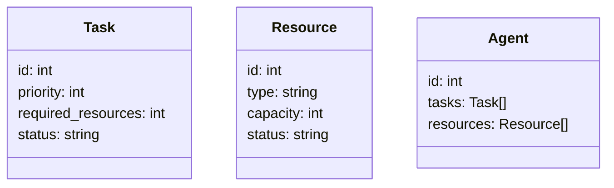
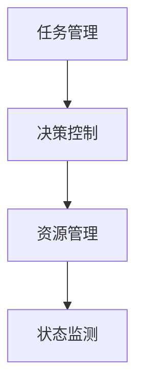
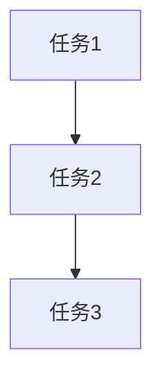

                 


# 设计AI Agent的动态任务分配策略

## 关键词：AI Agent、动态任务分配、多智能体系统、强化学习、任务调度

## 摘要：本文详细探讨了AI Agent动态任务分配的策略与实现。从理论背景到算法原理，从系统架构到项目实战，系统性地分析了AI Agent动态任务分配的核心问题，并通过具体案例展示了动态任务分配的实际应用。本文将帮助读者深入理解动态任务分配的原理与方法，掌握其实现技巧。

---

# 第1章: AI Agent与动态任务分配概述

## 1.1 AI Agent的基本概念

### 1.1.1 AI Agent的定义

AI Agent（人工智能代理）是指能够感知环境、自主决策并执行任务的智能实体。AI Agent可以是软件程序、机器人或其他智能系统，其核心目标是通过智能算法实现特定任务。

### 1.1.2 AI Agent的核心特征

- **自主性**：AI Agent能够在没有外部干预的情况下自主决策。
- **反应性**：AI Agent能够实时感知环境变化并做出响应。
- **目标导向**：AI Agent的行为以实现特定目标为导向。
- **学习能力**：AI Agent能够通过经验改进其决策能力。

### 1.1.3 AI Agent的应用场景

- **智能家居**：通过AI Agent实现设备的智能控制。
- **自动驾驶**：AI Agent用于车辆的环境感知和决策控制。
- **智能助手**：如Siri、Alexa等，通过AI Agent为用户提供服务。

## 1.2 动态任务分配的背景与意义

### 1.2.1 动态任务分配的定义

动态任务分配是指在运行过程中，根据环境变化和系统状态，实时调整任务分配策略的过程。

### 1.2.2 动态任务分配的重要性

在多智能体系统中，动态任务分配能够提高系统的灵活性和适应性，确保任务高效完成。

### 1.2.3 动态任务分配的挑战

- **任务优先级的动态变化**：任务的优先级可能因环境变化而改变。
- **资源约束**：系统资源有限，需合理分配以最大化效率。
- **不确定性**：环境的不确定性增加了任务分配的难度。

## 1.3 本章小结

本章介绍了AI Agent的基本概念及其应用场景，重点阐述了动态任务分配的背景、意义和挑战，为后续内容奠定了基础。

---

# 第2章: 动态任务分配的核心概念与原理

## 2.1 任务分配的基本要素

### 2.1.1 任务类型

- **简单任务**：如数据处理、信息检索等。
- **复杂任务**：如决策优化、策略制定等。

### 2.1.2 任务优先级

任务优先级是动态任务分配的重要依据，通常基于任务的紧急程度和重要性进行排序。

### 2.1.3 任务约束条件

任务的执行可能受到资源、时间、能力等多种约束条件的限制。

## 2.2 AI Agent的决策机制

### 2.2.1 基于规则的决策

基于预定义的规则进行任务分配，适用于任务关系简单、规则明确的场景。

### 2.2.2 基于学习的决策

通过机器学习模型（如强化学习）进行任务分配决策，适用于任务关系复杂、规则动态变化的场景。

### 2.2.3 基于优化的决策

通过数学优化方法（如线性规划）进行任务分配决策，适用于资源有限、目标明确的场景。

## 2.3 动态任务分配的数学模型

### 2.3.1 任务分配的数学表达式

$$
\text{最大化} \quad \sum_{i=1}^{n} w_i x_i
$$

$$
\text{约束条件} \quad \sum_{i=1}^{n} a_i x_i \leq A
$$

其中：
- $w_i$ 表示任务 $i$ 的权重
- $x_i$ 表示任务 $i$ 的分配情况（0或1）
- $a_i$ 表示任务 $i$ 的资源消耗
- $A$ 表示可用资源总量

### 2.3.2 任务分配的优化目标

动态任务分配的目标通常包括：
- **资源利用率最大化**：在有限资源下最大化任务完成量。
- **任务完成时间最小化**：在保证任务完成的前提下，尽可能缩短完成时间。
- **任务优先级平衡**：在多任务情况下，平衡任务的优先级。

## 2.4 核心概念对比表

| 概念         | 描述                                                                 |
|--------------|----------------------------------------------------------------------|
| 任务类型     | 任务的分类，如简单任务和复杂任务                                         |
| 任务优先级   | 任务的紧急程度和重要性                                                 |
| 任务约束条件 | 任务执行过程中受到的限制条件，如资源、时间等                           |

## 2.5 本章小结

本章详细阐述了动态任务分配的核心概念，包括任务的基本要素、AI Agent的决策机制以及数学模型，为后续的算法设计奠定了理论基础。

---

# 第3章: 动态任务分配的算法原理

## 3.1 常见的动态任务分配算法

### 3.1.1 基于贪心算法的任务分配

贪心算法通过局部最优选择逐步构建全局最优解，适用于任务关系简单、约束条件明确的场景。

### 3.1.2 基于动态规划的任务分配

动态规划算法通过将问题分解为子问题，逐层求解，适用于任务关系复杂、目标函数明确的场景。

### 3.1.3 基于强化学习的任务分配

强化学习算法通过试错学习，不断优化任务分配策略，适用于任务关系动态变化、环境不确定性较高的场景。

## 3.2 算法原理分析

### 3.2.1 贪心算法的工作流程



### 3.2.2 强化学习的算法流程



## 3.3 算法实现代码示例

### 3.3.1 贪心算法实现

```python
def greedy_algorithm(tasks, resources):
    # 任务排序
    tasks.sort(key=lambda x: x['priority'])
    # 分配资源
    for task in tasks:
        if resources >= task['required_resources']:
            allocate_resource(task, resources)
        else:
            break
```

### 3.3.2 强化学习算法实现

```python
import numpy as np

class Agent:
    def __init__(self, state_space_size, action_space_size):
        self.state_space_size = state_space_size
        self.action_space_size = action_space_size
        # 初始化策略网络
        self.policy_network = self.build_model()

    def build_model(self):
        # 网络结构定义
        pass

    def act(self, state):
        # 根据策略网络选择动作
        pass

    def update_policy(self, state, action, reward):
        # 更新策略网络
        pass
```

## 3.4 本章小结

本章详细分析了动态任务分配的常见算法及其工作原理，并通过代码示例展示了算法实现的关键步骤。

---

# 第4章: 动态任务分配的系统架构设计

## 4.1 系统架构概述

动态任务分配系统通常包括以下几个核心模块：
- **任务管理模块**：负责任务的接收、存储和管理。
- **资源管理模块**：负责系统资源的分配和调度。
- **决策控制模块**：负责任务分配策略的制定和执行。
- **状态监测模块**：负责系统状态的实时监测和反馈。

## 4.2 系统功能设计

### 4.2.1 领域模型设计



### 4.2.2 系统架构设计



## 4.3 系统接口设计

- **任务接口**：提供任务的创建、查询、更新和删除功能。
- **资源接口**：提供资源的分配、占用、释放功能。
- **决策接口**：提供任务分配策略的制定和执行功能。

## 4.4 本章小结

本章详细设计了动态任务分配系统的架构，包括系统功能模块、类图设计和系统架构图，为后续的实现提供了清晰的指导。

---

# 第5章: 动态任务分配的项目实战

## 5.1 项目背景介绍

本项目旨在实现一个多智能体系统的动态任务分配功能，通过强化学习算法优化任务分配策略。

## 5.2 系统核心实现

### 5.2.1 环境安装

```bash
pip install numpy matplotlib
```

### 5.2.2 核心代码实现

```python
import numpy as np

class TaskAllocator:
    def __init__(self, tasks, resources):
        self.tasks = tasks
        self.resources = resources

    def allocate(self):
        # 分配逻辑
        pass

# 示例任务和资源
tasks = [{'id': 1, 'priority': 2}, {'id': 2, 'priority': 1}]
resources = 10

allocator = TaskAllocator(tasks, resources)
allocator.allocate()
```

### 5.2.3 代码解读与分析

- **TaskAllocator类**：负责任务分配的核心逻辑。
- **allocate方法**：根据任务优先级和资源情况，动态分配任务。

## 5.3 实际案例分析

### 5.3.1 案例背景

假设有一个多智能体系统，包含3个智能体和5个任务，每个任务有不同的优先级和资源需求。

### 5.3.2 分配过程



## 5.4 本章小结

本章通过项目实战，详细展示了动态任务分配的实现过程，包括环境安装、核心代码实现和案例分析。

---

# 第6章: 最佳实践与注意事项

## 6.1 最佳实践 tips

- **任务优先级的动态调整**：根据实时状态调整任务优先级。
- **资源分配的灵活性**：在资源紧张时，优先分配高优先级任务。
- **算法选择的合理性**：根据场景选择合适的算法。

## 6.2 小结

动态任务分配是一个复杂的系统工程，需要综合考虑任务、资源、环境等多种因素。

## 6.3 注意事项

- **性能优化**：确保任务分配算法的高效性。
- **系统容错**：设计容错机制，确保系统健壮性。
- **安全性**：确保任务分配过程的安全性。

## 6.4 拓展阅读

- **强化学习**：进一步学习强化学习在动态任务分配中的应用。
- **分布式系统**：研究动态任务分配在分布式系统中的实现。

---

# 第7章: 未来展望与总结

## 7.1 未来展望

随着人工智能技术的不断发展，动态任务分配将更加智能化和自动化。未来的研究方向包括：
- **自适应算法**：开发更高效的自适应算法。
- **多目标优化**：实现多目标优化的任务分配。
- **边缘计算**：在边缘计算环境下实现动态任务分配。

## 7.2 总结

本文系统性地探讨了AI Agent动态任务分配的策略与实现，从理论到实践，全面分析了动态任务分配的核心问题。通过具体案例展示了动态任务分配的实际应用，为读者提供了宝贵的参考。

---

# 作者：AI天才研究院/AI Genius Institute & 禅与计算机程序设计艺术 /Zen And The Art of Computer Programming

