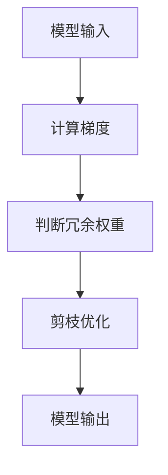
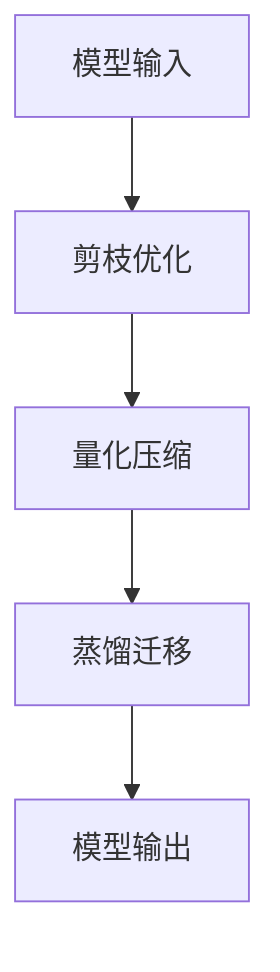
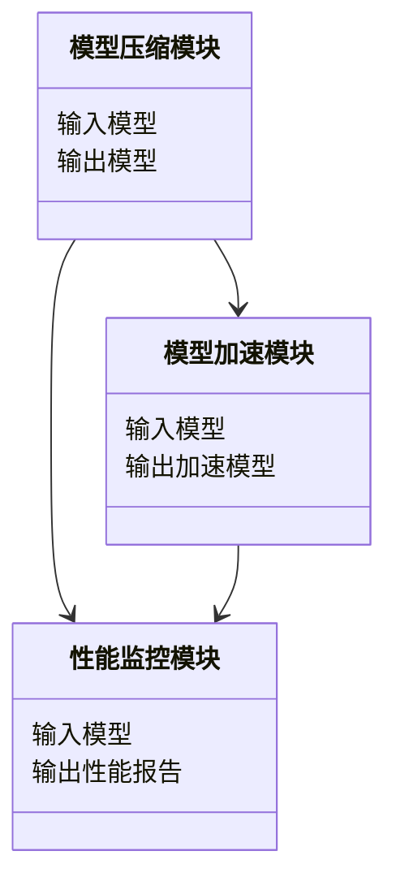
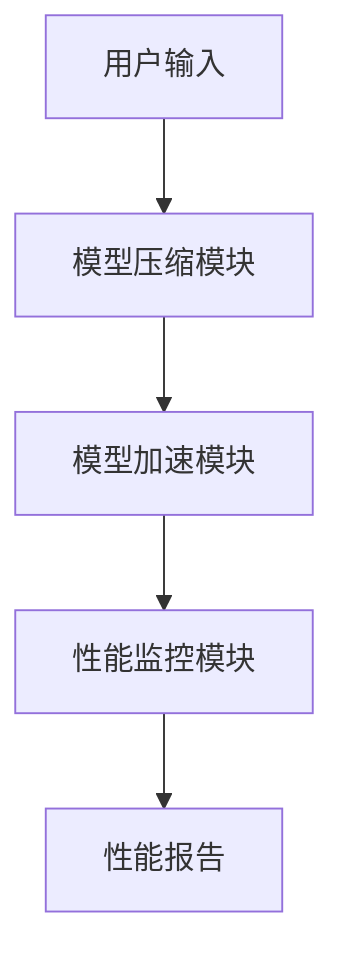
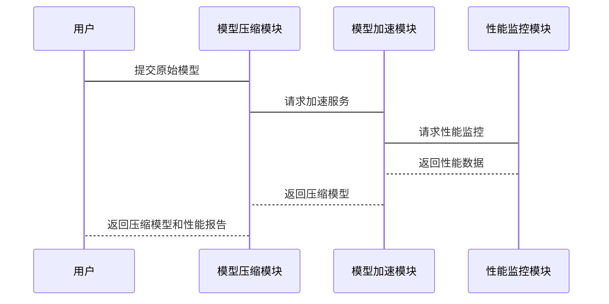

                 


### # 第3章: 动态模型压缩算法原理讲解

## ## 3.1 动态模型压缩算法的数学模型

### ### 3.1.1 模型压缩的数学公式
动态模型压缩的核心在于通过数学变换和优化，减少模型参数的数量，同时保持模型的性能。以下是一些常用的模型压缩数学公式：

1. **权重剪枝（Weight Pruning）**  
   权重剪枝通过去掉冗余的权重参数来降低模型的复杂度。剪枝过程通常基于梯度的大小进行判断，梯度较小的权重被认为是冗余的。  
   **公式：**  
   $$ \text{剪枝权重} = \{w | | \nabla L(w) | < \theta \} $$  
   其中，$\theta$ 是预设的阈值。

2. **激活剪枝（Activation Pruning）**  
   激活剪枝通过去掉对模型输出贡献较小的激活值来降低计算量。  
   **公式：**  
   $$ \text{保留激活} = \{a | a > \mu + 3\sigma\} $$  
   其中，$\mu$ 是激活值的均值，$\sigma$ 是标准差。

3. **知识蒸馏（Knowledge Distillation）**  
   知识蒸馏通过将大模型的知识迁移到小模型中，从而实现模型压缩。  
   **公式：**  
   $$ \mathcal{L}_{\text{distill}} = \alpha \mathcal{L}_{\text{CE}} + (1-\alpha)\mathcal{L}_{\text{KL}} $$  
   其中，$\mathcal{L}_{\text{CE}}$ 是交叉熵损失，$\mathcal{L}_{\text{KL}}$ 是KL散度，$\alpha$ 是平衡系数。

4. **量化（Quantization）**  
   量化通过将浮点数权重转化为低比特宽的整数，减少存储空间和计算量。  
   **公式：**  
   $$ w_{\text{quant}} = \text{round}(w \cdot 2^b) $$  
   其中，$b$ 是比特宽度。

### ### 3.1.2 模型压缩的数学实现
模型压缩的数学实现通常涉及以下步骤：
1. 计算模型的梯度或激活值。
2. 根据预设阈值或统计量（如均值、方差）筛选冗余参数。
3. 对筛选出的参数进行剪枝或量化。
4. 对剪枝后的模型进行微调，恢复其性能。

**流程图：**



### ### 3.1.3 模型压缩的Python实现
以下是基于权重剪枝的Python代码示例：

```python
import torch

def weight_pruning(model, threshold=0.1):
    # 计算梯度的绝对值
    for param in model.parameters():
        mask = torch.abs(param.grad) < threshold
        param.data.mul_(mask.float())
```

## ## 3.2 动态模型压缩算法的具体实现

### ### 3.2.1 剪枝算法实现
剪枝算法通过去除冗余的神经元或权重来降低模型复杂度。以下是一个简单的剪枝算法实现：

**流程图：**


### ### 3.2.2 量化算法实现
量化算法通过将权重转化为低比特宽的整数来减少存储空间和计算量。以下是量化算法的实现示例：

```python
def quantize(weights, bit_width=8):
    # 确定量化范围
    max_weight = torch.max(torch.abs(weights))
    quant_step = max_weight / (2**bit_width - 1)
    # 量化权重
    quantized_weights = torch.round(weights / quant_step) * quant_step
    return quantized_weights
```

### ### 3.2.3 蒸馏算法实现
蒸馏算法通过将大模型的知识迁移到小模型中，从而实现模型压缩。以下是蒸馏算法的实现示例：

```python
def distillation_loss(student, teacher, alpha=0.5):
    # 计算交叉熵损失
    ce_loss = torch.nn.CrossEntropyLoss()(student, teacher_labels)
    # 计算KL散度
    kl_loss = torch.nn.KLDivLoss()(F.log_softmax(student, dim=1), F.softmax(teacher, dim=1))
    # 综合损失
    total_loss = alpha * ce_loss + (1 - alpha) * kl_loss
    return total_loss
```

## ## 3.3 动态模型压缩算法的性能评估

### ### 3.3.1 模型压缩效果评估指标
模型压缩效果通常通过以下指标进行评估：
- **参数数量（Parameter Count）**：压缩后的模型参数数量。
- **模型准确率（Accuracy）**：压缩后模型的性能。
- **推理速度（Inference Speed）**：压缩对模型推理速度的影响。

### ### 3.3.2 模型压缩算法的对比分析
以下是几种常见的模型压缩算法的对比分析表格：

| 算法名称      | 参数减少比例 | 准确率下降 | 优点                          | 缺点                          |
|---------------|--------------|------------|-------------------------------|-------------------------------|
| 权重剪枝      | 50%-70%      | 5%-10%     | 参数减少明显，计算速度快       | 准确率下降较大                 |
| 激活剪枝      | 30%-50%      | 3%-7%      | 参数减少适中，准确率保留较好     | 参数减少比例不如权重剪枝       |
| 知识蒸馏      | 30%-50%      | 2%-5%      | 准确率保留较好                 | 对教师模型依赖较大             |
| 量化          | 20%-40%      | 5%-15%     | 存储空间减少，计算速度快         | 对某些模型效果不佳               |

## ## 3.4 动态模型压缩算法的优化策略

### ### 3.4.1 动态剪枝策略
动态剪枝策略根据模型的运行时特征（如梯度、激活值）动态调整剪枝力度，以平衡模型压缩与性能之间的关系。

**公式：**  
$$ \theta_{\text{动态}} = \theta_{\text{初始}} \cdot e^{-kt} $$  
其中，$k$ 是衰减系数，$t$ 是训练轮数。

### ### 3.4.2 自适应量化策略
自适应量化策略根据模型参数的分布动态调整量化比特宽度，以在不同参数上实现最佳压缩效果。

**公式：**  
$$ b_{\text{动态}} = \text{argmin}_b \mathcal{L}(w_{\text{quant}}, b) $$  
其中，$b$ 是比特宽度，$\mathcal{L}$ 是量化损失函数。

### ### 3.4.3 混合压缩策略
混合压缩策略结合多种压缩技术（如剪枝、量化、蒸馏）进行模型压缩，以实现更好的压缩效果和性能。

**流程图：**



---

# 第4章: 系统分析与架构设计方案

## ## 4.1 系统分析与架构设计概述

### ### 4.1.1 系统分析
动态模型压缩与加速系统通常包括以下组成部分：
1. **模型压缩模块**：负责对原始模型进行压缩，减少参数数量。
2. **模型加速模块**：负责对压缩后的模型进行优化，提升推理速度。
3. **性能监控模块**：负责监控模型压缩和加速后的性能表现。

### ### 4.1.2 系统架构设计
动态模型压缩与加速系统的架构设计需要考虑以下几点：
1. **模块划分**：明确各模块的功能和接口。
2. **数据流设计**：确保数据在各模块之间的高效流动。
3. **性能优化**：通过并行计算、缓存优化等方式提升系统性能。

## ## 4.2 系统功能设计

### ### 4.2.1 领域模型设计
以下是动态模型压缩与加速系统的领域模型：



### ### 4.2.2 系统架构设计
以下是动态模型压缩与加速系统的架构图：



### ### 4.2.3 系统接口设计
系统接口设计需要考虑以下几点：
1. **输入接口**：接收原始模型和配置参数。
2. **输出接口**：输出压缩后的模型和性能报告。
3. **监控接口**：实时监控模型压缩和加速过程中的性能表现。

### ### 4.2.4 系统交互流程设计
以下是系统交互流程的序列图：



## ## 4.3 系统优化与实现

### ### 4.3.1 系统优化策略
1. **并行计算**：利用多线程或分布式计算提升模型压缩和加速的速度。
2. **缓存优化**：通过缓存技术减少数据访问时间，提升系统性能。
3. **算法优化**：对模型压缩算法进行优化，提升压缩效率。

### ### 4.3.2 系统实现细节
以下是系统实现的关键细节：
1. **模型压缩模块**：实现多种模型压缩算法（如剪枝、量化、蒸馏）。
2. **模型加速模块**：优化模型的推理过程，提升计算速度。
3. **性能监控模块**：实时监控模型压缩和加速过程中的性能表现，生成性能报告。

## ## 4.4 系统性能分析

### ### 4.4.1 系统性能指标
系统性能指标包括：
1. **压缩比（Compression Ratio）**：压缩后的模型大小与原始模型大小的比值。
2. **推理速度（Inference Speed）**：压缩后模型的推理速度。
3. **准确率（Accuracy）**：压缩后模型的性能表现。

### ### 4.4.2 系统性能优化
系统性能优化可以通过以下方式实现：
1. **算法优化**：改进模型压缩算法，提升压缩效果。
2. **硬件优化**：利用硬件加速技术（如GPU、TPU）提升系统性能。
3. **并行优化**：通过并行计算技术提升系统吞吐量。

---

接下来是第5章到第9章的内容，涵盖项目实战、最佳实践、案例分析与优化、未来趋势以及总结展望等部分。每一章都将按照上述逻辑展开，结合实际案例和代码示例，详细讲解动态模型压缩与加速的实现细节和应用实践。

