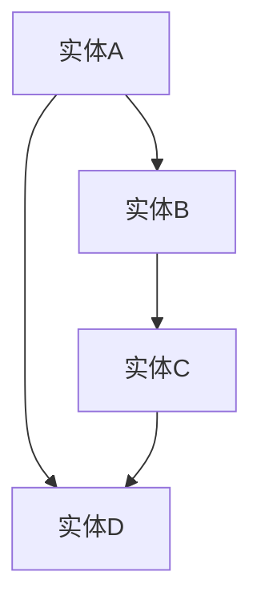
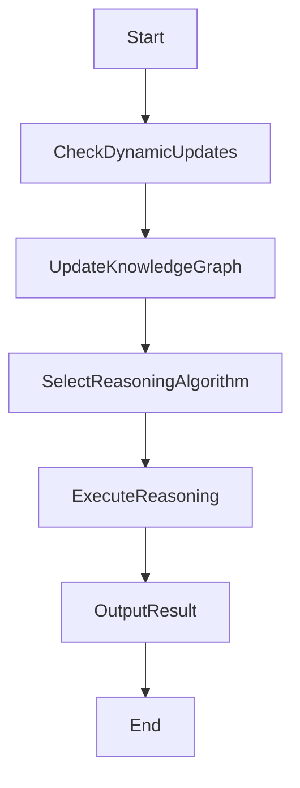
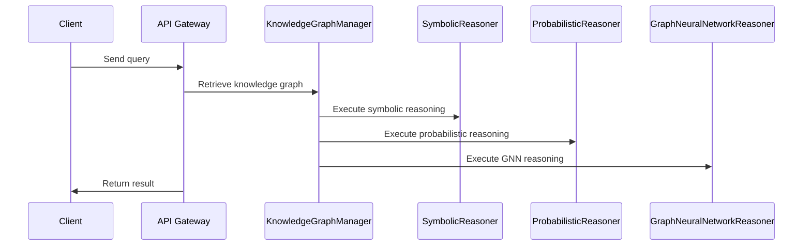

                 


# 设计AI Agent的动态知识图谱推理引擎

> **关键词**: AI Agent, 动态知识图谱, 推理引擎, 知识图谱构建, 动态推理  
> **摘要**: 本文详细探讨了设计AI Agent动态知识图谱推理引擎的核心概念、算法原理、系统架构及项目实现。从背景介绍到项目实战，系统阐述了引擎的构建过程，结合具体案例分析，为AI Agent的动态知识推理提供了理论与实践指导。

---

## 第一部分：背景介绍

### 第1章：AI Agent与动态知识图谱概述

#### 1.1 问题背景
- **1.1.1 当前AI Agent的局限性**
  - AI Agent在处理复杂动态环境中的知识推理时，往往依赖静态知识库，难以适应实时变化。
- **1.1.2 知识图谱在AI Agent中的作用**
  - 知识图谱提供结构化的知识表示，帮助AI Agent理解和推理复杂关系。
- **1.1.3 动态知识图谱推理的必要性**
  - 动态环境要求AI Agent能够实时更新和推理知识图谱，以应对变化。

#### 1.2 问题描述
- **1.2.1 AI Agent面临的动态知识挑战**
  - 动态环境中的信息变化频繁，传统静态推理无法满足需求。
- **1.2.2 知识图谱推理的复杂性**
  - 知识图谱的规模和复杂性增加推理难度。
- **1.2.3 动态环境下的推理需求**
  - AI Agent需要实时更新知识图谱并进行动态推理。

#### 1.3 问题解决
- **1.3.1 动态知识图谱推理引擎的设计目标**
  - 实现知识图谱的动态更新和实时推理。
- **1.3.2 引擎的核心功能与价值**
  - 提供高效的动态推理能力，增强AI Agent的智能性。
- **1.3.3 引擎的适用场景与边界**
  - 适用于需要实时动态推理的场景，如智能推荐、实时监控等。

#### 1.4 概念结构与核心要素
- **1.4.1 知识图谱的基本组成**
  - 实体、关系、属性三者构成知识图谱的基础。
- **1.4.2 动态推理引擎的关键要素**
  - 动态更新机制、推理算法、推理策略。
- **1.4.3 引擎与AI Agent的交互关系**
  - 引擎为AI Agent提供动态推理支持，AI Agent调用引擎进行推理。

---

## 第二部分：核心概念与联系

### 第2章：知识图谱与动态推理引擎

#### 2.1 知识图谱的核心原理
- **2.1.1 知识图谱的构建过程**
  - 数据收集、实体识别、关系抽取、知识融合。
- **2.1.2 实体与关系的定义**
  - 实体是知识图谱的基本单元，关系描述实体间的联系。
- **2.1.3 知识图谱的动态更新机制**
  - 实时更新数据源，维护知识图谱的最新性。

#### 2.2 动态推理引擎的原理
- **2.2.1 动态推理的基本概念**
  - 在动态变化的知识图谱中进行实时推理。
- **2.2.2 引擎的推理策略与算法**
  - 符号逻辑推理、概率推理、图神经网络推理。
- **2.2.3 引擎的动态适应能力**
  - 根据环境变化自适应调整推理策略。

#### 2.3 核心概念对比
- **2.3.1 知识图谱与传统数据库的对比**
  - 知识图谱是语义网络，数据库是结构化数据存储。
- **2.3.2 动态推理与静态推理的差异**
  - 动态推理实时更新，静态推理基于固定数据。
- **2.3.3 引擎与规则引擎的区别**
  - 引擎支持动态知识，规则引擎基于固定规则。

#### 2.4 实体关系图


---

## 第三部分：算法原理讲解

### 第3章：动态推理算法与实现

#### 3.1 符号逻辑推理
- **3.1.1 算法原理**
  - 基于谓词逻辑的推理，通过规则匹配进行推导。
- **3.1.2 实现步骤**
  - 建立知识库，定义推理规则，执行规则匹配。
- **3.1.3 优缺点**
  - 优点：逻辑清晰，结果确定。
  - 缺点：难以处理模糊和不确定信息。

#### 3.2 概率推理
- **3.2.1 算法原理**
  - 使用概率模型（如贝叶斯网络）进行推理。
- **3.2.2 实现步骤**
  - 构建概率图模型，计算概率分布，进行概率推断。
- **3.2.3 优缺点**
  - 优点：处理不确定性问题能力强。
  - 缺点：计算复杂度高。

#### 3.3 图神经网络推理
- **3.3.1 算法原理**
  - 利用图神经网络处理知识图谱结构。
- **3.3.2 实现步骤**
  - 构建图神经网络模型，训练模型，进行推理。
- **3.3.3 优缺点**
  - 优点：适合大规模图数据，表达能力强。
  - 缺点：训练数据需求大，计算资源消耗高。

#### 3.4 动态推理流程


#### 3.5 算法实现代码
```python
def symbolic_reasoning(knowledge_graph, query):
    # 简单符号逻辑推理实现
    result = None
    for rule in knowledge_graph.rules:
        if rule.matches(query):
            result = rule.infer(query)
            break
    return result

# 示例推理规则
class Rule:
    def matches(self, query):
        # 示例匹配逻辑
        return True
    def infer(self, query):
        # 示例推理逻辑
        return "Inferred result"
```

---

## 第四部分：系统分析与架构设计

### 第4章：系统架构与实现

#### 4.1 问题场景介绍
- **4.1.1 系统需求**
  - 动态更新知识图谱，支持实时推理。
- **4.1.2 使用场景**
  - 智能问答、推荐系统、实时监控等。

#### 4.2 系统功能设计
- **4.2.1 功能模块**
  - 知识图谱管理模块、推理引擎模块、接口模块。
- **4.2.2 功能描述**
  - 知识图谱管理：构建、更新、查询。
  - 推理引擎：符号推理、概率推理、图神经网络推理。
  - 接口模块：提供API访问。

#### 4.3 系统架构设计
```mermaid
graph LR
    Client --> API Gateway
    API Gateway --> KnowledgeGraphManager
    KnowledgeGraphManager --> SymbolicReasoner
    KnowledgeGraphManager --> ProbabilisticReasoner
    KnowledgeGraphManager --> GraphNeuralNetworkReasoner
    SymbolicReasoner --> Result
    ProbabilisticReasoner --> Result
    GraphNeuralNetworkReasoner --> Result
    Result --> API Gateway
    API Gateway --> Client
```

#### 4.4 系统交互流程


---

## 第五部分：项目实战

### 第5章：项目实现与案例分析

#### 5.1 环境安装
- **5.1.1 安装Python环境**
  - 安装Python 3.8及以上版本。
- **5.1.2 安装依赖库**
  - `networkx`, `numpy`, `scikit-learn`, `pymermaid`.

#### 5.2 核心代码实现
```python
import networkx as nx

class KnowledgeGraphManager:
    def __init__(self):
        self.graph = nx.Graph()

    def add_entity(self, entity):
        self.graph.add_node(entity)

    def add_relation(self, source, target):
        self.graph.add_edge(source, target)

    def update_graph(self, data):
        # 更新知识图谱
        pass

class SymbolicReasoner:
    def __init__(self, graph):
        self.graph = graph

    def infer(self, query):
        # 符号逻辑推理
        pass
```

#### 5.3 代码解读与分析
- **5.3.1 知识图谱管理类**
  - 管理知识图谱的构建与更新。
- **5.3.2 符号推理类**
  - 基于规则进行推理，返回推理结果。
- **5.3.3 概率推理类**
  - 使用贝叶斯网络进行推理，处理不确定性。

#### 5.4 实际案例分析
- **5.4.1 案例背景**
  - 设备监控系统，实时更新设备状态。
- **5.4.2 数据处理**
  - 收集设备数据，更新知识图谱。
- **5.4.3 推理过程**
  - 基于符号推理，判断设备状态异常。

#### 5.5 项目小结
- **5.5.1 核心实现总结**
  - 成功实现动态知识图谱管理与推理。
- **5.5.2 问题与优化**
  - 知识图谱的动态更新效率有待提升。
  - 推理算法的性能优化空间存在。

---

## 第六部分：总结与展望

### 第6章：总结与展望

#### 6.1 总结
- 本文详细阐述了AI Agent动态知识图谱推理引擎的设计与实现，从背景到项目实战，系统地介绍了引擎的核心概念、算法原理、系统架构及实现细节。

#### 6.2 当前技术的局限性
- 知识图谱的动态更新效率有待提升。
- 复杂场景下的推理算法性能不足。

#### 6.3 未来展望
- 结合边缘计算，优化动态更新效率。
- 研究更高效的推理算法，提升引擎性能。

#### 6.4 最佳实践 tips
- 定期更新知识图谱，保持数据准确性。
- 根据场景选择合适的推理算法，优化性能。

---

## 作者：AI天才研究院/AI Genius Institute & 禅与计算机程序设计艺术 /Zen And The Art of Computer Programming

---

**版权声明：** 本文版权归作者所有，未经授权不得转载。

