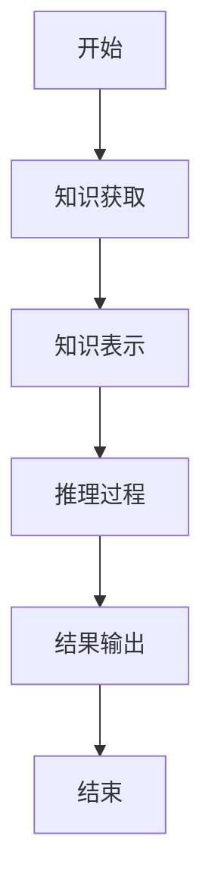
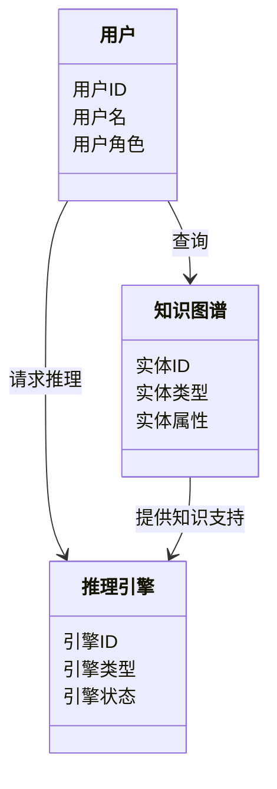
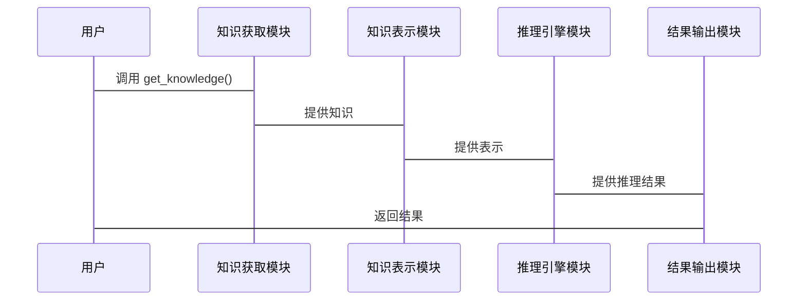

                 


# 设计AI Agent的动态知识图谱推理引擎

> 关键词：AI Agent，动态知识图谱，推理引擎，知识图谱推理，动态推理

> 摘要：  
AI Agent的动态知识图谱推理引擎是实现智能系统核心能力的关键技术。本文将详细探讨AI Agent的动态知识图谱推理引擎的设计与实现，从背景介绍到系统架构设计，从算法原理到项目实战，系统地分析这一技术的核心要素与实现细节。通过本文的学习，读者将能够理解并掌握如何设计和实现一个高效、可靠的动态知识图谱推理引擎，为AI Agent提供强大的知识处理能力。

---

## 第一部分: AI Agent与知识图谱概述

### 第1章: AI Agent的背景与概念

#### 1.1 问题背景
##### 1.1.1 当前AI Agent的发展现状
AI Agent（人工智能代理）是实现智能化系统的核心技术，近年来随着深度学习、自然语言处理和知识图谱技术的快速发展，AI Agent的能力得到了显著提升。然而，现有的AI Agent在动态环境下的知识处理能力仍存在不足，特别是在面对实时变化的知识和复杂推理任务时，传统的静态知识图谱推理引擎难以满足需求。

##### 1.1.2 动态知识图谱推理引擎的必要性
在动态环境中，知识图谱需要实时更新和扩展，推理引擎需要能够快速适应这些变化，以支持AI Agent的实时决策和交互能力。传统的静态知识图谱推理引擎在面对动态变化时，会出现推理效率下降、结果不准确等问题，因此设计一个能够处理动态知识图谱的推理引擎变得尤为重要。

##### 1.1.3 问题解决的思路与方法
动态知识图谱推理引擎的设计需要结合知识图谱的动态更新、实时推理和高效查询等特点，通过引入增量式推理、在线更新和自适应优化等技术，实现对动态知识图谱的高效推理。

#### 1.2 问题描述
##### 1.2.1 AI Agent的核心问题
AI Agent的核心问题在于如何高效地处理和利用动态变化的知识图谱，以支持实时决策和交互。这需要AI Agent具备动态知识获取、动态推理和动态知识更新的能力。

##### 1.2.2 知识图谱推理引擎的关键挑战
知识图谱推理引擎的关键挑战在于如何在动态环境下保持推理的高效性和准确性，同时支持大规模知识图谱的实时更新和查询。

##### 1.2.3 问题解决
通过设计一个动态知识图谱推理引擎，可以实时更新知识图谱，并支持动态推理，从而解决AI Agent在动态环境下的知识处理问题。

#### 1.3 问题解决
##### 1.3.1 AI Agent的解决方案
AI Agent的解决方案包括动态知识图谱的构建、增量式推理算法的设计以及高效的知识查询与更新机制。

##### 1.3.2 知识图谱推理引擎的设计思路
知识图谱推理引擎的设计思路包括动态知识图谱的表示、增量式推理算法的实现以及高效的查询与更新机制的设计。

##### 1.3.3 动态知识图谱推理引擎的实现方法
动态知识图谱推理引擎的实现方法包括知识图谱的动态更新、增量式推理算法的实现以及高效的查询与更新机制的设计。

#### 1.4 边界与外延
##### 1.4.1 AI Agent的边界
AI Agent的边界包括知识获取、推理、决策和交互等核心功能，不涉及具体的应用场景和外部系统的集成。

##### 1.4.2 知识图谱推理引擎的外延
知识图谱推理引擎的外延包括知识图谱的构建、推理算法的设计以及推理结果的应用，涉及动态环境下的知识更新和推理优化。

##### 1.4.3 动态知识图谱推理引擎的应用范围
动态知识图谱推理引擎的应用范围包括智能问答系统、实时信息处理系统、动态知识库管理等领域。

#### 1.5 概念结构与核心要素
##### 1.5.1 AI Agent的核心要素
AI Agent的核心要素包括知识获取、推理、决策和交互能力。

##### 1.5.2 知识图谱推理引擎的组成
知识图谱推理引擎的组成包括知识表示、推理算法、查询与更新机制。

##### 1.5.3 动态知识图谱推理引擎的结构
动态知识图谱推理引擎的结构包括动态知识图谱的构建、增量式推理算法的设计以及高效的查询与更新机制。

---

### 第2章: 核心概念与联系

#### 2.1 核心概念原理
##### 2.1.1 AI Agent的工作原理
AI Agent通过知识获取、推理、决策和交互等核心功能，实现对动态环境的实时响应和决策。

##### 2.1.2 知识图谱推理引擎的基本原理
知识图谱推理引擎通过知识表示、推理算法和查询机制，实现对知识图谱的推理和查询。

##### 2.1.3 动态知识图谱推理引擎的独特机制
动态知识图谱推理引擎通过动态知识图谱的构建、增量式推理和高效查询机制，实现对动态环境下的实时推理。

#### 2.2 概念属性特征对比
##### 2.2.1 AI Agent与传统AI的区别
AI Agent具有更强的动态适应能力和实时决策能力，而传统AI主要关注静态环境下的任务处理。

##### 2.2.2 知识图谱推理引擎与传统推理引擎的对比
知识图谱推理引擎具有更强的动态适应能力和知识表示能力，而传统推理引擎主要关注静态知识库的推理。

##### 2.2.3 动态知识图谱推理引擎的特征分析
动态知识图谱推理引擎具有动态知识更新、增量式推理和高效查询的特点。

#### 2.3 ER实体关系图架构
```mermaid
erDiagram
    actor 用户 {
        string 用户ID
        string 用户名
        string 用户角色
    }
    entity 知识图谱 {
        string 实体ID
        string 实体类型
        string 实体属性
    }
    entity 推理引擎 {
        string 引擎ID
        string 引擎类型
        string 引擎状态
    }
    用户 --> 知识图谱 : 查询
    用户 --> 推理引擎 : 请求推理
    知识图谱 --> 推理引擎 : 提供知识支持
```

---

### 第3章: 算法原理讲解

#### 3.1 算法原理


#### 3.2 Python源代码实现
```python
def dynamic_knowledge_graph_reasoning_engine():
    # 知识获取
    knowledge = get_knowledge()
    # 知识表示
    representation = represent_knowledge(knowledge)
    # 推理过程
    result = infer(representation)
    # 结果输出
    return result

def get_knowledge():
    # 知识获取逻辑
    pass

def represent_knowledge(knowledge):
    # 知识表示逻辑
    pass

def infer(representation):
    # 推理逻辑
    pass
```

#### 3.3 数学模型与公式
动态知识图谱推理引擎的数学模型可以表示为：
$$
P(h, r, t) = f(h, r, t)
$$
其中，$h$ 是头实体，$r$ 是关系，$t$ 是尾实体，$f$ 是推理函数。

---

## 第4章: 系统分析与架构设计

### 4.1 系统分析
#### 4.1.1 问题场景介绍
动态知识图谱推理引擎需要支持实时知识更新、高效推理和动态查询，以应对动态环境下的知识处理需求。

#### 4.1.2 项目介绍
本项目旨在设计和实现一个动态知识图谱推理引擎，支持AI Agent在动态环境下的实时推理和决策。

#### 4.1.3 系统功能设计
##### 4.1.3.1 功能模块划分
系统功能模块包括知识获取、知识表示、推理过程和结果输出。

##### 4.1.3.2 领域模型


#### 4.1.4 系统架构设计
##### 4.1.4.1 系统架构图


#### 4.1.5 系统接口设计
##### 4.1.5.1 接口定义
- 知识获取接口：`get_knowledge()`
- 知识表示接口：`represent_knowledge()`
- 推理接口：`infer()`
- 结果输出接口：`output_result()`

##### 4.1.5.2 交互序列图


---

## 第5章: 项目实战

### 5.1 环境安装与配置
##### 5.1.1 环境需求
- Python 3.8+
- 知识图谱构建工具（如Ubergraph）
- 推理引擎框架（如PyTorch）

##### 5.1.2 安装依赖
```bash
pip install numpy
pip install networkx
pip install py2neo
```

### 5.2 核心代码实现
#### 5.2.1 知识获取模块
```python
def get_knowledge():
    # 知识获取逻辑
    pass
```

#### 5.2.2 知识表示模块
```python
def represent_knowledge(knowledge):
    # 知识表示逻辑
    pass
```

#### 5.2.3 推理引擎模块
```python
def infer(representation):
    # 推理逻辑
    pass
```

#### 5.2.4 结果输出模块
```python
def output_result(result):
    # 结果输出逻辑
    pass
```

### 5.3 案例分析与实现解读
##### 5.3.1 案例场景
动态知识图谱推理引擎在智能问答系统中的应用。

##### 5.3.2 代码实现解读
通过实现动态知识图谱推理引擎的核心模块，展示如何在实际场景中应用这些技术。

### 5.4 项目总结
通过本项目，我们可以看到动态知识图谱推理引擎在实际应用中的重要性，以及其设计与实现的关键技术。

---

## 第6章: 最佳实践与小结

### 6.1 最佳实践 tips
- 定期更新知识图谱，以保持推理的准确性。
- 使用增量式推理算法，以提高推理效率。
- 优化查询与更新机制，以提高系统的响应速度。

### 6.2 小结
动态知识图谱推理引擎是实现AI Agent核心能力的关键技术。通过本文的分析与实现，读者可以掌握设计和实现动态知识图谱推理引擎的核心技术。

### 6.3 注意事项
- 确保知识图谱的实时更新，以支持动态推理。
- 注意推理算法的效率，避免影响系统的性能。
- 定期维护知识图谱，以确保其准确性和完整性。

### 6.4 拓展阅读
- 《知识图谱构建与应用》
- 《动态知识图谱推理算法研究》
- 《AI Agent设计与实现》

---

## 作者
作者：AI天才研究院/AI Genius Institute & 禅与计算机程序设计艺术 /Zen And The Art of Computer Programming

