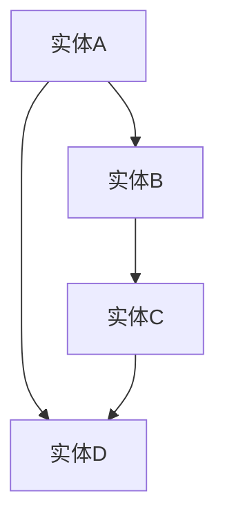
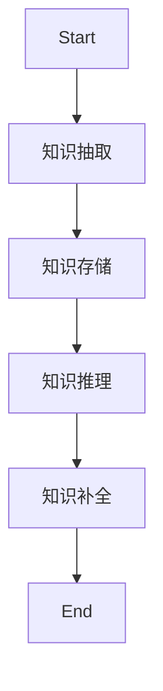
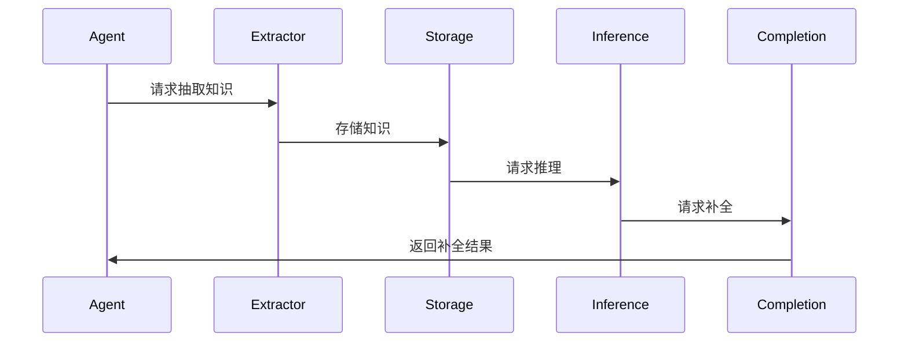

                 


# 设计AI Agent的动态知识图谱补全技术

> 关键词：AI Agent, 知识图谱, 动态知识图谱, 补全技术, 知识推理

> 摘要：本文详细探讨了设计AI Agent的动态知识图谱补全技术，从核心概念到算法实现，再到系统架构和项目实战，全面解析了这一技术的原理和应用。文章内容包括背景介绍、核心概念、算法原理、系统分析、项目实战、最佳实践等部分，旨在为读者提供系统的知识和实用的指导。

---

# 目录

## 第1章 背景介绍与核心概念

### 1.1 问题背景
1.1.1 知识图谱的定义与特点  
1.1.2 AI Agent的基本概念  
1.1.3 动态知识图谱的特性  

### 1.2 问题描述
1.2.1 知识图谱补全的必要性  
1.2.2 动态环境下的知识更新挑战  
1.2.3 AI Agent在知识图谱中的作用  

### 1.3 问题解决
1.3.1 知识图谱补全的核心方法  
1.3.2 AI Agent在动态知识更新中的应用  
1.3.3 动态知识图谱补全的实现步骤  

### 1.4 边界与外延
1.4.1 知识图谱补全的边界条件  
1.4.2 动态知识图谱的外延应用  
1.4.3 AI Agent与其他技术的结合  

### 1.5 核心要素组成
1.5.1 知识图谱的核心要素  
1.5.2 AI Agent的功能模块  
1.5.3 动态知识图谱的组成结构  

---

## 第2章 核心概念与联系

### 2.1 动态知识图谱补全技术的原理
2.1.1 知识抽取与存储  
2.1.2 知识推理与补全  
2.1.3 动态更新机制  

### 2.2 核心概念对比
2.2.1 知识图谱与传统数据库的对比  
2.2.2 AI Agent与传统知识推理的区别  
2.2.3 动态知识图谱与其他动态数据结构的对比  

### 2.3 ER实体关系图


---

## 第3章 算法原理讲解

### 3.1 算法流程图


### 3.2 算法实现代码
```python
def knowledge_completion(kg, agent):
    # 知识抽取
    extracted_kg = kg.extract_knowledge()
    
    # 知识存储
    stored_kg = kg.store_knowledge(extracted_kg)
    
    # 知识推理
    inferred_kg = kg.infer_knowledge(stored_kg)
    
    # 知识补全
    completed_kg = kg.complete_knowledge(inferred_kg, agent)
    
    return completed_kg
```

### 3.3 数学模型与公式
$$ P(e_1, e_2) = \frac{C(e_1, e_2)}{N} $$  
其中，$C(e_1, e_2)$ 是实体 $e_1$ 和 $e_2$ 的共现次数，$N$ 是总样本数。

---

## 第4章 系统分析与架构设计

### 4.1 问题场景介绍
4.1.1 知识图谱的应用场景  
4.1.2 AI Agent的动态知识更新需求  

### 4.2 系统功能设计
4.2.1 知识抽取模块  
4.2.2 知识存储模块  
4.2.3 知识推理模块  
4.2.4 知识补全模块  

### 4.3 系统架构设计


### 4.4 系统接口设计
4.4.1 API接口定义  
4.4.2 接口调用流程  

### 4.5 系统交互序列图


---

## 第5章 项目实战

### 5.1 环境配置
5.1.1 Python版本要求  
5.1.2 依赖库安装（如networkx、scikit-learn）  

### 5.2 核心代码实现
```python
def main():
    kg = KnowledgeGraph()
    agent = AIAgent()
    completed_kg = knowledge_completion(kg, agent)
    print("知识图谱补全完成。")
```

### 5.3 代码应用解读
5.3.1 代码功能分析  
5.3.2 代码运行结果展示  

### 5.4 实际案例分析
5.4.1 案例背景介绍  
5.4.2 案例分析与解决  

### 5.5 项目小结
5.5.1 项目总结  
5.5.2 经验与教训  

---

## 第6章 最佳实践与小结

### 6.1 最佳实践
6.1.1 数据质量的重要性  
6.1.2 算法选择的策略  
6.1.3 系统的可扩展性  

### 6.2 小结
6.2.1 核心技术回顾  
6.2.2 未来研究方向  

### 6.3 注意事项
6.3.1 数据安全问题  
6.3.2 算法性能优化  

### 6.4 拓展阅读
6.4.1 推荐书籍与论文  
6.4.2 其他相关资源  

---

## 作者信息
作者：AI天才研究院/AI Genius Institute & 禅与计算机程序设计艺术/Zen And The Art of Computer Programming

---

# 文章正文

## 第1章 背景介绍与核心概念

### 1.1 问题背景

#### 1.1.1 知识图谱的定义与特点
知识图谱是一种以图结构表示知识的语义网络，由节点（实体）和边（关系）组成。其特点包括语义丰富、结构化、可扩展性强等。

#### 1.1.2 AI Agent的基本概念
AI Agent（人工智能代理）是指在特定环境中能够感知并自主行动以实现目标的智能体。AI Agent可以通过与环境交互来执行任务。

#### 1.1.3 动态知识图谱的特性
动态知识图谱是指随着时间推移不断更新和变化的知识图谱。其特性包括实时性、动态性、不确定性等。

### 1.2 问题描述

#### 1.2.1 知识图谱补全的必要性
知识图谱可能因为数据缺失或更新不及时而导致信息不完整，补全技术可以弥补这一不足。

#### 1.2.2 动态环境下的知识更新挑战
在动态环境中，知识图谱需要实时更新以反映最新信息，这对AI Agent提出了更高的要求。

#### 1.2.3 AI Agent在知识图谱中的作用
AI Agent可以通过感知环境变化，主动触发知识图谱的更新和补全，提高系统的智能化水平。

### 1.3 问题解决

#### 1.3.1 知识图谱补全的核心方法
知识图谱补全可以通过基于规则的推理、基于深度学习的模型以及混合方法来实现。

#### 1.3.2 AI Agent在动态知识更新中的应用
AI Agent可以监控环境变化，触发知识图谱的更新，并通过推理引擎进行补全。

#### 1.3.3 动态知识图谱补全的实现步骤
1. 知识抽取：从数据源中提取实体和关系。  
2. 知识存储：将抽取的知识存储到知识图谱中。  
3. 知识推理：通过推理引擎进行推理，发现缺失的知识。  
4. 知识补全：利用推理结果，补全知识图谱。  

### 1.4 边界与外延

#### 1.4.1 知识图谱补全的边界条件
知识图谱补全仅处理知识图谱本身的信息，不涉及外部数据源的整合。

#### 1.4.2 动态知识图谱的外延应用
动态知识图谱可以应用于实时数据分析、智能推荐、实时监控等领域。

#### 1.4.3 AI Agent与其他技术的结合
AI Agent可以与大数据技术、分布式系统等结合，提升系统的综合能力。

### 1.5 核心要素组成

#### 1.5.1 知识图谱的核心要素
知识图谱由实体、关系、属性三部分组成。

#### 1.5.2 AI Agent的功能模块
AI Agent通常包括感知模块、推理模块、执行模块和学习模块。

#### 1.5.3 动态知识图谱的组成结构
动态知识图谱由实体、关系、时间戳和版本控制四部分组成。

---

## 第2章 核心概念与联系

### 2.1 动态知识图谱补全技术的原理

#### 2.1.1 知识抽取与存储
知识抽取是从文本或数据库中提取实体和关系，存储到知识图谱中。

#### 2.1.2 知识推理与补全
通过推理引擎发现知识图谱中的缺失部分，进行补全。

#### 2.1.3 动态更新机制
动态知识图谱通过订阅数据源的变化，实时更新知识图谱。

### 2.2 核心概念对比

#### 2.2.1 知识图谱与传统数据库的对比
| 特性 | 知识图谱 | 传统数据库 |
|------|----------|-------------|
| 结构 | 图结构    | 行列结构    |
| 语义 | 语义丰富  | 语义简单    |
| 可扩展性 | 高      | 中         |

#### 2.2.2 AI Agent与传统知识推理的区别
| 特性 | AI Agent | 传统知识推理 |
|------|-----------|---------------|
| 主动性 | 主动      | 被动         |
| 环境感知 | 高       | 低          |
| 自适应性 | 高       | 中         |

#### 2.2.3 动态知识图谱与其他动态数据结构的对比
动态知识图谱与传统动态数据结构的主要区别在于其语义丰富性和复杂性。

### 2.3 ER实体关系图


---

## 第3章 算法原理讲解

### 3.1 算法流程图


### 3.2 算法实现代码

#### 3.2.1 知识抽取模块
```python
def extract_knowledge(text):
    # 使用NLP工具抽取实体和关系
    entities = extractor.get_entities(text)
    relations = extractor.get_relations(text)
    return entities, relations
```

#### 3.2.2 知识存储模块
```python
def store_knowledge(kg, entities, relations):
    # 将实体和关系存储到知识图谱中
    kg.add_entities(entities)
    kg.add_relations(relations)
    return kg
```

#### 3.2.3 知识推理模块
```python
def infer_knowledge(kg):
    # 使用推理引擎进行推理
    inferred_relations = inf

