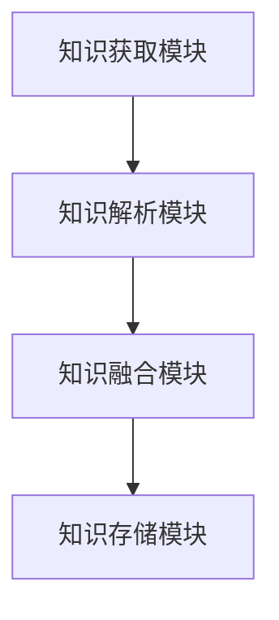
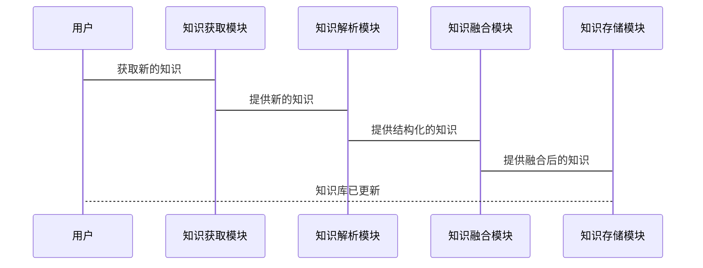

                 


# 设计AI Agent的动态知识库更新机制

> 关键词：AI Agent，动态知识库，知识库更新，增量式更新，机器学习，知识图谱

> 摘要：本文将详细探讨AI Agent的动态知识库更新机制的设计与实现，从基本概念到算法原理，从系统架构到项目实战，全面解析动态知识库更新机制的核心要素与实现方法，帮助读者掌握AI Agent在复杂动态环境中的知识管理与更新能力。

---

# 第一部分: AI Agent与动态知识库更新机制概述

## 第1章: AI Agent与动态知识库概述

### 1.1 AI Agent的基本概念

#### 1.1.1 AI Agent的定义与特点
AI Agent（人工智能代理）是指能够感知环境、执行任务并做出决策的智能实体。其特点包括自主性、反应性、目标导向性和社会性。

- 自主性：AI Agent能够在没有外部干预的情况下独立执行任务。
- 反应性：AI Agent能够实时感知环境并做出相应的反应。
- 目标导向性：AI Agent的行为通常是为了实现特定的目标。
- 社会性：AI Agent能够与其他Agent或人类进行交互和协作。

#### 1.1.2 知识库在AI Agent中的作用
知识库是AI Agent的核心组成部分，用于存储和管理与任务相关的信息和知识。知识库的作用包括：

- 提供决策支持：AI Agent通过查询知识库来获取所需的信息，从而做出更智能的决策。
- 支持学习与推理：知识库为AI Agent的学习和推理提供基础数据。
- 实现知识共享：知识库可以被多个AI Agent或系统共享，促进知识的复用与协作。

#### 1.1.3 动态知识库的定义与特性
动态知识库是一种能够实时更新和调整的知识存储系统，其特性包括：

- 实时性：动态知识库能够快速响应环境的变化，实时更新知识内容。
- 可扩展性：动态知识库能够根据需求动态扩展其存储容量和内容。
- 自适应性：动态知识库能够根据环境变化自动调整知识结构和存储方式。

### 1.2 动态知识库更新机制的背景与意义

#### 1.2.1 AI Agent知识库更新的必要性
在动态环境中，知识库的内容需要不断更新以反映环境的变化。例如，在智能客服系统中，客户的需求和问题可能会随时间变化，因此需要动态更新知识库以提供准确的信息。

#### 1.2.2 动态知识库更新的挑战与机遇
动态知识库更新面临的主要挑战包括数据冗余、更新延迟和数据冲突等问题。然而，动态知识库更新也为AI Agent提供了更强大的适应能力和灵活性，使其能够更好地应对复杂环境。

#### 1.2.3 动态知识库更新机制的应用场景
动态知识库更新机制广泛应用于多个领域，包括智能客服、自动驾驶、智能推荐系统等。例如，在自动驾驶中，AI Agent需要实时更新道路状况、交通规则等知识以确保安全行驶。

---

## 第2章: 动态知识库更新机制的核心概念

### 2.1 动态知识库更新机制的原理

#### 2.1.1 知识库更新的基本流程
动态知识库更新的基本流程包括以下几个步骤：

1. **知识获取**：从各种来源（如传感器、数据库、用户输入等）获取新的知识。
2. **知识解析**：对获取的知识进行解析和结构化处理，使其能够被AI Agent理解和使用。
3. **知识融合**：将新的知识与现有知识库中的知识进行融合，确保知识的一致性和完整性。
4. **知识存储**：将融合后的知识存储到知识库中，供AI Agent后续使用。

#### 2.1.2 动态知识库更新的核心要素
动态知识库更新的核心要素包括：

- **知识来源**：知识的来源包括数据库、API、传感器等。
- **知识表示**：知识的表示方式包括结构化数据、图数据等。
- **更新规则**：知识更新的规则包括冲突解决策略、优先级策略等。
- **更新机制**：知识更新的机制包括增量式更新、全量式更新等。

#### 2.1.3 更新机制与知识库结构的关系
知识库的结构直接影响更新机制的选择。例如，基于图结构的知识库适合使用增量式更新机制，而基于关系数据库的知识库适合使用全量式更新机制。

### 2.2 动态知识库更新机制的分类

#### 2.2.1 增量式更新机制
增量式更新机制只更新知识库中发生变化的部分，适用于数据量大且变化频繁的场景。

- **优点**：减少计算开销，提高更新效率。
- **缺点**：需要处理数据一致性问题。

#### 2.2.2 基于规则的更新机制
基于规则的更新机制通过预定义的规则来决定知识的更新方式。

- **优点**：规则简单明了，易于理解和维护。
- **缺点**：难以应对复杂动态环境中的知识更新需求。

#### 2.2.3 基于机器学习的更新机制
基于机器学习的更新机制通过训练模型来自动学习知识更新的规律和模式。

- **优点**：能够处理复杂动态环境中的知识更新需求。
- **缺点**：需要大量数据和计算资源。

### 2.3 动态知识库更新机制的优缺点对比

#### 2.3.1 不同更新机制的对比分析
以下是几种常见更新机制的对比分析：

| 更新机制       | 优点                           | 缺点                             |
|----------------|--------------------------------|----------------------------------|
| 增量式更新      | 计算开销低，更新效率高           | 数据一致性问题                   |
| 基于规则的更新  | 规则简单，易于维护             | 难以应对复杂动态环境             |
| 基于机器学习的更新 | 能够处理复杂动态环境           | 数据需求高，计算开销大           |

#### 2.3.2 各种更新机制的适用场景
- **增量式更新机制**适用于数据量大且变化频繁的场景，例如实时数据流处理。
- **基于规则的更新机制**适用于规则简单且变化缓慢的场景，例如企业内部知识库的更新。
- **基于机器学习的更新机制**适用于复杂动态环境，例如自动驾驶中的实时路况更新。

#### 2.3.3 更新机制的性能与稳定性对比
以下是几种更新机制的性能与稳定性对比：

| 更新机制       | 性能表现 | 稳定性表现 |
|----------------|----------|------------|
| 增量式更新      | 高       | 高          |
| 基于规则的更新  | 中       | 中          |
| 基于机器学习的更新 | 低       | 低          |

---

## 第3章: 动态知识库更新机制的算法原理

### 3.1 增量式更新算法

#### 3.1.1 增量式更新的基本原理
增量式更新算法的核心思想是只更新知识库中发生变化的部分。其基本步骤如下：

1. **数据获取**：获取变化的数据。
2. **数据解析**：将变化的数据解析为结构化数据。
3. **数据融合**：将变化的数据与现有知识库中的数据进行融合。
4. **数据存储**：将融合后的数据存储到知识库中。

#### 3.1.2 基于哈希的增量更新方法
基于哈希的增量更新方法通过哈希值的变化来判断数据是否发生变化。

- **优点**：计算开销低，实现简单。
- **缺点**：哈希冲突可能导致数据更新不准确。

#### 3.1.3 基于图结构的增量更新方法
基于图结构的增量更新方法通过维护图的边和节点关系来实现知识库的动态更新。

- **优点**：能够处理复杂的关系型数据。
- **缺点**：需要维护图结构的复杂性较高。

### 3.2 基于机器学习的更新算法

#### 3.2.1 基于监督学习的知识更新
基于监督学习的知识更新通过训练分类器来判断哪些知识需要更新。

- **优点**：能够处理复杂的动态环境。
- **缺点**：需要大量标注数据。

#### 3.2.2 基于无监督学习的知识更新
基于无监督学习的知识更新通过聚类等技术来发现新的知识模式。

- **优点**：不需要标注数据。
- **缺点**：聚类结果可能存在误差。

#### 3.2.3 基于强化学习的知识更新
基于强化学习的知识更新通过奖励机制来优化知识更新的策略。

- **优点**：能够处理复杂的动态环境。
- **缺点**：需要设计合适的奖励函数。

### 3.3 动态知识库更新的数学模型与公式

#### 3.3.1 知识表示的数学模型
知识表示的数学模型可以采用向量空间模型或图嵌入模型。例如，向量空间模型可以通过向量内积来表示知识的相关性：

$$ \text{相似度} = \vec{a} \cdot \vec{b} $$

#### 3.3.2 更新规则的数学表达
增量式更新的数学表达可以表示为：

$$ \Delta = B - A $$

其中，$A$ 是旧知识，$B$ 是新知识，$\Delta$ 是变化的部分。

#### 3.3.3 知识库更新的优化目标
知识库更新的优化目标通常包括最小化计算开销和最大化数据一致性。例如，可以使用以下优化目标：

$$ \min_{\Delta} \text{计算开销} + \text{数据不一致性的惩罚项} $$

---

## 第4章: 动态知识库更新机制的系统分析与架构设计

### 4.1 系统功能设计

#### 4.1.1 知识获取模块
知识获取模块负责从各种来源获取新的知识。例如，可以通过API从互联网获取实时数据。

#### 4.1.2 知识解析模块
知识解析模块将获取的知识进行结构化处理。例如，将文本数据转换为结构化的JSON格式。

#### 4.1.3 知识融合模块
知识融合模块将新的知识与现有知识库中的知识进行融合。例如，使用图嵌入方法将新知识与旧知识进行融合。

#### 4.1.4 知识存储模块
知识存储模块将融合后的知识存储到知识库中。例如，可以使用关系数据库或图数据库来存储知识。

### 4.2 系统架构设计

#### 4.2.1 系统架构概述
系统的整体架构可以分为以下几个部分：

- **知识获取模块**：负责从各种来源获取新的知识。
- **知识解析模块**：负责将获取的知识进行结构化处理。
- **知识融合模块**：负责将新的知识与现有知识库中的知识进行融合。
- **知识存储模块**：负责将融合后的知识存储到知识库中。

#### 4.2.2 知识库更新的系统架构
以下是知识库更新的系统架构图：



#### 4.2.3 系统接口设计
系统接口设计包括以下几个方面：

- **知识获取接口**：提供API用于获取新的知识。
- **知识解析接口**：提供API用于将获取的知识进行结构化处理。
- **知识融合接口**：提供API用于将新的知识与现有知识库中的知识进行融合。
- **知识存储接口**：提供API用于将融合后的知识存储到知识库中。

#### 4.2.4 系统交互流程
以下是知识库更新的系统交互流程图：



---

## 第5章: 动态知识库更新机制的项目实战

### 5.1 项目介绍

#### 5.1.1 项目背景
本项目旨在设计和实现一个动态知识库更新系统，用于支持AI Agent在复杂动态环境中的知识管理与更新。

#### 5.1.2 项目目标
本项目的最终目标是实现一个高效、可靠、可扩展的动态知识库更新系统。

### 5.2 核心代码实现

#### 5.2.1 知识获取模块
以下是知识获取模块的代码实现：

```python
import requests

def get_new_knowledge(url):
    response = requests.get(url)
    return response.json()
```

#### 5.2.2 知识解析模块
以下是知识解析模块的代码实现：

```python
import json

def parse_knowledge(knowledge):
    return json.loads(knowledge)
```

#### 5.2.3 知识融合模块
以下是知识融合模块的代码实现：

```python
from itertools import chain

def merge_knowledge(old_knowledge, new_knowledge):
    return dict(chain(old_knowledge.items(), new_knowledge.items()))
```

#### 5.2.4 知识存储模块
以下是知识存储模块的代码实现：

```python
import sqlite3

def store_knowledge(database, knowledge):
    conn = sqlite3.connect(database)
    cursor = conn.cursor()
    cursor.execute("CREATE TABLE IF NOT EXISTS knowledge (id TEXT PRIMARY KEY, content TEXT)")
    cursor.execute("INSERT INTO knowledge VALUES (?, ?)", (knowledge['id'], json.dumps(knowledge['content'])))
    conn.commit()
    conn.close()
```

### 5.3 项目总结

#### 5.3.1 项目小结
本项目通过设计和实现动态知识库更新系统，验证了动态知识库更新机制的有效性和可行性。

#### 5.3.2 项目意义
本项目的成功实施为AI Agent在复杂动态环境中的知识管理与更新提供了重要的理论和实践基础。

---

## 第6章: 动态知识库更新机制的最佳实践

### 6.1 最佳实践

#### 6.1.1 小结
动态知识库更新机制是AI Agent在复杂动态环境中的核心能力之一。通过合理设计和实现动态知识库更新机制，可以显著提高AI Agent的知识管理与更新能力。

#### 6.1.2 注意事项
- **数据一致性**：在动态知识库更新过程中，需要特别注意数据的一致性问题。
- **性能优化**：动态知识库更新需要考虑性能优化，例如通过增量式更新减少计算开销。
- **容错设计**：动态知识库更新系统需要具备容错能力，例如通过备份和恢复机制应对数据丢失问题。

#### 6.1.3 拓展阅读
- 《动态知识库管理与更新》
- 《AI Agent的知识表示与推理》
- 《基于机器学习的知识更新方法》

---

# 作者：AI天才研究院/AI Genius Institute & 禅与计算机程序设计艺术 /Zen And The Art of Computer Programming

