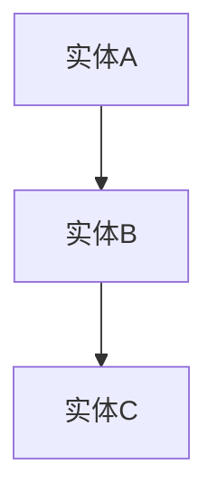
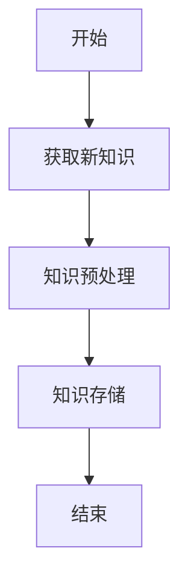
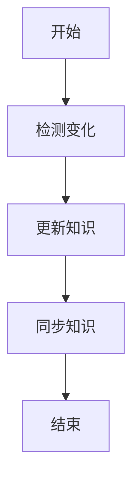
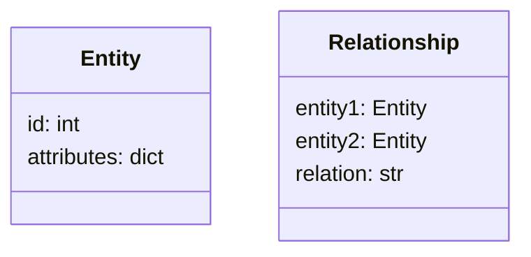
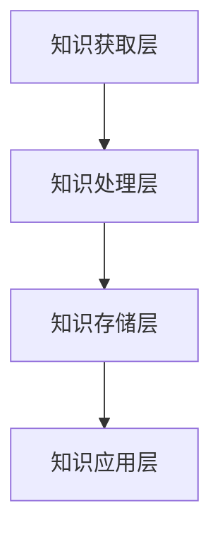
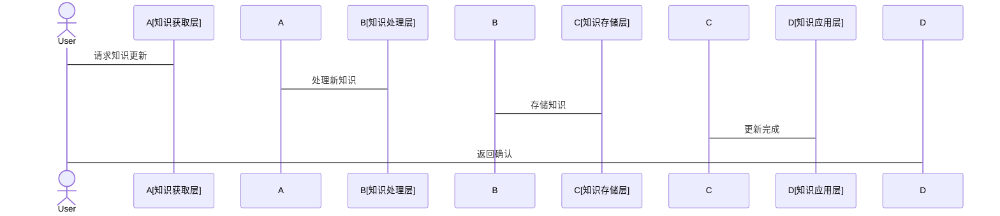

                 


# 设计AI Agent的动态知识库构建与维护

> 关键词：AI Agent，动态知识库，知识构建，知识维护，增量式算法，分布式存储

> 摘要：本文章详细探讨了AI Agent的动态知识库构建与维护的关键问题，分析了动态知识库的核心概念、算法原理、系统架构及项目实战。通过系统化的分析和丰富的案例，文章深入阐述了如何设计和实现高效的动态知识库，为AI Agent的开发提供了理论基础和实践指导。

---

# 第一部分: AI Agent与动态知识库基础

## 第1章: AI Agent与动态知识库概述

### 1.1 问题背景与定义
- **问题背景**：AI Agent在现代智能系统中的广泛应用，尤其是在复杂动态环境下的知识管理需求。
- **动态知识库的定义**：动态知识库是指能够实时更新、适应环境变化的智能知识存储系统。
- **AI Agent的核心概念**：AI Agent是一种能够感知环境并采取行动以实现目标的智能实体。

### 1.2 动态知识库的特点与优势
- **动态性**：知识库能够实时更新，适应变化的环境。
- **高效性**：通过优化算法实现快速的知识更新和检索。
- **容错性**：能够处理不完整或不确定的知识。

### 1.3 动态知识库的构建与维护意义
- **知识管理**：构建动态知识库是实现AI Agent高效决策的基础。
- **实时更新**：动态知识库能够确保AI Agent在变化的环境中保持知识的准确性。
- **应用场景**：广泛应用于智能推荐、实时监控等领域。

## 第2章: 动态知识库的核心概念

### 2.1 动态知识库的原理
- **知识表示**：采用符号逻辑和语义网络等方法表示知识。
- **知识更新**：通过增量式算法实现高效更新。
- **知识推理**：利用推理引擎进行知识的演绎和归纳。

### 2.2 动态知识库的属性特征对比
| 属性 | 静态知识库 | 动态知识库 |
|------|------------|------------|
| 更新频率 | 低         | 高         |
| 数据一致性 | 高         | 中         |
| 灵活性 | 低         | 高         |

### 2.3 实体关系架构图


## 第3章: 动态知识库的构建算法

### 3.1 增量式知识库构建算法
- **算法流程图**


- **算法实现代码**
```python
def incremental_build(new_knowledge):
    preprocess(new_knowledge)
    store_knowledge(preprocessed_data)
```

### 3.2 分布式知识库维护算法
- **算法流程图**


- **算法实现代码**
```python
def distributed_maintenance():
    detect_changes()
    update_knowledge()
    synchronize_knowledge()
```

## 第4章: 动态知识库的系统架构设计

### 4.1 系统功能设计
- **领域模型设计**


### 4.2 系统架构图


### 4.3 接口设计
- **RESTful API示例**
  - `POST /api/knowledge/update`：用于知识更新。
  - `GET /api/knowledge/retrieve`：用于知识检索。

### 4.4 交互流程


## 第5章: 项目实战

### 5.1 环境安装
- **工具安装**：安装Python、Jupyter Notebook、Mermaid CLI。
- **依赖管理**：使用pip安装所需的库，如`networkx`、`pymermaid`。

### 5.2 核心代码实现
- **增量式构建代码**
```python
def preprocess(new_knowledge):
    # 知识预处理逻辑
    pass

def store_knowledge(data):
    # 知识存储逻辑
    pass
```

### 5.3 案例分析
- **案例背景**：智能客服系统的动态知识库构建。
- **实现步骤**：数据收集、预处理、存储、应用。

## 第6章: 最佳实践

### 6.1 小结
- 动态知识库的构建与维护是AI Agent设计中的关键环节。
- 通过增量式算法和分布式架构可以提高系统的效率和可靠性。

### 6.2 注意事项
- 定期检查数据一致性。
- 处理数据冗余和冲突。
- 优化知识检索算法。

### 6.3 拓展阅读
- 推荐阅读相关领域的论文和书籍，如《分布式系统：原理与设计》。

---

# 作者：AI天才研究院/AI Genius Institute & 禅与计算机程序设计艺术 /Zen And The Art of Computer Programming

