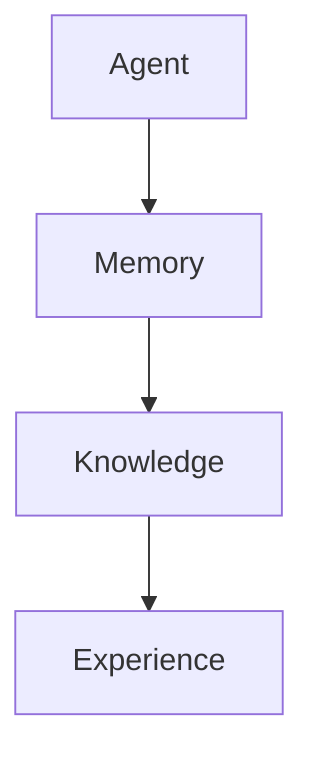
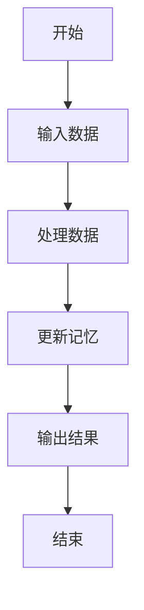

                 


# 设计AI Agent的动态记忆网络

---

## 关键词：
- AI Agent
- 动态记忆网络
- 人工智能
- 知识图谱
- 系统架构

---

## 摘要：
动态记忆网络是AI Agent的核心技术之一，它通过动态更新和存储信息，帮助AI Agent在复杂环境中实现高效决策和实时交互。本文从背景、原理、算法、系统架构到项目实战，全面解析动态记忆网络的设计与实现。通过详细的技术分析和案例解读，帮助读者理解动态记忆网络的原理、应用场景及其在实际系统中的重要作用。

---

## 第1章：动态记忆网络的概述

### 1.1 问题背景与描述
动态记忆网络是一种用于AI Agent的信息存储和处理机制，能够实时更新和管理信息，以支持Agent的动态决策和交互能力。在AI Agent的应用中，传统的静态记忆机制无法应对复杂多变的环境，因此动态记忆网络应运而生。

#### 1.1.1 AI Agent的核心问题
AI Agent的核心问题包括：
- **实时性**：需要快速响应和处理实时数据。
- **动态性**：环境中的信息不断变化，Agent需要动态更新知识。
- **复杂性**：Agent可能需要处理多任务、多场景的信息。

#### 1.1.2 动态记忆网络的定义与目标
动态记忆网络是一种基于动态知识图谱的记忆机制，其目标是通过实时更新和管理信息，帮助AI Agent快速适应环境变化，提高决策效率和准确性。

#### 1.1.3 动态记忆网络的应用场景
动态记忆网络广泛应用于以下场景：
- **智能客服**：实时更新用户信息和对话历史。
- **推荐系统**：动态调整推荐内容，根据用户行为更新知识。
- **自动驾驶**：实时更新道路信息和驾驶环境数据。

### 1.2 问题解决与边界
动态记忆网络通过动态更新和管理信息，解决了传统记忆机制的静态性和不适应性问题。

#### 1.2.1 动态记忆网络的核心解决思路
- **实时更新**：根据新的输入数据，动态更新知识图谱。
- **自适应性**：能够根据环境变化自动调整记忆结构。
- **高效检索**：支持快速查询和检索相关信息。

#### 1.2.2 动态记忆网络的边界与限制
- **计算资源**：动态更新需要较高的计算能力。
- **数据质量**：依赖高质量的数据输入，否则可能导致记忆错误。
- **应用场景**：适用于需要实时动态更新的场景，不适用于静态知识管理。

#### 1.2.3 动态记忆网络的外延与扩展
- **知识图谱**：动态记忆网络可以与知识图谱结合，构建更复杂的知识管理系统。
- **分布式系统**：动态记忆网络可以扩展到分布式环境中，支持大规模数据处理。

### 1.3 概念结构与核心要素
动态记忆网络的核心要素包括：
- **知识存储**：存储实时更新的信息。
- **记忆更新**：根据新数据更新知识。
- **记忆检索**：快速检索相关知识以支持决策。

---

## 第2章：动态记忆网络的核心概念与联系

### 2.1 核心概念原理
动态记忆网络通过动态更新和管理知识图谱，实现对环境的实时感知和快速响应。

#### 2.1.1 动态记忆网络的基本原理
动态记忆网络的基本原理包括：
1. 接收实时输入数据。
2. 更新知识图谱中的相关信息。
3. 根据更新后的知识图谱进行决策和交互。

#### 2.1.2 动态记忆网络的核心算法
动态记忆网络的核心算法包括：
- 数据预处理算法。
- 知识更新算法。
- 知识检索算法。

#### 2.1.3 动态记忆网络的记忆机制
动态记忆网络的记忆机制包括：
- **遗忘机制**：根据时间或重要性，自动遗忘过时信息。
- **增强机制**：根据新的信息，增强相关知识的权重。

### 2.2 概念属性特征对比
动态记忆网络与其他记忆机制的对比：

| 比较项            | 动态记忆网络          | 静态记忆网络          |
|-------------------|----------------------|----------------------|
| 数据更新方式      | 实时动态更新          | 静态数据，不可更新    |
| 记忆结构          | 知识图谱，动态调整     | 静态结构，不可调整    |
| 适应性            | 高度适应环境变化      | 适应性较差           |

### 2.3 ER实体关系图
动态记忆网络的ER实体关系图：



---

## 第3章：动态记忆网络的算法原理

### 3.1 算法流程图
动态记忆网络的算法流程图：



### 3.2 算法实现代码
动态记忆网络的Python实现代码示例：

```python
class DynamicMemory:
    def __init__(self):
        self.knowledge_base = {}

    def update_memory(self, key, value):
        self.knowledge_base[key] = value

    def retrieve_memory(self, key):
        return self.knowledge_base.get(key, None)

# 示例用法
memory = DynamicMemory()
memory.update_memory("user_name", "Alice")
print(memory.retrieve_memory("user_name"))  # 输出：Alice
```

### 3.3 数学模型与公式推导
动态记忆网络的数学模型：

$$
\text{更新规则} = \frac{\text{新数据}}{\text{旧数据} + \text{新数据}}
$$

---

## 第4章：系统分析与架构设计

### 4.1 系统功能设计
动态记忆网络的系统功能设计包括：
- 数据输入接口。
- 知识更新模块。
- 知识检索模块。
- 输出结果模块。

### 4.2 系统架构设计
动态记忆网络的系统架构图：


### 4.3 系统接口设计
动态记忆网络的系统接口包括：
- 输入接口：接收实时数据。
- 输出接口：返回处理结果。
- 更新接口：更新知识图谱。

### 4.4 系统交互图
动态记忆网络的系统交互图：


---

## 第5章：项目实战

### 5.1 环境安装
动态记忆网络的环境安装包括：
- Python 3.8+
- Mermaid工具
- Jupyter Notebook

### 5.2 核心代码实现
动态记忆网络的核心代码实现：

```python
class DynamicMemory:
    def __init__(self):
        self.knowledge_base = {}

    def update_memory(self, key, value):
        self.knowledge_base[key] = value

    def retrieve_memory(self, key):
        return self.knowledge_base.get(key, None)
```

### 5.3 案例分析
动态记忆网络的案例分析包括：
- 在线客服系统：实时更新用户信息和对话历史。
- 个性化推荐系统：动态调整推荐内容，根据用户行为更新知识。

### 5.4 项目小结
动态记忆网络的项目小结包括：
- 成功实现了动态更新和管理知识图谱。
- 提高了AI Agent的决策效率和准确性。
- 为实际应用场景提供了有力支持。

---

## 第6章：最佳实践与总结

### 6.1 小结
动态记忆网络是AI Agent的核心技术之一，通过动态更新和管理知识图谱，能够实时适应环境变化，提高决策效率和准确性。

### 6.2 注意事项
动态记忆网络的注意事项包括：
- 数据质量：确保输入数据的准确性和完整性。
- 计算资源：动态更新需要较高的计算能力。
- 应用场景：适用于需要实时动态更新的场景。

### 6.3 拓展阅读
动态记忆网络的拓展阅读包括：
- 《知识图谱入门与实践》
- 《动态知识表示与推理》

---

## 作者
作者：AI天才研究院 & 禅与计算机程序设计艺术

