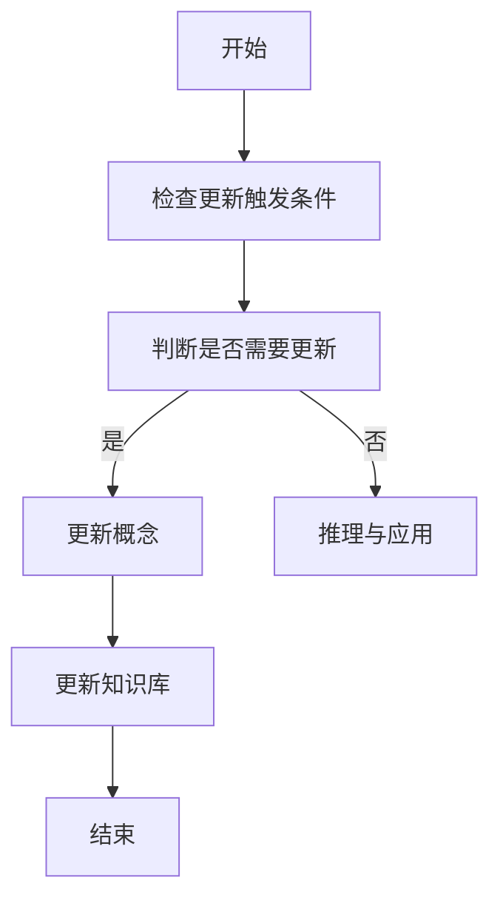

                 


# 设计AI Agent的增量式概念学习策略

## 关键词：AI Agent, 增量式学习, 概念学习, 知识表示, 推理引擎

## 摘要
本文详细探讨了设计AI Agent增量式概念学习策略的关键问题，包括背景介绍、核心概念、算法原理、系统架构设计、项目实战以及最佳实践。通过逐步分析，本文为AI Agent在动态环境中的概念学习提供了理论基础和实践指导。

---

# 第一部分：背景介绍与核心概念

## 第1章：问题背景与概念背景

### 1.1 问题背景
#### 1.1.1 AI Agent的定义与特点
AI Agent是一种智能体，具备感知环境、自主决策和执行任务的能力。其特点包括自主性、反应性、目标导向性和学习能力。

#### 1.1.2 增量式概念学习的必要性
AI Agent需要应对动态变化的环境，传统的批量学习无法满足实时更新的需求，因此增量式概念学习成为必要。

#### 1.1.3 当前AI Agent学习策略的局限性
现有策略在处理增量更新时效率低下，且缺乏模块化设计，导致知识更新和推理效率不高。

### 1.2 问题描述
#### 1.2.1 AI Agent需求场景的动态变化
AI Agent需处理的任务场景不断变化，知识库需实时更新。

#### 1.2.2 知识更新的效率问题
传统批量学习在处理增量更新时计算量大，效率低。

#### 1.2.3 概念学习的增量特性
增量式学习强调逐步更新知识，减少计算量，提高效率。

### 1.3 问题解决思路
#### 1.3.1 增量式学习的核心思想
通过逐步更新知识库，适应环境变化。

#### 1.3.2 概念学习的模块化设计
将知识分解为模块，分别更新，降低整体复杂度。

#### 1.3.3 知识表示与推理的优化
采用高效的表示方法，优化推理过程。

### 1.4 概念结构与核心要素
#### 1.4.1 概念的层次化结构
概念分为多个层次，上层概念涵盖下层概念。

#### 1.4.2 概念之间的关系
概念间可以是包含、并列或交叉关系。

#### 1.4.3 增量式学习的核心要素
包括触发机制、更新规则和推理方法。

---

## 第2章：核心概念与联系

### 2.1 增量式概念学习的原理
#### 2.1.1 增量式学习的基本原理
通过逐步更新知识，适应环境变化。

#### 2.1.2 概念学习的模块化设计
将知识分解为模块，分别更新。

#### 2.1.3 概念更新的触发机制
当环境变化时，触发相关概念的更新。

### 2.2 概念属性特征对比表

| 概念A | 属性1 | 属性2 | 属性3 |
|------|------|------|------|
| 概念B | ... | ... | ... |
| ... | ... | ... | ... |

### 2.3 ER实体关系图
```mermaid
erDiagram
    actor 学习者 {
        string 名称
        string 属性
    }
    knowledge_base {
        string 概念
        string 属性
    }
    学习者 --> knowledge_base: 更新
```

---

## 第3章：算法原理讲解

### 3.1 算法流程图


### 3.2 Python源代码实现
```python
def increment_learning(new_concept, attributes):
    # 更新概念
    update_concepts(new_concept)
    # 更新属性
    update_attributes(new_concept, attributes)
    # 推理
    infer_new_concepts()
```

### 3.3 数学模型与公式
- 更新规则：$$ C_{new} = C_{old} \cup \{ new\_concept \} $$
- 推理公式：$$ P(C|E) = \frac{P(E|C)P(C)}{P(E)} $$

---

## 第4章：系统分析与架构设计

### 4.1 问题场景介绍
AI Agent需处理动态变化的任务，如实时数据分析和决策。

### 4.2 系统功能设计
- 知识库管理
- 概念更新
- 推理引擎

### 4.3 系统架构设计
```mermaid
container 知识库 {
    存储 概念
    存储 属性
}
container 推理引擎 {
    运行 推理算法
}
container 用户接口 {
    收集 输入
    提供 输出
}
```

---

## 第5章：项目实战

### 5.1 环境安装
安装Python和相关库，如numpy和pandas。

### 5.2 核心代码实现
```python
def update_concepts(new_concept):
    knowledge_base.add(new_concept)
```

### 5.3 案例分析
分析一个具体案例，如更新天气预测模型。

### 5.4 项目小结
总结项目实现的关键点和经验。

---

## 第6章：最佳实践

### 6.1 小结
总结文章内容，强调增量式概念学习的重要性。

### 6.2 注意事项
更新知识时要注意模块化设计，避免影响整体系统。

### 6.3 拓展阅读
推荐相关书籍和论文，供读者深入学习。

---

# 作者信息
作者：AI天才研究院 & 禅与计算机程序设计艺术

---

本文系统地探讨了设计AI Agent增量式概念学习策略的关键问题，通过背景介绍、核心概念、算法原理、系统架构设计、项目实战以及最佳实践的详细讲解，为读者提供了理论基础和实践指导。

