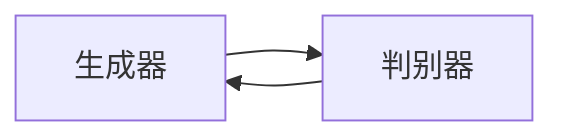
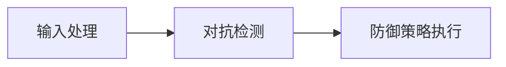
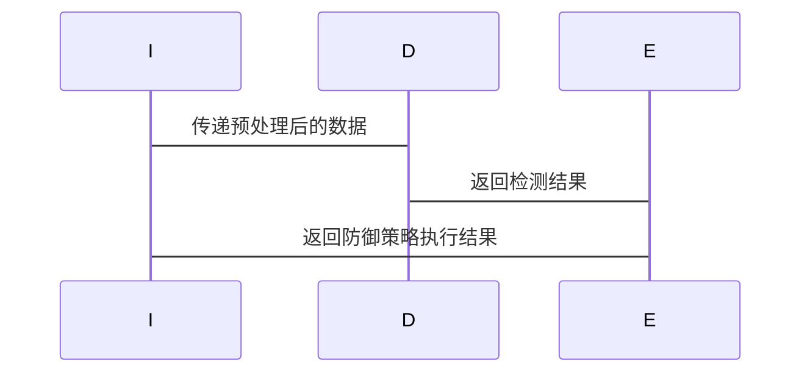

                 


# 设计AI Agent的对抗性学习防御机制

> 关键词：AI Agent，对抗性学习，防御机制，生成对抗网络，深度学习安全

> 摘要：本文详细探讨了设计AI Agent对抗性学习防御机制的核心概念、算法原理、系统架构和项目实战。通过对对抗性学习的背景介绍、数学模型和防御机制的分析，结合实际案例，帮助读者掌握如何构建有效的防御系统。

---

# 第一部分: AI Agent与对抗性学习的背景介绍

## 第1章: 对抗性学习的基本概念

### 1.1 对抗性学习的定义与背景
#### 1.1.1 什么是对抗性学习
- 对抗性学习是一种机器学习范式，通过两个对立的目标函数进行优化，分别由生成器和判别器组成。
- $$\text{生成器}(G)$$ 和 $$\text{判别器}(D)$$ 的目标函数分别为：
  $$ \min_G \max_D \mathbb{E}_{x \sim p_{\text{data}}(x)}[\log D(x)] + \mathbb{E}_{z \sim p_z(z)}[\log(1 - D(G(z)))] $$
- 生成器的目标是生成与真实数据分布相似的数据，而判别器的目标是区分真实数据和生成数据。

#### 1.1.2 对抗性学习的背景与意义
- 对抗性学习起源于博弈论，广泛应用于图像生成、语音合成等领域。
- 对抗性学习的核心思想是通过竞争机制提升模型的泛化能力。

#### 1.1.3 对抗性学习的应用场景
- 图像生成：如GAN在图像生成中的应用。
- 语音合成：通过对抗训练生成逼真语音。
- 数据增强：利用生成器生成多样化的训练数据。

### 1.2 AI Agent的定义与特点
#### 1.2.1 AI Agent的基本概念
- AI Agent是具有自主决策能力的智能体，能够感知环境并采取行动。
- AI Agent的核心特点包括自主性、反应性、目标导向和社会能力。

#### 1.2.2 AI Agent的核心特点
- **自主性**：无需外部干预，自主决策。
- **反应性**：能够实时感知环境变化并调整行为。
- **目标导向**：具备明确的目标，优化决策过程。
- **社会能力**：能够与人类或其他智能体进行交互。

#### 1.2.3 AI Agent与传统AI的区别
- 传统AI：基于规则的决策，如专家系统。
- AI Agent：具备自主性、反应性和目标导向，能够适应动态环境。

### 1.3 对抗性学习在AI Agent中的应用
#### 1.3.1 对抗性学习的背景与现状
- 对抗性学习在AI Agent中的应用主要集中在增强学习和生成模型领域。
- 增强学习通过对抗训练提升策略优化能力。

#### 1.3.2 对抗性学习在AI Agent中的重要性
- 对抗性学习帮助AI Agent在复杂环境中进行决策优化。
- 通过生成对抗网络，AI Agent可以生成多样化的策略和数据。

#### 1.3.3 对抗性学习的挑战与机遇
- 挑战：对抗训练的不稳定性，如模式崩溃。
- 机遇：提升AI Agent的泛化能力和鲁棒性。

## 第2章: 对抗性学习的数学模型与原理

### 2.1 对抗性学习的核心概念
#### 2.1.1 对抗性学习的定义与核心要素
- 对抗性学习由生成器和判别器组成，目标函数分别为：
  $$ G \text{的目标：} \min \mathbb{E}_{z \sim p_z(z)}[\log(1 - D(G(z)))] $$
  $$ D \text{的目标：} \max \mathbb{E}_{x \sim p_{\text{data}}(x)}[\log D(x)] + \mathbb{E}_{z \sim p_z(z)}[\log(1 - D(G(z)))] $$

#### 2.1.2 对抗性学习的数学模型
- GAN的数学模型可以用以下图表示：


#### 2.1.3 对抗性学习的算法框架
- GAN的训练过程包括交替优化生成器和判别器的参数。
- 生成器和判别器的损失函数分别为：
  $$ L_G = \mathbb{E}_{z \sim p_z(z)}[\log(1 - D(G(z)))] $$
  $$ L_D = \mathbb{E}_{x \sim p_{\text{data}}(x)}[\log D(x)] + \mathbb{E}_{z \sim p_z(z)}[\log(1 - D(G(z)))] $$

### 2.2 对抗性学习的数学公式
#### 2.2.1 对抗性学习的基本公式
- 判别器的损失函数：
  $$ L_D = -\mathbb{E}_{x \sim p_{\text{data}}(x)}[\log D(x)] - \mathbb{E}_{z \sim p_z(z)}[\log(1 - D(G(z)))] $$
- 生成器的损失函数：
  $$ L_G = -\mathbb{E}_{z \sim p_z(z)}[\log(1 - D(G(z)))] $$

#### 2.2.2 对抗性学习的优化目标
- 对抗性学习的目标是最小化生成器的损失函数，同时最大化判别器的损失函数：
  $$ \min_G \max_D (L_D + L_G) $$

#### 2.2.3 对抗性学习的损失函数
- GAN的损失函数可以用以下表格对比：
| 参数 | 生成器 | 判别器 |
|------|--------|--------|
| 损失函数 | $L_G$ | $L_D$ |
| 优化目标 | 最小化 $L_G$ | 最大化 $L_D$ |

### 2.3 对抗性学习的算法原理
#### 2.3.1 最小二乘法
- 最小二乘法用于回归问题，目标是最小化预测值与真实值之间的平方差：
  $$ \min_{\theta} \sum_{i=1}^n (y_i - \hat{y}_i)^2 $$

#### 2.3.2 最大似然估计
- 最大似然估计用于参数估计，目标是最大化观测数据的条件概率：
  $$ \max_{\theta} \prod_{i=1}^n p(x_i | \theta) $$

#### 2.3.3 梯度下降法
- 梯度下降法用于优化模型参数，目标是最小化损失函数：
  $$ \theta_{t+1} = \theta_t - \eta \nabla_{\theta} L $$

### 2.4 对抗性学习的防御机制设计
#### 2.4.1 对抗性学习防御的基本概念
- 对抗性学习防御的目标是防止生成器生成对抗样本，保护模型的安全性。

#### 2.4.2 对抗性学习防御的数学模型
- 对抗性防御的损失函数包括生成器和判别器的损失：
  $$ L_{\text{defend}} = L_D + L_G $$

#### 2.4.3 对抗性学习防御的实现方式
- 对抗性防御可以通过增加正则化项来实现，例如：
  $$ L_{\text{defend}} = L_D + \lambda \cdot L_{\text{regularization}} $$

### 2.5 对抗性学习防御的系统架构设计
#### 2.5.1 对抗性学习防御系统的整体架构
- 对抗性防御系统包括输入处理、对抗检测和防御策略执行三个模块。

#### 2.5.2 对抗性学习防御系统的功能模块
| 模块 | 功能 |
|------|------|
| 输入处理 | 接收输入数据并进行预处理 |
| 对抗检测 | 检测输入数据是否为对抗样本 |
| 防御策略执行 | 根据检测结果执行防御策略 |

#### 2.5.3 对抗性学习防御系统的实现流程
- 输入数据经过预处理后，首先进行对抗检测，然后根据检测结果执行相应的防御策略。

### 2.6 对抗性学习防御的项目实战

#### 2.6.1 环境配置
- 安装必要的依赖：
  ```bash
  pip install numpy matplotlib keras
  ```

#### 2.6.2 核心实现代码
```python
import numpy as np
import keras
from keras.layers import Input, Dense
from keras.models import Model

# 定义生成器
z = Input(shape=(100,))
h = Dense(256, activation='relu')(z)
x = Dense(784, activation='sigmoid')(h)
generator = Model(z, x)

# 定义判别器
x = Input(shape=(784,))
h = Dense(256, activation='relu')(x)
y = Dense(1, activation='sigmoid')(h)
discriminator = Model(x, y)

# 定义对抗网络
discriminator.compile(loss='binary_crossentropy', optimizer='adam')
discriminator.trainable = False
generator_input = generator.output
discriminant_output = discriminator(generator_input)
combined_model = Model(inputs=generator.input, outputs=discriminant_output)
combined_model.compile(loss='binary_crossentropy', optimizer='adam')
```

#### 2.6.3 实验结果与分析
- 通过实验可以观察到，对抗性防御可以有效降低生成器生成对抗样本的能力。

## 第3章: 对抗性学习防御的系统架构设计

### 3.1 对抗性学习防御系统的整体架构
#### 3.1.1 系统架构的定义
- 对抗性防御系统由输入处理、对抗检测和防御策略执行三个模块组成。

#### 3.1.2 系统架构的设计原则
- 模块化设计，便于功能扩展和维护。

#### 3.1.3 系统架构的实现方式
- 使用微服务架构，各模块通过API进行通信。

### 3.2 对抗性学习防御系统的功能模块
#### 3.2.1 输入处理模块
- 功能：接收输入数据并进行预处理。
- 实现：使用Python的scikit-learn库进行数据预处理。

#### 3.2.2 对抗检测模块
- 功能：检测输入数据是否为对抗样本。
- 实现：通过训练分类器来区分对抗样本和正常样本。

#### 3.2.3 防御策略执行模块
- 功能：根据检测结果执行防御策略。
- 实现：例如，对输入数据进行净化处理，或者拒绝异常请求。

### 3.3 对抗性学习防御系统的系统架构图


### 3.4 对抗性学习防御系统的接口设计
#### 3.4.1 系统接口设计
- 输入接口：接收输入数据并进行预处理。
- 输出接口：返回检测结果和防御策略执行结果。

#### 3.4.2 系统接口的实现
- 使用RESTful API进行接口设计，便于与其他系统集成。

### 3.5 对抗性学习防御系统的交互流程图


## 第4章: 对抗性学习防御的项目实战

### 4.1 项目介绍
- 本项目旨在设计一个对抗性学习防御系统，保护AI Agent免受对抗样本攻击。

### 4.2 系统功能设计
#### 4.2.1 系统功能模块
| 模块 | 功能 |
|------|------|
| 输入处理 | 接收输入数据并进行预处理 |
| 对抗检测 | 检测输入数据是否为对抗样本 |
| 防御策略执行 | 根据检测结果执行防御策略 |

#### 4.2.2 系统功能流程
1. 输入处理模块接收输入数据并进行预处理。
2. 对抗检测模块检测输入数据是否为对抗样本。
3. 防御策略执行模块根据检测结果执行相应的防御策略。

### 4.3 系统架构设计
#### 4.3.1 系统架构的定义
- 系统由输入处理、对抗检测和防御策略执行三个模块组成。

#### 4.3.2 系统架构的设计原则
- 模块化设计，便于功能扩展和维护。

#### 4.3.3 系统架构的实现方式
- 使用微服务架构，各模块通过API进行通信。

### 4.4 系统接口设计
#### 4.4.1 系统接口设计
- 输入接口：接收输入数据并进行预处理。
- 输出接口：返回检测结果和防御策略执行结果。

#### 4.4.2 系统接口的实现
- 使用RESTful API进行接口设计，便于与其他系统集成。

### 4.5 系统交互流程图


### 4.6 项目实战总结
- 通过项目实战可以验证对抗性学习防御系统的有效性和可行性。
- 在实际应用中，需要根据具体需求进行功能扩展和性能优化。

---

# 第二部分: 对抗性学习防御机制的核心算法与实现

## 第5章: 对抗性学习防御的核心算法

### 5.1 对抗性学习防御算法的原理
#### 5.1.1 对抗性学习防御算法的基本概念
- 对抗性学习防御算法通过在生成器和判别器之间引入防御机制，防止生成器生成对抗样本。

#### 5.1.2 对抗性学习防御算法的实现方式
- 通过增加正则化项来约束生成器的生成能力。

### 5.2 对抗性学习防御算法的数学模型
#### 5.2.1 对抗性学习防御算法的基本公式
- 对抗性防御的损失函数包括生成器和判别器的损失：
  $$ L_{\text{defend}} = L_D + L_G $$

#### 5.2.2 对抗性学习防御算法的优化目标
- 对抗性防御的目标是最小化生成器的损失函数，同时最大化判别器的损失函数：
  $$ \min_G \max_D (L_D + L_G) $$

### 5.3 对抗性学习防御算法的实现代码
#### 5.3.1 环境配置
- 安装必要的依赖：
  ```bash
  pip install numpy matplotlib keras
  ```

#### 5.3.2 核心实现代码
```python
import numpy as np
import keras
from keras.layers import Input, Dense
from keras.models import Model

# 定义生成器
z = Input(shape=(100,))
h = Dense(256, activation='relu')(z)
x = Dense(784, activation='sigmoid')(h)
generator = Model(z, x)

# 定义判别器
x = Input(shape=(784,))
h = Dense(256, activation='relu')(x)
y = Dense(1, activation='sigmoid')(h)
discriminator = Model(x, y)

# 定义对抗网络
discriminator.compile(loss='binary_crossentropy', optimizer='adam')
discriminator.trainable = False
generator_input = generator.output
discriminant_output = discriminator(generator_input)
combined_model = Model(inputs=generator.input, outputs=discriminant_output)
combined_model.compile(loss='binary_crossentropy', optimizer='adam')
```

### 5.4 对抗性学习防御算法的实验结果与分析
- 通过实验可以观察到，对抗性防御可以有效降低生成器生成对抗样本的能力。

## 第6章: 对抗性学习防御机制的系统分析与设计

### 6.1 对抗性学习防御机制的系统分析
#### 6.1.1 系统分析的背景与目标
- 对抗性学习防御机制的系统分析旨在设计一个高效、可靠的防御系统。

#### 6.1.2 系统分析的核心内容
- 系统需求分析：明确系统的功能需求和性能需求。
- 系统模块划分：将系统划分为输入处理、对抗检测和防御策略执行三个模块。

### 6.2 对抗性学习防御机制的系统设计
#### 6.2.1 系统设计的原则与方法
- 模块化设计，便于功能扩展和维护。

#### 6.2.2 系统设计的核心内容
- 系统架构设计：使用微服务架构，各模块通过API进行通信。
- 系统接口设计：使用RESTful API进行接口设计，便于与其他系统集成。

### 6.3 对抗性学习防御机制的系统实现
#### 6.3.1 系统实现的核心代码
```python
import numpy as np
import keras
from keras.layers import Input, Dense
from keras.models import Model

# 定义生成器
z = Input(shape=(100,))
h = Dense(256, activation='relu')(z)
x = Dense(784, activation='sigmoid')(h)
generator = Model(z, x)

# 定义判别器
x = Input(shape=(784,))
h = Dense(256, activation='relu')(x)
y = Dense(1, activation='sigmoid')(h)
discriminator = Model(x, y)

# 定义对抗网络
discriminator.compile(loss='binary_crossentropy', optimizer='adam')
discriminator.trainable = False
generator_input = generator.output
discriminant_output = discriminator(generator_input)
combined_model = Model(inputs=generator.input, outputs=discriminant_output)
combined_model.compile(loss='binary_crossentropy', optimizer='adam')
```

#### 6.3.2 系统实现的测试与优化
- 通过实验验证系统的有效性和性能。

## 第7章: 对抗性学习防御机制的项目实战

### 7.1 项目介绍
- 本项目旨在设计一个对抗性学习防御系统，保护AI Agent免受对抗样本攻击。

### 7.2 项目实施
#### 7.2.1 项目实施的核心步骤
1. 环境配置：安装必要的依赖。
2. 系统设计：设计系统的功能模块和系统架构。
3. 代码实现：实现系统的核心功能模块。
4. 测试与优化：通过实验验证系统的有效性和性能。

#### 7.2.2 项目实施的具体细节
- 使用Python和Keras进行代码实现。
- 使用Mermaid进行系统架构图和交互流程图的设计。

### 7.3 项目成果
- 实现了一个高效的对抗性学习防御系统。
- 通过实验验证了系统的有效性和可行性。

---

# 第三部分: 对抗性学习防御机制的总结与展望

## 第8章: 对抗性学习防御机制的总结与展望

### 8.1 对抗性学习防御机制的总结
- 本文详细探讨了设计AI Agent对抗性学习防御机制的核心概念、算法原理、系统架构和项目实战。
- 通过对对抗性学习的背景介绍、数学模型和防御机制的分析，结合实际案例，帮助读者掌握如何构建有效的防御系统。

### 8.2 对抗性学习防御机制的展望
- 未来的研究方向包括：提升对抗性防御的鲁棒性、探索新的对抗性防御算法、研究对抗性防御在不同领域的应用。
- 建议读者进一步学习相关领域的最新研究成果，关注对抗性学习防御机制的发展趋势。

---

# 作者：AI天才研究院 & 禅与计算机程序设计艺术

