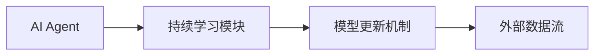
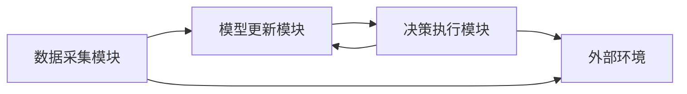

                 


# 设计AI Agent的持续学习与模型更新机制

> **关键词**: AI Agent, 持续学习, 模型更新, 机器学习, 人工智能

> **摘要**: 本文详细探讨了设计AI Agent的持续学习与模型更新机制的核心概念、算法原理、系统架构、项目实战以及最佳实践。通过分析AI Agent在动态环境中的适应性需求，结合持续学习和模型更新机制的原理，提出了一套完整的解决方案，并通过实际案例和代码实现进行了深入阐述。文章旨在为AI开发者和研究人员提供理论与实践相结合的指导，帮助他们在复杂场景下构建高效的AI Agent系统。

---

## 第1章: 背景介绍

### 1.1 问题背景

#### 1.1.1 AI Agent的定义与应用场景

AI Agent（人工智能代理）是指能够感知环境并采取行动以实现目标的智能实体。它可以是一个软件程序、一个机器人，甚至是嵌入在设备中的算法。AI Agent的核心能力在于其能够通过感知环境、分析信息、做出决策并执行动作。

AI Agent的应用场景广泛，包括但不限于：

- **自动驾驶**: 车辆实时感知环境并做出驾驶决策。
- **智能助手**: 如Siri、Alexa等，通过语音交互帮助用户完成任务。
- **推荐系统**: 根据用户行为推荐个性化内容。
- **机器人控制**: 工业机器人或服务机器人执行复杂任务。

#### 1.1.2 持续学习与模型更新的必要性

在动态环境中，AI Agent需要不断适应新的输入和变化。例如，在推荐系统中，用户的偏好可能随时间变化；在自动驾驶中，道路状况和交通规则也可能更新。为了保持性能，AI Agent需要具备持续学习和模型更新的能力。

持续学习（Lifelong Learning）是指模型在任务序列中不断学习，每个新任务的学习可以利用之前任务的经验。模型更新机制则是确保AI Agent能够实时或定期更新其知识库或参数，以适应新数据和环境变化。

#### 1.1.3 当前AI Agent的挑战与不足

尽管AI Agent在许多领域取得了显著进展，但其持续学习和模型更新机制仍存在一些挑战：

- **数据稀疏性**: 新数据可能不足以覆盖所有可能的情况。
- **计算资源限制**: 在线更新可能需要实时计算资源。
- **模型漂移**: 长期更新可能导致模型性能下降。

---

### 1.2 核心概念

#### 1.2.1 AI Agent的基本构成

AI Agent通常由以下部分构成：

1. **感知模块**: 用于感知环境，获取输入数据。
2. **决策模块**: 根据输入数据做出决策。
3. **执行模块**: 执行决策动作。
4. **学习模块**: 用于模型更新和持续学习。

#### 1.2.2 持续学习的核心原理

持续学习的核心思想是通过不断地与环境交互，逐步优化模型的性能。与批量学习（Batch Learning）不同，持续学习能够处理在线数据流，支持实时更新。

持续学习的关键特点包括：

- **在线性**: 模型在接收新数据的同时进行更新。
- **累积性**: 每个新任务的学习可以利用之前任务的经验。
- **适应性**: 模型能够适应环境的变化。

#### 1.2.3 模型更新机制的分类与特点

模型更新机制主要分为以下几类：

1. **在线更新**: 数据流实时更新，模型在线调整。
2. **离线更新**: 批量数据处理后进行模型更新。
3. **混合更新**: 结合在线和离线更新的方式。

---

## 第2章: 核心概念与联系

### 2.1 AI Agent与持续学习的关系

#### 2.1.1 AI Agent的动态环境适应性

AI Agent需要在动态环境中保持高性能，而持续学习正是其实现动态适应的核心机制。通过持续学习，AI Agent能够不断优化其决策能力。

#### 2.1.2 持续学习对模型更新的推动作用

持续学习不仅提供新的数据流，还通过模型更新机制优化AI Agent的性能。例如，在推荐系统中，持续学习能够根据用户的最新行为调整推荐策略。

### 2.2 持续学习与模型更新机制的对比分析

#### 2.2.1 持续学习的特点

| 特性         | 描述                                                                 |
|--------------|----------------------------------------------------------------------|
| 在线性       | 数据流实时更新，无需等待批量数据。                                       |
| 累积性       | 新任务的学习可以利用之前的经验。                                         |
| 适应性       | 能够适应环境的变化，保持高性能。                                         |

#### 2.2.2 模型更新机制的分类

| 类型         | 描述                                                                 |
|--------------|----------------------------------------------------------------------|
| 在线更新     | 数据流实时更新，模型在线调整。                                           |
| 离线更新     | 批量数据处理后进行模型更新。                                             |
| 混合更新     | 结合在线和离线更新的方式，优化性能。                                       |

#### 2.2.3 两者之间的联系与区别

**联系**：  
- 持续学习需要模型更新机制的支持。
- 模型更新机制是持续学习的核心实现手段。

**区别**：  
- 持续学习侧重于学习策略和数据流处理。
- 模型更新机制侧重于具体的更新方法和技术。

---

### 2.3 实体关系图

以下是一个AI Agent、持续学习模块和模型更新机制之间的关系图：



---

## 第3章: 算法原理讲解

### 3.1 模型更新机制的算法原理

#### 3.1.1 离线模型更新

离线模型更新是一种批量更新方式，适用于数据量较大且处理时间允许的场景。其步骤如下：

1. **数据收集**: 收集一批新数据。
2. **模型训练**: 使用新数据重新训练模型。
3. **模型替换**: 替换旧模型，部署新模型。

#### 3.1.2 在线模型更新

在线模型更新是一种实时更新方式，适用于需要快速响应的场景。其步骤如下：

1. **实时数据流**: 模型在运行时接收新数据。
2. **在线训练**: 每个新数据点都用于更新模型参数。
3. **模型调整**: 模型参数逐步调整，保持高性能。

#### 3.1.3 混合模型更新

混合模型更新结合了在线和离线更新的优点，适用于复杂场景。其步骤如下：

1. **实时数据流**: 模型在运行时接收新数据。
2. **在线微调**: 使用新数据对模型进行小批量更新。
3. **周期性批量训练**: 定期进行批量数据训练，优化模型性能。

---

### 3.2 持续学习算法的数学模型

#### 3.2.1 线性回归模型

线性回归是一种简单但有效的持续学习模型，其数学表达式为：

$$ y = \beta x + \epsilon $$

其中，$\beta$ 是回归系数，$x$ 是输入变量，$\epsilon$ 是误差项。

#### 3.2.2 在线梯度下降算法

在线梯度下降是一种常用的在线学习算法，其更新公式为：

$$ \beta_{t+1} = \beta_t - \eta (\beta_t x_t - y_t) $$

其中，$\eta$ 是学习率，$x_t$ 和 $y_t$ 是第 $t$ 个数据点的输入和标签。

---

## 第4章: 系统架构设计

### 4.1 系统功能设计

AI Agent的持续学习与模型更新系统主要包括以下功能模块：

1. **数据采集模块**: 负责收集环境数据。
2. **模型更新模块**: 负责模型的持续学习和更新。
3. **决策执行模块**: 根据更新后的模型做出决策并执行动作。

---

### 4.2 系统架构设计

以下是一个AI Agent系统的架构图：



---

## 第5章: 项目实战

### 5.1 环境安装

以下是一个Python实现的持续学习AI Agent的环境配置：

1. **Python 3.8+**
2. **TensorFlow或PyTorch**
3. **numpy**

---

### 5.2 核心代码实现

以下是一个简单的在线梯度下降实现代码：

```python
import numpy as np

def online_gradient_descent(X, y, beta_0, eta):
    beta = beta_0.copy()
    for i in range(len(X)):
        x = X[i]
        y_pred = np.dot(beta, x)
        error = y[i] - y_pred
        beta += eta * error * x
    return beta

# 示例数据
X = np.array([[1, 1], [1, 2], [1, 3]])
y = np.array([2, 4, 6])

# 初始化参数
beta_0 = np.array([0, 0])
eta = 0.1

# 训练模型
beta = online_gradient_descent(X, y, beta_0, eta)
print("更新后的模型参数：", beta)
```

---

## 第6章: 最佳实践与注意事项

### 6.1 性能优化

- **数据预处理**: 对数据进行归一化或标准化处理，提升模型收敛速度。
- **学习率调整**: 使用自适应学习率优化算法（如Adam）。
- **模型评估**: 定期评估模型性能，及时调整更新策略。

### 6.2 数据隐私与安全

- **数据加密**: 确保数据在传输和存储过程中的安全性。
- **隐私保护**: 遵守相关隐私保护法规，如GDPR。

### 6.3 拓展阅读

- 《Deep Learning》——Ian Goodfellow
- 《Hands-On Machine Learning with Scikit-Learn, Keras, and TensorFlow》——Aurélien Géron

---

## 作者：AI天才研究院/AI Genius Institute & 禅与计算机程序设计艺术 /Zen And The Art of Computer Programming

---

以上是《设计AI Agent的持续学习与模型更新机制》的完整目录和内容概要。通过逐步分析和详细阐述，本文旨在为AI开发者和研究人员提供理论与实践相结合的指导，帮助他们在复杂场景下构建高效的AI Agent系统。

