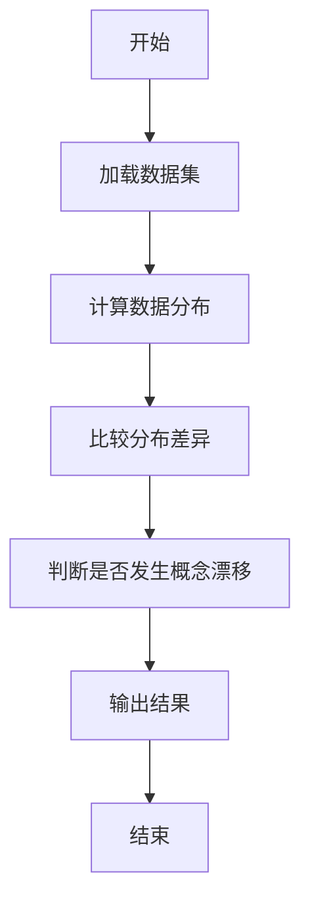
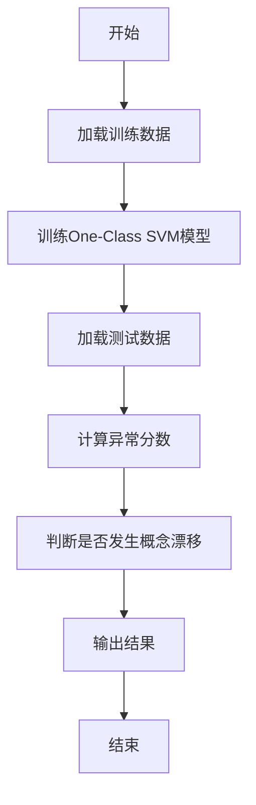
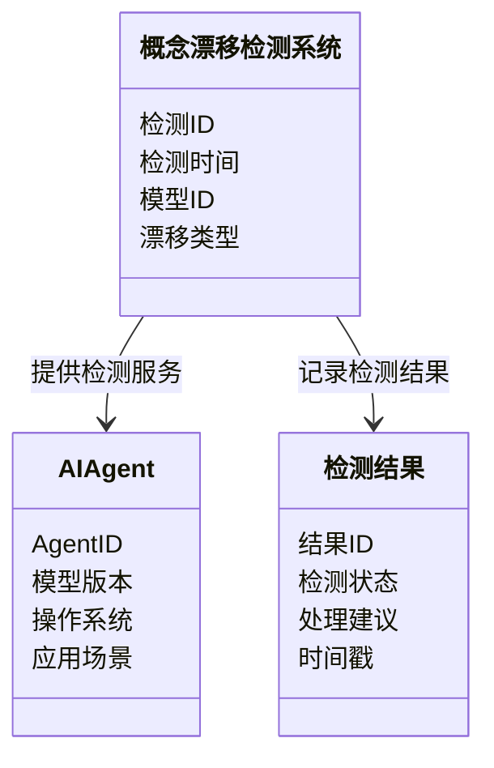
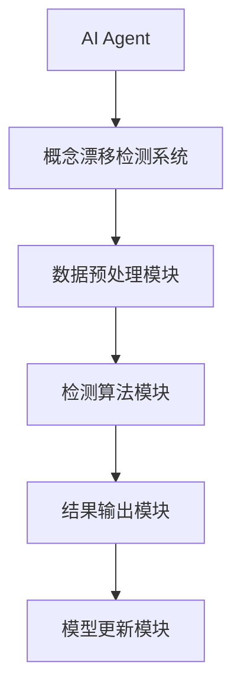
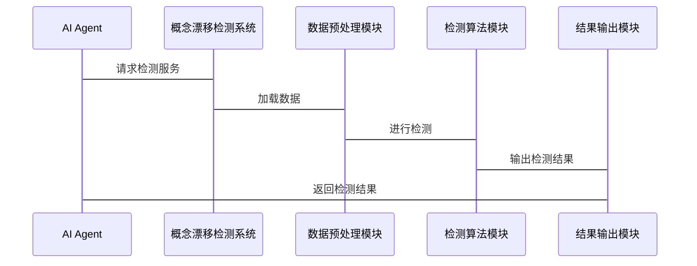

                 


# 设计AI Agent的概念漂移检测机制

> 关键词：AI Agent，概念漂移，机器学习，模型更新，数据变化检测

> 摘要：  
概念漂移是指数据分布的变化导致机器学习模型性能下降的现象。在AI Agent系统中，及时检测和应对概念漂移对于保持模型的准确性和可靠性至关重要。本文将详细探讨概念漂移检测的原理、算法、系统设计及实际应用，帮助读者理解如何在AI Agent中有效设计和实现概念漂移检测机制。

---

# 第1章: 概念漂移检测的背景与重要性

## 1.1 概念漂移的基本概念

### 1.1.1 什么是概念漂移
概念漂移（Concept Drift）是指数据分布的变化导致模型预测能力下降的现象。例如，在电商领域，用户的购买行为可能因市场变化、季节性影响或用户偏好的改变而发生变化，导致之前训练的模型无法准确预测新数据。

### 1.1.2 概念漂移的类型
概念漂移可以分为以下几种类型：
- **突然漂移（Sudden Drift）**：数据分布的变化是突然的，例如突发事件导致的需求变化。
- **逐步漂移（Incremental Drift）**：数据分布的变化是缓慢且渐进的，例如随着时间推移，用户的偏好逐渐变化。
- **分布漂移（Distribution Drift）**：数据的分布发生变化，但标签（类别）保持不变。
- **类内漂移（Within Class Drift）**：同一类别内的数据分布发生变化。

### 1.1.3 概念漂移对AI Agent的影响
- **模型性能下降**：概念漂移会导致模型预测准确率下降，影响AI Agent的决策能力。
- **用户信任度降低**：如果AI Agent在变化的环境中表现不佳，用户会失去信任。
- **业务损失**：在商业场景中，概念漂移可能导致错误的决策，从而带来经济损失。

## 1.2 概念漂移检测的必要性

### 1.2.1 机器学习模型的局限性
机器学习模型通常假设训练数据和测试数据来自相同的分布。然而，现实场景中数据分布往往是动态变化的，模型无法适应这种变化，导致性能下降。

### 1.2.2 概念漂移对模型性能的影响
- 数据分布的变化可能导致模型过时，无法准确预测新数据。
- 模型在概念漂移后，如果不及时更新，可能会产生错误的预测结果。

### 1.2.3 AI Agent中概念漂移检测的应用场景
- **实时监控**：AI Agent需要实时监控数据分布的变化，及时发现概念漂移。
- **动态模型更新**：通过概念漂移检测，AI Agent可以触发模型更新机制，保持模型性能。
- **异常检测**：概念漂移检测也可以用于异常检测，帮助AI Agent识别异常数据。

---

# 第2章: 概念漂移检测的核心概念

## 2.1 概念漂移检测的原理

### 2.1.1 统计方法
统计方法通过分析数据分布的变化来检测概念漂移。常见的统计方法包括：
- **卡方检验（Chi-square test）**：用于分类变量分布的变化检测。
- **Kolmogorov-Smirnov检验（KS检验）**：用于连续变量分布的变化检测。

### 2.1.2 机器学习方法
机器学习方法通过训练模型来检测数据分布的变化。常见的机器学习方法包括：
- **One-Class SVM**：用于检测异常数据点。
- **Isolation Forest**：一种无监督的异常检测算法。

### 2.1.3 深度学习方法
深度学习方法通过构建神经网络模型来检测概念漂移。例如，可以使用变种的自编码器（Autoencoder）来检测数据分布的变化。

## 2.2 概念漂移检测的关键属性

### 2.2.1 检测的及时性
及时性是指检测系统能够快速发现概念漂移的能力。在实时应用场景中，及时性尤为重要。

### 2.2.2 检测的准确性
准确性是指检测系统能够正确区分概念漂移和随机波动的能力。如果检测系统误报或漏报，都会影响AI Agent的性能。

### 2.2.3 检测的可解释性
可解释性是指检测系统能够提供清晰的解释，帮助用户理解概念漂移的原因和影响。

## 2.3 概念漂移检测的ER实体关系图

```mermaid
er
    entity 概念漂移检测系统 {
        key 检测ID
        检测时间
        模型ID
        漂移类型
    }
    entity AI Agent {
        key AgentID
        模型版本
        操作系统
        应用场景
    }
    entity 检测结果 {
        key 结果ID
        检测状态
        处理建议
        时间戳
    }
    概念漂移检测系统 --> AI Agent: 为AI Agent提供概念漂移检测服务
    概念漂移检测系统 --> 检测结果: 记录检测结果和处理建议
```

---

# 第3章: 概念漂移检测的算法原理

## 3.1 基于统计的方法

### 3.1.1 统计假设检验

#### 卡方检验（Chi-square test）
卡方检验用于比较两个数据集的分布差异。假设我们有两个数据集$X$和$Y$，分别来自分布$P$和$Q$，卡方统计量可以表示为：
$$
\chi^2 = \sum_{i=1}^{n} \frac{(O_i - E_i)^2}{E_i}
$$
其中，$O_i$是观察频数，$E_i$是期望频数。

#### Kolmogorov-Smirnov检验
KS检验用于比较两个数据集的累积分布函数（CDF）的差异。KS统计量定义为：
$$
D = \max_x |F_1(x) - F_2(x)|
$$
其中，$F_1(x)$和$F_2(x)$分别是两个数据集的CDF。

### 3.1.2 基于分布变化的检测

#### 算法流程图



## 3.2 基于机器学习的方法

### 3.2.1 One-Class SVM

#### 算法流程图



#### Python代码实现

```python
from sklearn.svm import OneClassSVM

# 训练模型
svm = OneClassSVM()
svm.fit(train_data)

# 预测异常分数
scores = svm.score_samples(test_data)
# 判断是否发生概念漂移
threshold = 0.5
is_drift = scores < threshold
```

---

# 第4章: 系统分析与架构设计

## 4.1 问题场景介绍

### 问题场景：实时监控AI Agent的模型性能
AI Agent需要实时监控模型的性能，及时发现并应对概念漂移。

## 4.2 系统功能设计

### 领域模型类图



## 4.3 系统架构设计

### 系统架构图



## 4.4 系统接口设计

### 接口设计



---

# 第5章: 项目实战

## 5.1 环境安装

### 安装Python和必要的库
```bash
pip install numpy pandas scikit-learn
```

## 5.2 核心代码实现

### 概念漂移检测的Python代码

```python
import numpy as np
from sklearn.svm import OneClassSVM

def detect_concept_drift(train_data, test_data):
    svm = OneClassSVM()
    svm.fit(train_data)
    scores = svm.score_samples(test_data)
    threshold = np.quantile(scores, 0.05)
    is_drift = scores < threshold
    return is_drift.any()

# 示例数据
train_data = np.random.randn(100, 2)
test_data = np.random.randn(50, 2) + 2  # 模拟概念漂移
drift = detect_concept_drift(train_data, test_data)
print(f"检测到概念漂移: {drift}")
```

## 5.3 代码解读与分析

### 代码功能分析
- **训练模型**：使用One-Class SVM训练模型。
- **计算异常分数**：对测试数据计算异常分数。
- **判断是否发生概念漂移**：通过设定阈值，判断是否发生概念漂移。

## 5.4 实际案例分析

### 案例分析：电商领域的用户行为变化
假设我们有一个电商AI Agent，用于预测用户的购买行为。由于季节性变化，用户的购买行为可能发生变化，导致模型性能下降。通过概念漂移检测，AI Agent可以及时发现数据分布的变化，并触发模型更新机制。

---

# 第6章: 总结与展望

## 6.1 总结
概念漂移检测是AI Agent系统中一个重要的功能模块，能够帮助系统及时发现和应对数据分布的变化，保持模型的性能和可靠性。

## 6.2 未来研究方向
- **更高效的检测算法**：研究更高效的检测算法，提高检测的准确性和及时性。
- **自适应模型更新机制**：研究如何根据概念漂移的情况自适应地更新模型。
- **多模态数据检测**：研究如何在多模态数据中检测概念漂移。

---

# 作者：AI天才研究院 & 禅与计算机程序设计艺术

---

**小结：** 通过本文的详细讲解，我们了解了概念漂移检测的基本原理、算法实现和系统设计。在实际应用中，AI Agent需要结合具体场景，选择合适的检测方法，并通过不断优化检测算法和模型更新机制，确保系统的稳定性和可靠性。

