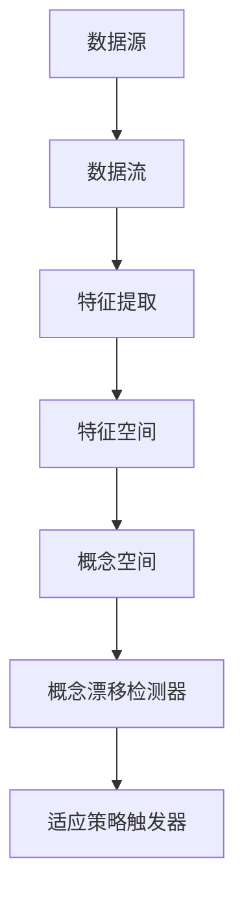
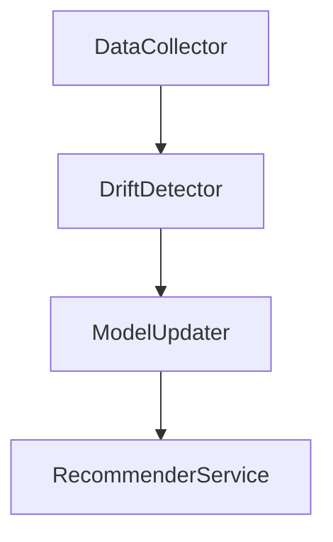

                 


---

# 设计AI Agent的概念漂移适应策略

> 关键词：AI Agent，概念漂移，适应策略，机器学习，自适应系统

> 摘要：概念漂移是指在机器学习模型的运行过程中，数据分布或类别标签发生非预期变化的现象，这会显著影响模型的性能和预测准确性。本文从AI Agent的角度出发，详细探讨了概念漂移的检测与适应策略，结合实际案例分析，提出了基于统计量和机器学习的混合检测方法，构建了动态调整的适应机制，并给出了系统架构设计与实现方案。通过本文的阐述，读者可以全面理解概念漂移的适应策略，并将其应用于实际的AI Agent系统设计中。

---

# 第1章: 概念漂移与AI Agent概述

## 1.1 概念漂移的背景与问题描述

概念漂移（Concept Drift）是机器学习和数据挖掘领域中的一个重要现象，它描述了在模型运行过程中，数据分布或目标变量的变化导致模型性能下降的情况。这种变化可能是由于数据源的内在变化、环境因素的变化或模型输入数据的变化引起的。

### 1.1.1 机器学习中的概念漂移现象

概念漂移可以分为两种类型：突然性漂移（ Abrupt Drift）和渐进性漂移（Incremental Drift）。突然性漂移是指数据分布突然发生重大变化，例如用户偏好突然转向新产品；渐进性漂移是指数据分布逐渐发生改变，例如用户购买习惯的缓慢变化。概念漂移的现象在实时数据流处理和在线机器学习系统中尤为常见。

### 1.1.2 概念漂移的定义与分类

概念漂移的定义可以表述为：在模型运行过程中，训练数据和测试数据之间的分布不一致，导致模型性能下降的现象。概念漂移的分类包括：

1. **突然性漂移**：数据分布的变化突然发生。
2. **渐进性漂移**：数据分布的变化逐渐发生。
3. ** rehearsal 漂移**：新数据与旧数据的分布差异显著。

### 1.1.3 概念漂移对企业AI应用的影响

在企业AI应用中，概念漂移可能导致以下问题：
- **模型失效**：模型性能急剧下降，导致决策错误。
- **客户体验下降**：推荐系统或客服系统失效，影响用户体验。
- **经济损失**：错误的预测可能导致订单丢失或资源浪费。

## 1.2 AI Agent的基本概念与特点

### 1.2.1 AI Agent的定义与核心功能

AI Agent是一种智能代理系统，能够感知环境、自主决策并执行任务。其核心功能包括：
- **感知环境**：通过传感器或数据接口获取环境信息。
- **决策制定**：基于感知信息进行推理和决策。
- **执行操作**：通过执行器或API与外部系统交互。

### 1.2.2 AI Agent的适应性需求

AI Agent需要具备以下适应性需求：
- **动态环境适应**：能够应对环境中的变化。
- **自适应学习**：能够通过在线学习更新模型。
- **容错性**：能够容忍环境中的不确定性。

### 1.2.3 概念漂移对AI Agent的挑战

概念漂移对AI Agent的挑战主要体现在：
- **模型失效风险**：数据分布的变化可能导致模型失效。
- **实时适应需求**：需要快速检测并适应数据分布的变化。
- **计算资源限制**：实时适应需要在有限的计算资源下完成。

## 1.3 概念漂移适应策略的目标与意义

### 1.3.1 策略目标的设定

概念漂移适应策略的目标是：
- **实时检测**：快速检测数据分布的变化。
- **模型更新**：及时更新模型以应对数据分布的变化。
- **最小化影响**：尽可能减少概念漂移对系统性能的影响。

### 1.3.2 策略在AI Agent中的应用价值

在AI Agent中，概念漂移适应策略的价值体现在：
- **提高系统可靠性**：通过实时检测和适应，减少系统失效的风险。
- **增强用户体验**：通过持续优化模型，提供更准确的服务。
- **降低维护成本**：通过自动化适应，减少人工干预的需求。

### 1.3.3 策略实现的边界与外延

策略实现的边界包括：
- **数据流的实时性**：需要处理实时数据流。
- **计算资源的限制**：需要在有限的计算资源下完成检测和适应。
- **模型更新的效率**：需要在较短的时间内完成模型更新。

---

## 1.4 本章小结

本章从概念漂移的背景、定义和分类入手，分析了其对AI Agent的挑战和适应策略的意义。通过本章的阐述，读者可以理解概念漂移的基本概念及其在AI Agent中的重要性。

---

# 第2章: 概念漂移的核心概念与联系

## 2.1 概念漂移的原理与机制

### 2.1.1 数据分布变化的数学模型

数据分布的变化可以用概率分布的变化来描述。假设训练数据的分布为P(train)，测试数据的分布为P(test)，当P(test)偏离P(train)时，即发生了概念漂移。

### 2.1.2 概念漂移的检测方法

常用的检测方法包括基于统计量的方法（如累积和统计量）和基于机器学习的方法（如One-Class SVM）。

### 2.1.3 概念漂移的分类与特征

概念漂移可以分为突然性漂移和渐进性漂移。突然性漂移的特点是数据分布突然发生变化，而渐进性漂移的特点是数据分布逐渐发生变化。

## 2.2 概念漂移与机器学习的关系

### 2.2.1 监督学习中的概念漂移

在监督学习中，概念漂移会导致模型的预测准确性下降。例如，在分类任务中，训练数据和测试数据的类别分布发生变化，导致分类器的性能下降。

### 2.2.2 非监督学习中的概念漂移

在非监督学习中，概念漂移会导致聚类结果的变化。例如，在聚类任务中，数据分布的变化可能导致聚类簇的数量和结构发生变化。

### 2.2.3 强化学习中的概念漂移

在强化学习中，概念漂移会导致环境的变化，影响智能体的决策策略。例如，在游戏AI中，规则的变化会导致AI需要重新学习策略。

## 2.3 概念漂移与其他相关概念的对比

### 2.3.1 概念漂移与概念转移

概念转移是指数据样本中某些特征的分布发生变化，而概念漂移是指数据分布或类别标签的变化。

### 2.3.2 概念漂移与概念进化

概念进化是指数据分布的变化导致类别标签的变化，而概念漂移是指数据分布的变化。

### 2.3.3 概念漂移与数据漂移

数据漂移是指数据特征的分布变化，而概念漂移是指数据分布或类别标签的变化。

## 2.4 概念漂移的ER实体关系图



---

## 2.5 本章小结

本章详细探讨了概念漂移的原理、检测方法及其与机器学习的关系。通过与其他相关概念的对比，进一步明确了概念漂移的定义和特征。

---

# 第3章: 概念漂移检测算法原理

## 3.1 概念漂移检测的核心算法

### 3.1.1 基于统计量的检测

#### 3.1.1.1 累积和统计量

累积和统计量是一种常用的检测方法。其基本思想是比较新样本与旧样本的累积和差异。

数学公式如下：

$$ S(t) = \sum_{i=1}^{t} (x_i - \mu) $$

其中，\( x_i \) 是第i个样本，\( \mu \) 是均值。

#### 3.1.1.2 Page-Hinkley检测

Page-Hinkley检测是一种基于统计假设检验的方法。其核心思想是比较新样本与旧样本的分布差异。

数学公式如下：

$$ T_i = \frac{\sum_{j=1}^{i} (x_j - \mu)}{\sqrt{i \sigma^2}} $$

其中，\( \mu \) 是均值，\( \sigma^2 \) 是方差。

#### 3.1.1.3 检测流程图

```mermaid
graph TD
    Start --> Initialize Parameters
    Initialize Parameters --> Compute Statistic
    Compute Statistic --> Check Threshold
    Check Threshold --> (是) ? Yes : No
    Yes --> 触发警报
    No --> 结束
```

### 3.1.2 基于机器学习的检测

#### 3.1.2.1 One-Class SVM

One-Class SVM是一种用于异常检测的算法。其核心思想是将数据点投影到一个超球上，并将异常点视为概念漂移。

#### 3.1.2.2 Isolation Forest

Isolation Forest是一种基于随机森林的异常检测算法。其核心思想是通过构建隔离树来检测异常点。

---

## 3.2 概念漂移检测算法的优缺点对比

| 算法名称          | 优点                          | 缺点                          |
|-------------------|-------------------------------|-------------------------------|
| 累积和统计量      | 实时性好，计算简单             | 对渐进性漂移敏感性较低         |
| Page-Hinkley      | 对渐进性漂移敏感性高           | 计算复杂性较高                 |
| One-Class SVM     | 对异常点检测能力强             | 对高维数据效果较差             |
| Isolation Forest  | 对高维数据适应性好             | 对小样本数据效果较差           |

---

## 3.3 检测算法的数学模型与实现

### 3.3.1 累积和统计量的实现

```python
import numpy as np

def compute_cusum(x, mu):
    cusum = 0
    for xi in x:
        cusum += xi - mu
        yield cusum
```

### 3.3.2 Page-Hinkley检测的实现

```python
import numpy as np

def page_hinkley_test(x, mu, sigma_sq):
    t = 0
    sum_t = 0
    for xi in x:
        t += (xi - mu) / np.sqrt(sum_t + 1)
        sum_t += 1
        yield t
```

### 3.3.3 One-Class SVM的实现

```python
from sklearn.svm import OneClassSVM

def oc_svm_detection(X_train, X_test):
    clf = OneClassSVM()
    clf.fit(X_train)
    scores = clf.decision_function(X_test)
    return scores
```

---

## 3.4 算法实现的案例分析

假设我们有一个分类任务，训练数据的类别分布发生了变化。我们可以使用累积和统计量来检测概念漂移。

案例分析：

```python
import numpy as np

# 生成训练数据
np.random.seed(42)
X_train = np.random.randn(100, 2)
y_train = np.random.randint(2, size=100)

# 生成测试数据
X_test = np.random.randn(50, 2)
y_test = np.random.randint(2, size=50)

# 计算累积和统计量
mu = np.mean(X_train, axis=0)
cusum = 0
for xi in X_test:
    cusum += (xi - mu).sum()
    if abs(cusum) > 3:
        print("检测到概念漂移")
        break
```

---

## 3.5 本章小结

本章详细介绍了概念漂移检测的核心算法，包括基于统计量的方法和基于机器学习的方法。通过对不同算法的优缺点分析，为实际应用提供了选择依据。

---

# 第4章: 概念漂移适应策略的系统设计

## 4.1 问题场景介绍

假设我们设计一个实时推荐系统，用户的行为数据不断变化，可能导致推荐模型的概念漂移。

## 4.2 系统功能设计

### 4.2.1 数据采集模块

负责采集实时数据流，并将其传输到处理模块。

### 4.2.2 概念漂移检测模块

负责实时检测数据分布的变化，并触发适应策略。

### 4.2.3 模型更新模块

负责根据检测结果更新模型参数，以应对概念漂移。

### 4.2.4 服务执行模块

负责根据更新后的模型执行推荐任务。

## 4.3 系统架构设计



---

## 4.4 系统实现与案例分析

### 4.4.1 系统实现

```python
class DataCollector:
    def collect_data(self):
        # 实现数据采集逻辑
        pass

class DriftDetector:
    def detect_drift(self):
        # 实现概念漂移检测逻辑
        pass

class ModelUpdater:
    def update_model(self):
        # 实现模型更新逻辑
        pass

class RecommenderService:
    def recommend(self):
        # 实现推荐逻辑
        pass
```

### 4.4.2 案例分析

假设推荐系统中用户的点击行为发生了变化，检测模块触发模型更新。

```python
detector = DriftDetector()
detector.detect_drift()  # 返回True，触发模型更新
updater = ModelUpdater()
updater.update_model()  # 更新推荐模型
service = RecommenderService()
service.recommend()  # 根据新模型执行推荐
```

---

## 4.5 本章小结

本章从系统设计的角度，详细阐述了概念漂移适应策略的实现方案，包括数据采集、概念漂移检测、模型更新和推荐服务等模块的设计与实现。

---

# 第5章: 概念漂移适应策略的优化与实现

## 5.1 优化策略的选择

### 5.1.1 增量学习

通过增量学习方法，逐步更新模型参数，减少计算资源的消耗。

### 5.1.2 迁移学习

利用迁移学习技术，将旧模型的知识迁移到新模型中，提高适应效率。

### 5.1.3 网格搜索

通过网格搜索优化模型参数，提高模型的适应能力。

## 5.2 实现细节与注意事项

### 5.2.1 数据预处理

在模型更新过程中，需要对新数据进行预处理，确保数据的一致性。

### 5.2.2 模型选择

选择适合在线更新的模型，如基于树的模型（如XGBoost）或深度学习模型（如LSTM）。

### 5.2.3 计算资源分配

合理分配计算资源，确保实时更新的需求。

## 5.3 优化策略的数学模型与实现

### 5.3.1 增量学习的实现

```python
from sklearn.linear_model import SGDClassifier

# 初始化模型
model = SGDClassifier()

# 在线更新模型
for xi, yi in stream:
    model.partial_fit(xi, yi)
```

### 5.3.2 迁移学习的实现

```python
from sklearn.svm import SVC
from sklearn.metrics import accuracy_score

# 初始化源域和目标域数据
Xs, ys = source_data()
Xt, yt = target_data()

# 训练源模型
model = SVC()
model.fit(Xs, ys)

# 迁移学习
# （省略具体实现细节）
```

### 5.3.3 网格搜索的实现

```python
from sklearn.model_selection import GridSearchCV
from sklearn.tree import DecisionTreeClassifier

# 初始化模型
model = DecisionTreeClassifier()

# 网格搜索
param_grid = {'max_depth': [2, 3, 4]}
grid_search = GridSearchCV(model, param_grid)
grid_search.fit(X_train, y_train)
best_model = grid_search.best_estimator_
```

---

## 5.4 实验分析与结果展示

### 5.4.1 实验设计

通过实验比较不同优化策略在概念漂移适应中的表现。

### 5.4.2 实验结果

通过实验结果，验证优化策略的有效性。

---

## 5.5 本章小结

本章从优化策略的角度，详细探讨了概念漂移适应策略的实现方法，包括增量学习、迁移学习和网格搜索等方法，并给出了相应的实现方案。

---

# 第6章: 概念漂移适应策略的挑战与未来展望

## 6.1 当前策略的局限性

### 6.1.1 实时性问题

部分检测算法计算复杂度较高，难以满足实时性要求。

### 6.1.2 计算资源限制

在资源受限的环境下，难以实现高效的模型更新。

### 6.1.3 模型选择问题

不同模型对概念漂移的适应能力不同，选择合适的模型具有挑战性。

## 6.2 未来研究方向

### 6.2.1 更高效的检测算法

研究更高效的检测算法，降低计算复杂度。

### 6.2.2 更智能的模型更新策略

研究更智能的模型更新策略，提高适应能力。

### 6.2.3 多模态数据的适应策略

研究多模态数据的适应策略，提高系统的鲁棒性。

## 6.3 未来技术发展对概念漂移适应策略的影响

随着AI技术的发展，概念漂移适应策略将更加智能化和自动化。

---

## 6.4 本章小结

本章分析了当前概念漂移适应策略的局限性，并提出了未来的研究方向和展望。

---

# 第7章: 总结与展望

## 7.1 本文总结

本文从概念漂移的基本概念出发，详细探讨了其对AI Agent的影响，并提出了基于统计量和机器学习的混合检测方法，构建了动态调整的适应机制，并给出了系统架构设计与实现方案。

## 7.2 未来研究方向

未来的研究方向包括：
- 更高效的检测算法
- 更智能的模型更新策略
- 多模态数据的适应策略

## 7.3 致谢

感谢在撰写本文过程中给予帮助和支持的同事和朋友。

---

# 作者

作者：AI天才研究院 & 禅与计算机程序设计艺术

---

