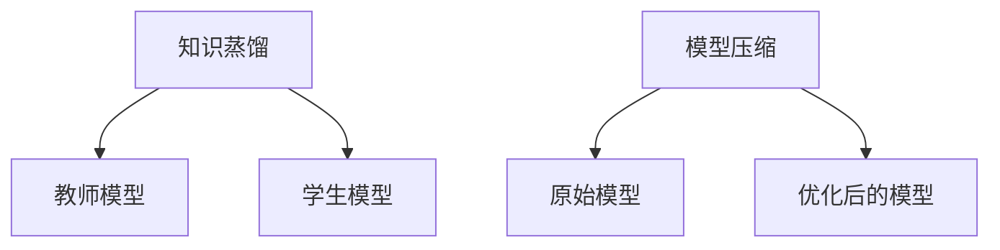
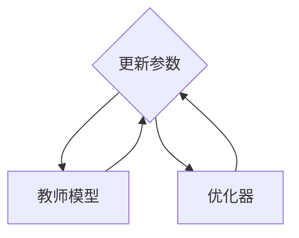
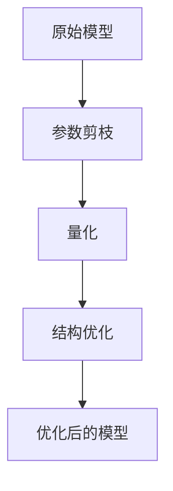
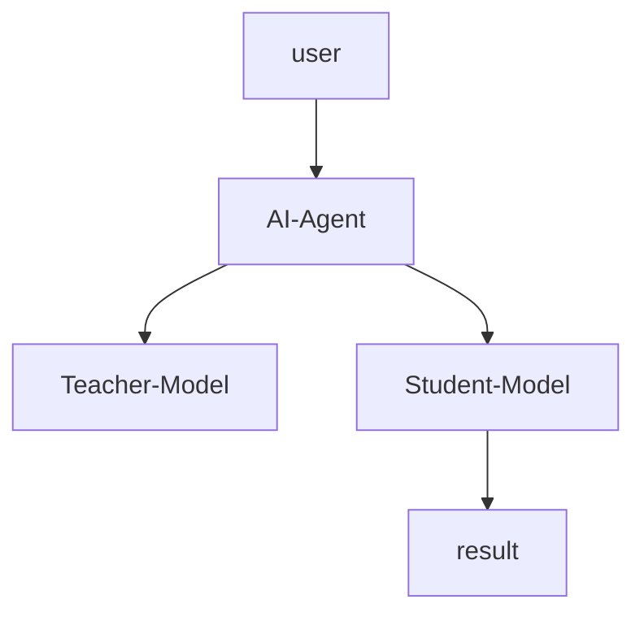
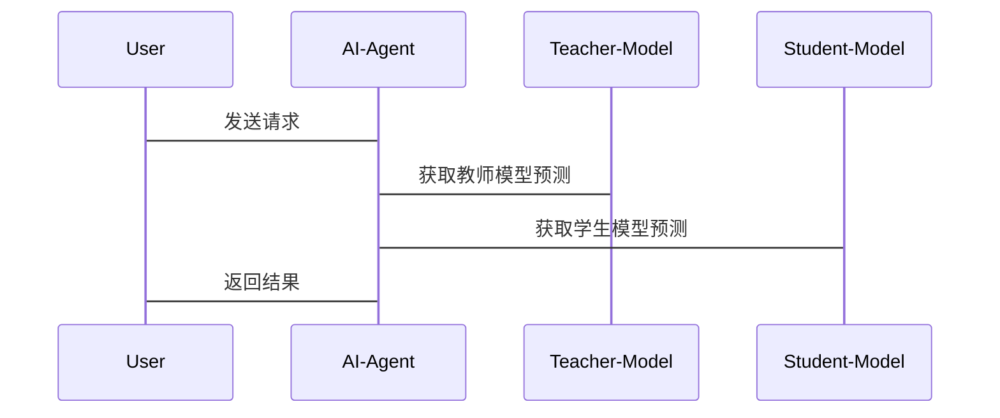

                 


# 设计AI Agent的知识蒸馏与压缩策略

## 关键词：知识蒸馏，模型压缩，AI代理，机器学习，优化策略

## 摘要：  
在AI Agent设计中，知识蒸馏与压缩是优化模型性能和效率的关键技术。本文系统地探讨了知识蒸馏与压缩的核心概念、算法原理、系统架构设计及实际应用案例。通过理论分析和实践指导，本文旨在帮助读者理解如何通过知识蒸馏和模型压缩技术，提升AI Agent的性能、减少计算资源消耗，并在实际项目中有效实施这些策略。

---

## 第一部分：背景介绍

### 第1章：知识蒸馏与压缩的背景

#### 1.1 问题背景

随着AI技术的快速发展，AI Agent在各个领域的应用日益广泛。然而，AI Agent的设计面临两大核心挑战：  
1. **知识表示的复杂性**：AI Agent需要处理海量数据，并从中提取有用的知识，这对模型的存储和计算能力提出了更高要求。  
2. **计算资源的限制**：在实际应用场景中，AI Agent往往需要在资源受限的环境中运行，如移动设备或边缘计算设备，这要求模型必须轻量化。  

知识蒸馏与压缩技术正是为了解决这些问题而诞生。通过蒸馏和压缩技术，AI Agent可以在保持甚至提升性能的同时，显著降低模型的计算和存储需求。

#### 1.2 问题描述

知识蒸馏与压缩的目标是通过以下方式优化AI Agent：  
- **知识蒸馏**：将复杂模型（教师模型）的知识迁移到简单模型（学生模型），提升学生模型的性能。  
- **模型压缩**：通过剪枝、量化等技术，减少模型的参数数量，降低模型的存储和计算开销。  

两者的结合可以实现模型的轻量化，同时保持甚至提升模型的性能。

#### 1.3 问题解决

1. **知识蒸馏**：通过教师模型的指导，学生模型可以更快、更高效地学习复杂的任务。  
2. **模型压缩**：通过去除冗余参数和优化模型结构，减少计算资源的消耗。  
3. **组合策略**：蒸馏和压缩的结合可以在不显著降低性能的前提下，大幅降低模型的资源需求。

#### 1.4 边界与外延

- **知识蒸馏的适用范围**：适用于需要迁移学习的场景，特别是当目标模型需要快速学习复杂任务时。  
- **模型压缩的适用场景**：适用于资源受限的环境，如移动设备、边缘计算等。  
- **两者的相互影响**：蒸馏可以提升压缩后模型的性能，而压缩则可以减少蒸馏过程中的计算开销。

#### 1.5 概念结构与核心要素

- **核心概念**：知识蒸馏、模型压缩、组合策略。  
- **组成关系**：蒸馏和压缩是独立的技术，但可以结合使用以达到更好的效果。  

---

## 第二部分：核心概念与联系

### 第2章：知识蒸馏与压缩的核心原理

#### 2.1 核心概念的原理

- **知识蒸馏**：通过教师模型的软标签（soft label）指导学生模型学习，学生模型通过模仿教师模型的行为来提升性能。  
- **模型压缩**：通过去除模型中的冗余参数和结构优化，降低模型的资源消耗。  

#### 2.2 核心概念属性特征对比

| **技术**       | **目标**               | **实现方法**                     | **优点**                         | **缺点**                         |
|----------------|------------------------|----------------------------------|----------------------------------|----------------------------------|
| 知识蒸馏       | 提升学生模型性能       | 使用软标签和知识迁移           | 性能提升显著                     | 需要教师模型，计算开销较大       |
| 模型压缩       | 减少模型资源消耗       | 参数剪枝、量化、结构优化         | 资源消耗降低                     | 可能导致性能下降                 |

#### 2.3 ER实体关系图



---

## 第三部分：算法原理讲解

### 第3章：知识蒸馏算法

#### 3.1 算法流程



#### 3.2 代码实现

```python
import torch
import torch.nn as nn
import torch.optim as optim

# 定义教师模型和学生模型
class TeacherModel(nn.Module):
    def __init__(self):
        super(TeacherModel, self).__init__()
        self.fc = nn.Linear(10, 1)

class StudentModel(nn.Module):
    def __init__(self):
        super(StudentModel, self).__init__()
        self.fc = nn.Linear(10, 1)

# 定义蒸馏损失函数
class DistillationLoss(nn.Module):
    def __init__(self, T=1.0):
        super(DistillationLoss, self).__init__()
        self.T = T

    def forward(self, teacher logits, student logits, labels):
        teacher_probs = torch.nn.functional.softmax(teacher logits / self.T, dim=1)
        student_probs = torch.nn.functional.softmax(student logits, dim=1)
        loss = -torch.mean(torch.sum(teacher_probs * torch.log(student_probs), dim=1))
        return loss

# 训练过程
teacher = TeacherModel()
student = StudentModel()
distillation_criterion = DistillationLoss(T=2.0)
optimizer = optim.SGD(student.parameters(), lr=0.01)

for epoch in range(num_epochs):
    for inputs, labels in dataloader:
        teacher_logits = teacher(inputs)
        student_logits = student(inputs)
        loss = distillation_criterion(teacher_logits, student_logits, labels)
        optimizer.zero_grad()
        loss.backward()
        optimizer.step()
```

#### 3.3 数学模型

蒸馏损失函数：  
$$ L = -\frac{1}{N}\sum_{i=1}^{N} \sum_{j=1}^{C} p_j^{(teacher)} \log p_j^{(student)} $$  

其中，$p_j^{(teacher)}$ 和 $p_j^{(student)}$ 分别是教师模型和学生模型在类别 $j$ 的概率。

---

### 第4章：模型压缩算法

#### 4.1 算法流程



#### 4.2 代码实现

```python
import torch
import torch.nn as nn
import torch.quantization

# 定义原始模型
class OriginalModel(nn.Module):
    def __init__(self):
        super(OriginalModel, self).__init__()
        self.conv1 = nn.Conv2d(3, 6, 5)
        self.conv2 = nn.Conv2d(6, 10, 5)
        self.fc1 = nn.Linear(10 * 5 * 5, 20)
        self.fc2 = nn.Linear(20, 10)

# 定义量化模型
class QuantizedModel(nn.Module):
    def __init__(self):
        super(QuantizedModel, self).__init__()
        self.quant = torch.quantization.QuantizedLinear(10 * 5 * 5, 20, 8, 8)
        self.fc = nn.Linear(20, 10)

# 应用量化
model = OriginalModel()
quantized_model = QuantizedModel()

# 模型压缩过程
quantized_model.load_state_dict(torch.quantization.quantize(model, 8).state_dict())
```

#### 4.3 数学模型

量化公式：  
$$ q(x) = \text{round}(x \times 2^{b}) / 2^{b} $$  

其中，$b$ 是位数，$x$ 是原始数值。

---

## 第四部分：系统分析与架构设计

### 第5章：系统架构设计方案

#### 5.1 项目介绍

假设我们正在设计一个AI推荐系统，其中AI Agent需要在移动设备上实时处理用户请求。为了优化性能，我们需要对模型进行知识蒸馏和压缩。

#### 5.2 系统功能设计

- **功能模块**：用户请求处理、知识蒸馏模块、模型压缩模块。  
- **领域模型类图**：  
  ```mermaid
  classDiagram
      class User {
          id: int
          request: string
      }
      class AI-Agent {
          process_request(request: string): string
      }
      class Teacher-Model {
          forward(x: tensor): tensor
      }
      class Student-Model {
          forward(x: tensor): tensor
      }
      User --> AI-Agent
      AI-Agent --> Teacher-Model
      AI-Agent --> Student-Model
  ```

#### 5.3 系统架构设计



#### 5.4 接口设计

- **输入接口**：用户请求（字符串）。  
- **输出接口**：处理结果（字符串）。  

#### 5.5 交互序列图



---

## 第五部分：项目实战

### 第6章：项目实战

#### 6.1 环境安装

- 安装PyTorch和相关库：  
  ```bash
  pip install torch torchvision
  ```

#### 6.2 核心代码实现

```python
# 知识蒸馏实现
class DistillationLoss(nn.Module):
    def __init__(self, T=1.0):
        super(DistillationLoss, self).__init__()
        self.T = T

    def forward(self, teacher_logits, student_logits, labels):
        teacher_probs = torch.nn.functional.softmax(teacher_logits / self.T, dim=1)
        student_probs = torch.nn.functional.softmax(student_logits, dim=1)
        loss = -torch.mean(torch.sum(teacher_probs * torch.log(student_probs), dim=1))
        return loss

# 模型压缩实现
class QuantizedLinear(nn.Linear):
    def __init__(self, in_features, out_features, bits=8):
        super(QuantizedLinear, self).__init__(in_features, out_features)
        self.quant = torch.quantization.QuantizedLinear(in_features, out_features, bits, bits)

    def forward(self, input):
        return self.quant(input)
```

#### 6.3 案例分析

假设我们有一个图像分类任务，原始模型参数过多，无法在移动设备上运行。通过知识蒸馏和压缩技术，我们可以将教师模型的知识迁移到一个轻量级的学生模型，并通过量化将模型参数减少到原来的一半。

---

## 第六部分：最佳实践

### 6.1 小结

知识蒸馏与压缩是优化AI Agent性能和资源利用率的重要技术。通过蒸馏，我们可以提升模型的性能；通过压缩，我们可以降低模型的资源消耗。两者的结合可以在不显著降低性能的前提下，大幅优化模型的资源需求。

### 6.2 注意事项

- 确保蒸馏过程中的教师模型性能优秀，否则会影响学生模型的效果。  
- 在压缩过程中，要注意保持模型的可解释性和实用性。  
- 在实际应用中，需要根据具体场景选择合适的蒸馏和压缩策略。

### 6.3 拓展阅读

- 《Distilling the Knowledge in Neural Networks》  
- 《Model Compression via Low-rank and Sparse Coding》  
- 《A Survey on Model Compression and Acceleration for Deep Learning》  

---

## 作者：AI天才研究院/AI Genius Institute & 禅与计算机程序设计艺术 /Zen And The Art of Computer Programming

---

通过以上内容，读者可以全面了解知识蒸馏与压缩的核心概念、算法原理、系统架构设计及实际应用案例。这些技术不仅可以提升AI Agent的性能，还能显著降低资源消耗，为实际应用提供强有力的支持。

