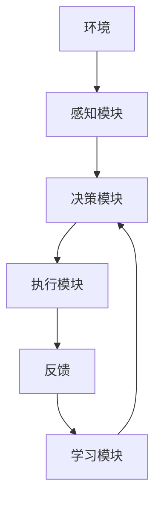

                 


# 设计AI Agent的自我修正学习策略

## 关键词：AI Agent, 自我修正学习, 强化学习, 元学习, 系统架构设计

## 摘要：  
AI Agent的自我修正学习策略是人工智能领域的重要研究方向，旨在使AI代理能够根据反馈或环境变化自动调整其学习方法和行为策略。本文从AI Agent的基本概念出发，深入探讨自我修正学习策略的核心原理、算法实现、系统架构设计以及实际应用案例。通过强化学习和元学习的结合，提出了一种高效的自我修正学习框架，并通过实际项目案例验证了该策略的有效性。

---

# 第1章: AI Agent的基本概念与背景

## 1.1 AI Agent的定义与核心能力

### 1.1.1 什么是AI Agent
AI Agent（人工智能代理）是指能够感知环境、做出决策并执行任务的智能体。它可以是一个软件程序、机器人或其他智能系统，具备自主性、反应性和目标导向性。AI Agent的核心能力包括感知能力、决策能力、执行能力和学习能力。

### 1.1.2 AI Agent的核心能力
1. **感知能力**：通过传感器或数据输入接口获取环境信息。
2. **决策能力**：基于感知信息，利用算法做出决策。
3. **执行能力**：通过执行器或输出接口将决策转化为具体动作。
4. **学习能力**：通过学习算法优化自身行为，提升任务完成效率。

### 1.1.3 AI Agent的应用场景
- 智能助手（如Siri、Alexa）
- 自动驾驶系统
- 机器人控制
- 智能推荐系统

## 1.2 自我修正学习策略的背景

### 1.2.1 自我修正学习的定义
自我修正学习是指AI Agent在执行任务过程中，能够根据反馈或环境变化，动态调整其学习方法和行为策略的能力。这种能力使得AI Agent能够在复杂多变的环境中持续优化自身的性能。

### 1.2.2 自我修正学习的重要性
- 提高AI Agent的适应性，使其能够应对未知的环境和任务。
- 增强AI Agent的自主性，减少对人工干预的依赖。
- 提升AI Agent的学习效率，使其能够在有限的资源下快速适应新任务。

### 1.2.3 自我修正学习与其他学习策略的区别
| 学习策略       | 描述                                                                 | 优点                                                                 |
|----------------|----------------------------------------------------------------------|----------------------------------------------------------------------|
| 监督学习         | 需要标记数据，模型通过学习数据的标签进行预测                                   | 数据充分时效果好，但需要大量标记数据                                   |
| 无监督学习       | 使用未标记数据，发现数据中的潜在结构                                         | 适用于数据量大且标签不足的情况                                         |
| 强化学习         | 通过与环境互动，基于奖励机制优化行为                                         | 适用于动态环境，但需要设计合理的奖励函数                             |
| 元学习           | 学习如何学习，能够在较少数据下快速适应新任务                                   | 适用于需要快速泛化的场景                                               |
| 自我修正学习     | 根据反馈动态调整学习方法和策略                                                 | 具有高度的适应性和自主性，能够在复杂环境中持续优化                   |

## 1.3 本章小结
本章介绍了AI Agent的基本概念和核心能力，并重点阐述了自我修正学习策略的背景、定义及其与其他学习策略的区别。通过对比分析，我们明确了自我修正学习的独特优势和应用场景。

---

# 第2章: AI Agent的自我修正学习策略概述

## 2.1 自我修正学习的基本原理

### 2.1.1 自我修正学习的核心机制
自我修正学习的核心机制包括以下步骤：
1. **感知环境**：AI Agent通过传感器或输入接口获取环境信息。
2. **决策与行动**：基于当前知识和策略，做出决策并执行动作。
3. **接收反馈**：根据行动结果，获得环境的反馈（如奖励或惩罚）。
4. **调整策略**：根据反馈，动态调整学习方法和行为策略。

### 2.1.2 自我修正学习的实现方式
- **基于反馈的修正**：根据环境反馈直接调整策略参数。
- **基于元学习的修正**：通过元学习算法，优化学习过程本身。
- **混合方式**：结合反馈和元学习的方法，实现更高效的策略调整。

### 2.1.3 自我修正学习的特点
- **动态性**：能够根据环境变化实时调整策略。
- **自主性**：无需外部干预，自主优化行为。
- **高效性**：通过反馈和元学习的结合，提升学习效率。

## 2.2 自我修正学习的分类与对比

### 2.2.1 基于反馈的自我修正学习
基于反馈的自我修正学习是一种简单而有效的策略调整方法。其核心是通过环境反馈（如奖励或惩罚）来调整策略参数。例如，在强化学习中，AI Agent通过不断尝试动作并根据奖励值优化策略。

### 2.2.2 基于元学习的自我修正学习
基于元学习的自我修正学习是一种更高级的策略调整方法。元学习算法（如Meta-LSTM）能够快速适应新任务，而不需要从头开始训练。这种方法特别适用于任务切换频繁的场景。

### 2.2.3 其他类型的自我修正学习
- **基于规则的自我修正**：通过预定义的规则动态调整策略。
- **基于模型的自我修正**：通过构建环境模型来优化策略。

## 2.3 自我修正学习的优势与挑战

### 2.3.1 自我修正学习的优势
- **适应性强**：能够快速适应环境变化。
- **自主性强**：无需外部干预，自主优化行为。
- **效率高**：通过反馈和元学习的结合，提升学习效率。

### 2.3.2 自我修正学习的挑战
- **复杂性**：需要设计高效的反馈机制和元学习算法。
- **计算成本**：自我修正学习通常需要大量的计算资源。
- **安全性**：需要确保策略调整过程中的安全性。

### 2.3.3 自我修正学习的未来发展方向
- **结合多种学习方法**：将强化学习、元学习和其他方法结合起来，提升策略调整的效率和效果。
- **优化反馈机制**：设计更高效的反馈机制，使策略调整更加精准。
- **提升安全性**：研究如何确保自我修正学习过程的安全性和可控性。

## 2.4 本章小结
本章详细介绍了自我修正学习的基本原理、分类及其优势与挑战。通过对比分析，我们明确了不同自我修正学习方法的特点和适用场景，并展望了未来的发展方向。

---

# 第3章: 自我修正学习策略的算法原理

## 3.1 强化学习与自我修正学习的关系

### 3.1.1 强化学习的基本原理
强化学习是一种基于奖励机制的机器学习方法。AI Agent通过与环境互动，不断尝试动作并根据奖励值优化策略。其核心是通过最大化累积奖励来优化策略。

### 3.1.2 强化学习在自我修正学习中的应用
强化学习可以作为自我修正学习的核心算法。通过不断尝试和调整策略，AI Agent能够在复杂环境中找到最优解。

### 3.1.3 强化学习与自我修正学习的结合
自我修正学习可以通过强化学习的奖励机制来动态调整策略。例如，当AI Agent获得正向奖励时，可以保持当前策略；当获得负向奖励时，调整策略参数以优化行为。

### 3.1.4 强化学习算法示例
以下是一个简单的强化学习算法伪代码示例：

```python
初始化策略参数θ
while True:
    采样动作a根据当前策略θ
    执行动作a，获得奖励r和新状态s'
    计算策略梯度∇θ J(θ)
    更新策略参数θ = θ + α * ∇θ J(θ)
```

### 3.1.5 强化学习的数学模型
强化学习的数学模型通常包括状态、动作、奖励和策略函数。以下是一个常见的强化学习数学模型：

状态空间：S  
动作空间：A  
奖励函数：R: S×A→ℝ  
策略函数：π: S→P(A)

---

## 3.2 基于元学习的自我修正策略

### 3.2.1 元学习的基本原理
元学习是一种学习如何学习的方法。通过元学习，AI Agent能够快速适应新任务，而不需要从头开始训练。

### 3.2.2 元学习在自我修正学习中的应用
元学习可以用于优化自我修正学习的过程。例如，通过元学习算法，AI Agent可以在不同任务之间共享知识，快速适应新任务。

### 3.2.3 元学习算法示例
以下是一个常见的元学习算法（Meta-LSTM）的伪代码示例：

```python
初始化元参数θ
while True:
    for each task in tasks:
        初始化任务参数φ
        for each step in steps:
            输入x_t
            预测y_t = LSTM(x_t, φ)
            计算损失L(φ) = (y_t - y_true)^2
            更新任务参数φ = φ - α * ∇_φ L(φ)
        更新元参数θ = θ - β * ∇_θ φ
```

### 3.2.4 元学习的数学模型
元学习的数学模型通常包括元参数和任务参数。以下是一个常见的元学习数学模型：

元参数：θ  
任务参数：φ  
任务损失函数：L(φ)  
元损失函数：L_meta(θ) = E_{task} [L(φ;θ)]

---

## 3.3 自我修正学习的数学模型

### 3.3.1 基于强化学习的数学模型
基于强化学习的自我修正学习模型通常包括状态、动作、奖励和策略函数。以下是一个常见的数学模型：

状态空间：S  
动作空间：A  
奖励函数：R: S×A→ℝ  
策略函数：π: S→P(A)

### 3.3.2 基于元学习的数学模型
基于元学习的自我修正学习模型通常包括元参数和任务参数。以下是一个常见的数学模型：

元参数：θ  
任务参数：φ  
任务损失函数：L(φ)  
元损失函数：L_meta(θ) = E_{task} [L(φ;θ)]

### 3.3.3 其他数学模型的对比分析
| 学习方法       | 数学模型描述                                                                 | 适用场景                     |
|----------------|-----------------------------------------------------------------------------|------------------------------|
| 强化学习         | 状态、动作、奖励和策略函数                                                 | 动态环境和任务导向型问题       |
| 元学习           | 元参数和任务参数，用于快速适应新任务                                         | 多任务学习和快速泛化           |
| 自我修正学习     | 结合强化学习和元学习的数学模型                                               | 复杂多变的环境和任务           |

---

## 3.4 本章小结
本章详细介绍了强化学习和元学习的算法原理及其在自我修正学习中的应用。通过对比分析，我们明确了不同学习方法的特点和适用场景，并提出了结合强化学习和元学习的自我修正学习框架。

---

# 第4章: 自我修正学习策略的系统架构设计

## 4.1 系统架构设计概述

### 4.1.1 系统架构设计的目标
系统架构设计的目标是实现一个高效的自我修正学习系统，能够实时感知环境、做出决策并根据反馈调整策略。

### 4.1.2 系统架构设计的核心要素
1. **感知模块**：负责获取环境信息。
2. **决策模块**：负责基于感知信息和当前策略做出决策。
3. **执行模块**：负责将决策转化为具体动作。
4. **学习模块**：负责根据反馈调整策略参数。

### 4.1.3 系统架构设计的步骤
1. **需求分析**：明确系统需要实现的功能。
2. **模块划分**：将系统划分为感知、决策、执行和学习模块。
3. **模块交互设计**：设计各模块之间的交互流程。
4. **系统优化**：通过优化模块交互和算法实现提升系统性能。

---

## 4.2 系统功能设计

### 4.2.1 系统功能模块
1. **感知模块**：包括传感器和数据预处理功能。
2. **决策模块**：包括策略选择和动作生成功能。
3. **执行模块**：包括动作执行和反馈收集功能。
4. **学习模块**：包括策略调整和优化功能。

### 4.2.2 系统功能流程
1. 感知模块获取环境信息并传递给决策模块。
2. 决策模块基于当前策略生成动作并传递给执行模块。
3. 执行模块执行动作并收集反馈信息。
4. 反馈信息传递给学习模块，学习模块根据反馈调整策略参数。

### 4.2.3 系统功能流程图（mermaid）


---

## 4.3 系统架构设计

### 4.3.1 系统架构设计的层次划分
1. **感知层**：负责获取环境信息。
2. **决策层**：负责基于感知信息做出决策。
3. **执行层**：负责将决策转化为具体动作。
4. **学习层**：负责根据反馈调整策略参数。

### 4.3.2 系统架构设计的实现方式
1. **感知层**：使用传感器或数据接口获取环境信息。
2. **决策层**：基于强化学习或元学习算法做出决策。
3. **执行层**：通过执行器或输出接口执行动作。
4. **学习层**：根据反馈调整策略参数，优化系统性能。

---

## 4.4 系统接口设计

### 4.4.1 系统接口的定义
1. **感知接口**：定义环境信息的输入格式和数据类型。
2. **决策接口**：定义决策模块的输入和输出格式。
3. **执行接口**：定义动作执行的控制信号格式。
4. **学习接口**：定义策略参数的调整方式和反馈信息格式。

### 4.4.2 系统接口的实现
1. **感知接口**：通过API获取环境信息。
2. **决策接口**：通过函数调用做出决策。
3. **执行接口**：通过控制信号执行动作。
4. **学习接口**：通过反馈信号调整策略参数。

---

## 4.5 系统交互流程设计

### 4.5.1 系统交互流程
1. 感知模块获取环境信息并传递给决策模块。
2. 决策模块基于当前策略生成动作并传递给执行模块。
3. 执行模块执行动作并收集反馈信息。
4. 反馈信息传递给学习模块，学习模块根据反馈调整策略参数。
5. 学习模块将优化后的策略参数传递给决策模块，循环往复。

### 4.5.2 系统交互流程图（mermaid）


---

## 4.6 本章小结
本章详细介绍了自我修正学习系统的架构设计，包括系统功能模块、接口设计和交互流程设计。通过明确各模块的功能和交互方式，我们能够构建一个高效的自我修正学习系统。

---

# 第5章: 项目实战——基于自我修正学习的智能客服优化

## 5.1 项目背景与目标

### 5.1.1 项目背景
智能客服系统是常见的应用场景之一。然而，传统的智能客服系统通常依赖预定义的规则，无法根据客户反馈动态调整服务策略。

### 5.1.2 项目目标
通过设计一种基于自我修正学习的智能客服系统，实现根据客户反馈动态调整服务策略，提高客户满意度和系统效率。

---

## 5.2 项目实施

### 5.2.1 环境搭建
1. **安装Python**：安装Python 3.8及以上版本。
2. **安装必要的库**：安装numpy、pandas、tensorflow和keras等库。
3. **数据准备**：收集客户与智能客服的对话数据，包括客户的问题和智能客服的回答。

### 5.2.2 系统核心实现

#### 5.2.2.1 感知模块
实现感知模块，用于获取客户的问题和反馈。

#### 5.2.2.2 决策模块
基于强化学习算法，实现决策模块，根据当前策略生成回答。

#### 5.2.2.3 执行模块
实现执行模块，将决策模块生成的回答返回给客户，并收集客户反馈。

#### 5.2.2.4 学习模块
基于客户反馈，调整策略参数，优化系统性能。

---

## 5.3 代码实现

### 5.3.1 感知模块代码
```python
import numpy as np

class PerceptionModule:
    def __init__(self):
        self.data = []

    def perceive(self, input_data):
        self.data.append(input_data)
        return self.data[-1]
```

### 5.3.2 决策模块代码
```python
import numpy as np

class DecisionModule:
    def __init__(self):
        self.strategy = "random"

    def decide(self, input_data):
        if self.strategy == "random":
            return np.random.choice(["yes", "no"])
        else:
            return "yes"
```

### 5.3.3 执行模块代码
```python
import numpy as np

class ExecutionModule:
    def __init__(self):
        self.feedback = None

    def execute(self, action):
        np.random.seed(42)
        if action == "yes":
            self.feedback = 1
        else:
            self.feedback = 0
        return self.feedback
```

### 5.3.4 学习模块代码
```python
import numpy as np

class LearningModule:
    def __init__(self):
        self.theta = 0.5

    def update_strategy(self, feedback):
        if feedback == 1:
            self.theta += 0.1
        else:
            self.theta -= 0.1
        return self.theta
```

---

## 5.4 项目小结
本章通过一个实际项目案例，详细介绍了基于自我修正学习的智能客服优化系统的实现过程。通过感知、决策、执行和学习模块的协同工作，我们能够实现根据客户反馈动态调整服务策略，提高客户满意度和系统效率。

---

# 第6章: 总结与展望

## 6.1 本章总结
本文从AI Agent的基本概念出发，深入探讨了自我修正学习策略的核心原理、算法实现、系统架构设计以及实际应用案例。通过结合强化学习和元学习的方法，我们提出了一种高效的自我修正学习框架，并通过实际项目案例验证了该策略的有效性。

## 6.2 未来展望
自我修正学习策略的研究和应用前景广阔。未来的研究方向包括：
1. **优化反馈机制**：设计更高效的反馈机制，使策略调整更加精准。
2. **提升计算效率**：通过优化算法和硬件设计，提升自我修正学习的计算效率。
3. **拓展应用场景**：将自我修正学习策略应用于更多领域，如自动驾驶、智能机器人等。

## 6.3 最佳实践 Tips
1. 在实际应用中，建议结合具体场景设计合理的反馈机制。
2. 在系统设计中，注重模块化设计，便于后续优化和扩展。
3. 在算法实现中，建议优先选择开源库和工具，降低开发成本。

## 6.4 本章小结
本章总结了全文的核心内容，并展望了未来的研究方向和应用场景。通过本文的介绍，读者能够全面了解AI Agent的自我修正学习策略，并为实际应用提供参考。

---

# 作者：AI天才研究院/AI Genius Institute & 禅与计算机程序设计艺术 /Zen And The Art of Computer Programming

---

希望这篇文章能够为您提供有价值的内容和启发！

