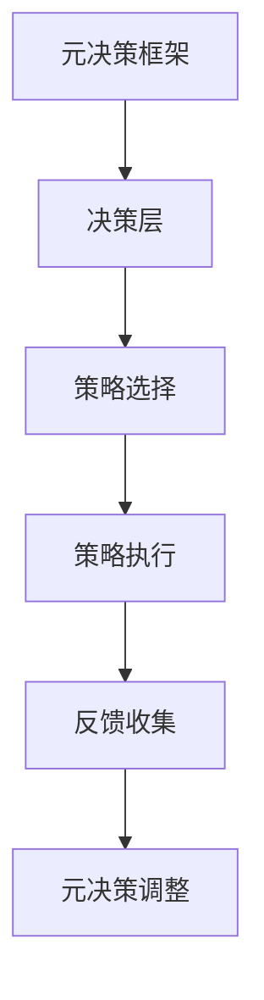
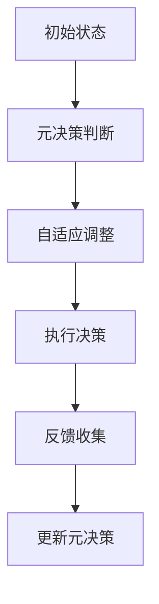
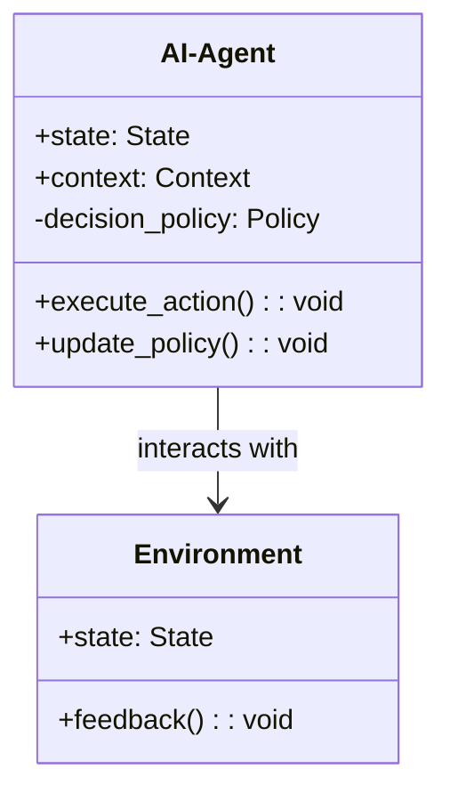
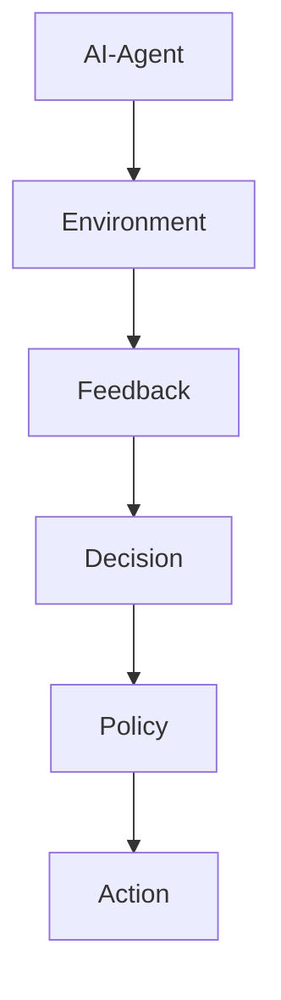
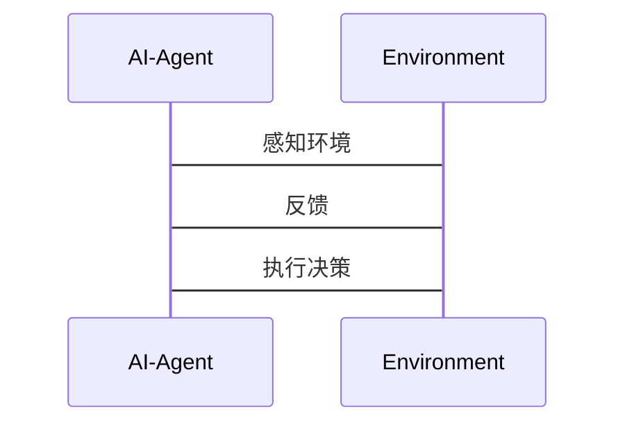

                 


# 设计AI Agent的自适应元决策框架

> 关键词：AI Agent, 元决策, 自适应决策, 强化学习, 多智能体系统

> 摘要：本文将详细介绍设计AI Agent的自适应元决策框架的过程，从背景介绍到算法实现，再到系统架构设计和项目实战，全面解析自适应元决策框架的核心原理与应用。通过本文的学习，读者能够理解如何构建一个高效的自适应元决策框架，以应对复杂动态环境中的决策问题。

---

# 第一部分: 背景介绍

## 第1章: 问题背景与描述

### 1.1 问题背景

#### 1.1.1 当前AI Agent的发展现状
AI Agent（智能体）近年来在各个领域取得了显著进展。从简单的规则驱动系统到复杂的强化学习模型，AI Agent 已经在游戏、自动驾驶、智能客服、机器人等领域展现出强大的能力。然而，现有的决策框架大多依赖于静态规则或固定的策略，难以应对动态变化的环境。

#### 1.1.2 现有决策框架的局限性
传统的AI Agent决策框架通常基于静态规则或基于经验的策略，缺乏对动态环境的自适应能力。例如，在多智能体系统中，当环境或目标发生改变时，传统的决策框架难以快速调整策略，导致决策效率下降或错误率增加。

#### 1.1.3 自适应决策的必要性
在复杂多变的环境中，AI Agent需要具备自适应能力，能够根据环境变化动态调整决策策略。自适应决策框架通过引入元决策机制，能够在不同场景下灵活切换策略，提高决策的准确性和效率。

### 1.2 问题描述

#### 1.2.1 AI Agent决策框架的核心问题
AI Agent的决策框架需要解决的核心问题是：如何在动态环境中快速调整决策策略，以应对不确定性。传统的决策框架往往依赖于预定义的规则或固定的策略，难以适应环境的变化。

#### 1.2.2 元决策的概念与作用
元决策是指在决策过程中，对决策策略进行选择和调整的机制。它能够帮助AI Agent在不同场景下选择最优的决策策略，从而提高整体决策效率。

#### 1.2.3 自适应决策的定义与目标
自适应决策是指AI Agent能够根据环境变化动态调整决策策略的能力。其目标是在复杂多变的环境中，实现高效、准确的决策。

### 1.3 问题解决与边界

#### 1.3.1 自适应元决策框架的设计目标
自适应元决策框架的设计目标是：在动态环境中，通过元决策机制，快速调整决策策略，以实现最优决策。

#### 1.3.2 解决方案的边界与限制
自适应元决策框架的边界包括：不处理底层环境建模问题，专注于决策策略的调整；不考虑硬件实现，专注于算法设计；不涉及数据采集问题，专注于决策逻辑。

#### 1.3.3 相关概念的对比与区分
自适应元决策框架与传统决策框架的主要区别在于：前者具有动态调整策略的能力，而后者依赖于静态规则。

---

## 第2章: 核心概念与联系

### 2.1 元决策框架的核心原理

#### 2.1.1 元决策的定义与特征
元决策是指在决策过程中，对决策策略进行选择和调整的机制。其核心特征包括：动态性、灵活性、高效性。

#### 2.1.2 自适应决策的实现机制
自适应决策通过元决策机制，动态选择最优策略。其实现机制包括：环境感知、策略选择、策略调整。

#### 2.1.3 元决策与传统决策框架的对比
对比传统决策框架，元决策框架在动态性、灵活性和适应性方面具有显著优势。

### 2.2 核心概念对比表

| 比较维度 | 元决策框架 | 传统决策框架 |
|----------|------------|--------------|
| 决策方式 | 动态调整策略 | 静态规则驱动 |
| 适应性   | 高度适应环境变化 | 适应性有限 |
| 灵活性   | 高 | 低 |

### 2.3 ER实体关系图



---

# 第二部分: 算法原理

## 第3章: 算法原理与实现

### 3.1 元决策算法的原理

#### 3.1.1 元决策的数学模型
自适应元决策框架的数学模型如下：

$$ V(s) = \max_{\pi \in \Pi} Q(s, \pi) $$

其中，$s$ 是当前状态，$\pi$ 是决策策略，$Q(s, \pi)$ 是策略的评估值。

#### 3.1.2 自适应机制的实现步骤
1. 环境感知：收集环境信息。
2. 策略选择：根据当前状态选择最优策略。
3. 策略执行：执行选定的策略。
4. 反馈收集：收集执行结果的反馈。
5. 策略调整：根据反馈调整策略。

### 3.2 算法实现的mermaid流程图



### 3.3 算法实现的Python代码

```python
def meta_decision(state, context):
    # 元决策逻辑
    if context['adaptive'] == True:
        return adaptive_policy(state)
    else:
        return static_policy(state)

def adaptive_policy(state):
    # 根据当前状态选择最优策略
    strategies = get_available_strategies(state)
    best_strat = select_best_strategy(strategies)
    return best_strat

def static_policy(state):
    # 静态策略，基于预定义规则
    return default_strategy
```

---

## 第4章: 算法的数学模型与公式

### 4.1 元决策的数学模型

$$ V(s) = \max_{\pi \in \Pi} Q(s, \pi) $$

其中，$Q(s, \pi)$ 是策略 $\pi$ 在状态 $s$ 下的评估值。

### 4.2 策略选择的数学模型

$$ \pi^* = \arg\max_{\pi} Q(s, \pi) $$

### 4.3 自适应调整的数学模型

$$ Q(s, \pi) = Q(s, \pi) + \alpha (r + \gamma V(s')) - Q(s, \pi) $$

其中，$\alpha$ 是学习率，$\gamma$ 是折扣因子，$r$ 是奖励，$s'$ 是下一个状态。

---

# 第三部分: 系统分析与架构设计

## 第5章: 系统分析与架构设计

### 5.1 问题场景介绍

#### 5.1.1 多智能体协作场景
在多智能体协作场景中，AI Agent需要与其他智能体协同完成任务。例如，在自动驾驶中，车辆需要与其他车辆、行人和交通信号灯协同工作。

#### 5.1.2 动态环境应对场景
在动态环境应对场景中，AI Agent需要根据环境变化动态调整策略。例如，在股票交易中，AI Agent需要根据市场波动调整交易策略。

### 5.2 项目介绍

#### 5.2.1 项目目标
本项目旨在设计一个自适应元决策框架，能够在复杂动态环境中实现高效决策。

#### 5.2.2 项目范围
本项目主要针对AI Agent的决策框架设计，不涉及硬件实现和数据采集问题。

### 5.3 系统功能设计

#### 5.3.1 领域模型
领域模型是一个多智能体协作的系统，其中每个智能体都有自己的决策逻辑。



#### 5.3.2 功能模块
功能模块包括环境感知、策略选择、策略执行、反馈收集和策略调整。

### 5.4 系统架构设计

#### 5.4.1 系统架构图
系统架构图展示了各个模块之间的关系。



#### 5.4.2 接口设计
系统接口包括环境感知接口、策略选择接口、策略执行接口和反馈收集接口。

### 5.5 系统交互设计

#### 5.5.1 交互流程
系统交互流程包括环境感知、策略选择、策略执行和反馈收集。



---

## 第6章: 项目实战

### 6.1 环境安装

#### 6.1.1 安装Python
安装Python 3.8或更高版本。

#### 6.1.2 安装依赖
安装必要的Python库，如TensorFlow、Keras、numpy等。

#### 6.1.3 安装框架
安装自适应元决策框架的代码库。

### 6.2 系统核心实现

#### 6.2.1 核心代码实现
实现元决策框架的核心逻辑。

```python
def meta_decision(state, context):
    if context['adaptive'] == True:
        return adaptive_policy(state)
    else:
        return static_policy(state)

def adaptive_policy(state):
    strategies = get_available_strategies(state)
    best_strat = select_best_strategy(strategies)
    return best_strat

def static_policy(state):
    return default_strategy
```

#### 6.2.2 代码解读
解释代码的实现逻辑和功能。

### 6.3 案例分析

#### 6.3.1 案例背景
以智能客服为例，介绍自适应元决策框架的应用场景。

#### 6.3.2 问题分析
分析智能客服中的决策问题，如客户情绪识别、需求判断等。

#### 6.3.3 方案设计
设计基于自适应元决策框架的解决方案，实现动态调整决策策略。

### 6.4 项目小结

#### 6.4.1 项目总结
总结项目实现的关键点和经验教训。

#### 6.4.2 项目成果
展示项目的实际成果，如性能提升、效率优化等。

---

## 第7章: 最佳实践与小结

### 7.1 最佳实践

#### 7.1.1 设计原则
遵循简洁性、高效性、可扩展性等设计原则。

#### 7.1.2 实现技巧
在实现过程中，注意模块化设计和代码复用。

#### 7.1.3 优化建议
根据实际需求，优化策略选择和调整机制。

### 7.2 小结

#### 7.2.1 核心内容总结
总结本文的核心内容，包括自适应元决策框架的设计原理、算法实现和系统架构。

#### 7.2.2 未来展望
展望自适应元决策框架的发展方向，如多智能体协作、复杂环境建模等。

---

## 参考文献

1. Russell, S., & Norvig, P. (2010). Artificial Intelligence: A Modern Approach.
2. Sutton, R. S., & Barto, A. G. (2018). Reinforcement Learning: An Introduction.
3. 禅与计算机程序设计艺术系列丛书

---

**作者：AI天才研究院/AI Genius Institute & 禅与计算机程序设计艺术/Zen And The Art of Computer Programming**

