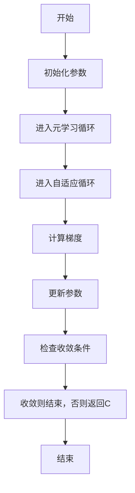

                 


# 设计AI Agent的自适应元强化学习框架

---

## 关键词：
- AI Agent
- 自适应元强化学习
- 强化学习
- 深度学习
- 系统架构

---

## 摘要：
本文详细探讨了设计AI Agent的自适应元强化学习框架的理论基础、算法原理、系统架构及实际应用。首先，从AI Agent的基本概念入手，介绍了强化学习与元强化学习的概念及其在AI Agent中的应用。接着，深入分析了自适应元强化学习的核心原理、算法流程及其实现方式，并通过mermaid流程图和Python代码示例进行了详细说明。随后，从系统架构的角度，设计了AI Agent的场景介绍、功能模块及接口交互流程，进一步探讨了系统实现的关键步骤。最后，通过项目实战展示了自适应元强化学习框架的应用，并总结了最佳实践和注意事项，为读者提供了全面而深入的指导。

---

## 第一章: AI Agent与自适应元强化学习概述

### 1.1 AI Agent的基本概念
AI Agent（人工智能代理）是指在环境中能够感知并自主行动以实现目标的智能实体。它具备以下核心特征：
- **自主性**：无需外部干预，自主决策。
- **反应性**：能够实时感知环境并做出反应。
- **目标导向**：所有行动均以实现特定目标为导向。

### 1.2 强化学习与元强化学习
- **强化学习**：通过与环境交互，AI Agent通过试错学习，以最大化累积奖励。
- **元强化学习**：在强化学习的基础上，引入元学习机制，使AI Agent能够快速适应新任务，减少对环境的探索成本。

### 1.3 问题背景与目标
- **问题背景**：传统强化学习在复杂动态环境中的适应性有限，需引入元学习提升其泛化能力。
- **问题目标**：设计一种自适应元强化学习框架，使AI Agent能够在多变环境中自适应调整策略。

### 1.4 核心概念结构
- **核心要素**：AI Agent、环境、强化学习、元学习。
- **关系图**：通过ER图展示各要素之间的交互关系。

---

## 第二章: 自适应元强化学习的理论基础

### 2.1 原理分析
- **基本原理**：自适应元强化学习通过元学习层优化策略，使其在不同环境中快速适应。
- **对比分析**：与传统强化学习相比，自适应元强化学习具备更快的适应速度和更强的泛化能力。

### 2.2 核心概念属性特征对比
通过表格对比分析，清晰展示自适应元强化学习与其他强化学习方法的异同。

---

## 第三章: 自适应元强化学习算法

### 3.1 算法原理
- **算法流程**：通过mermaid流程图展示算法执行步骤。
- **Python实现**：代码示例展示算法实现细节。

### 3.2 mermaid流程图


### 3.3 Python源代码实现
```python
def meta_reinforcement_learning():
    params = initialize_params()
    while not converged:
        for _ in range(meta_steps):
            gradients = compute_gradients(params)
            params = update_params(params, gradients)
    return params
```

### 3.4 数学模型与公式
- **元学习目标函数**：$$ L_{meta} = \sum_{i=1}^n L_i(\theta_i; \theta) $$
- **参数更新规则**：$$ \theta_{t+1} = \theta_t - \eta \nabla_{\theta} L_{meta} $$

---

## 第四章: 系统分析与架构设计

### 4.1 系统功能设计
- **领域模型**：通过mermaid类图展示系统功能模块。
- **系统架构**：展示系统整体架构图。

### 4.2 系统接口设计
- **交互流程**：通过mermaid序列图展示系统接口交互。

---

## 第五章: 项目实战

### 5.1 环境安装
- **依赖管理**：列出所需库及版本。
- **环境配置**：详细说明环境搭建步骤。

### 5.2 核心实现
- **代码实现**：展示关键代码片段。
- **代码解读**：解释代码实现细节。

### 5.3 案例分析
- **实际案例**：通过具体案例分析框架的应用。

---

## 第六章: 最佳实践与小结

### 6.1 最佳实践
- **设计建议**：总结设计经验。
- **实现技巧**：分享实现过程中的实用技巧。

### 6.2 小结
- **总结全文**：回顾文章内容。
- **未来展望**：展望自适应元强化学习的发展方向。

---

## 作者：AI天才研究院/AI Genius Institute & 禅与计算机程序设计艺术 /Zen And The Art of Computer Programming

---

**全文完**。

