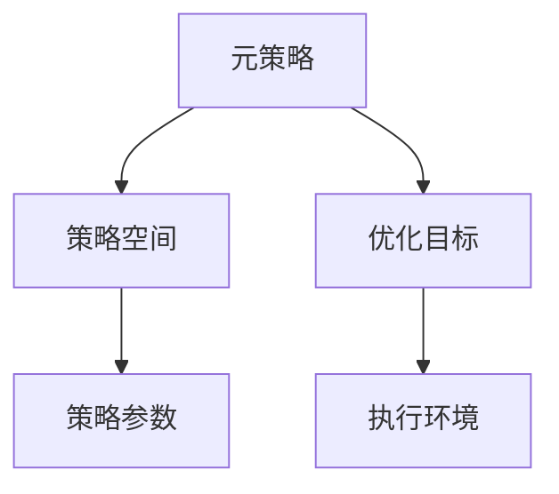
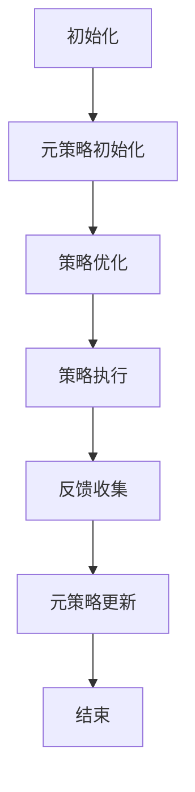
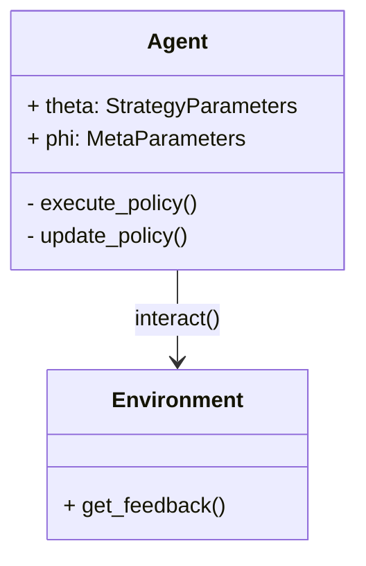
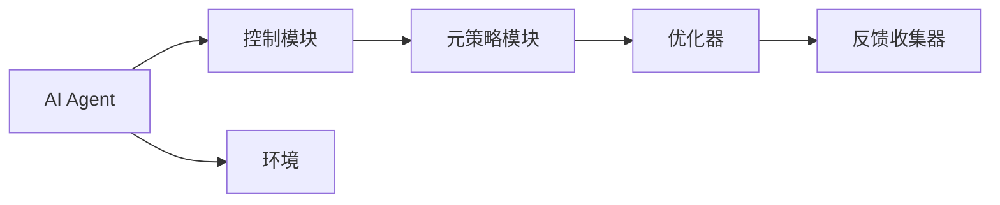
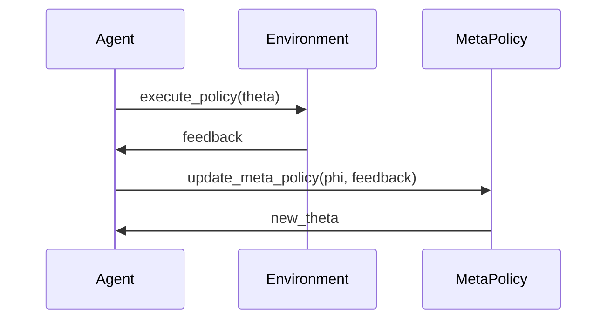

                 


# 设计AI Agent的自适应元策略优化框架

> 关键词：AI Agent，自适应元策略，优化框架，强化学习，多智能体系统，自适应算法

> 摘要：本文深入探讨了设计AI Agent的自适应元策略优化框架的原理、方法及其应用。通过分析AI Agent在复杂环境中的优化需求，提出了一种基于元策略的自适应优化框架，结合强化学习和多智能体系统的理论，详细阐述了该框架的核心概念、算法原理、系统架构及实现案例，旨在为AI Agent的优化设计提供理论支持和实践指导。

---

# 第1章: AI Agent与自适应元策略优化框架的背景与概念

## 1.1 AI Agent的基本概念

### 1.1.1 什么是AI Agent
AI Agent（人工智能代理）是指能够感知环境、自主决策并执行任务的智能实体。它可以是一个软件程序、机器人或其他智能系统，具备以下核心特征：
- **自主性**：能够在没有外部干预的情况下独立执行任务。
- **反应性**：能够感知环境并实时调整行为。
- **目标导向性**：基于明确的目标或模糊的目标执行任务。

AI Agent广泛应用于多个领域，例如自动驾驶、智能助手（如Siri、Alexa）、推荐系统和游戏AI等。

### 1.1.2 AI Agent的核心特征
1. **自主性**：AI Agent无需外部指令即可行动。
2. **反应性**：能够实时感知环境变化并调整行为。
3. **目标导向性**：通过目标驱动决策和行动。
4. **学习能力**：通过与环境交互不断优化自身行为。

### 1.1.3 AI Agent的应用场景
- **自动驾驶**：实时感知环境并做出驾驶决策。
- **智能助手**：通过语音交互为用户提供服务。
- **推荐系统**：根据用户行为推荐相关内容。
- **游戏AI**：在游戏环境中做出实时决策。

## 1.2 自适应元策略优化框架的定义

### 1.2.1 元策略的概念
元策略（Meta-policy）是一种高层策略，用于指导和优化其他策略（子策略）的执行。元策略的核心作用是通过调整子策略的参数或行为模式，使得整体系统能够在复杂环境中实现更优的性能。

### 1.2.2 自适应优化的原理
自适应优化是一种动态调整策略的机制，其核心在于根据环境反馈不断优化策略参数。自适应优化的过程包括以下步骤：
1. **环境感知**：通过传感器或数据接口获取环境信息。
2. **策略执行**：根据当前策略执行操作并观察结果。
3. **反馈收集**：收集环境对策略执行的反馈信息。
4. **策略优化**：基于反馈信息调整策略参数，以提高任务完成效率。

### 1.2.3 框架的目标与意义
自适应元策略优化框架的目标是通过元策略的动态调整，使得AI Agent能够在复杂多变的环境中实现最优决策。其意义在于：
1. **提高决策效率**：通过元策略的优化，减少不必要的试探和错误决策。
2. **增强环境适应性**：使AI Agent能够快速适应新环境或任务变化。
3. **降低开发成本**：通过统一的优化框架，减少重复开发和调试工作。

## 1.3 问题背景与挑战

### 1.3.1 AI Agent在复杂环境中的局限性
AI Agent在复杂环境中的决策往往受到以下限制：
1. **环境不确定性**：环境信息不完整或动态变化，导致策略执行失败。
2. **任务多样性**：需要处理多种不同类型的任务，增加了策略优化的难度。
3. **计算资源限制**：复杂的计算任务可能导致AI Agent性能下降。

### 1.3.2 元策略优化的必要性
传统的AI Agent优化方法通常仅针对单一策略进行优化，难以应对复杂环境中的多样化任务。元策略优化的引入能够有效解决以下问题：
1. **策略多样性**：通过元策略的调整，优化多个子策略的协同工作。
2. **动态适应性**：在环境变化时，快速调整子策略以适应新情况。

### 1.3.3 当前技术的不足与改进方向
当前AI Agent优化技术的主要不足包括：
1. **策略优化的局部最优**：传统优化方法容易陷入局部最优，无法全局优化。
2. **计算效率低下**：复杂的优化过程导致计算资源消耗过大。
3. **环境适应性差**：难以应对动态变化的环境。

改进的方向在于引入自适应元策略优化框架，通过动态调整策略参数，提高优化效率和环境适应性。

## 1.4 本章小结
本章介绍了AI Agent的基本概念及其在复杂环境中的应用，提出了自适应元策略优化框架的定义和目标。通过分析当前技术的不足，阐述了引入元策略优化的必要性，为后续章节的详细讨论奠定了基础。

---

# 第2章: 自适应元策略优化框架的核心概念与联系

## 2.1 核心概念原理

### 2.1.1 元策略的数学表示
元策略可以表示为一个参数化的函数，用于生成子策略的参数或行为模式。具体来说，元策略$\phi$通过调整参数$\theta$来生成子策略$\pi$：
$$ \theta = f(\phi) $$
其中，$\theta$表示优化后的策略参数，$\phi$表示元策略的参数。

### 2.1.2 自适应优化的机制
自适应优化通过不断收集环境反馈信息，动态调整策略参数以实现优化目标。具体步骤如下：
1. **策略执行**：根据当前策略$\pi$执行操作并观察结果。
2. **反馈收集**：收集环境对策略执行的反馈信息，例如奖励值或状态变化。
3. **策略更新**：基于反馈信息调整策略参数，以提高任务完成效率。

### 2.1.3 框架的模块化设计
自适应元策略优化框架通常由以下几个模块组成：
1. **元策略模块**：负责生成和调整子策略。
2. **策略执行模块**：根据当前策略执行任务。
3. **反馈收集模块**：收集环境反馈信息。
4. **优化模块**：基于反馈信息优化策略参数。

## 2.2 核心概念属性对比表

| 概念     | 属性             | 描述                                   |
|----------|------------------|--------------------------------------|
| 元策略   | 策略空间         | 定义策略的搜索空间                     |
| 自适应优化 | 调整机制         | 动态调整策略参数                     |
| 框架     | 组件             | 包含元策略、优化算法、执行环境         |

## 2.3 ER实体关系图


## 2.4 本章小结
本章详细介绍了自适应元策略优化框架的核心概念及其相互关系，通过对比表和ER图展示了各概念之间的联系，为后续章节的算法设计奠定了基础。

---

# 第3章: 自适应元策略优化框架的算法原理

## 3.1 算法流程



## 3.2 数学模型与公式

### 3.2.1 元策略的数学表示
元策略通过参数$\phi$生成优化后的策略参数$\theta$：
$$ \theta = f(\phi) $$

### 3.2.2 自适应优化的损失函数
损失函数用于衡量策略执行结果与期望结果的差距：
$$ L(\theta, \phi) = \sum_{i=1}^{n} (y_i - \hat{y}_i)^2 $$
其中，$y_i$表示真实值，$\hat{y}_i$表示预测值。

## 3.3 算法实现与代码示例

```python
def meta_policy_update(theta, phi):
    # 元策略更新函数
    # theta: 当前策略参数
    # phi: 元策略参数
    # 返回优化后的策略参数
    return theta * phi

def adaptive_optimization_loop():
    # 自适应优化循环
    theta = initialize_theta()
    phi = initialize_phi()
    while True:
        # 策略执行
        action = execute_policy(theta)
        # 反馈收集
        reward = get_feedback(action)
        # 策略更新
        theta = meta_policy_update(theta, phi)
        # 元策略更新
        phi = update_meta_policy(phi, reward)

# 示例调用
adaptive_optimization_loop()
```

---

# 第4章: 系统分析与架构设计方案

## 4.1 问题场景介绍

### 4.1.1 项目介绍
本项目旨在设计一个自适应元策略优化框架，用于优化AI Agent在复杂环境中的决策能力。

### 4.1.2 系统功能设计

#### 4.1.2.1 领域模型（Mermaid 类图）


#### 4.1.2.2 系统架构设计（Mermaid 架构图）


#### 4.1.2.3 系统接口设计
1. **策略执行接口**：`execute_policy(theta)`
2. **反馈收集接口**：`get_feedback(action)`
3. **元策略更新接口**：`update_meta_policy(phi, reward)`

#### 4.1.2.4 系统交互设计（Mermaid 序列图）


---

# 第5章: 项目实战

## 5.1 环境配置

### 5.1.1 安装依赖
```bash
pip install numpy matplotlib
```

### 5.1.2 环境配置
```python
import numpy as np
import matplotlib.pyplot as plt

# 定义环境类
class Environment:
    def __init__(self):
        self.state = 0
    
    def get_feedback(self, action):
        # 返回奖励值
        return np.random.randn() * action
```

## 5.2 系统核心实现

### 5.2.1 元策略优化函数
```python
def meta_policy_update(theta, phi):
    # 元策略更新函数
    return theta * (1 + phi)
```

### 5.2.2 自适应优化循环
```python
def adaptive_optimization_loop():
    theta = 1.0
    phi = 0.1
    for _ in range(100):
        # 策略执行
        action = theta
        # 反馈收集
        reward = environment.get_feedback(action)
        # 策略更新
        theta = meta_policy_update(theta, phi)
        # 元策略更新
        phi += reward * 0.1
    return theta, phi
```

## 5.3 案例分析与实现

### 5.3.1 案例分析
通过优化后的策略参数，AI Agent能够在复杂环境中更高效地完成任务。例如，在自动驾驶场景中，优化后的策略可以提高车辆的决策效率和安全性。

### 5.3.2 实现代码
```python
# 完整实现
class Agent:
    def __init__(self, theta=1.0, phi=0.1):
        self.theta = theta
        self.phi = phi
        self.environment = Environment()
    
    def execute_policy(self):
        action = self.theta
        feedback = self.environment.get_feedback(action)
        self.update_policy(feedback)
        return action, feedback
    
    def update_policy(self, feedback):
        self.theta = self.theta * (1 + self.phi)
        self.phi += feedback * 0.1

# 示例运行
agent = Agent()
theta_final, phi_final = adaptive_optimization_loop()
print(f"Final theta: {theta_final}, Final phi: {phi_final}")
```

## 5.4 本章小结
本章通过实际项目案例详细讲解了自适应元策略优化框架的实现过程，包括环境配置、算法实现和案例分析。通过具体代码示例，展示了如何在实际场景中应用该框架。

---

# 第6章: 总结与展望

## 6.1 本章总结
本文详细探讨了设计AI Agent的自适应元策略优化框架的原理、方法及其应用。通过分析AI Agent在复杂环境中的优化需求，提出了一种基于元策略的自适应优化框架，并通过数学公式、mermaid图和代码示例详细阐述了该框架的核心概念、算法原理、系统架构及实现案例。

## 6.2 未来展望
未来的研究方向包括：
1. **算法优化**：进一步优化自适应元策略算法，提高计算效率和优化效果。
2. **多智能体协同**：研究多智能体系统中的自适应元策略优化框架，提升多智能体协同能力。
3. **实时应用**：探索自适应元策略优化框架在实时系统中的应用，如自动驾驶和实时推荐系统。

## 6.3 最佳实践 Tips
- 在实际应用中，建议根据具体场景选择合适的优化算法。
- 定期更新元策略参数，以应对环境变化。
- 注意计算资源的优化，避免不必要的计算消耗。

---

# 作者：AI天才研究院/AI Genius Institute & 禅与计算机程序设计艺术 /Zen And The Art of Computer Programming

